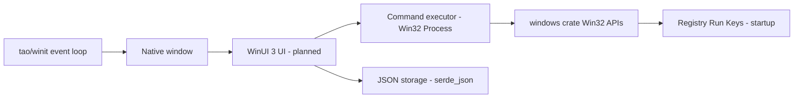
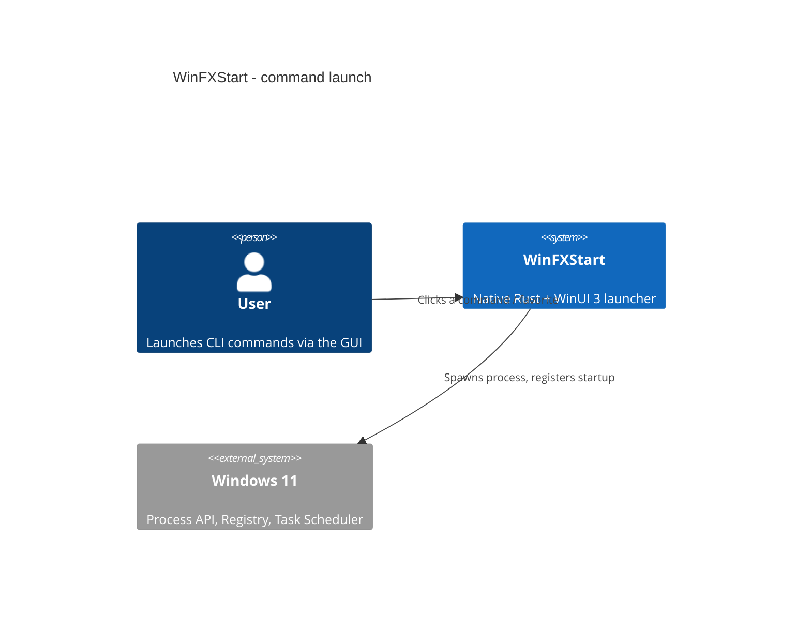

# Architecture

- [Language/Framework](#languageframework)
- [Naming Conventions](#naming-conventions)
- [Services communication](#services-communication)

## Language/Framework

```toml
@Cargo.toml
```

- **Language**: Rust (edition 2021)
- **Windowing**: `tao` (custom-fonts) + `winit` for the native window / event loop
- **OS integration**: `windows` crate (Win32 Foundation, WindowsAndMessaging, Threading, ProcessStatus, Registry, Shell, GDI)
- **Native UI**: WinUI 3 (Microsoft UI Library) — planned, not yet wired
- **Persistence**: `serde` + `serde_json` (JSON config files)
- **Icons**: `image` crate for PNG/SVG handling
- **Logging**: `log` + `env_logger`



## Naming Conventions

Standard Rust conventions:

- **Files/modules**: `snake_case`
- **Functions**: `snake_case`
- **Variables**: `snake_case`
- **Constants**: `SCREAMING_SNAKE_CASE`
- **Types/Structs/Enums**: `PascalCase`

## Services communication

The application is a self-contained native binary. A user action (button / icon) triggers a command launch routed to the Windows process API; configuration is loaded from and saved to local JSON.



> No external/network services. All integration is with local Windows 11 APIs.
