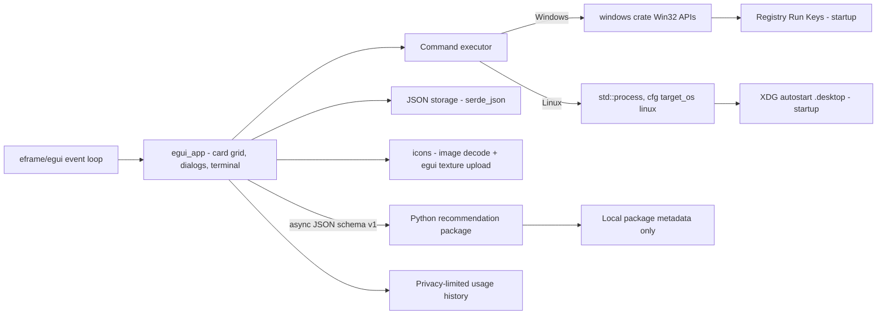
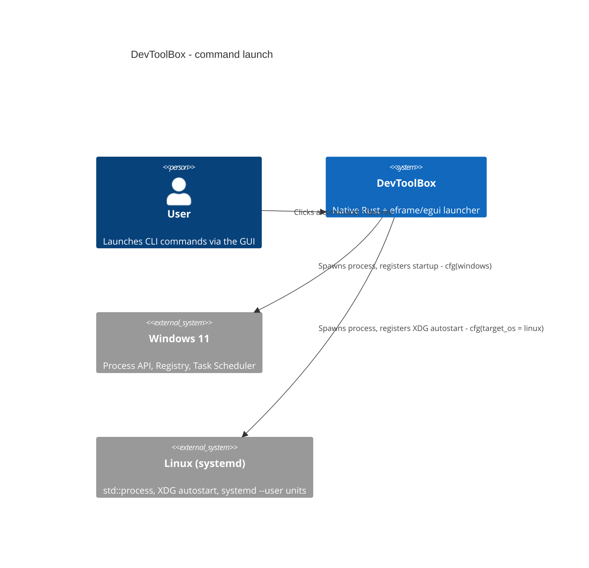

# Architecture

- [Language/Framework](#languageframework)
- [Naming Conventions](#naming-conventions)
- [Services communication](#services-communication)

## Language/Framework

```toml
@Cargo.toml
```

- **Language**: Rust (edition 2021)
- **UI**: `eframe`/`egui` — single cross-platform native UI (replaces the earlier `tao` +
  WinUI 3 plan, abandoned during the multi-OS transformation; `egui` owns the window,
  event loop and immediate-mode rendering on both Windows and Linux)
- **OS integration**:
  - Windows: `windows` crate (Win32 Foundation, WindowsAndMessaging, Threading,
    ProcessStatus, Registry, Shell, GDI, Controls, Input), gated `#[cfg(windows)]` on
    the whole `src/windows/` module (`src/windows/mod.rs`'s `#![cfg(windows)]`)
  - Linux: no extra crate — std + XDG Base Directory spec conventions, gated
    `#[cfg(target_os = "linux")]` on `src/linux/`
- **Platform abstraction**: `src/platform/` exposes OS-neutral config/data/state path
  resolution and a `StartupProvider` trait ("launch at OS startup/login"), dispatching
  at compile time to `platform::windows` (wraps `crate::windows::registry`'s HKCU
  Run-key logic) or `platform::linux` (wraps `crate::linux::autostart`'s XDG
  `.desktop`-file logic)
- **Persistence**: `serde` + `serde_json` (JSON config files)
- **Icons**: `image` crate (PNG/JPEG/BMP/GIF; SVG descoped, decision D1) decoded and
  rendered through `src/icons/` (`egui_backend.rs` uploads to an `egui::TextureHandle`);
  icon *resolution* additionally consults the freedesktop icon theme on Linux
  (`src/linux/icon_theme.rs`)
- **Logging**: `log` + `env_logger`
- **Application recommendations**: a stdlib-only Python domain package
  (`scripts/app_recommendations`) owns OS collectors, evidence, protections and
  scoring. Rust launches its versioned JSON CLI asynchronously through
  `src/python_runtime.rs`; `src/ui/applications_view.rs` renders the result but
  contains no scoring or uninstall execution path.
- **Usage history**: `src/applications/usage.rs` samples local processes only after
  the first report supplies unambiguous executable targets. It stores per-app
  `tracked_since`/`last_seen` plus daily successful-sample counts at the OS-local
  state path. It does not store a process timeline.



## Naming Conventions

Standard Rust conventions:

- **Files/modules**: `snake_case`
- **Functions**: `snake_case`
- **Variables**: `snake_case`
- **Constants**: `SCREAMING_SNAKE_CASE`
- **Types/Structs/Enums**: `PascalCase`

## Bundled `@python` actions

A config action whose command starts with `@python` is resolved to a bundled
script under the DevToolBox root (`DEVTOOLBOX_HOME`, else the nearest ancestor
holding a `scripts/` directory). `src/python_runtime.rs` centralizes the root and
interpreter cascade for both launch paths:

- `src/windows/process.rs` — `#[cfg(windows)]`-gated, backs
  `build_command()`/`build_action_command()`, using Windows' `CREATE_NO_WINDOW`
  creation flag so a script that reports by printing reports to nobody — such
  a script must write to a file via `--out <path>` and the UI must surface
  that file. Not wired into any launch path from the card grid.
- `src/ui/terminal_view.rs` — cross-platform (`std::process::Command`, no
  `cfg(windows)` gate), `launch_captured()`. Backs both the Terminal panel's
  own launch button **and**, since the `actions-launch-and-variants` plan
  (`aidd_docs/tasks/2026_08/2026_08_15_actions-launch-and-variants/`), the
  Actions card grid's click-to-launch: a click on any card's body (icon +
  name) — simple or grouped alike — or "Lancer" on a grouped/variant card
  launches through this same function; both card kinds share the
  `render_card_shell` helper, which is what makes the grouped card's body
  clickable too. The card grid uses a launch-state slot
  dedicated to it (`EguiApp::action_rx`/`action_running`, drained by
  `drain_action_events`), separate from the Terminal view's own
  `terminal_rx`/`terminal_running`, so a card launch and a Terminal-view
  command never interfere with each other; `action_running` also gates
  concurrency, allowing only one card launch at a time. Commands sharing a
  `variant_group` (`config/builtin-actions.json`) render as one card with an
  `egui::ComboBox` variant selector plus a dedicated "Lancer" button, rather
  than one card per variant — `EguiApp::selected_variant` (session-only, never
  persisted to `config.json`) tracks the chosen variant per group.

  Any command may also carry an optional free-text `Command::info` string
  (editable in the action form's "Information" field, omitted from JSON when
  empty). When set — or when the card is unconfigured for this machine — a
  small circled "i" badge is painted in the card's top-right corner via
  `Ui::new_child`, so it costs no layout space, and its text shows only as a
  hover tooltip. `badge_message` decides the tooltip content: the
  unconfigured diagnostic first, then the free-text note, blank-line
  separated. The badge sits outside `add_enabled_ui`, otherwise egui would
  drop its tooltip on a disabled card.

Four consequences bind any script exposed either way:

- **stdout is invisible on the Windows direct-launch path** (`CREATE_NO_WINDOW`);
  not true of the Terminal panel, which streams stdout/stderr live on both OSes.
- **The output path must be absolute.** `resolve_action()` sets the child's
  working directory to `script_path.parent()`, so a relative output path lands
  **inside the script's own package source tree** — overwritten every run, and
  visible in `git status`. Same fact forbids `Path.cwd()` as a default root in
  these scripts.
- **Interpreter resolution** (shared implementation, same order): a venv
  interpreter beside the script wins (`.venv\Scripts\python.exe` on Windows,
  `.venv/bin/python` on Linux), then `DEVTOOLBOX_PYTHON`, then `python3`.
- `bundled_python_actions_reference_existing_scripts` asserts an **exact count**
  of `@python` actions; adding one requires updating that assertion in the same
  change.
- **Any piped Python subprocess must set `PYTHONIOENCODING=utf-8` on the
  child's environment.** Without it, Python picks the console's codepage
  (e.g. `cp1252` on a French Windows install) for stdout whenever stdout isn't
  a real console — a piped `Stdio`, as used by `recommendation_command`
  (`src/python_runtime.rs`), always qualifies. An accented character (app
  name, size label, …) then comes out as raw Latin-1 bytes instead of UTF-8,
  which `serde_json::from_slice`/`from_str` reject outright.

## PowerShell JSON bridges (Automations view)

`src/ui/automations_view.rs`'s `fetch_impl` (Windows) shells out to
`Get-ScheduledTask` + `ConvertTo-Json -Compress` and deserializes the result
into `Vec<AutomationRow>`.

- **A field PowerShell always seems to populate can still be genuinely
  `$null`.** `Get-ScheduledTask`'s `Author` is `$null` (not `""`) for several
  built-in system tasks (e.g. the `.NET Framework NGEN` family) — a plain,
  non-optional `String` field rejects that outright. The fix is a
  `#[serde(deserialize_with = "...")]` mapper that folds `null` to `""`,
  matching how `NextRun` already represents "nothing to show" as an empty
  string rather than an absent/optional field — not switching the field to
  `Option<String>`, which would push the null-check onto every caller.
- **A single-object PowerShell response and an array response both have to
  deserialize.** `ConvertTo-Json` returns a bare object (no `[...]`) when
  exactly one task matches, and an array otherwise — `fetch_impl` tries
  `Vec<AutomationRow>` first, falling back (`.or_else`) to a single
  `AutomationRow` wrapped in a one-element `Vec` if that first attempt errors.
  The surfaced error (via `.map_err`) is always the *second* attempt's, so
  when the real payload genuinely is an array but the first `Vec<...>` parse
  fails for an unrelated reason (e.g. a field-level type mismatch on one
  element), the message the user actually sees comes from trying to
  deserialize that whole array as one struct — serde_json doesn't reply
  "expected a struct, found a sequence" there, it falls back to
  positional/seq-based field binding and reports something like `invalid
  type: map, expected a string at line 1 column 1`, which points at a
  field-type mismatch that isn't the real shape mismatch either. Don't trust
  that message when diagnosing a "réponse PowerShell inattendue" error;
  reproduce the raw JSON directly instead.

## Docker CLI bridge (Docker tab, Linux-only)

Three layers, same shape as the Automations view: `src/linux/docker.rs`
(CLI data source, `#[cfg(target_os = "linux")]` via `src/linux/mod.rs`) →
`src/ui/docker_view.rs` (OS-neutral shared types + cfg-gated façade + pure
"data in, actions out" render) → `src/ui/egui_app.rs` (tab, lazy fetch,
confirm modals). Key mechanics:

- Listings use `docker ... --format '{{json .}}'` (NDJSON, one object per
  line, tolerant parser) — **except** `docker system df -v`, which emits one
  single JSON object with `Volumes`/`Images` arrays.
- `run_docker(args, OperationClass)`: `Listing` (~5 s) vs `Action` (~30 s)
  timeouts; a listing timeout/`cannot connect`/`permission denied` maps to
  `DaemonUnreachable` (in-tab retry message), an action timeout never does.
- **Blocking work is deferred by one frame**: clicking "Oui" (or "Calculer
  les tailles") stores a `DeferredDockerAction` + status + repaint; the next
  `update` executes it, so the busy status paints before the UI freezes.
- Volume sizes are merged into the existing snapshot **by name, without a
  refetch** — a refetch would drop them (`docker volume ls` always reports
  `Size:"N/A"`).

### Ports, dates and dormancy

`src/ui/ports.rs` is an OS-neutral, dependency-free **pure port model** that
knows nothing about docker: `PortBinding` / `PortOwner` / `PortConflict`,
`parse_ps_ports` (reads `docker ps`'s flat `Ports` string),
`find_conflicts`, `format_bindings`. It sits under `src/ui/` rather than
`src/linux/` because Part 2's compose stacks feed it *declared* ports with no
daemon involved (`OwnerKind::DeclaredStack`). Measured traps it encodes:

- One publish is reported twice, once IPv4 and once IPv6 (`0.0.0.0:5656->…,
  [::]:5656->…`). De-duplication happens in `PortOwner::new`, **not** in the
  parser — `ContainerEntry.ports` stays a faithful image of what docker said.
- A conflict needs two *distinct* owner keys and overlapping interfaces
  (a wildcard bind overlaps everything), so a container never conflicts with
  itself.

Dates come from a **grouped `docker inspect` pass** (`inspect_containers` /
`inspect_dates`, chunked 50 ids per call) because the listings cannot supply
them. Three measured contracts:

- `docker inspect --format` does **not** expand `\t` — it prints the two
  literal characters. The templates therefore emit NDJSON via `{{json …}}`,
  which also lets Part 2 append `.Config.Labels` without inventing a
  separator. A `the_inspect_templates_emit_json_fields…` test guards this.
- `inspect` returns 64-char / `sha256:`-prefixed ids while the listings
  return 12-char ones: **both sides of the join go through `normalize_id`**,
  or the date column silently stays empty forever.
- `docker inspect` exits non-zero when a single id is unknown (a resource
  removed between the listing and the inspect) while still printing every id
  it resolved. `run_command_capturing` therefore returns
  `CommandOutput { success, stdout, stderr }` and reserves `Err` for spawn
  failure/timeout only; `run_command_with_timeout` is a thin wrapper over it.

Dormancy itself is pure and **clock-injected** (`DockerViewState.now_epoch_secs`),
so every badge is assertable in a test: `parse_rfc3339` (a real parser, not a
lexicographic compare — `docker volume inspect` returns a local offset
`+02:00` while container/image inspects return `…Z`), `cutoff_epoch`,
`days_since`, `is_dormant`. `ZERO_DOCKER_DATE` (`0001-01-01T00:00:00Z`) means
*no date at all*, never "very old". Dormancy **refines** the existing signals
rather than standing alone — a running container, a used image and a
non-orphan volume are never dormant however old their dates are, because
docker stores no "last used" date to justify it.

### Grouped deletion (selection bar)

A selection lives in `EguiApp` (`docker_selection: HashSet<SelectionKey>`),
never in the view — it has to survive the refetch that follows every action.
`refetch_docker` is the **single** entry point for `docker_view::fetch()`
precisely so `sanitize_selection` runs on every new snapshot: a key whose
resource vanished (deleted here, or from another terminal) stops being a
target instead of producing an unactionable failure. Contracts worth keeping:

- Sizes are **SI**, like docker's own `units.HumanSize`: `kB` = 1000, and
  `parse_human_size` reads only what precedes `" ("` so a container's
  `767kB (virtual 148MB)` contributes its writable layer, not its image
  layers. An unreadable size makes the batch total print as `≥ X` rather
  than silently counting as zero.
- A row is selectable **iff** its own « Supprimer » button would be enabled —
  plus one selection-aware rule: an image whose every `used_by` container is
  itself selected becomes selectable, since the batch deletes those first.
  `sanitize_selection` validates images against the containers it has already
  kept, so unticking a container unticks the image on the same frame. An
  image `used` with an *empty* `used_by` (the "used on doubt" case) can never
  be freed by any selection. Volumes have no equivalent rule.
- `ResourceKind`'s **declaration order is the deletion order** (containers →
  images → volumes), consumed by `order_targets`' stable sort.
- The batch is N per-item `docker` calls, deliberately not `docker rm a b c`:
  that is what makes continue-on-failure and a per-item report possible.
  `remove_batch_with` takes the removal closure so both are testable with no
  daemon; `remove_batch` is the usual cfg-split façade over it.
- Only the *succeeded* items leave the selection; failures stay ticked so a
  retry is one click. The report is cleared by the next selection change or a
  manual refresh, never by a timer.
- `egui::Modal` centres itself only once it knows its size, so its first
  frame is off-centre: a kittest that clicks a dialog button must `run()` to
  settle, not `run_steps(n)`, or the click lands on the backdrop and reads as
  a dismissal. Multi-line dialog messages also keep the modal narrower than
  the window.

### Compose stacks (Stacks section, Linux-only)

Same three layers as above: `src/linux/compose.rs` (CLI + `walkdir`) →
`src/ui/compose_view.rs` (every OS-neutral type, façade, pure render) →
`src/ui/egui_app.rs` (state, worker threads, dispatch). `StackConfig` /
`StackService` / `ScanOutcome` live in `compose_view.rs`, **not** in the
Linux module, because `src/ui/` is compiled on Windows too — the Linux module
only converts its private `ConfigWire` into them. Measured contracts:

- `docker compose -f <file> config --format json` needs **no daemon** and
  costs ~89 ms, which is why DevToolBox parses no YAML itself. It is not the
  `--format json` banned for the listings: different subcommand, different
  flag family. Its `level=warning` diagnostics go to **stderr**, so only
  stdout is parsed.
- A sibling `.env` resolves from the compose file's own directory even when
  the process' cwd is elsewhere (measured with cwd `/`), so
  `run_command_with_timeout` needed **no** `cwd` parameter — the plan's
  planned change to it was annulled. `up -d` still runs with the file's
  parent as working directory, for relative build contexts.
- `published` is a string in the measured output and a number in other
  schema versions (`#[serde(untagged)]`); `ports` is `null` for a service
  that publishes nothing; `host_ip` is absent and defaults to the wildcard.
- The stack↔container link reads `com.docker.compose.project` and
  `…project.config_files` from the **grouped inspect's** `.Config.Labels`,
  never from `docker ps`'s flat `Labels` string (which joins labels with the
  same `,` that separates a multi-file `config_files` value). Zero extra
  docker calls — Part 1's inspect template was extended.
- `Exited (0)` is a normally-finished one-shot, never a failure
  (`compose_view::is_failing`), or the `db-init` containers would pin healthy
  stacks to `partielle` forever. `exit_code` is parsed from the **listing's**
  status text, not from the inspect, which may come back empty on a race.
- `up -d` / `stop` / `down` are **detached**, streamed through
  `terminal_view::launch_captured_program` on their own channel — never the
  30 s `run_docker` path, which cannot represent a minutes-long image pull.
  `down` never carries `-v`. Only `down` is confirmed by a modal.
- The `$HOME` walk has **no depth cap** (a depth-6 cap missed 3 of the 13
  real files here); it prunes by directory name via `filter_entry`, which is
  what keeps a `node_modules` tree from being descended at all, and never
  truncates silently — past `SCAN_WARN_MS` the outcome carries a warning.
- The command's output goes to an **anchored bottom panel**
  (`compose_view::render_log_panel`, `egui::Panel::bottom`), not into the
  tab's flow and not into the Terminal view. Two constraints decided this.
  Inline, the panel appeared and vanished mid-run and shoved the Docker
  sections below it while the user was reading them. Rerouting to Terminal
  was rejected on a harder ground: `command_busy()` deliberately excludes
  `compose_running` so a build can run while the user does something else,
  and a shared `terminal_lines` would interleave two live streams — adding
  `compose_running` to the guard would freeze the Actions tab for the length
  of an image pull. The panel is also where the *result* is not: `down`'s
  result is the row flipping to « arrêtée », which a view switch would hide.
  `render_log_panel` must be called **before** the tab's other content (egui
  shrinks the parent cursor when a panel claims an edge), keys its visibility
  on `log_target`, and its ✕ is disabled while `busy` — closing mid-run would
  drop the buffer and the panel would reopen on the next output line anyway.
  A kittest driving a `busy` panel needs `run_steps`, not `run`: the spinner
  repaints forever and `run`'s settle loop trips its own ceiling. The
  opposite of the modal trap — an anchored panel's rect is final on frame 1.
- The three resource lists are **tabs**, not stacked sections
  (`docker_view::DockerList` + `render_list_tabs`, selected via
  `DockerAction::SelectList`, held in `EguiApp.docker_active_list` as session
  state — a tab choice is not a `config.json` setting). Only the active list
  is laid out, which is also why the per-section `ui.strong` headings are
  gone: the tab label names and counts the list. The non-obvious constraint:
  the batch selection **spans** the three lists (ticking a container is what
  makes its image selectable), so each tab label carries its own selection
  count — `Volumes (3 · 1 sél.)` — or « Supprimer la sélection » would act on
  rows the user cannot see ticked. The selection bar and the batch report
  stay **above** the tab strip, outside the scroll area, and switching tabs
  triggers no refetch and never clears the report.

Some commands need a different literal launch string per machine (e.g. a
path or app name that only exists on one host). `Command.machine_specific:
bool` (`src/storage/models.rs`, `#[serde(default)]`, so a command absent this
field in JSON deserializes to `false` — every pre-existing config entry is
unaffected) opts a command into this.

- **Storage** (`src/storage/machine_commands.rs`): `MachineCommands {
  machines: BTreeMap<String, BTreeMap<String, String>> }` — machine id ->
  command id -> override launch string. Persisted at
  `platform::machine_commands_path()`, which mirrors `state_log_path()`'s
  directory (`$XDG_STATE_HOME/devtoolbox/machine-commands.json`, falling back
  to `~/.local/state/devtoolbox/machine-commands.json`, on Linux;
  `%LOCALAPPDATA%\DevToolBox\machine-commands.json` on Windows) —
  deliberately **not** `config_path()`'s directory
  (`$XDG_CONFIG_HOME`/roaming `%APPDATA%`), so a tool that syncs the config
  directory across machines (dotfiles manager, roaming profile) doesn't
  propagate one machine's overrides onto another. A missing file loads as an
  empty map, not an error; malformed JSON surfaces a distinct
  `MachineCommandsError::Parse` so a hand-edit mistake is visible.
- **Machine identity** (`platform::machine_id()`): the `DEVTOOLBOX_MACHINE_ID`
  env var when set to a non-empty value, else the OS hostname (`/etc/hostname`
  on Linux, `%COMPUTERNAME%` on Windows), else the `"unknown"` sentinel.
  Never panics.
- **Resolution** (`storage::resolve_command(command, overrides, machine_id)
  -> CommandResolution`): a non-machine-specific command always resolves to
  `command.command` unchanged, ignoring `overrides` entirely. A
  machine-specific command looks up
  `overrides.machines[machine_id][command.id]`, comparing machine ids
  case-insensitively (both sides lowercased) so a mapping saved from a
  machine with an uppercase hostname still matches a lowercase lookup at
  resolution time. A miss on either the machine id or the command id yields
  `CommandResolution::Unconfigured { command_id, machine_id }` rather than an
  error.
- **UI** (`src/ui/egui_app.rs`, `resolution_fields()`): turns that outcome
  into each card's `is_configured`/`disabled_message`. An `Unconfigured`
  card renders disabled via `ui.add_enabled_ui(card.is_configured, ...)`,
  with an inline message naming the current machine id and
  `machine_commands_path()` so the user knows exactly what to add and where;
  the favorite-toggle star stays enabled regardless, so an unconfigured card
  can still be favorited. The resolved override string feeds `CardData.command`
  and is what the card grid's click-to-launch actually launches (see the
  `terminal_view::launch_captured` note above) — an `Unconfigured` card is
  simply never clickable.

**Relative to the `@python` cascade above**: these are two independent,
composable resolution stages over the same string. Per-machine resolution
runs first and decides *which* literal command string applies on this
machine (the base `command.command`, or a machine-specific override);
`@python` resolution then runs on *that* string to decide *how* to execute
it (bundled script vs. literal shell command). A machine-specific command's
override value is free to itself be an `@python ...` invocation — neither
resolver forbids it — though no shipped example does this today.

**Known limitation — merge staleness.** `merge_builtin_actions()`
(`src/storage/json.rs`) merges `config/builtin-actions.json`'s
categories/commands into a user's config on first load (skipping any
command id already present), and the merged result is what gets persisted
back on save. A builtin command's `machine_specific` flag is therefore baked
into the user's `config.json` **at merge time** and never re-synced
afterward: if a later release changes a builtin's `machine_specific` flag in
`config/builtin-actions.json`, a user who already merged that command once
keeps the old flag value indefinitely — the new value only reaches users
merging that command for the first time. This is an accepted, documented
limitation (decision 8 of the per-machine command mapping master plan), not
a bug to fix; it matches `merge_builtin_actions()`'s existing skip-if-present
behavior for every other builtin field.

All 14 `@python`-based entries in `config/builtin-actions.json` (10
`launch_rust_app.py`-based + 4 `sftp_fetch.py`-based) are
`machine_specific: false` — confirmed by `grep -c machine_specific
config/builtin-actions.json` returning `0` (the key is simply absent from
every entry, which `#[serde(default)]` resolves to `false`). None of the
shipped builtins currently need a per-machine override.

A documented, self-serve starting point for a new mapping file ships at
`config/machine-commands.example.json`.

## Services communication

The application is a self-contained native binary. A user action (button / icon /
Terminal panel) triggers a command launch routed to the OS process API (`windows`
crate on Windows, `std::process` on Linux); configuration is loaded from and saved to
local JSON.



> No external/network services. All integration is with local OS APIs (Windows 11 or
> Linux with `systemd --user`).
