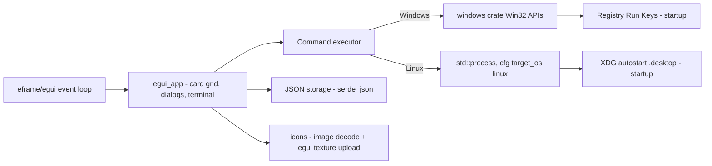
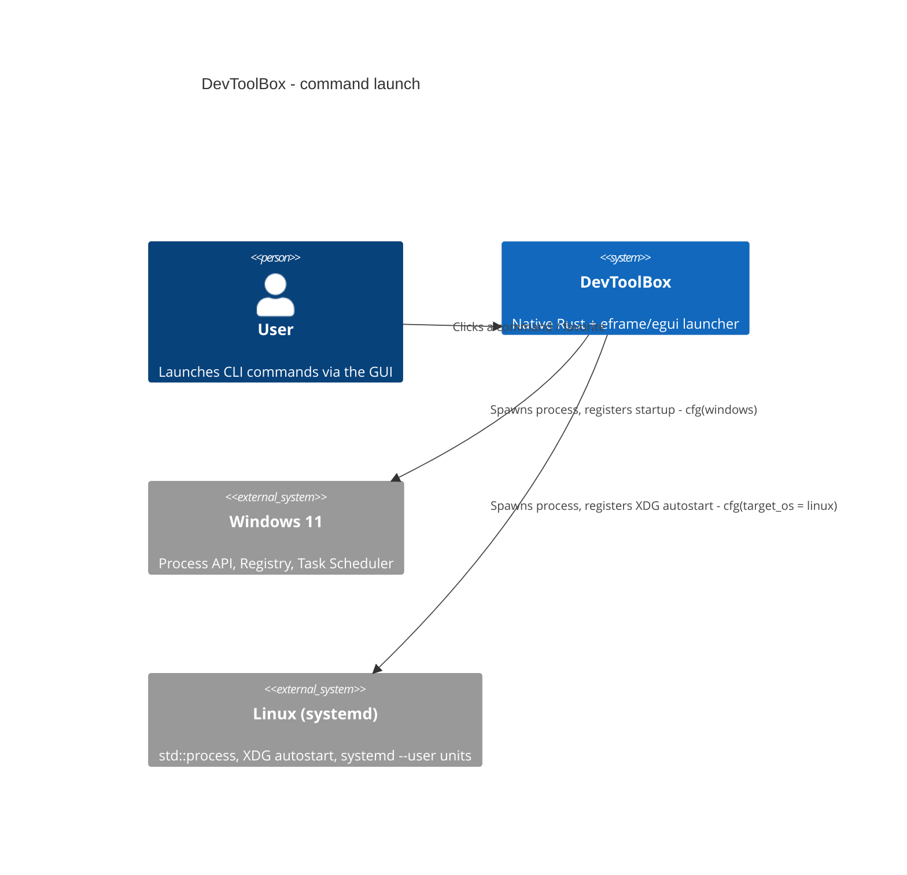

# Architecture

- [Language/Framework](#languageframework)
- [Naming Conventions](#naming-conventions)
- [Services communication](#services-communication)

## Language/Framework

```toml
@Cargo.toml
```

- **Language**: Rust (edition 2021)
- **UI**: `eframe`/`egui` — single cross-platform native UI (replaces the earlier `tao` +
  WinUI 3 plan, abandoned during the multi-OS transformation; `egui` owns the window,
  event loop and immediate-mode rendering on both Windows and Linux)
- **OS integration**:
  - Windows: `windows` crate (Win32 Foundation, WindowsAndMessaging, Threading,
    ProcessStatus, Registry, Shell, GDI, Controls, Input), gated `#[cfg(windows)]` on
    the whole `src/windows/` module (`src/windows/mod.rs`'s `#![cfg(windows)]`)
  - Linux: no extra crate — std + XDG Base Directory spec conventions, gated
    `#[cfg(target_os = "linux")]` on `src/linux/`
- **Platform abstraction**: `src/platform/` exposes OS-neutral config/data/state path
  resolution and a `StartupProvider` trait ("launch at OS startup/login"), dispatching
  at compile time to `platform::windows` (wraps `crate::windows::registry`'s HKCU
  Run-key logic) or `platform::linux` (wraps `crate::linux::autostart`'s XDG
  `.desktop`-file logic)
- **Persistence**: `serde` + `serde_json` (JSON config files)
- **Icons**: `image` crate (PNG/JPEG/BMP/GIF; SVG descoped, decision D1) decoded and
  rendered through `src/icons/` (`egui_backend.rs` uploads to an `egui::TextureHandle`);
  icon *resolution* additionally consults the freedesktop icon theme on Linux
  (`src/linux/icon_theme.rs`)
- **Logging**: `log` + `env_logger`



## Naming Conventions

Standard Rust conventions:

- **Files/modules**: `snake_case`
- **Functions**: `snake_case`
- **Variables**: `snake_case`
- **Constants**: `SCREAMING_SNAKE_CASE`
- **Types/Structs/Enums**: `PascalCase`

## Bundled `@python` actions

A config action whose command starts with `@python` is resolved to a bundled
script under the DevToolBox root (`DEVTOOLBOX_HOME`, else the nearest ancestor
holding a `scripts/` directory). The resolution cascade exists in two places:

- `src/windows/process.rs` — `#[cfg(windows)]`-gated, backs the direct
  card-click launch path (`build_command()`/`build_action_command()`, using
  Windows' `CREATE_NO_WINDOW` creation flag so a script that reports by
  printing reports to nobody — such a script must write to a file via
  `--out <path>` and the UI must surface that file). **As of Part 2, this
  direct-launch wiring from the card grid is still deferred** — the `egui`
  UI's click handler is not yet connected to it on either OS.
- `src/ui/terminal_view.rs` — cross-platform (`std::process::Command`, no
  `cfg(windows)` gate), backs the Terminal panel's launch button via
  `launch_captured()`. This is the one currently wired into the running UI.

Four consequences bind any script exposed either way:

- **stdout is invisible on the Windows direct-launch path** (`CREATE_NO_WINDOW`);
  not true of the Terminal panel, which streams stdout/stderr live on both OSes.
- **The output path must be absolute.** `resolve_action()` sets the child's
  working directory to `script_path.parent()`, so a relative output path lands
  **inside the script's own package source tree** — overwritten every run, and
  visible in `git status`. Same fact forbids `Path.cwd()` as a default root in
  these scripts.
- **Interpreter resolution** (both implementations, same order): a venv
  interpreter beside the script wins (`.venv\Scripts\python.exe` on Windows,
  `.venv/bin/python` on Linux), then `DEVTOOLBOX_PYTHON`, then `python3`.
- `bundled_python_actions_reference_existing_scripts` asserts an **exact count**
  of `@python` actions; adding one requires updating that assertion in the same
  change.

## Per-machine command resolution

Some commands need a different literal launch string per machine (e.g. a
path or app name that only exists on one host). `Command.machine_specific:
bool` (`src/storage/models.rs`, `#[serde(default)]`, so a command absent this
field in JSON deserializes to `false` — every pre-existing config entry is
unaffected) opts a command into this.

- **Storage** (`src/storage/machine_commands.rs`): `MachineCommands {
  machines: BTreeMap<String, BTreeMap<String, String>> }` — machine id ->
  command id -> override launch string. Persisted at
  `platform::machine_commands_path()`, which mirrors `state_log_path()`'s
  directory (`$XDG_STATE_HOME/devtoolbox/machine-commands.json`, falling back
  to `~/.local/state/devtoolbox/machine-commands.json`, on Linux;
  `%LOCALAPPDATA%\DevToolBox\machine-commands.json` on Windows) —
  deliberately **not** `config_path()`'s directory
  (`$XDG_CONFIG_HOME`/roaming `%APPDATA%`), so a tool that syncs the config
  directory across machines (dotfiles manager, roaming profile) doesn't
  propagate one machine's overrides onto another. A missing file loads as an
  empty map, not an error; malformed JSON surfaces a distinct
  `MachineCommandsError::Parse` so a hand-edit mistake is visible.
- **Machine identity** (`platform::machine_id()`): the `DEVTOOLBOX_MACHINE_ID`
  env var when set to a non-empty value, else the OS hostname (`/etc/hostname`
  on Linux, `%COMPUTERNAME%` on Windows), else the `"unknown"` sentinel.
  Never panics.
- **Resolution** (`storage::resolve_command(command, overrides, machine_id)
  -> CommandResolution`): a non-machine-specific command always resolves to
  `command.command` unchanged, ignoring `overrides` entirely. A
  machine-specific command looks up
  `overrides.machines[machine_id][command.id]`, comparing machine ids
  case-insensitively (both sides lowercased) so a mapping saved from a
  machine with an uppercase hostname still matches a lowercase lookup at
  resolution time. A miss on either the machine id or the command id yields
  `CommandResolution::Unconfigured { command_id, machine_id }` rather than an
  error.
- **UI** (`src/ui/egui_app.rs`, `resolution_fields()`): turns that outcome
  into each card's `is_configured`/`disabled_message`. An `Unconfigured`
  card renders disabled via `ui.add_enabled_ui(card.is_configured, ...)`,
  with an inline message naming the current machine id and
  `machine_commands_path()` so the user knows exactly what to add and where;
  the favorite-toggle star stays enabled regardless, so an unconfigured card
  can still be favorited. As of this lot, only the enabled/disabled
  determination is wired — the resolved override string itself is not yet
  threaded into a launch call, since the card grid's click-to-launch handler
  remains unconnected on both OSes (the same deferred state already noted
  above for the direct-launch `@python` path).

**Relative to the `@python` cascade above**: these are two independent,
composable resolution stages over the same string. Per-machine resolution
runs first and decides *which* literal command string applies on this
machine (the base `command.command`, or a machine-specific override);
`@python` resolution then runs on *that* string to decide *how* to execute
it (bundled script vs. literal shell command). A machine-specific command's
override value is free to itself be an `@python ...` invocation — neither
resolver forbids it — though no shipped example does this today.

**Known limitation — merge staleness.** `merge_builtin_actions()`
(`src/storage/json.rs`) merges `config/builtin-actions.json`'s
categories/commands into a user's config on first load (skipping any
command id already present), and the merged result is what gets persisted
back on save. A builtin command's `machine_specific` flag is therefore baked
into the user's `config.json` **at merge time** and never re-synced
afterward: if a later release changes a builtin's `machine_specific` flag in
`config/builtin-actions.json`, a user who already merged that command once
keeps the old flag value indefinitely — the new value only reaches users
merging that command for the first time. This is an accepted, documented
limitation (decision 8 of the per-machine command mapping master plan), not
a bug to fix; it matches `merge_builtin_actions()`'s existing skip-if-present
behavior for every other builtin field.

All 14 `@python`-based entries in `config/builtin-actions.json` (10
`launch_rust_app.py`-based + 4 `sftp_fetch.py`-based) are
`machine_specific: false` — confirmed by `grep -c machine_specific
config/builtin-actions.json` returning `0` (the key is simply absent from
every entry, which `#[serde(default)]` resolves to `false`). None of the
shipped builtins currently need a per-machine override.

A documented, self-serve starting point for a new mapping file ships at
`config/machine-commands.example.json`.

## Services communication

The application is a self-contained native binary. A user action (button / icon /
Terminal panel) triggers a command launch routed to the OS process API (`windows`
crate on Windows, `std::process` on Linux); configuration is loaded from and saved to
local JSON.



> No external/network services. All integration is with local OS APIs (Windows 11 or
> Linux with `systemd --user`).
