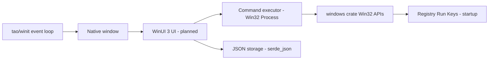
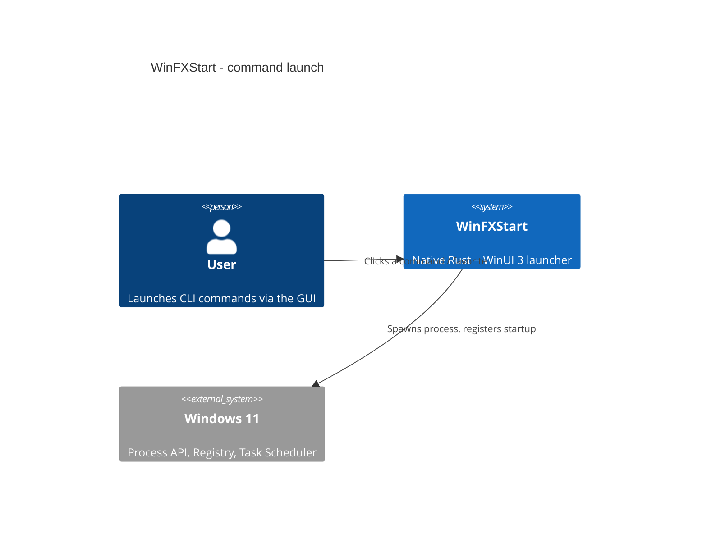

# Architecture

- [Language/Framework](#languageframework)
- [Naming Conventions](#naming-conventions)
- [Services communication](#services-communication)

## Language/Framework

```toml
@Cargo.toml
```

- **Language**: Rust (edition 2021)
- **Windowing**: `tao` (custom-fonts) + `winit` for the native window / event loop
- **OS integration**: `windows` crate (Win32 Foundation, WindowsAndMessaging, Threading, ProcessStatus, Registry, Shell, GDI)
- **Native UI**: WinUI 3 (Microsoft UI Library) — planned, not yet wired
- **Persistence**: `serde` + `serde_json` (JSON config files)
- **Icons**: `image` crate for PNG/SVG handling
- **Logging**: `log` + `env_logger`



## Naming Conventions

Standard Rust conventions:

- **Files/modules**: `snake_case`
- **Functions**: `snake_case`
- **Variables**: `snake_case`
- **Constants**: `SCREAMING_SNAKE_CASE`
- **Types/Structs/Enums**: `PascalCase`

## Bundled `@python` actions (`src/windows/process.rs`)

A config action whose command starts with `@python` is resolved to a bundled
script under the WinFXStart root (`WINFXSTART_HOME`, else the nearest ancestor
holding a `scripts/` directory). Four consequences bind any script exposed that
way:

- **stdout is invisible.** `build_command()` spawns with `CREATE_NO_WINDOW`, so
  a script that reports by printing reports to nobody. Such an action must write
  to a file (`--out <path>`) and the UI must surface that file.
- **That path must be absolute.** `resolve_action()` sets the child's working
  directory to `script_path.parent()` (applied by `build_action_command()` via
  `current_dir`), so a relative output path lands **inside the script's own
  package source tree** — overwritten every run, and visible in `git status`.
  Same fact forbids `Path.cwd()` as a default root in these scripts.
- **Interpreter resolution**: a `.venv\Scripts\python.exe` beside the script
  wins, then `WINFXSTART_PYTHON`, then `python3`.
- `bundled_python_actions_reference_existing_scripts` asserts an **exact count**
  of `@python` actions; adding one requires updating that assertion in the same
  change.

## Services communication

The application is a self-contained native binary. A user action (button / icon) triggers a command launch routed to the Windows process API; configuration is loaded from and saved to local JSON.



> No external/network services. All integration is with local Windows 11 APIs.
