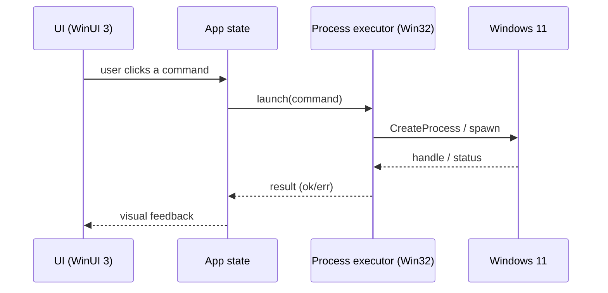

# Communicating with the backend

WinFXStart has no client/server backend. This file documents the equivalent internal "backend" boundary: how the UI layer drives command execution and OS integration inside the single binary.

## Overview

- **Services**: in-process modules (planned `src/windows/process.rs`, `registry.rs`, `task_scheduler.rs`)
- **Request Types**: UI events → command launch, startup-registration toggle, config load/save
- **Entities**: `Command`, `Category`, `Settings` (defined in planned `src/storage/models.rs`)
- **Error Handling**: command launch failures surfaced as UI feedback (success/error)
- **Validation**: command string and config validated on load and before execution

### Data Flow

