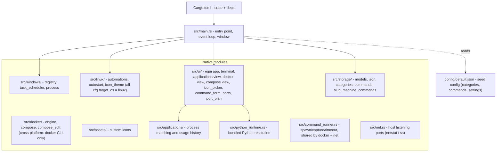

# Codebase Structure

Current state: one native Rust binary split into platform, UI, storage, icon and
application-usage modules, plus isolated Python utility packages.

## Standalone scripts (`scripts/`)

Independent, stdlib-only Python utilities living alongside the Rust crate, each with its own `tests/` run via `python -m unittest discover`: `sftp_fetch/`, `deps_audit/` (repo-declared deps vs source audit), `system_inventory/` (read-only Windows dev-machine disk inventory: registry, AppData/dotfolders/ProgramData, Scoop/Choco, PATH, Docker/WSL vhdx), `winclean/` (dry-run-first disk cleaner; imports `system_inventory` as its **read-only** discovery layer and must never modify it — see `memory/internal/decisions/winclean-separate-package.md`).

`model_orchestrator/` owns the schema-versioned local-AI artifact catalog,
progressive content identity, path-safety primitives, and read-only adapters for
Ollama, Jan, LM Studio, and ComfyUI. `local_ai/ollama_http.py` is the narrow
caller-neutral loopback transport shared by that inventory and `winclean`;
each caller translates technical failures into its own domain. The orchestrator
otherwise remains separate from `winclean`: inventory and migration never imply
that an artifact is safe to delete.

`app_recommendations/` is the read-only multi-OS application report: stable models
and score in `models.py`/`scoring.py`, aggregation in `report.py`, APT/Snap/Flatpak
and Registry/AppX/Scoop/Chocolatey adapters in `collectors/`, and the schema-v1 CLI
in `__main__.py`. Its tests include a JSON fixture consumed directly by Rust.

### Gotchas shared by these scripts

- An argparse `help=` string is `%`-formatted at render time: a literal
  `%APPDATA%` must be written `%%APPDATA%%`, otherwise `--help` raises
  `ValueError` for the **whole** parser. No `parse_args` test catches it —
  formatting only happens on render, so assert on `format_help()`.
- A `--out <file>` option writes UTF-8, but **redirected stdout follows the
  console code page** (cp1252 here). Reading a script's piped output therefore
  needs `encoding='cp1252'`, and a `--json` pipe is not UTF-8-safe.
