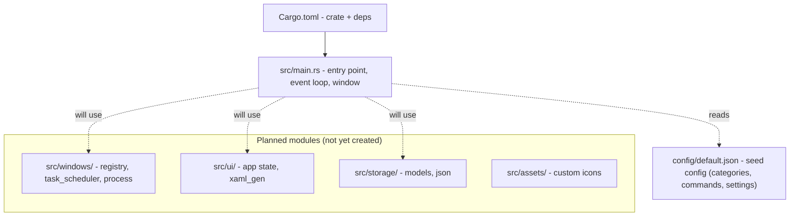

# Codebase Structure

Current state (MVP, Phase 1): a single binary crate with one entry point. The modular layout below is the intended target documented in `README.md`; only `src/main.rs` exists today.

