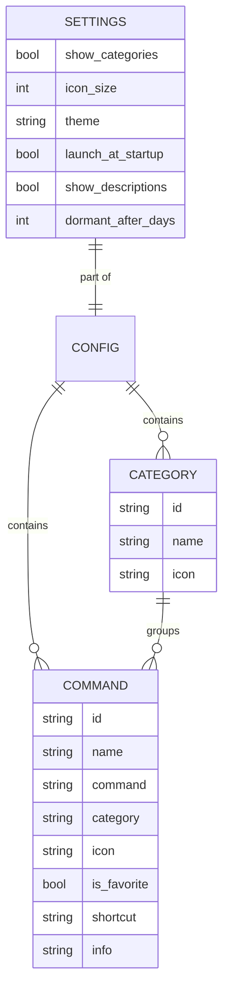

# Database

DevToolBox has no database engine. Persistence is local JSON files handled with `serde` / `serde_json`. The seed/default file is `config/default.json`.

```json
@config/default.json
```

## Main entities and relationships



- A `Command` references a `Category` by `id` (the `category` field stores the category's `id` string).
- `Settings` are app-level (theme, icon size, startup, etc.).
- `dormant_after_days` (`u32`, default 60) is the Docker tab's dormancy
  threshold in days, edited in Préférences. It carries a **field-level**
  `#[serde(default = "default_dormant_after_days")]` because `Settings` has
  no struct-level `#[serde(default)]` — without it, every config written
  before the field existed would fail to load outright. Unlike `shortcut` /
  `info` it is *not* `skip_serializing_if`: the key is always written back,
  so the on-disk file states the threshold explicitly.
- `docker_stacks` (`Vec<String>`, `#[serde(default, skip_serializing_if =
  "Vec::is_empty")]`) is the Docker tab's memorized list of compose-file
  paths, written by a scan and re-read at launch so reopening the tab does
  not re-walk `$HOME`. Both attributes matter: `default` lets every existing
  config load, and `skip_serializing_if` keeps a config that never scanned
  byte-identical to today's — the key only appears once the user scans.
  A scan **replaces** the list rather than merging into it; a path the walk
  no longer finds is genuinely gone, and a project still running from a
  vanished file is rebuilt from the container labels instead (see
  `compose_view::link_runs`).
- `shortcut` and `info` are optional (`Option<String>`, `skip_serializing_if`):
  absent from JSON means `None`, and `None` is never written back — so older
  configs round-trip losslessly. `info` is free text surfaced as the card's
  "i" badge tooltip.

## Schema stability (issue #6)

The schema is intentionally unchanged by issue #6. Key invariants:

- `"uncategorized"` is a **synthetic grouping bucket**, never a stored `Category`. Commands with an empty or unknown `category` id are grouped under it at runtime only.
- The `category` field of a `Command` is an empty string `""` when the command has no category or its category was removed. This is the on-disk representation of "Uncategorized".
- No new JSON field was added in issue #6; the issue #3 lossless round-trip tests are unaffected.

## Migrations

None. Config schema is versioned via the top-level `version` field in the JSON. Schema evolution is handled in-code on load.

## Seeding

`config/default.json` ships as the default configuration (sample categories and commands).
