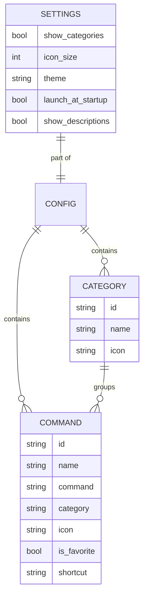

# Database

WinFXStart has no database engine. Persistence is local JSON files handled with `serde` / `serde_json`. The seed/default file is `config/default.json`.

```json
@config/default.json
```

## Main entities and relationships



- A `Command` references a `Category` by `id`.
- `Settings` are app-level (theme, icon size, startup, etc.).

## Migrations

None. Config schema is versioned via the top-level `version` field in the JSON. Schema evolution is handled in-code on load.

## Seeding

`config/default.json` ships as the default configuration (sample categories and commands).
