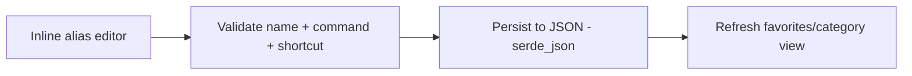

# Forms

DevToolBox is a native WinUI 3 desktop app — there are no web forms. The only form-like surface is the **command/alias editor** (Phase 2, planned), used to create and edit commands.

## State Management

- App state held in-process (planned `src/ui/app.rs`); edits persisted to JSON via `serde_json`.

## Validation

- Command string presence and basic validity checked before save/execution.

## Form Flow

> Planned for Phase 2 (Personnalisation); not yet implemented.
