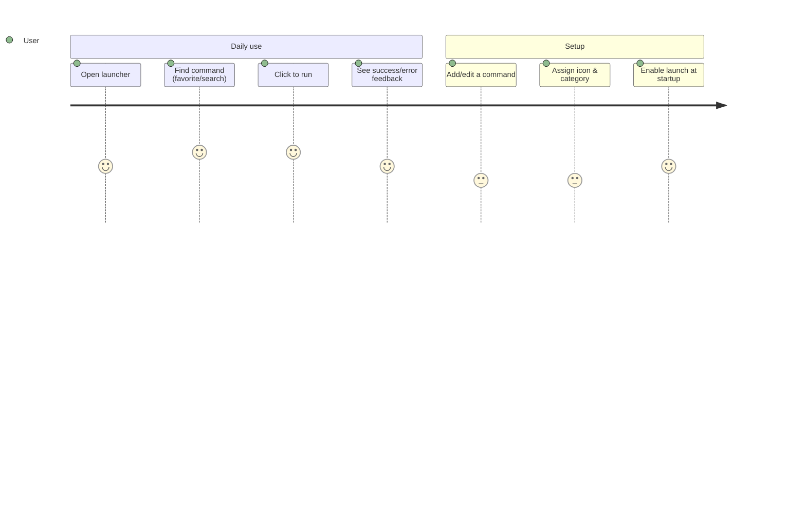

# PROJECT_BRIEF.md

DevToolBox is a minimalist Rust application to launch Windows CLI commands from a native WinUI 3 graphical interface.

## Executive Summary

- **Project Name**: DevToolBox — Windows 11 Command Launcher
- **Vision**: Launch any Windows CLI command in one click from a fast, native, bloat-free launcher.
- **Mission**: Give power users a lightweight (no WebView) GUI to organize, customize, and run their frequent commands, with optional launch at Windows startup.

### Full Description

A native Windows 11 desktop launcher built in Rust. Users define commands (with names, icons, categories, favorites, keyboard shortcuts) and run them from customizable buttons/icons. Configuration is stored as JSON. The app can register itself to start at Windows login.

## Context

### Core Domain

Desktop productivity tooling for Windows 11. The domain centers on **commands** the user wants quick access to, organized into **categories** and surfaced as **favorites**, executed through the Windows process API.

### Ubiquitous Language

| Term      | Definition                                                              | Synonyms        |
| --------- | ---------------------------------------------------------------------- | --------------- |
| Command   | A CLI invocation the user can launch (name, executable, icon, shortcut) | Alias           |
| Category  | A logical grouping of commands (e.g. System, Network, Maintenance)      | Group           |
| Favorite  | A command flagged for the visual favorites grid                         |                 |
| Settings  | App-level configuration (theme, icon size, launch at startup, etc.)     | Config          |

## Features & Use-cases

- Launch CLI commands via customizable buttons/icons
- Manage aliases, categories, and favorites
- Custom icons (PNG/SVG)
- Search commands
- Launch at Windows 11 startup (Registry Run Keys)
- Light/dark themes, keyboard shortcuts
- Native Windows 11 UI (WinUI 3) — no WebView, no bloatware

## User Journey maps

### Power user

- A Windows 11 power user who runs the same CLI commands often.
- Goals: speed, organization, minimal footprint; avoid retyping commands or hunting through menus.

#### Main journey

Opens DevToolBox (optionally auto-launched at login) → locates a command via the favorites grid or search → clicks to execute → gets immediate visual feedback. Occasionally edits commands, icons, categories, and shortcuts.
