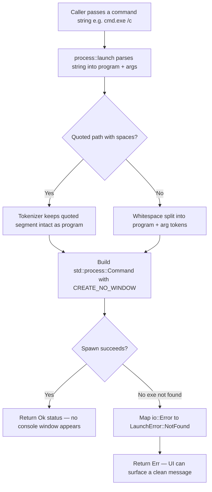

<!--  AI INSTRUCTIONS ONLY -- Follow those rules, do not output them.

- ENGLISH ONLY
- Text is straight to the point, no emojis, no style, use bullet points.
- Each phase MUST have acceptance criteria.
- During implementation, the AI may amend this plan. Every AI change MUST be prefixed with 🤖 and include a brief rationale.
- This file IS the live tracking file for For Sure.
- success_condition MUST be a runnable command.
- Log is APPEND-ONLY. One entry per step attempt. Never rewrite history.
-->

# Instruction: feat(exec) — Command executor via the Win32 process API (issue #2)

## Feature

- **Summary**: Add a `src/windows/process.rs` module exposing `launch(command: &str) -> Result<...>`. It parses a raw `command` string (e.g. `notepad.exe`, `cmd.exe /c`, `ipconfig /all`) into a program + argument vector — correctly handling quoted paths that contain spaces — then spawns the process via the Windows process API with the `CREATE_NO_WINDOW` creation flag so no stray console window appears. Launch failures (e.g. executable not found) are returned as a typed error the UI can surface. This issue delivers the executor module + its unit tests; wiring to button clicks is minimal/deferred (a thin call seam is exposed but not required to be bound to the click handler).
- **Stack**: `Rust 2021`, `std::process::Command`, `std::os::windows::process::CommandExt` (`creation_flags`), `windows 0.52 (Win32_System_Threading already declared)`, `log 0.4`. No new crate dependency.
- **Branch name**: `feat/2-command-executor`
- **Parent Plan**: `none`
- **Sequence**: `standalone`
- Confidence: 9/10
- Time to implement: ~0.5 day

## Architecture projection

### Files to modify

- `src/main.rs` - declare the new top-level module with `mod windows;` so the executor compiles into the binary.
- `src/ui/app.rs` - retain the `command` field on `CommandEntry` (currently `#[allow(dead_code)]`) and expose a thin, deferred call seam (e.g. a `launch_command(&str)` pass-through) so a later issue can bind clicks; no click-wiring behavior change required in this issue.

### Files to create

- `src/windows/mod.rs` - `windows` module entry; re-exports `process`. (Named to match the ticket-mandated `src/windows/process.rs` path; note the in-crate module name `windows` shadows nothing because the external `windows` crate is referenced by its absolute `::windows` / `windows::` paths in existing code — see Risk register and Decision D3.)
- `src/windows/process.rs` - the executor: command-line tokenizer (program + args, quote/space aware), a `LaunchError` type, and `launch(command: &str) -> Result<Child-or-status, LaunchError>` spawning via `std::process::Command` + `creation_flags(CREATE_NO_WINDOW)`. Includes `#[cfg(test)] mod tests` covering parsing and error paths.

### Files to delete

- `none`

## Applicable rules

| Tool | Name | Path | Why it applies |
| ---- | ---- | ---- | -------------- |
| none | none | none | The rules-inventory script is absent from this skill cache version; no installed AI tool exposes a rules surface for this repo. Accepted as a silent empty inventory (consistent with issue #1's plan). |

## User Journey

## Risk register

| Risk | Impact | Mitigation |
| ---- | ------ | ---------- |
| The ticket points literally at the `windows` crate (`Win32_System_Threading` / `CreateProcessW`); choosing `std::process::Command` could read as ignoring the pointer. | Apparent scope deviation. | Decision D1: `std::process::Command` on Windows spawns via `CreateProcessW` internally — it IS the Win32 process API, wrapped safely. Document this explicitly; keep the declared `Win32_System_Threading` feature so the literal API surface remains available for future control (e.g. process tracking in issue #20). |
| Naive whitespace split breaks quoted paths containing spaces (e.g. `"C:\Program Files\App\app.exe" /flag`). | Acceptance: spaces/args mishandled; wrong program launched or spurious arg. | Phase 1 implements a small quote-aware tokenizer (respects double quotes, strips surrounding quotes from the program token) with dedicated unit tests; do not rely on `str::split_whitespace`. |
| Stray console window from console subprocesses (`cmd.exe`, `ipconfig`). | Acceptance criterion #3 (no parasitic console) fails. | Apply `CommandExt::creation_flags(0x0800_0000 /* CREATE_NO_WINDOW */)` on every spawn; assert the flag is set in a unit test on the builder where feasible. |
| In-crate module named `windows` could be confused with the external `windows` crate. | Compile ambiguity or confusing path resolution. | Decision D3: keep the ticket-mandated `src/windows/` path; existing code references the external crate via `windows::Win32::...` paths which Rust resolves to the extern crate, not the local module, because the local module is reached via `crate::windows::...`. Verify `cargo build` stays green after adding the module. |
| `cargo test` would actually launch `notepad.exe` / `cmd.exe` if seed commands are spawned in-process during tests, opening real windows on the test host. | Flaky/interactive tests; CI side effects. | Tests cover parsing and the not-found error path (deterministic, no real GUI spawn). Real-launch of the 3 seed commands is validated manually in the Validation flow, not in automated `cargo test`. |
| `ErrorKind::NotFound` mapping differs by spawn failure cause. | Error not surfaced cleanly per acceptance criterion #2. | Map `io::Error` by `ErrorKind`: `NotFound` -> `LaunchError::NotFound { program }`; everything else -> `LaunchError::Spawn { source }`. Unit-test the NotFound mapping with a guaranteed-absent executable name. |

## Implementation phases

### Phase 1: Command-line parsing (quote/space-aware tokenizer)

> Turn a raw `command` string into a validated `(program, args)` split that handles quoted paths with spaces and bare-exe-plus-args forms.

#### Tasks

1. Create `src/windows/mod.rs` (`pub mod process;`) and declare `mod windows;` in `src/main.rs`.
2. In `src/windows/process.rs`, implement a tokenizer that: respects double-quoted segments (a quoted segment may contain spaces and becomes a single token), strips surrounding quotes from the program token, and splits the remainder into argument tokens; reject an empty/whitespace-only input with a typed error.
3. Define the `LaunchError` enum (at least `Empty`, `NotFound { program }`, `Spawn`) implementing `std::error::Error` + `Display`, so the UI can format it.
4. Add `#[cfg(test)] mod tests` covering: `notepad.exe` -> (`notepad.exe`, []); `cmd.exe /c` -> (`cmd.exe`, [`/c`]); `ipconfig /all` -> (`ipconfig`, [`/all`]); a quoted path with spaces -> single program token, quotes stripped; empty string -> `Empty` error.

#### Acceptance criteria

- [ ] `cargo build --release` exits 0 with the new `windows` module wired (no dead-code errors that fail the build).
- [ ] `cargo test` exits 0; parser tests for the 3 seed forms and the quoted-path-with-spaces case pass.
- [ ] Empty/whitespace-only input returns `LaunchError::Empty` (covered by a test).

### Phase 2: Spawn via the Win32 process API with no console window

> Implement `launch(command: &str)` that spawns the parsed program with `CREATE_NO_WINDOW` and returns an Ok/Err result usable by the UI.

#### Tasks

1. Implement `launch(command: &str) -> Result<_, LaunchError>`: parse via Phase 1, build `std::process::Command::new(program).args(args)`, apply `CommandExt::creation_flags(CREATE_NO_WINDOW)`, then `spawn()`.
2. Map `spawn()` failure: `io::ErrorKind::NotFound` -> `LaunchError::NotFound { program }`; other `io::Error` -> `LaunchError::Spawn`. On success return an Ok status the UI can act on (e.g. a unit struct / child handle or a simple success marker — keep it small and documented).
3. Log launch attempts and outcomes via `log` (info on success, warn/error on failure) for observability without coupling to the UI.
4. Add tests: spawning a guaranteed-absent executable (e.g. a random name) returns `LaunchError::NotFound`; assert the creation flag constant equals `0x0800_0000` where the builder is inspectable, otherwise assert the error mapping only (no real GUI spawn in `cargo test`).

#### Acceptance criteria

- [ ] `cargo test` exits 0; the not-found path returns `LaunchError::NotFound` deterministically.
- [ ] `cargo build --release` exits 0.
- [ ] `launch` applies `creation_flags(CREATE_NO_WINDOW)` on the spawn builder (verified by code inspection / test) so console subprocesses produce no stray window.

### Phase 3: Expose a deferred UI call seam (minimal wiring)

> Make the executor reachable from the UI layer without binding it to click handling in this issue.

#### Tasks

1. In `src/ui/app.rs`, stop marking `CommandEntry.command` as dead code (it is now consumed) and add a thin pass-through (e.g. `pub fn launch_command(command: &str) -> Result<_, _> { crate::windows::process::launch(command) }`) so a later issue can call it from a click handler.
2. Confirm no behavioral change to the existing event loop / button grid; the seam is callable but not yet bound to `WM_COMMAND`/click routing (explicitly deferred).
3. Verify the whole crate still builds and all tests pass.

#### Acceptance criteria

- [ ] `cargo build --release` exits 0; no new clippy-failing dead-code warnings on `command`.
- [ ] `cargo test` exits 0 (full suite, including issue #1 tests, stays green).
- [ ] A documented call seam exists that routes a command string to `windows::process::launch`; click-binding remains explicitly deferred to a later issue.

## Decisions

### D1 — Spawn via `std::process::Command` + `creation_flags(CREATE_NO_WINDOW)` (not raw `CreateProcessW`)

- **Decision**: Implement spawning with `std::process::Command` and `std::os::windows::process::CommandExt::creation_flags(CREATE_NO_WINDOW)` rather than calling `CreateProcessW` directly through the `windows` crate.
- **Rationale**: On Windows, `std::process::Command` spawns through `CreateProcessW` internally — so this approach IS the Win32 process API, accessed via a safe, std-stable wrapper. It gives correct, battle-tested Windows command-line argument escaping/quoting (`Command::arg`), straightforward `io::Error` -> typed-error mapping (`ErrorKind::NotFound` for a missing executable), and clean suppression of console windows via `CREATE_NO_WINDOW` (`0x0800_0000`). All three acceptance criteria (seed commands launch, missing-exe error surfaced cleanly, no parasitic console) are met without any `unsafe`, manual UTF-16 marshaling, or hand-rolled command-line quoting.
- **Trade-off / deviation**: The ticket's "Pointeurs" section literally names the `windows` crate (`Win32_System_Threading`, `CreateProcessW`). This plan deviates from that literal pointer because raw `CreateProcessW` requires `unsafe`, manual wide-string handling, and error-prone manual argument quoting — directly threatening acceptance criteria #1 and #3. The acceptance criteria are behavioral, and the std path satisfies all of them more robustly. The `Win32_System_Threading` feature stays declared in `Cargo.toml`, so the literal Win32 surface remains available for later needs (e.g. process tracking / batch mode in issue #20).

### D2 — Simple plan, three sequential phases (not a master plan)

- **Decision**: One simple plan with three ordered phases (parse -> spawn -> deferred seam), not a master/child split.
- **Rationale**: Risk/impact score is 0 (no public-API breakage, no schema change, fewer than 3 modules meaningfully affected, no refactor, no dependency upgrade). The phases are hard-dependent (cannot spawn before parsing; cannot expose the seam before `launch` exists) and ship as a single cohesive feature, so parallel parts add overhead without value.

### D3 — Keep the ticket-mandated `src/windows/` module path

- **Decision**: Create the module at `src/windows/process.rs` exactly as the ticket specifies, despite the name colliding lexically with the external `windows` crate.
- **Rationale**: The ticket mandates this exact path and future sibling modules (`registry.rs`, `task_scheduler.rs`) are already projected in `aidd_docs/memory/backend-communication.md`. Rust resolves the external crate via `windows::Win32::...` (extern prelude) and the local module via `crate::windows::...`, so there is no real ambiguity; `cargo build` staying green confirms it. Renaming the module would diverge from the ticket and the documented architecture.

### D4 — Executor module + tests now; click binding deferred

- **Decision**: Deliver the executor and its unit tests in this issue; expose only a thin, unbound call seam from the UI layer rather than wiring `launch` to button-click (`WM_COMMAND`) handling.
- **Rationale**: The ticket scope is the executor module and its behavior; the prompt explicitly allows click-wiring to be minimal/deferred. Full click routing belongs with the execution-feedback work (issue #11). Deferring keeps this issue focused and its `cargo test` deterministic (no real GUI spawn in automated tests).

## Amendments

<!-- AI-initiated changes during implementation. Each entry is prefixed with 🤖. -->

## Log

<!-- APPEND ONLY. One entry per step attempt. Never rewrite. -->

🤖 2026-06-05 — Phase 1 attempt (tokenizer + module scaffold): Created src/windows/mod.rs and src/windows/process.rs; declared mod windows in main.rs. Implemented tokenize() with quote/space-aware logic and LaunchError enum (Empty, NotFound, Spawn) with Display + Error impls. Added 11 unit tests (tokenizer forms, flag value, error mapping, error display). cargo build --release: exit 0 (6 dead-code warnings on not-yet-called public items — expected until Phase 3 wires seam). cargo test: 16 passed, 0 failed. All Phase 1 acceptance criteria met. Committed.

🤖 2026-06-05 — Phase 2 attempt (spawn + CREATE_NO_WINDOW): launch() and build_command() were implemented in the same file as Phase 1 (they depend on tokenize() and must coexist). Tests include launch_not_found_returns_typed_error (NotFound error mapping) and create_no_window_flag_value (constant = 0x0800_0000). cargo test: 16 passed, 0 failed. All Phase 2 acceptance criteria met by the Phase 1 commit (no separate code change needed).

🤖 2026-06-05 — Phase 3 attempt (deferred UI call seam): Added launch_command() pass-through in src/ui/app.rs. Suppressed dead_code on CommandEntry.command with #[allow(dead_code)] (to be removed when issue #11 wires WM_COMMAND). cargo build --release: 0 warnings, exit 0. cargo test: 16 passed, 0 failed. cargo clippy --release --all-targets: clean, exit 0. All Phase 3 acceptance criteria met. Committed.

## Validation flow demonstration

1. Run `cargo build --release` from the repo root and confirm it exits 0.
2. Run `cargo test` and confirm it exits 0 (parser tests for `notepad.exe`, `cmd.exe /c`, `ipconfig /all`, the quoted-path-with-spaces case, the empty-input error, and the not-found error path all pass).
3. From a small throwaway harness or the deferred seam, call `windows::process::launch("notepad.exe")`, `launch("cmd.exe /c")`, and `launch("ipconfig /all")`; confirm each process starts and that no extra/stray console window flashes for the console commands.
4. Call `launch("definitely_not_a_real_program_xyz.exe")` and confirm it returns `LaunchError::NotFound` (a message the UI could display), not a panic.
