<!--  AI INSTRUCTIONS ONLY -- Follow those rules, do not output them.

- ENGLISH ONLY
- Text is straight to the point, no emojis, no style, use bullet points.
- Each phase MUST have acceptance criteria.
- During implementation, the AI may amend this plan. Every AI change MUST be prefixed with 🤖 and include a brief rationale.
- This file IS the live tracking file for For Sure.
- success_condition MUST be a runnable command.
- Log is APPEND-ONLY. One entry per step attempt. Never rewrite history.
-->

# Instruction: feat(storage) — Load/save commands and config as JSON via serde (issue #3)

## Feature

- **Summary**: Add a `src/storage/` module that owns app configuration as typed Rust models and persists them as JSON. `models.rs` defines `Settings`, `Category`, and `Command` structs whose fields match `config/default.json` exactly (snake_case already used there), plus a top-level `Config` (or `AppConfig`) wrapper carrying `version`, `default_settings`, `categories`, and `commands`. `json.rs` exposes `load()` and `save()`: `load()` reads the user file at `%APPDATA%\WinFXStart\config.json`, and falls back to the bundled `config/default.json` (current behavior) when the user file is absent; `save()` writes the typed `Config` back to the user file, creating the directory if needed and preserving the `version` field. A `load->save->load` round-trip is lossless. This module becomes the single source of truth: `src/ui/app.rs` is refactored to consume `crate::storage` types instead of its private ad-hoc `AppConfig`/`CommandEntry`, removing the duplicated `load_config()` while preserving the issue-#1 favorite-command button grid behavior. Unit tests cover (de)serialization and the round-trip.
- **Stack**: `Rust 2021`, `serde 1.0 (derive)` and `serde_json 1.0` (both already in `Cargo.toml`), `std::fs`, `std::path`, `std::env::var("APPDATA")`, `log 0.4`. No new crate dependency (no `dirs` crate — `APPDATA` env var suffices; see Decision D3).
- **Branch name**: `feat/3-json-storage`
- **Parent Plan**: `none`
- **Sequence**: `standalone`
- Confidence: 9/10
- Time to implement: ~0.5-1 day

## Architecture projection

### Files to modify

- `src/main.rs` - add `mod storage;` so the new module compiles into the binary.
- `src/ui/app.rs` - remove the private `AppConfig`/`CommandEntry` structs and the ad-hoc `load_config()`; consume `crate::storage::{Config, Command}` (and `storage::load()`) instead; keep the favorite filter + `build_grid` flow byte-for-byte equivalent (still builds the grid from favorite command names). Drop the now-unused `serde::Deserialize` import and the `std::path::Path` import if they become dead.
- `config/default.json` - no field changes; remains the bundled fallback. (Listed because `models.rs` field names are validated against it; it is read, not edited.)

### Files to create

- `src/storage/mod.rs` - `storage` module entry; `pub mod models; pub mod json;` and re-export the public surface (`pub use models::{Config, Settings, Category, Command}; pub use json::{load, save, StorageError};`).
- `src/storage/models.rs` - typed structs with `#[derive(Serialize, Deserialize, Clone, Debug, PartialEq)]`: `Settings { show_categories, icon_size, theme, launch_at_startup, show_descriptions }`, `Category { id, name, icon }`, `Command { id, name, command, category, icon, is_favorite, shortcut }`, and the wrapper `Config { version, default_settings, categories, commands }`. Field names match `config/default.json` exactly; `#[cfg(test)] mod tests` covering exact-field (de)serialization.
- `src/storage/json.rs` - `load() -> Result<Config, StorageError>` (user file -> default.json fallback), `save(&Config) -> Result<(), StorageError>` (writes user file, creates dir, preserves `version`), a `user_config_path()` helper built from `APPDATA`, a `default_config_path()` helper (mirrors app.rs current cwd/exe-dir candidates), and a `StorageError` enum (`Io`, `Parse`, `NoConfigFound`). `#[cfg(test)] mod tests` for round-trip and fallback path selection (using a temp dir / explicit-path variants so tests do not touch the real `%APPDATA%`).

### Files to delete

- `none` (the ad-hoc structs/loader are removed in-place inside `src/ui/app.rs`, not as whole-file deletions).

## Applicable rules

| Tool | Name | Path | Why it applies |
| ---- | ---- | ---- | -------------- |
| none | none | none | The rules-inventory script (`list-rules.mjs`) is absent from this skill cache version and `$CLAUDE_PLUGIN_ROOT` did not resolve; no installed AI tool exposes a rules surface for this repo. Accepted as a silent empty inventory (consistent with issue #1 and #2 plans). |

## User Journey

```mermaid
flowchart TD
  A[App starts -> storage::load] --> B{User file %APPDATA%\WinFXStart\config.json exists?}
  B -->|Yes| C[Read + deserialize user JSON into Config]
  B -->|No| D[Read bundled config/default.json as fallback]
  D --> E[Deserialize default JSON into Config]
  C --> F[UiHost builds grid from favorite commands]
  E --> F
  F --> G[User edits config later -> storage::save&#40;Config&#41;]
  G --> H[Create %APPDATA%\WinFXStart\ if missing]
  H --> I[Serialize Config to JSON, preserving version field]
  I --> J[Write user config.json]
  J --> K{Reload -> storage::load}
  K --> L[load->save->load is lossless: Config equal]
```

## Risk register

| Risk | Impact | Mitigation |
| ---- | ------ | ---------- |
| The ad-hoc `AppConfig`/`CommandEntry` in `src/ui/app.rs` (issue #1) and the new `src/storage` models duplicate the config concept; leaving both creates two sources of truth. | Drift between loaders; future bugs. | Phase 3 refactors `app.rs` to consume `crate::storage` and removes the private structs + `load_config()`. The storage module is the single source of truth. Behavior-preserving (Decision D1). |
| Refactoring `app.rs` could change the favorite-grid behavior (issue #1 acceptance: grid built from favorite commands). | Regression in the only working UI feature. | Keep the exact filter+map pipeline: `commands.iter().filter(\|c\| c.is_favorite).map(\|c\| c.name.clone())` then `build_grid(&favorites, 3)`. No change to `xaml_gen`/layout. Verify `cargo build --release` stays green and the favorite count log is unchanged (Decision D1). |
| Unit tests that call `save()` could write to the real `%APPDATA%\WinFXStart\config.json` on the test host and pollute the developer environment. | Flaky/destructive tests; CI side effects. | Tests exercise (de)serialization and round-trip via explicit paths / a temp directory (e.g. `std::env::temp_dir()`), never the real `%APPDATA%`. `user_config_path()` is unit-tested for its construction logic only, not by writing to it. |
| `Settings.icon_size` JSON type (`80`) must map to an integer Rust type; a wrong type (e.g. `String`) breaks round-trip. | Acceptance: exact-field (de)serialization fails. | Map `icon_size` to `u32` (matches the `u32` sizes used in `xaml_gen`/layout). Assert the exact field set per the ticket in a (de)serialization test against the real `config/default.json` content. |
| `shortcut` is present on some commands and absent on others in `config/default.json` (only `notepad` has it). | Deserialization fails on commands without `shortcut`. | Model `Command.shortcut` as `Option<String>` with `#[serde(default, skip_serializing_if = "Option::is_none")]` so absent stays absent on round-trip (lossless) and present is preserved. |
| `default_settings` key name in `config/default.json` differs from a naive `settings` field name. | Deserialization of the wrapper fails silently / drops settings. | Name the wrapper field `default_settings` (or use `#[serde(rename = "default_settings")]`) so it matches the JSON key exactly; cover with a wrapper-level deserialization test. |
| `version` is a string (`"0.1.0"`) and could be dropped on save or mishandled when it differs from the app's expected schema version. | Acceptance: round-trip lossless + version handling. | Store `version: String`, read it, keep it verbatim, and re-serialize it unchanged on `save()`. For now: accept and preserve any `version` value (no migration); document the forward strategy (Decision D4). |
| `%APPDATA%` may be unset in unusual environments. | `load()`/`save()` panic or pick a wrong path. | `user_config_path()` returns a `Result`/`Option`; when `APPDATA` is unset, `load()` falls through to the bundled `default.json` and `save()` returns a typed `StorageError` instead of panicking. |

## Implementation phases

### Phase 1: Typed models aligned with config/default.json

> Define the serde models so they (de)serialize `config/default.json` exactly, with no field loss.

#### Tasks

1. Create `src/storage/mod.rs` (`pub mod models; pub mod json;` + re-exports) and declare `mod storage;` in `src/main.rs`.
2. In `src/storage/models.rs`, define `#[derive(Serialize, Deserialize, Clone, Debug, PartialEq)]` structs:
   - `Settings { show_categories: bool, icon_size: u32, theme: String, launch_at_startup: bool, show_descriptions: bool }`.
   - `Category { id: String, name: String, icon: String }`.
   - `Command { id: String, name: String, command: String, category: String, icon: String, is_favorite: bool, shortcut: Option<String> }` with `#[serde(default, skip_serializing_if = "Option::is_none")]` on `shortcut`.
   - `Config { version: String, default_settings: Settings, categories: Vec<Category>, commands: Vec<Command> }`.
3. Add `#[cfg(test)] mod tests` that deserializes the literal `config/default.json` content (embedded as a test string or read from path) into `Config`, then re-serializes and asserts the exact field set and values are preserved (including the present/absent `shortcut`).

#### Acceptance criteria

- [ ] `cargo build --release` exits 0 with the new `storage` module wired (any dead-code warnings on not-yet-consumed items are acceptable until Phase 3).
- [ ] `cargo test` exits 0; a test deserializes the real `config/default.json` schema into `Config` and asserts the exact ticket field set for `Settings`/`Category`/`Command`.
- [ ] A command without `shortcut` (e.g. `cmd`) deserializes with `shortcut: None` and re-serializes without emitting a `shortcut` key (lossless).

### Phase 2: load()/save() with user-profile path + default fallback + version preservation

> Implement persistence: load from `%APPDATA%\WinFXStart\config.json` with fallback to the bundled `config/default.json`, save back to the user file, and keep a lossless round-trip.

#### Tasks

1. In `src/storage/json.rs`, define `StorageError` (`Io`, `Parse`, `NoConfigFound`) implementing `std::error::Error` + `Display`.
2. Implement `user_config_path() -> Option<PathBuf>` from `std::env::var("APPDATA")` joined with `WinFXStart\config.json`; and `default_config_path() -> Option<PathBuf>` mirroring the existing app.rs candidates (`config/default.json` relative to cwd, then relative to the executable dir).
3. Implement `load() -> Result<Config, StorageError>`: if the user file exists, read+deserialize it; else read+deserialize the bundled `default.json`; if neither exists, return `StorageError::NoConfigFound`. Log which source was used (mirrors current `log::info!`/`log::warn!`).
4. Implement `save(config: &Config) -> Result<(), StorageError>`: resolve `user_config_path()`, create the parent directory with `std::fs::create_dir_all` if missing, serialize `config` to pretty JSON (preserving `version` verbatim), and write it. Map I/O and serde failures to `StorageError`.
5. Add `#[cfg(test)] mod tests`: a round-trip test that serializes a `Config` to a temp-dir path, reads it back, and asserts equality (`load->save->load` lossless, version preserved); a fallback-selection test asserting that when the user path is absent the default path is chosen (use explicit-path helper variants so tests never touch the real `%APPDATA%`).

#### Acceptance criteria

- [ ] `cargo test` exits 0; the round-trip test proves `load->save->load` is lossless and the `version` field is unchanged.
- [ ] `cargo test` exits 0; a test asserts that the user file is preferred when present and the bundled `default.json` is used as fallback when it is absent.
- [ ] `cargo build --release` exits 0; `save()` creates `%APPDATA%\WinFXStart\` if missing and `load()`/`save()` return `StorageError` (no panic) when `APPDATA` is unset.

### Phase 3: Reconcile src/ui/app.rs onto crate::storage (remove duplication, preserve UI behavior)

> Make the storage module the single source of truth; refactor the UI host to consume it and delete the ad-hoc config code without changing the favorite-grid behavior.

#### Tasks

1. In `src/ui/app.rs`, remove the private `AppConfig` and `CommandEntry` structs and the `load_config()` function (and now-unused `serde::Deserialize` / `std::path::Path` imports).
2. In `UiHost::new`, call `crate::storage::load()` and build `favorites` from the typed `crate::storage::Command` list using the same pipeline: `filter(|c| c.is_favorite).map(|c| c.name.clone())`, then `build_grid(&favorites, 3)`. Keep the `log::info!("Loaded {} favorite commands", ...)` line.
3. Preserve the deferred `launch_command()` seam (issue #2): keep it pointing at `crate::windows::process::launch`; the `command` field now comes from `crate::storage::Command`.
4. Verify the whole crate builds and all tests (issue #1, #2, #3) pass; confirm no behavioral change to the event loop, button grid, or layout.

#### Acceptance criteria

- [ ] `cargo build --release` exits 0; `src/ui/app.rs` no longer defines `AppConfig`/`CommandEntry` and no longer contains `load_config()` (single source of truth is `crate::storage`).
- [ ] `cargo test` exits 0 (full suite, including issue #1 and #2 tests, stays green).
- [ ] The favorite-command button grid is built from `crate::storage`'s favorite commands with the same 3-column layout and the same favorite count, with no change to `xaml_gen`/layout behavior (verified by code inspection + a clean build).

## Decisions

### D1 — Reconcile: storage module is the single source of truth; refactor app.rs to consume it (behavior-preserving)

- **Decision**: Define the canonical typed models in `src/storage/models.rs` and refactor `src/ui/app.rs` to call `crate::storage::load()` and use `crate::storage::Command`, removing the private ad-hoc `AppConfig`/`CommandEntry` and `load_config()`. The favorite-grid pipeline (`filter(is_favorite).map(name)` -> `build_grid(&favorites, 3)`) is kept identical.
- **Rationale**: Issue #1 shipped an ad-hoc loader as a stopgap; the ticket explicitly scopes the proper persistence to `src/storage/`. Keeping both would create two diverging config representations. Consolidating now (while the only consumer is `app.rs`) is the cheapest, safest moment and prevents future drift. The refactor is minimal and behavior-preserving: same favorites, same grid, same layout, same deferred `launch_command` seam — so issue #1's acceptance (grid from favorite commands) is not broken.
- **Trade-off / deviation**: This touches `app.rs` beyond the literal `src/storage/` scope of the ticket. Justified because the prompt and the "single source of truth" intent require removing the duplication; the change is additive-then-subtractive and fully covered by the existing build + the new tests.

### D2 — Simple plan, three sequential phases (not a master plan)

- **Decision**: One simple plan with three ordered phases (models -> persistence -> reconcile), not a master/child split.
- **Rationale**: Risk/impact score < 3: no breaking change to a public API outside the crate, no migration of an existing persisted store (this is the first persistence layer), ~3 modules touched (`storage` new + `app.rs` + `main.rs`), the `app.rs` change is minor and behavior-preserving (not a major refactor), and no dependency upgrade (serde already present). The phases are hard-dependent (cannot persist before models exist; cannot reconcile `app.rs` before `load()` exists), so they ship as one cohesive feature.

### D3 — Use `%APPDATA%` via `std::env::var("APPDATA")`, no new `dirs` crate

- **Decision**: Resolve the user config path as `%APPDATA%\WinFXStart\config.json` using `std::env::var("APPDATA")`; do not add the `dirs` (or `directories`) crate.
- **Rationale**: The app is Windows-only (Win32 UI), and `APPDATA` is a standard, always-present roaming-profile variable on Windows. The std env var fully covers the requirement with zero new dependencies (project preference: prefer zero new deps). Adding `dirs` would buy cross-platform path logic this Windows-only app does not need. If a future cross-platform need appears, `dirs` can be introduced then with explicit justification.
- **Trade-off**: If `APPDATA` is unset (rare), path resolution returns `None`; handled gracefully — `load()` falls back to the bundled `default.json` and `save()` returns a typed `StorageError` rather than panicking.

### D4 — `version` field: read, preserve verbatim, accept-and-keep on mismatch (no migration yet)

- **Decision**: Model `version` as `String`, read it on load, keep it unchanged in memory, and re-serialize it verbatim on save. For now, any `version` value (including one differing from the app's build version) is accepted and preserved without transformation; no migration logic is implemented.
- **Rationale**: The ticket asks to "manage the `version` field for schema evolution" and requires a lossless round-trip; preserving the value verbatim satisfies both today without speculative migration code. It keeps the round-trip lossless and leaves a clear seam for a future migration step.
- **Forward strategy (documented)**: A later issue can compare the loaded `version` against a `CURRENT_SCHEMA_VERSION` constant and, on mismatch, run an ordered migration before handing the `Config` to the UI (and optionally bump+rewrite `version` on save). Until then: accept and keep.

### D5 — `shortcut` is `Option<String>` with skip-if-none serialization

- **Decision**: Model `Command.shortcut` as `Option<String>` with `#[serde(default, skip_serializing_if = "Option::is_none")]`.
- **Rationale**: In `config/default.json` only `notepad` has a `shortcut`; the others omit it. `Option` + `default` lets absent commands deserialize, and `skip_serializing_if` keeps them absent on re-serialization, so `load->save->load` is byte-equivalent at the field level (lossless), satisfying the round-trip acceptance criterion.

## Amendments

<!-- AI-initiated changes during implementation. Each entry is prefixed with 🤖. -->

## Log

<!-- APPEND ONLY. One entry per step attempt. Never rewrite. -->

🤖 2026-06-05 — Phase 1 (models): Created src/storage/mod.rs, src/storage/models.rs; wired mod storage; in src/main.rs. Structs: Config, Settings, Category, Command with exact field alignment to config/default.json. Command.shortcut is Option<String> with skip_serializing_if. Unit tests: exact-field deserialization, shortcut present/absent round-trip, settings all-fields. cargo build --release exit 0; cargo test 25/25 pass. Commit: 83bba08.

🤖 2026-06-05 — Phase 2 (persistence): Created src/storage/json.rs. StorageError enum (Io/Parse/NoConfigFound) + Display + std::error::Error. user_config_path() from APPDATA env var (no new crate). default_config_path() mirrors former app.rs candidates. load() / load_from() / save() / save_to() with dir creation and no-panic error handling. Unit tests: round-trip lossless + version preserved, shortcut absent after round-trip, Io error on missing path, Parse error on malformed JSON, save creates dirs, user_config_path shape. cargo test 25/25 pass. Commit: 437e1a4.

🤖 2026-06-05 — Phase 3 (reconcile): Refactored src/ui/app.rs — removed AppConfig, CommandEntry, load_config(); removed unused serde::Deserialize and std::path::Path imports. UiHost::new now calls crate::storage::load() with unwrap_or_else fallback; favorite-grid pipeline filter(is_favorite).map(name) + build_grid(&favorites,3) unchanged. launch_command seam preserved using crate::storage::Command.command. cargo build --release exit 0; cargo test 25/25 pass; cargo clippy --release --all-targets clean (only expected dead_code on save/save_to not yet called from binary). Commit: f3ab47d.

## Validation flow demonstration

1. Run `cargo build --release` from the repo root and confirm it exits 0.
2. Run `cargo test` and confirm it exits 0 (models (de)serialization against `config/default.json`, the `load->save->load` round-trip, version preservation, the `shortcut` present/absent cases, and the user-file/default fallback path selection all pass).
3. Delete (or ensure absent) `%APPDATA%\WinFXStart\config.json`, run the app, and confirm via logs that it loaded from the bundled `config/default.json` fallback and the favorite-command button grid renders unchanged (issue #1 behavior preserved).
4. Trigger a `storage::save(&config)` (from a throwaway harness), confirm `%APPDATA%\WinFXStart\config.json` is created with the same `version`, then reload and confirm the in-memory `Config` is equal (round-trip lossless).
5. Confirm `src/ui/app.rs` no longer defines `AppConfig`/`CommandEntry` or `load_config()` and instead consumes `crate::storage`.
