<!--  AI INSTRUCTIONS ONLY -- Follow those rules, do not output them.

- ENGLISH ONLY
- Text is straight to the point, no emojis, no style, use bullet points.
- Each phase MUST have acceptance criteria.
- During implementation, the AI may amend this plan. Every AI change MUST be prefixed with 🤖 and include a brief rationale.
- This file IS the live tracking file for For Sure.
- success_condition MUST be a runnable command.
- Log is APPEND-ONLY. One entry per step attempt. Never rewrite history.
-->

# Instruction: feat(startup) — Launch at login via Registry Run Keys (issue #4)

## Feature

- **Summary**: Add a `src/windows/registry.rs` module that controls whether WinFXStart launches at Windows login by writing/removing a value under `HKCU\Software\Microsoft\Windows\CurrentVersion\Run`. The value name is the stable app key `WinFXStart`; the value data is the current executable path (`std::env::current_exe()`), double-quoted so paths containing spaces are handled. The module exposes four functions: `enable_startup()` (idempotent upsert of the Run value), `disable_startup()` (delete the value, no error if it is absent), `is_startup_enabled() -> bool` (true iff the value exists), and `sync_startup(enabled: bool)` (maps the `Settings.launch_at_startup` flag to enable/disable). Registry access uses the `windows` crate `Win32_System_Registry` API (`RegOpenKeyExW`/`RegCreateKeyExW`, `RegSetValueExW`, `RegDeleteValueW`, `RegQueryValueExW`, `RegCloseKey`). Because a registry value is keyed by name, writing the same `WinFXStart` value twice overwrites in place — idempotency is structural, so no duplicate can be created (documented in Decision D4). At boot, `src/main.rs` calls `sync_startup(config.default_settings.launch_at_startup)` once after Settings load; failures are logged and swallowed (best-effort, never block app startup). All functions are path-injectable (they accept the parent key path and value name) so unit tests run against a throwaway subkey under `HKCU\Software\WinFXStart\Test`, never the real `Run` key. Errors are a typed `RegistryError` enum wrapping Win32 error codes; no `unwrap`/`panic` on the registry path.
- **Stack**: `Rust 2021`, `windows 0.52` with the already-enabled `Win32_System_Registry` + `Win32_Foundation` features (see Decision D1 — no new dependency, no Cargo.toml change), `std::env::current_exe`, `log 0.4`. UTF-16 wide-string conversion via `std::os::windows::ffi::OsStrExt` (std, no extra crate).
- **Branch name**: `feat/4-registry-startup`
- **Parent Plan**: `none`
- **Sequence**: `standalone`
- Confidence: 9/10
- Time to implement: ~0.5-1 day

## Architecture projection

### Files to modify

- `src/windows/mod.rs` - add `pub mod registry;` next to the existing `pub mod process;` (sibling module wiring).
- `src/main.rs` - after the UI host / Settings are available, call `crate::windows::registry::sync_startup(...)` once at boot using the loaded `Settings.launch_at_startup`; log-and-swallow any error. Requires reading the loaded `Config` at boot (today `Config` is loaded inside `UiHost::new`); main.rs will load Settings for the sync (cheap second `storage::load`, or surface the flag — see Decision D5).
- `Cargo.toml` - no change expected (verified: `Win32_System_Registry` feature already enabled). Listed only because the plan asserts the feature is present; if a missing sub-feature surfaces during build, it is added here.

### Files to create

- `src/windows/registry.rs` - the startup module: `RegistryError` enum (Win32-code-wrapping, `Display` + `std::error::Error`), constants (`RUN_KEY_PATH`, `APP_VALUE_NAME = "WinFXStart"`), pure helpers (`executable_value() -> Result<String,...>` building the quoted exe path; a `to_wide()` UTF-16 helper), the path-injectable core (`set_value(root_path, value_name, data)`, `delete_value(root_path, value_name)`, `query_value(root_path, value_name) -> Option<String>`), and the public API (`enable_startup`, `disable_startup`, `is_startup_enabled`, `sync_startup`) delegating to the core with the real `RUN_KEY_PATH`/`APP_VALUE_NAME`. `#[cfg(test)] mod tests` exercising the injectable core against a throwaway `HKCU\Software\WinFXStart\Test` subkey with setup/teardown, plus the pure helpers.

### Files to delete

- `none`.

## Applicable rules

| Tool | Name | Path | Why it applies |
| ---- | ---- | ---- | -------------- |
| none | none | none | The rules-inventory script (`list-rules.mjs`) is absent from this skill cache version and no installed AI tool exposes a rules surface for this repo. Accepted as a silent empty inventory (consistent with the issue #1/#2/#3 plans). |

## User Journey

```mermaid
flowchart TD
  A[App boots -> storage::load Settings] --> B[main.rs calls sync_startup&#40;launch_at_startup&#41;]
  B --> C{launch_at_startup == true?}
  C -->|Yes| D[enable_startup: open/create HKCU Run key]
  D --> E[Build quoted current_exe path]
  E --> F[RegSetValueExW value WinFXStart = exe path]
  F --> G{Value already present?}
  G -->|Yes| H[Overwrite in place - no duplicate &#40;idempotent&#41;]
  G -->|No| I[Create the value]
  C -->|No| J[disable_startup: open HKCU Run key]
  J --> K{Value WinFXStart exists?}
  K -->|Yes| L[RegDeleteValueW removes it]
  K -->|No| M[No-op, return Ok]
  H --> N[Ok - app registered at login]
  I --> N
  L --> O[Ok - app unregistered]
  M --> O
  F -.error.-> P[RegistryError&#40;win32 code&#41; logged, swallowed at boot - app continues]
```

## Risk register

| Risk | Impact | Mitigation |
| ---- | ------ | ---------- |
| Unit tests that write the real `WinFXStart` Run value would register the test runner / dev machine to auto-launch at login and pollute the user's real environment. | Destructive, persistent side effect on the developer/CI machine. | Make all core functions path-injectable (`root_path`/`value_name` parameters). Tests use a throwaway subkey `HKCU\Software\WinFXStart\Test` and a test-only value name, with teardown that deletes the value (and the test subkey). The public `enable_startup`/`disable_startup` bind the real `RUN_KEY_PATH`/`APP_VALUE_NAME` and are NOT called from tests (mirrors json.rs `_from`/`_to` injectable pattern). |
| Exe paths can contain spaces (`C:\Program Files\...`); an unquoted Run value would be parsed as program + args and fail to launch. | Startup entry silently does not launch the app. | Build the value data as the `current_exe()` path wrapped in double quotes (`"<path>"`). Cover with a pure-helper test asserting the quoting (no real registry needed). |
| Win32 registry calls return raw `WIN32_ERROR`/`LSTATUS` codes; treating any non-zero as success (or panicking) is wrong. | Silent failures or crashes. | Wrap every call; map non-`ERROR_SUCCESS` to `RegistryError::Win32 { code }`. `RegDeleteValueW` returning `ERROR_FILE_NOT_FOUND` on `disable_startup` is treated as success (idempotent delete). No `unwrap`/`expect` on the registry path. |
| Idempotency: calling `enable_startup` twice could be misread as needing dedup logic. | Over-engineering or, if mishandled, a duplicate. | Registry values are keyed by name: `RegSetValueExW` on the same `WinFXStart` name overwrites in place. No dedup code is needed; a test asserts enable-twice yields exactly one value with the latest data (Decision D4). |
| UTF-16 wide-string handling: Win32 `*W` APIs need null-terminated UTF-16; an off-by-one or missing terminator corrupts the key path or value. | Wrong key opened, or write/read failure. | Use a single `to_wide(&str) -> Vec<u16>` helper (`OsStr::encode_wide` + trailing `0`) for both key paths and value data; reuse it everywhere. `REG_SZ` data length is the byte length including the terminator. Covered indirectly by the round-trip (set -> query) test on the throwaway subkey. |
| `current_exe()` can fail (rare) or return a path differing between dev (`target/debug/...`) and release (`target/release/...`). | `enable_startup` errors, or the registered path is the debug exe. | `executable_value()` returns `Result`; a `current_exe()` failure maps to `RegistryError::ExePath`. The registered path is whatever the running binary is — correct by construction; documented as expected (Decision D3). |
| Calling `sync_startup` at boot could block or crash app startup if the registry is unavailable. | App fails to start over a non-critical feature. | `main.rs` treats startup sync as best-effort: log the `RegistryError` at `warn` and continue. Startup registration never gates the event loop (Decision D2). |
| `main.rs` does not currently hold the loaded `Settings` (the `Config` is loaded inside `UiHost::new`). | Sync has no flag to read. | `main.rs` calls `crate::storage::load()` for the boot sync (cheap; same fallback semantics) OR reads the flag from the host. Use a direct `storage::load()` in `main.rs` for the sync to avoid changing the UI host surface (Decision D5). |

## Implementation phases

### Phase 1: Registry core + typed errors + pure helpers (path-injectable, no real Run key)

> Build the Win32-backed, path-injectable registry primitives and the pure helpers, fully unit-tested against a throwaway HKCU subkey so the real Run key is never touched.

#### Tasks

1. Create `src/windows/registry.rs` and wire it: add `pub mod registry;` to `src/windows/mod.rs`.
2. Define `RegistryError` enum: `Win32 { code: u32 }` (wraps the Win32 status), `ExePath` (from `current_exe()` failure), implementing `Display` + `std::error::Error` (mirror the `LaunchError`/`StorageError` style in the repo).
3. Define constants: `RUN_KEY_PATH = "Software\\Microsoft\\Windows\\CurrentVersion\\Run"` and `APP_VALUE_NAME = "WinFXStart"`.
4. Implement the UTF-16 helper `to_wide(s: &str) -> Vec<u16>` (`OsStr::encode_wide` + trailing `0`) and `executable_value() -> Result<String, RegistryError>` returning the quoted `current_exe()` path.
5. Implement the path-injectable core against `HKEY_CURRENT_USER`:
   - `set_value(sub_key: &str, value_name: &str, data: &str) -> Result<(), RegistryError>` — `RegCreateKeyExW` (open-or-create) the subkey, `RegSetValueExW` `REG_SZ`, close the key.
   - `query_value(sub_key: &str, value_name: &str) -> Result<Option<String>, RegistryError>` — open subkey; `RegQueryValueExW`; `Ok(None)` when the subkey or value is absent (`ERROR_FILE_NOT_FOUND`); decode UTF-16 to `String` otherwise.
   - `delete_value(sub_key: &str, value_name: &str) -> Result<(), RegistryError>` — open subkey; `RegDeleteValueW`; treat `ERROR_FILE_NOT_FOUND` (subkey or value absent) as `Ok(())`.
6. Add `#[cfg(test)] mod tests` using a throwaway subkey constant `Software\\WinFXStart\\Test` and a test value name, with an RAII/teardown guard that deletes the value and best-effort removes the test subkey:
   - set -> query returns the written data; query of an absent value returns `None`.
   - delete removes the value; query after delete returns `None`.
   - delete of an absent value returns `Ok(())` (no-op).
   - set twice with different data leaves exactly one value holding the latest data (idempotent upsert, no duplicate).
   - `executable_value()` returns a string wrapped in double quotes; `to_wide("X")` is `[88, 0]`.

#### Acceptance criteria

- [x] `cargo build --release` exits 0 with the new `registry` module wired (dead-code warnings on the not-yet-called public API are acceptable until Phase 2).
- [x] `cargo test` exits 0; the registry-core tests run against `HKCU\Software\WinFXStart\Test` (NOT the real `Run` key) and cover set/query/delete, delete-absent no-op, and the set-twice idempotent-upsert case, all with teardown.
- [x] `cargo test` exits 0; pure-helper tests assert the exe value is double-quoted and `to_wide` is null-terminated UTF-16. No test references `CurrentVersion\Run`.

### Phase 2: Public startup API + boot sync wiring

> Bind the injectable core to the real Run key behind the public API, and call the sync once at boot as a best-effort step.

#### Tasks

1. In `src/windows/registry.rs`, implement the public API delegating to the Phase 1 core with `RUN_KEY_PATH`/`APP_VALUE_NAME`:
   - `enable_startup() -> Result<(), RegistryError>` = `set_value(RUN_KEY_PATH, APP_VALUE_NAME, &executable_value()?)`.
   - `disable_startup() -> Result<(), RegistryError>` = `delete_value(RUN_KEY_PATH, APP_VALUE_NAME)`.
   - `is_startup_enabled() -> bool` = `query_value(RUN_KEY_PATH, APP_VALUE_NAME)` mapped to `is_some()` (errors -> `false`, logged).
   - `sync_startup(enabled: bool) -> Result<(), RegistryError>` = `if enabled { enable_startup() } else { disable_startup() }`.
2. In `src/main.rs`, after `env_logger::init()` and before/around UI host init, load Settings via `crate::storage::load()` and call `crate::windows::registry::sync_startup(config.default_settings.launch_at_startup)`; on `Err`, `log::warn!` and continue (best-effort; never block the event loop). On `storage::load()` failure, skip the sync with a `log::warn!`.
3. Verify the whole crate builds and the full suite (issues #1/#2/#3 + new #4 tests) passes; confirm no behavioral change to the event loop or UI grid.

#### Acceptance criteria

- [x] `cargo build --release` exits 0; `enable_startup`/`disable_startup`/`is_startup_enabled`/`sync_startup` are defined and bound to `HKCU\Software\Microsoft\Windows\CurrentVersion\Run` with value name `WinFXStart`.
- [x] `cargo test` exits 0 (full suite green; the new public functions are not invoked from tests so no test writes the real Run key).
- [x] `src/main.rs` calls `sync_startup(...)` exactly once at boot using `Settings.launch_at_startup`, logs-and-swallows errors, and does not gate the event loop on the result (verified by code inspection + clean build).

## Decisions

### D1 — Use the already-enabled `windows` crate `Win32_System_Registry`; zero new dependency

- **Decision**: Implement registry access with the `windows 0.52` crate's `Win32_System_Registry` API (`RegCreateKeyExW`/`RegOpenKeyExW`, `RegSetValueExW`, `RegQueryValueExW`, `RegDeleteValueW`, `RegCloseKey`) under `HKEY_CURRENT_USER`. No `winreg` or other crate is added.
- **Rationale**: The `windows` crate is already a dependency and the `Win32_System_Registry` feature is already enabled in `Cargo.toml` (verified). The repo convention (issue #2 `process.rs`) is to use the `windows`/std Win32 surface directly. Adding `winreg` would duplicate capability the project already ships and violates the project's zero-new-deps preference.
- **Trade-off**: Raw Win32 needs manual UTF-16 conversion and explicit error-code mapping (vs. a higher-level `winreg`). Accepted: it is bounded, fully testable on a throwaway subkey, and keeps the dependency surface minimal.

### D2 — Boot sync is best-effort: log-and-swallow, never block startup

- **Decision**: `main.rs` calls `sync_startup` once at boot; on error it logs at `warn` and continues. Startup registration never gates the event loop.
- **Rationale**: Launch-at-login is a convenience feature, not a correctness requirement. A registry hiccup must not prevent the launcher from opening. This matches the app's existing fault-tolerant boot (storage load falls back rather than aborting).

### D3 — Run value = quoted `current_exe()` path; value name = stable `WinFXStart`

- **Decision**: The Run value data is `std::env::current_exe()` wrapped in double quotes; the value name is the constant `WinFXStart`.
- **Rationale**: The value name is the registry key for the entry — a single stable name guarantees idempotency and lets `disable` find exactly what `enable` wrote. Quoting the path handles `Program Files`-style spaces so the shell parses it as one executable. The registered path reflects the running binary (debug vs release) by construction, which is the correct, least-surprising behavior.
- **Trade-off**: In dev, enabling would register the `target/debug` exe; that is expected and only relevant to manual validation, not the unit tests (which never touch the real Run key).

### D4 — Idempotency is structural (value keyed by name); no dedup code

- **Decision**: Rely on registry semantics — `RegSetValueExW` on the same `WinFXStart` name overwrites in place — instead of writing dedup logic. A test asserts enable-twice yields one value with the latest data.
- **Rationale**: A registry value name is unique within its key, so a duplicate is impossible by construction. Adding dedup logic would be dead code. This satisfies the ticket's "idempotent (no duplicate)" acceptance criterion directly and is the simplest correct implementation.

### D5 — `main.rs` reads the flag via `storage::load()` for the boot sync (don't widen the UI host surface)

- **Decision**: For the boot sync, `main.rs` calls `crate::storage::load()` and reads `config.default_settings.launch_at_startup`, rather than exposing the flag through `UiHost`.
- **Rationale**: `storage::load()` is cheap, idempotent, and already the single source of truth (issue #3). Reusing it keeps the sync self-contained in `main.rs` and avoids adding a getter/coupling to `UiHost` solely for one boolean. If a future issue adds a runtime settings UI that toggles startup live, the toggle handler will call `sync_startup` directly at that point.
- **Trade-off**: The config is read twice at boot (once here, once in `UiHost::new`). Negligible cost (a small JSON file) and avoids API coupling; revisit if a single shared `Config` is later threaded through `main`.

### D6 — Simple plan, two sequential phases (not a master plan)

- **Decision**: One simple plan with two ordered phases (injectable core + tests -> public API + boot wiring), not a master/child split.
- **Rationale**: Risk/impact score < 3: no breaking public-API change, no schema migration, one new module plus trivial wiring in `mod.rs`/`main.rs`, no major refactor, and no dependency upgrade (the `windows` feature is already present). Phase 2 hard-depends on Phase 1 (cannot bind the public API before the core exists), so it ships as one cohesive feature.

## Amendments

<!-- AI-initiated changes during implementation. Each entry is prefixed with 🤖. -->

🤖 **A1 — Use `RegCreateKeyW` instead of `RegCreateKeyExW`**: `RegCreateKeyExW` is gated behind the `Win32_Security` feature (not enabled). `RegCreateKeyW` provides the same open-or-create semantics without requiring additional features. Accepted: simpler API, no plan change needed.

🤖 **A2 — All `Reg*` functions return `Result<(), windows_core::Error>` in windows 0.52**: The previous implementer treated them as returning `WIN32_ERROR`. Fixed throughout. Error code extracted via `err.code().0` (HRESULT value), not-found detection via HRESULT comparison.

🤖 **A3 — `delete_value` opens key with `KEY_WRITE` not `KEY_READ`**: `RegDeleteValueW` requires write access. Added a generic `open_key(sub_key, access)` helper and changed `delete_value` to use `KEY_WRITE`.

🤖 **A4 — Registry-touching tests serialised with a process-wide `Mutex`**: When run in parallel (Rust's default test runner), different tests' teardowns raced and caused `ERROR_KEY_DELETED`. Added `static REGISTRY_LOCK: Mutex<()>` in the test module; each registry-touching test acquires the lock for its entire duration. No new crate dependency.

🤖 **A5 — `RegistryError::Win32.code` is `i32` (HRESULT), not `u32` (WIN32_ERROR)**: The `windows::core::Error` surface exposes `HRESULT` (signed i32), so the field type and Display formatting were updated accordingly.

## Log

<!-- APPEND ONLY. One entry per step attempt. Never rewrite. -->

- 2026-06-06 — Implementer pass 2 (fix): rewrote `src/windows/registry.rs` to align with actual windows 0.52 API (Result return types, RegCreateKeyW, KEY_WRITE for delete, mutex serialisation of registry tests). Wired `sync_startup` in `src/main.rs`. `cargo build --release` exits 0. `cargo test` exits 0 (35/35 pass). `cargo clippy --release --all-targets` exits 0 (warnings only, all pre-existing dead-code on public API not yet wired to UI).

## Validation flow demonstration

1. Run `cargo build --release` from the repo root and confirm it exits 0.
2. Run `cargo test` and confirm it exits 0 — the registry-core tests pass against `HKCU\Software\WinFXStart\Test` (set/query/delete, delete-absent no-op, enable-twice idempotent upsert) with teardown, and the pure-helper tests (quoted exe value, UTF-16 conversion) pass. Confirm no test references `CurrentVersion\Run`.
3. Manual validation (real Run key, off the test path): set `launch_at_startup: true` in `%APPDATA%\WinFXStart\config.json`, run the app, then inspect `HKCU\Software\Microsoft\Windows\CurrentVersion\Run` and confirm a `WinFXStart` value holds the quoted exe path. Run the app a second time and confirm there is still exactly one `WinFXStart` value (idempotent).
4. Manual validation: set `launch_at_startup: false`, run the app, and confirm the `WinFXStart` value is gone from the Run key; run again with the value already absent and confirm no error in the logs (idempotent delete).
5. Confirm `src/main.rs` calls `sync_startup(...)` once at boot, logs-and-swallows any `RegistryError`, and the event loop still starts normally regardless of the sync result.
