<!--  AI INSTRUCTIONS ONLY -- Follow those rules, do not output them.

- ENGLISH ONLY
- Text is straight to the point, no emojis, no style, use bullet points.
- Each phase MUST have acceptance criteria.
- During implementation, the AI may amend this plan. Every AI change MUST be prefixed with 🤖 and include a brief rationale.
- This file IS the live tracking file for For Sure.
- success_condition MUST be a runnable command.
- Log is APPEND-ONLY. One entry per step attempt. Never rewrite history.
-->

# Instruction: feat(icons) — Custom PNG/raster icons for commands & categories (issue #5)

## Feature

- **Summary**: Let a command (and category) display a custom raster icon image instead of (or as a fallback to) the current emoji label. Re-add the `image` crate (removed in issue #1 as unused) to decode and resize user-supplied icons. Introduce an `icons` module that owns: (a) a pure icon-resolution rule that maps the existing `Command.icon`/`Category.icon` string to either an on-disk image file or an emoji/text fallback, and (b) pure decode+resize of an image file/bytes into a fixed-size RGBA buffer at `Settings.icon_size`. A separate Win32/GDI layer converts a decoded RGBA buffer into an `HBITMAP` (via `CreateDIBSection` + `SetDIBits`) and assigns it to the native BUTTON (`BS_BITMAP` style + `BM_SETIMAGE`); commands without a resolvable image keep the current text label. The UI host tracks every created `HBITMAP` and calls `DeleteObject` on relayout/reload/drop so reloading does not leak GDI handles or memory. The `Command`/`Category` schema is unchanged (`icon: String` reinterpreted, no breaking change to issue #3 round-trip tests). SVG is descoped to a documented follow-up.
- **Stack**: `Rust 2021`, `image = "0.25"` (raster decode/resize; re-added), `serde`/`serde_json` (unchanged), `windows 0.52` with the already-enabled `Win32_Graphics_Gdi` + `Win32_UI_WindowsAndMessaging` features (for `CreateDIBSection`, `SetDIBits`, `DeleteObject`, `SendMessageW`/`BM_SETIMAGE`, `SetWindowLongPtrW` for `BS_BITMAP`), `std::env::var("APPDATA")` and `std::path` for the icons dir (no new path crate — consistent with issue #3 Decision D3). rustc 1.93.0.
- **Branch name**: `feat/5-custom-icons`
- **Parent Plan**: `none`
- **Sequence**: `standalone`
- Confidence: 9/10
- Time to implement: ~1-1.5 days

## Architecture projection

### Files to modify

- `Cargo.toml` - re-add `image = "0.25"` with the minimal default feature set (or explicit `features = ["png"]` plus whatever raster formats are kept); justification recorded in Decision D1. The `windows` GDI feature is already present, no change there.
- `src/main.rs` - add `mod icons;` so the new module compiles into the binary.
- `src/ui/app.rs` - in `UiHost::new`, after creating each BUTTON, resolve the command's icon via `crate::icons` and, when it resolves to an image, build an `HBITMAP` and assign it to that button (`BS_BITMAP` + `BM_SETIMAGE`); store created `HBITMAP`s in the host. Carry the per-cell `icon` string (and command identity) into the grid build so the host knows which command each button maps to. Add `Drop`/cleanup that `DeleteObject`s all tracked bitmaps; ensure relayout does not recreate bitmaps (only `SetWindowPos`). Keep the text label path unchanged for fallback commands.
- `src/ui/xaml_gen.rs` - extend `GridCell` to carry the per-command `icon` reference (and ideally the command id) alongside `label`, and thread it through `build_grid` so the host can resolve icons per cell. Existing grid layout/row-col math stays behavior-equivalent; existing tests updated to the new `GridCell` shape (additive field, default-constructible for label-only cases).
- `aidd_docs/memory/design.md` - note the resolved icon semantics (path-or-emoji), the icons dir, and the SVG-descoped decision (documentation only; no behavior).

### Files to create

- `src/icons/mod.rs` - module entry: `pub mod resolve; pub mod decode;` plus re-exports (`pub use resolve::{resolve_icon, IconResolution}; pub use decode::{decode_resize_rgba, DecodedIcon, DecodeError};`). GDI-free; this is the unit-tested core.
- `src/icons/resolve.rs` - pure icon-resolution rule. `resolve_icon(icon: &str, dirs: &[PathBuf]) -> IconResolution` where `IconResolution` is `Image(PathBuf)` (the string resolved to an existing image file in one of the candidate dirs, by extension allowlist `png`/`jpg`/`jpeg`/`bmp`/`gif`) or `EmojiFallback(String)` (anything else: a bare emoji, a missing file, or an SVG path). A helper `icons_dirs()` builds the candidate list `[%APPDATA%\WinFXStart\icons\, <exe_dir>\assets\, ./assets\]` (Decision D4). `#[cfg(test)] mod tests`: existing-file -> `Image`; missing-file -> `EmojiFallback`; bare emoji -> `EmojiFallback`; `.svg` path -> `EmojiFallback` (descope guard).
- `src/icons/decode.rs` - pure decode+resize. `decode_resize_rgba(bytes: &[u8], size: u32) -> Result<DecodedIcon, DecodeError>` using `image::load_from_memory` then `resize_exact`/`thumbnail` to `size x size`, returning `DecodedIcon { width, height, rgba: Vec<u8> }` (premultiplied/straight RGBA documented). A path wrapper `decode_resize_file(path, size)`. `DecodeError` (`Io`, `Decode`) with `Display` + `std::error::Error`. `#[cfg(test)] mod tests`: build a tiny PNG in memory (e.g. `image::RgbaImage` -> `write_to(png)`), decode+resize to N, assert `width == height == N` and `rgba.len() == (N*N*4)`; assert a non-image byte slice returns `DecodeError::Decode` (no panic).
- `src/icons/gdi.rs` - **Win32/GDI, not unit-tested (manual validation)**. `rgba_to_hbitmap(decoded: &DecodedIcon) -> Result<HBITMAP, ...>` via `CreateDIBSection` (top-down 32bpp `BI_RGB`) + `SetDIBits` (handling BGRA channel order vs `image`'s RGBA), and `set_button_bitmap(hwnd, hbitmap)` that adds `BS_BITMAP` (`SetWindowLongPtrW(GWL_STYLE, ...)`) and sends `BM_SETIMAGE`/`IMAGE_BITMAP`. All `unsafe` FFI documented with safety notes. Marked `#[cfg(windows)]`; excluded from the pure test surface.

### Files to delete

- `none` (all changes are additive or in-place edits).

## Applicable rules

| Tool | Name | Path | Why it applies |
| ---- | ---- | ---- | -------------- |
| none | none | none | The rules-inventory script (`list-rules.mjs`) is absent from this skill cache version and `$CLAUDE_PLUGIN_ROOT` did not resolve (node reported MODULE_NOT_FOUND); no installed AI tool exposes a rules surface for this repo. Accepted as a silent empty inventory, consistent with the issue #1-#4 plans. |

## User Journey

```mermaid
flowchart TD
  A[App starts -> storage::load] --> B[UiHost::new builds grid from favorite commands]
  B --> C[For each command cell: resolve_icon&#40;icon, icons_dirs&#41;]
  C --> D{icon string resolves to an existing image file?}
  D -->|Yes -> Image&#40;path&#41;| E[decode_resize_rgba to Settings.icon_size]
  E --> F[rgba_to_hbitmap: CreateDIBSection + SetDIBits]
  F --> G[set_button_bitmap: BS_BITMAP + BM_SETIMAGE]
  G --> H[Track HBITMAP in UiHost.bitmaps]
  D -->|No -> EmojiFallback&#40;text&#41;| I[Keep current emoji/text BUTTON label]
  H --> J[Grid renders icons + fallbacks]
  I --> J
  J --> K{Reload / recreate buttons}
  K --> L[DeleteObject on every tracked HBITMAP before rebuild]
  L --> B
  J --> M{Window resized}
  M --> N[layout_children: SetWindowPos only -> no new bitmaps, no leak]
```

## Risk register

| Risk | Impact | Mitigation |
| ---- | ------ | ---------- |
| SVG is NOT supported by the `image` crate; the ticket title says "PNG/SVG". | A naive attempt to decode `.svg` via `image` fails at runtime; scope creep if `resvg`/`usvg`/`tiny-skia` are pulled in. | Decision D1: support PNG + other `image` raster formats now; descope SVG to a documented follow-up. `resolve_icon` treats `.svg` as `EmojiFallback` (guarded by a test), so SVG never reaches `image`. A clear future seam (`gdi`/`decode` accept any RGBA, so a future SVG rasterizer just feeds the same pipeline) is documented. |
| Displaying an image on a Win32 BUTTON requires `HBITMAP` creation + `BM_SETIMAGE`; channel order and orientation are easy to get wrong (BGRA vs RGBA, bottom-up DIB). | Icons render with swapped colors / upside-down / not at all (AC1 fails). | Decision D2: use a top-down 32bpp `BI_RGB` DIB via `CreateDIBSection`, swap R/B to BGRA when copying from `image`'s RGBA, `SetDIBits`, then `BS_BITMAP` + `BM_SETIMAGE`. Encapsulated in `src/icons/gdi.rs` with documented unsafe blocks; validated manually (GUI). |
| GDI `HBITMAP` handles leak if not freed when buttons are recreated, the host reloads, or on app exit (AC3: "no memory leak on reload"). | GDI handle exhaustion / memory growth on repeated reloads. | Decision D5: `UiHost` owns a `bitmaps: Vec<HBITMAP>` (or an id->HBITMAP cache); a `clear_bitmaps()` helper `DeleteObject`s and empties it; it is called before any button rebuild/reload, and a `Drop for UiHost` frees remaining handles. `layout_children` only `SetWindowPos`s — it never creates bitmaps. |
| Changing `Command.icon` semantics could break issue #3 lossless round-trip tests if the schema is altered. | Regression in persisted-config tests (issue #3). | Decision D3: keep `icon: String` unchanged; reinterpret the value at the UI layer only. No serde change, no new field. Issue #3 round-trip tests are untouched. |
| `GridCell` currently carries only `label`; the host needs per-cell icon (and command identity) to resolve/assign images. | Cannot map a button to its icon without threading data through the grid. | Add an `icon` (and optional `command_id`) field to `GridCell`; update `build_grid` and its existing tests to the additive shape. Layout math (row/col) is unchanged and re-verified by the existing grid tests. |
| Tests that touch `%APPDATA%\WinFXStart\icons\` could be flaky or environment-dependent. | Non-deterministic CI; AC verification unreliable. | `resolve_icon` takes the candidate dirs as a parameter; tests pass a `tempfile`/`std::env::temp_dir()` path with a real on-disk fixture file — never the real `%APPDATA%`. Decode tests use in-memory PNG bytes only. |
| `image = "0.25"` MSRV / transitive deps may not build under rustc 1.93. | `cargo build` fails on the toolchain. | Pin `image = "0.25"` (current stable line; MSRV well below 1.93). Trim default features to the needed raster formats (at least `png`) to minimize transitive deps and build time. If a transitive crate raises MSRV, pin the offending sub-dependency; record in the Log. |
| Owner-draw vs `BS_BITMAP` ambiguity for showing both an icon AND a text label on the same button. | Over-engineering; label+icon layout fights the native button. | Decision D2 scopes v1 to `BS_BITMAP` image-only when an icon resolves (AC1 only requires the icon to display); text label remains for fallback commands. A combined icon+caption (owner-draw / `BUTTON` image-list) is a documented follow-up, not in scope. |

## Implementation phases

### Phase 1: Pure icon core — resolution rule + decode/resize (GDI-free, fully unit-tested)

> Add the `image` dependency and the `src/icons/` pure core: map an icon string to image-or-emoji, and decode+resize image bytes to a fixed-size RGBA buffer. No Win32, no GUI.

#### Tasks

1. Re-add `image = "0.25"` to `Cargo.toml` (minimal features incl. `png`); declare `mod icons;` in `src/main.rs`.
2. Create `src/icons/mod.rs` (`pub mod resolve; pub mod decode;` + re-exports).
3. Implement `src/icons/resolve.rs`: `IconResolution { Image(PathBuf), EmojiFallback(String) }`, `resolve_icon(icon, dirs)` with an extension allowlist (`png/jpg/jpeg/bmp/gif`, `.svg` deliberately excluded), and `icons_dirs()` building `[%APPDATA%\WinFXStart\icons, <exe_dir>\assets, ./assets]`.
4. Implement `src/icons/decode.rs`: `DecodedIcon { width, height, rgba }`, `DecodeError { Io, Decode }`, `decode_resize_rgba(bytes, size)` (`image::load_from_memory` -> `resize_exact` to `size`), and `decode_resize_file(path, size)`.
5. Add `#[cfg(test)] mod tests` in both files (see Files to create for exact cases).

#### Acceptance criteria

- [ ] `cargo build --release` exits 0 with `image` re-added and `icons` wired (dead-code warnings on not-yet-consumed GDI/host items are acceptable until Phase 3).
- [ ] `cargo test` exits 0; a test builds a tiny in-memory PNG, decodes+resizes to N, and asserts `width == height == N` and `rgba.len() == N*N*4`; a non-image input returns `DecodeError::Decode` (no panic).
- [ ] `cargo test` exits 0; `resolve_icon` returns `Image(path)` for an existing fixture file, `EmojiFallback` for a missing path, a bare emoji, and an `.svg` path (SVG descope guard).
- [ ] Issue #1-#4 tests still pass (no schema/storage change).

### Phase 2: GDI bitmap bridge — RGBA -> HBITMAP -> BUTTON (Win32, manual validation)

> Convert a decoded RGBA buffer into an HBITMAP and assign it to a native BUTTON; own and free the handles. No automated tests for GDI (GUI-only); covered by manual validation.

#### Tasks

1. Create `src/icons/gdi.rs`: `rgba_to_hbitmap(&DecodedIcon) -> Result<HBITMAP, GdiError>` via top-down 32bpp `CreateDIBSection` + `SetDIBits`, swapping RGBA->BGRA on copy; document every `unsafe` block.
2. Implement `set_button_bitmap(hwnd, hbitmap)`: add `BS_BITMAP` via `SetWindowLongPtrW(GWL_STYLE,...)` then `SendMessageW(hwnd, BM_SETIMAGE, IMAGE_BITMAP, hbitmap)`.
3. Add a `delete_bitmap(hbitmap)` thin wrapper over `DeleteObject` for the host to call.
4. Confirm the required `windows` GDI symbols are reachable under the existing `Win32_Graphics_Gdi` feature; add a feature only if a symbol is missing (record in Log).

#### Acceptance criteria

- [ ] `cargo build --release` exits 0 with `src/icons/gdi.rs` compiling under `#[cfg(windows)]`; all FFI `unsafe` blocks carry safety comments.
- [ ] `cargo clippy --release --all-targets` is clean except expected `dead_code` on host-not-yet-wired items.
- [ ] Manual validation note recorded: an HBITMAP can be created from a decoded RGBA buffer (verified by wiring in Phase 3).

### Phase 3: Wire icons into UiHost + leak-safe handle ownership

> Thread per-cell icon data through the grid, assign bitmaps to buttons, keep the emoji fallback, and guarantee no GDI leak on relayout/reload/exit.

#### Tasks

1. Extend `GridCell` with `icon: String` (and optional `command_id`); update `build_grid` and its existing tests to the additive shape; keep row/col math unchanged.
2. In `UiHost`, add `bitmaps: Vec<HBITMAP>` and a `clear_bitmaps(&mut self)` that `DeleteObject`s and empties it.
3. In `UiHost::new`, for each cell: `resolve_icon(&cell.icon, &icons_dirs())`; on `Image(path)` -> `decode_resize_file(path, settings.icon_size)` -> `rgba_to_hbitmap` -> `set_button_bitmap` -> push the HBITMAP into `bitmaps`; on `EmojiFallback` keep the current text label. Log per-command outcome.
4. Ensure `layout_children` only repositions (`SetWindowPos`) and never creates bitmaps (no per-resize allocation/leak).
5. Implement `Drop for UiHost` (or call `clear_bitmaps` on teardown/reload) to free every tracked HBITMAP; call `clear_bitmaps()` before any future rebuild path.

#### Acceptance criteria

- [ ] `cargo build --release` exits 0; `cargo test` exits 0 (full suite incl. updated grid tests and Phase 1 icon tests).
- [ ] AC1 (manual): a command whose `icon` points to an existing PNG under the icons dir renders that PNG on its button.
- [ ] AC2 (manual + unit): a command whose `icon` is an emoji or a missing path keeps the emoji/text label (unit-covered by `resolve_icon`; visually confirmed).
- [ ] AC3 (manual + code): repeated reloads/relayouts do not grow GDI handle count — `clear_bitmaps` runs before rebuild and `Drop for UiHost` frees all handles; `layout_children` creates no bitmaps (verified by inspection + a GDI-handle watch during manual reload).

## Decisions

### D1 — Support PNG + image-crate raster formats now; descope SVG to a documented follow-up

- **Decision**: Re-add `image = "0.25"` and support the raster formats it decodes (PNG primary, plus jpg/jpeg/bmp/gif via the extension allowlist). Do NOT add an SVG rasterizer (`resvg`/`usvg`/`tiny-skia`) in this issue. `.svg` references resolve to `EmojiFallback` and never reach `image`.
- **Rationale**: The `image` crate has no SVG support; SVG would require a separate rasterizer stack (3+ new transitive-heavy crates) for a secondary need. The project preference is minimal dependencies. PNG (the explicit AC1 format) and common raster formats fully satisfy the acceptance criteria today. The decode/GDI pipeline takes RGBA, so a future SVG rasterizer is a drop-in upstream of `decode`/`gdi` — a clean seam with no rework.
- **Trade-off / deviation**: The ticket title mentions SVG; v1 ships raster only. Documented as a follow-up issue (rasterize SVG -> RGBA -> same HBITMAP path). Recorded in `design.md`.

### D2 — Display via HBITMAP (CreateDIBSection + SetDIBits) + BS_BITMAP/BM_SETIMAGE; image-only buttons for v1

- **Decision**: Convert decoded RGBA to a top-down 32bpp `BI_RGB` `HBITMAP` using `CreateDIBSection` + `SetDIBits` (swapping RGBA->BGRA), then set `BS_BITMAP` on the button style and send `BM_SETIMAGE`/`IMAGE_BITMAP`. When an icon resolves, the button shows the image (no caption); fallback buttons keep their text caption. Owner-draw icon+caption is out of scope.
- **Rationale**: `BS_BITMAP` + `BM_SETIMAGE` is the simplest standard-control path to show an image on a native BUTTON without owner-draw. `CreateDIBSection`/`SetDIBits` is the canonical RGBA->HBITMAP route and gives explicit control of orientation (top-down) and channel order. AC1 only requires the icon to display; a combined icon+label needs owner-draw or an image list and is deferred. Encapsulating all FFI in `src/icons/gdi.rs` keeps unsafe surface small and reviewable.
- **Trade-off**: No simultaneous icon + text in v1. Acceptable for AC1; combined rendering is a documented follow-up.

### D3 — Keep `icon: String`; reinterpret as path-or-emoji at the UI layer (no schema change)

- **Decision**: Do not change the `Command`/`Category` serde schema. Keep `icon: String`. Reinterpret the value only at the UI layer via `resolve_icon`: if it resolves to an existing image file in a candidate dir (extension allowlist) -> load the image; otherwise -> emoji/text fallback. No new `icon_path`/`icon_kind` field.
- **Rationale**: Avoids any breaking change to issue #3's lossless round-trip tests and to existing `config/default.json` (which stores emojis). The resolution rule is a pure, testable function; existing emoji configs keep working unchanged. Minimizes blast radius and keeps persistence untouched.
- **Resolution rule (documented)**: `resolve_icon(icon, dirs)` -> for each dir in `[%APPDATA%\WinFXStart\icons, <exe_dir>\assets, ./assets]`, if `dir.join(icon)` (or `icon` as an absolute/relative existing path) exists AND has an allowlisted raster extension -> `Image(path)`; else `EmojiFallback(icon)`. `.svg` is excluded from the allowlist (D1).
- **Trade-off**: A future need to disambiguate explicitly (e.g. force-emoji even if a same-named file exists) can add an optional `icon_kind` later without breaking this rule.

### D4 — Assets dirs: %APPDATA%\WinFXStart\icons\ (primary) + bundled assets/ (fallback)

- **Decision**: Resolve icons from candidate dirs in order: `%APPDATA%\WinFXStart\icons\` (user-editable, consistent with issue #3's config dir), then `<exe_dir>\assets\`, then `./assets\` (bundled/dev fallback). Built via `std::env::var("APPDATA")` + exe dir; no new path crate.
- **Rationale**: Mirrors issue #3 Decision D3 (APPDATA, no `dirs` crate) for a consistent user-data location, while a bundled `assets/` lets the app ship default icons and supports dev runs from the repo root. Ordered lookup makes user overrides win over bundled defaults.
- **Trade-off**: If `APPDATA` is unset, that candidate is skipped and the bundled/relative dirs are used; no panic.

### D5 — Explicit HBITMAP ownership in UiHost + Drop cleanup; no per-resize allocation

- **Decision**: `UiHost` owns a `bitmaps: Vec<HBITMAP>` populated when buttons are created. `clear_bitmaps()` `DeleteObject`s and empties the vec and is called before any rebuild/reload; `Drop for UiHost` frees remaining handles. `layout_children` only calls `SetWindowPos` and never creates bitmaps.
- **Rationale**: Directly satisfies AC3 ("no memory leak on reload"). GDI objects are not GC'd; explicit ownership tied to the host lifetime (RAII via `Drop`) plus a pre-rebuild sweep guarantees every handle is freed exactly once. Keeping bitmap creation out of the resize path avoids the most common leak (re-creating bitmaps on every `Resized` event).
- **Trade-off**: A future per-command icon cache keyed by path could avoid re-decoding identical icons; deferred — the simple owned vec is sufficient and leak-safe for v1.

### D6 — Testability split: pure core unit-tested; GDI display is manual

- **Decision**: Unit-test only the GDI-free core — `decode_resize_rgba` (in-memory PNG -> assert dims + RGBA length, non-image -> error) and `resolve_icon` (existing/missing/emoji/.svg). `rgba_to_hbitmap`/`set_button_bitmap`/`BM_SETIMAGE` and on-screen rendering are validated manually (GUI), with AC3 checked via a GDI-handle watch across reloads.
- **Rationale**: Decode/resize and the resolution rule are deterministic and headless, so they carry the automated coverage that gates `success_condition`. GDI handle creation and message-based button image assignment require a real window/device context and are not meaningfully unit-testable here; marking them manual keeps the suite hermetic and fast while still covering the risk-bearing logic.
- **Trade-off**: GDI bugs (channel/orientation) surface only in manual validation; mitigated by isolating that code in `gdi.rs` with documented invariants and a focused manual checklist.

## Amendments

<!-- AI-initiated changes during implementation. Each entry is prefixed with 🤖. -->

## Log

<!-- APPEND ONLY. One entry per step attempt. Never rewrite. -->

## Validation flow demonstration

1. Run `cargo build --release` from the repo root and confirm it exits 0 (with `image` re-added and the `icons` module wired).
2. Run `cargo test` and confirm it exits 0: decode+resize of an in-memory PNG asserts target dimensions and RGBA length; non-image bytes return `DecodeError::Decode`; `resolve_icon` returns `Image` for an existing fixture file and `EmojiFallback` for missing path / bare emoji / `.svg`; issue #1-#4 tests stay green.
3. Place a real PNG (e.g. `notepad.png`) in `%APPDATA%\WinFXStart\icons\`, set a command's `icon` to `notepad.png` in the user config, run the app, and confirm that command's button shows the PNG (AC1).
4. Set another command's `icon` to an emoji (or a non-existent file name), run the app, and confirm it keeps the emoji/text label (AC2).
5. With a GDI-handle watch (Task Manager "GDI objects" column or a handle counter), reload/recreate the buttons several times and confirm the GDI handle count does not grow; resize the window repeatedly and confirm no growth (AC3). On exit, confirm `Drop for UiHost` freed all tracked HBITMAPs.
6. Confirm the `Command`/`Category` serde schema is unchanged (issue #3 round-trip tests untouched) and `config/default.json` still loads with emoji icons.
