<!--  AI INSTRUCTIONS ONLY -- Follow those rules, do not output them.

- ENGLISH ONLY
- Text is straight to the point, no emojis, no style, use bullet points.
- Each phase MUST have acceptance criteria.
- During implementation, the AI may amend this plan. Every AI change MUST be prefixed with 🤖 and include a brief rationale.
- This file IS the live tracking file for For Sure.
- success_condition MUST be a runnable command.
- Log is APPEND-ONLY. One entry per step attempt. Never rewrite history.
-->

# Instruction: feat(ui) — Category system and groups (issue #6)

## Feature

- **Summary**: Group WinFXStart commands by their `category` id. The work splits cleanly into a pure, headless-testable core and a thin Win32 rendering change. The pure core is a new `src/storage/categories.rs` module that (a) groups commands for display — `group_commands_by_category(&Config)` returns the categories in the config-declared order, each paired with its commands, followed by a synthetic `Uncategorized` bucket that collects commands whose `category` id matches no declared category (orphans); and (b) provides CRUD over the in-memory `Config` model — `add_category`, `rename_category`, `remove_category` — where removal does NOT delete commands but clears the `category` id of every affected command so they fall into the Uncategorized bucket. CRUD mutations are persisted through the existing `storage::save`/`save_to` and covered by lossless round-trip tests (satisfies AC3). The Win32 host (`src/ui/app.rs`) gains a grouped render path gated by `Settings.show_categories`: when true, it renders ALL commands grouped under a per-category STATIC header control followed by that category's BUTTONs (the ticket says "les commandes s'affichent sous leur catégorie" → all commands, not just favorites); when false, it keeps the current flat favorites-only grid unchanged (AC2 toggle). The serde schema is untouched — no new field and no persisted Uncategorized category — so issue #3 round-trip tests stay green. Interactive create/rename/delete widgets are deferred to the settings/alias-editor issue (#9) behind a documented callable-API seam; this issue delivers the CRUD logic + grouped rendering + the toggle.
- **Stack**: `Rust 2021`, `serde`/`serde_json` (unchanged — no schema change), `windows 0.52` with the already-enabled `Win32_UI_WindowsAndMessaging` + `Win32_Graphics_Gdi` features (for the existing `CreateWindowExW`/`SetWindowPos`/`ShowWindow` plus a `STATIC` window class for section headers — no new feature required), the existing `icons` pipeline (issue #5) reused for grouped buttons. No new crates. rustc 1.93.0.
- **Branch name**: `feat/6-categories`
- **Parent Plan**: `none`
- **Sequence**: `standalone`
- Confidence: 9/10
- Time to implement: ~1-1.5 days

## Architecture projection

### Files to modify

- `src/storage/mod.rs` - add `pub mod categories;` and re-export the grouping + CRUD API (`pub use categories::{group_commands_by_category, CategoryGroup, add_category, rename_category, remove_category};`) so `ui` and future settings UI consume one surface.
- `src/ui/app.rs` - branch `UiHost::new` on `config.default_settings.show_categories`: when false keep the current favorites-only flat grid (unchanged); when true call `group_commands_by_category(&config)`, create one `STATIC` header control per non-empty group and one BUTTON per command in that group (reusing the issue #5 icon pipeline), and store enough layout metadata for `layout_children` to stack header→buttons→header sections vertically. `layout_children` gains a grouped-layout branch (stacked sections) while keeping the flat-grid branch intact; it must remain `SetWindowPos`-only (no bitmap creation — preserve issue #5 AC3 leak-safety). Track header HWNDs alongside `buttons` so they are positioned and (if needed) cleaned up.
- `src/ui/xaml_gen.rs` - add a section-aware layout descriptor (e.g. `GridSection { header: String, entries: Vec<GridEntry> }` and a `build_sectioned(&[GridSection], cols)` producing a `SectionedModel` of header rows + per-section cell grids) WITHOUT breaking the existing `GridModel`/`build_grid` used by the flat path. Existing `build_grid` and its tests stay behavior-equivalent (the flat path is untouched); the new sectioned builder is additive and independently unit-tested for header/row/col math.
- `aidd_docs/memory/design.md` - document the grouped-vs-flat render rule, the synthetic Uncategorized bucket (display-only, never persisted), the orphan-on-remove policy (clear category id, re-bucket), and the deferred-CRUD-UI seam pointing at issue #9.
- `aidd_docs/memory/database.md` - note that the schema is unchanged and that "uncategorized" is a synthetic grouping bucket (commands with an empty or unknown `category` id), not a stored Category.

### Files to create

- `src/storage/categories.rs` - the pure, GDI-free, fully unit-tested core. Contains:
  - `pub struct CategoryGroup<'a> { pub category: Option<&'a Category>, pub commands: Vec<&'a Command> }` (`None` category = the synthetic Uncategorized bucket; or an owned `id/name` sentinel — implementer's call, documented in D1).
  - `pub fn group_commands_by_category(config: &Config) -> Vec<CategoryGroup<'_>>` — iterate `config.categories` in order, collect matching commands per category (preserving command order); append a final Uncategorized group for commands whose `category` id is empty or not in `config.categories`. Empty trailing bucket is omitted when there are no orphans (documented).
  - `pub fn add_category(config: &mut Config, id, name, icon)` — append a `Category` (reject/normalize duplicate id per D2).
  - `pub fn rename_category(config: &mut Config, id, new_name) -> bool` — rename in place; returns whether a category matched.
  - `pub fn remove_category(config: &mut Config, id) -> bool` — remove the `Category` and clear (`= String::new()`) the `category` id of every command that referenced it (orphan handling D3); returns whether a category matched.
  - `#[cfg(test)] mod tests` — see Phase 1 acceptance criteria for the exact cases (grouping order, orphan bucket, unknown-id bucket, CRUD mutations, and a save_to→load_from round-trip after CRUD using a temp path, mirroring issue #3 test style).

### Files to delete

- `none` (all changes are additive or in-place edits).

## Applicable rules

| Tool | Name | Path | Why it applies |
| ---- | ---- | ---- | -------------- |
| none | none | none | The rules-inventory script (`list-rules.mjs`) is absent from this skill cache version and `$CLAUDE_PLUGIN_ROOT` did not resolve; no installed AI tool exposes a rules surface for this repo. Accepted as a silent empty inventory, consistent with the issue #1-#5 plans. |

## User Journey

```mermaid
flowchart TD
  A[App starts -> storage::load] --> B{Settings.show_categories?}
  B -->|false| C[Flat path: favorites-only grid &#40;issue #1/#5 unchanged&#41;]
  C --> D[build_grid + BUTTON per favorite + icon pipeline]
  D --> E[layout_children flat grid]
  B -->|true| F[group_commands_by_category&#40;config&#41;]
  F --> G[Ordered groups by config category order]
  G --> H[Trailing Uncategorized bucket for orphan/unknown category ids]
  H --> I[Per group: STATIC header + BUTTON per command &#40;all commands, icon pipeline&#41;]
  I --> J[layout_children grouped: stack header -> buttons -> next header]
  E --> K[Window renders]
  J --> K
  K --> L{Future settings UI &#40;#9&#41; calls CRUD seam}
  L --> M[add_category / rename_category / remove_category]
  M --> N[remove clears category id of affected commands -> Uncategorized]
  N --> O[storage::save persists categories + commands]
  O --> A
```

## Risk register

| Risk | Impact | Mitigation |
| ---- | ------ | ---------- |
| Adding a section/grouped layout could break the existing flat favorites grid (issue #1/#5 behavior + tests). | Regression in the default flat view and its grid tests. | Decision D5: keep `build_grid`/`GridModel` and the flat `UiHost` path byte-for-byte behavior-equivalent; add a SEPARATE sectioned builder and a SEPARATE grouped branch selected only when `show_categories == true`. Existing `xaml_gen` tests stay green unchanged; new sectioned tests are additive. |
| Introducing a real "Uncategorized" Category (to host orphans) would change the persisted schema and break issue #3 round-trip tests. | Persisted-config regression; AC3 at risk. | Decision D1/D4: Uncategorized is a SYNTHETIC, display-only bucket produced by `group_commands_by_category` (modeled as `Option<&Category> = None` or an owned non-persisted sentinel). It is never added to `config.categories`, never serialized. No serde change → issue #3 tests untouched. |
| `remove_category` could orphan or silently drop commands whose category was deleted. | Commands disappear from the UI or point at a dead id. | Decision D3: `remove_category` does NOT delete commands; it clears each affected command's `category` to an empty string so grouping re-buckets them as Uncategorized. Unit-tested: after remove, the commands still exist and appear in the Uncategorized group. |
| Win32 STATIC header controls + variable-height stacked sections complicate `layout_children` (previously a uniform grid). | Misaligned headers/buttons, overlap, or broken resize. | Decision D6: keep grouped layout minimal and deterministic — a single vertical flow of fixed-height header rows and fixed-height button rows per section, reusing the existing PAD/cell math. Headers are plain `STATIC` controls (text only, no icons). On-screen result is manual-validated; the row/col math of the sectioned model is unit-tested headlessly. |
| Grouped view scope ambiguity: favorites-only vs all commands. | Wrong commands shown; AC1 ("commands appear under their category") unmet. | Per the ticket wording, the grouped view shows ALL commands grouped by category (not only favorites). The flat view stays favorites-only. Documented in D7; grouping core is unit-tested over all commands. |
| No input-dialog infrastructure exists yet for interactive CRUD (create/rename/delete from the UI). | Attempting interactive CRUD widgets now would balloon scope and duplicate issue #9 work. | Decision D2: ship CRUD as a pure callable API + tests NOW; DEFER interactive widgets to the settings/alias-editor issue (#9) behind the documented `storage::categories` seam. AC1/AC2/AC3 are all satisfiable without interactive CRUD UI. |
| Header HWNDs not tracked/cleaned could leak window handles or desync on relayout. | Stray controls, handle growth across rebuilds. | Track header HWNDs alongside `buttons`; position them in `layout_children`; if a rebuild path is added later, destroy them with the buttons. `layout_children` stays `SetWindowPos`-only (no new GDI bitmaps) preserving issue #5 AC3. |
| Borrow lifetimes: `group_commands_by_category` returns references into `Config` while the UI also needs owned label/icon strings for control creation. | Borrow-checker friction in `UiHost::new`. | Decision D1: grouping returns borrows; `UiHost::new` immediately maps each `&Command` to owned `GridEntry { label, icon, command_id }` (as today) before creating controls, so no borrow outlives config use. |

## Implementation phases

### Phase 1: Pure category core — grouping + CRUD + persistence round-trip (GDI-free, fully unit-tested)

> Add `src/storage/categories.rs`: order-preserving grouping with a synthetic Uncategorized bucket, plus add/rename/remove CRUD with orphan handling, all persisted via the existing storage API and verified by round-trip tests. No Win32, no GUI.

#### Tasks

1. Create `src/storage/categories.rs`; declare `pub mod categories;` in `src/storage/mod.rs` and re-export the public API.
2. Implement `CategoryGroup` and `group_commands_by_category(&Config)`: iterate `config.categories` in order, bucket commands by matching `category` id (preserve command order), then append a synthetic Uncategorized group for commands with empty/unknown category id; omit the trailing bucket when there are no orphans.
3. Implement `add_category`, `rename_category`, `remove_category`; `remove_category` clears the `category` id of every affected command (D3). Document duplicate-id behavior (D2).
4. Add `#[cfg(test)] mod tests` (see acceptance criteria) using `save_to`/`load_from` with a temp path (mirror issue #3 test style) for the round-trip.

#### Acceptance criteria

- [ ] `cargo build --release` exits 0 with `categories` wired and re-exported (dead-code warnings on not-yet-consumed UI items acceptable until Phase 2/3).
- [ ] `cargo test` exits 0: `group_commands_by_category` returns groups in `config.categories` order, each containing exactly its commands in original order.
- [ ] `cargo test` exits 0: a command whose `category` id is empty OR not present in `config.categories` appears in a single trailing Uncategorized bucket; when there are no orphans, no Uncategorized bucket is emitted.
- [ ] `cargo test` exits 0: `add_category` appends a category; `rename_category` renames in place and returns true (false for unknown id); `remove_category` removes the category, returns true, leaves all commands present, and clears the `category` id of every affected command (verified by them landing in Uncategorized).
- [ ] `cargo test` exits 0: after a CRUD mutation, `save_to`→`load_from` on a temp path is lossless and `version` is preserved (AC3).
- [ ] Issue #1-#5 tests still pass (no schema/serde change; flat UI path untouched).

### Phase 2: Sectioned layout model (headless) — section-aware grid builder

> Add a section-aware layout descriptor and builder in `xaml_gen.rs` that turns ordered groups into header rows + per-section cell grids, WITHOUT touching the existing flat `build_grid`. Unit-tested for header/row/col math.

#### Tasks

1. Add `GridSection { header: String, entries: Vec<GridEntry> }` and a `SectionedModel` (ordered header markers + per-section `GridCell`s with stable section indices).
2. Implement `build_sectioned(&[GridSection], cols)` reusing the row/col math of `build_grid` per section; compute a global vertical ordering (header row, then that section's button rows, then next header).
3. Keep `build_grid`/`GridModel` and all existing tests unchanged (flat path).
4. Add `#[cfg(test)] mod tests`: multi-section ordering, per-section column wrap, empty-section omission, and header-marker placement.

#### Acceptance criteria

- [ ] `cargo build --release` exits 0; existing `xaml_gen` flat-grid tests pass unchanged.
- [ ] `cargo test` exits 0: `build_sectioned` preserves section order, wraps each section's entries by `cols`, omits empty sections, and emits one header marker per non-empty section before its cells.
- [ ] The flat `build_grid` API and behavior are unchanged (verified by the untouched existing tests).

### Phase 3: Wire grouped rendering into UiHost behind show_categories (Win32, manual validation)

> Branch `UiHost::new` and `layout_children` on `show_categories`: grouped path renders STATIC headers + all-command buttons via the sectioned model and the issue #5 icon pipeline; flat path stays favorites-only and unchanged. Leak-safe (SetWindowPos-only relayout).

#### Tasks

1. In `UiHost::new`, read `config.default_settings.show_categories`. When false, keep the current favorites-only flat grid path verbatim.
2. When true: call `group_commands_by_category(&config)`, map each `&Command` to an owned `GridEntry` (label/icon/command_id), build `GridSection`s, call `build_sectioned`, create one `STATIC` header control per section and one BUTTON per entry (reuse `resolve_icon`→`decode_resize_file`→`rgba_to_hbitmap`→`set_button_bitmap`, pushing HBITMAPs into `bitmaps`).
3. Track header HWNDs (e.g. `headers: Vec<HWND>`) alongside `buttons`; store the sectioned layout metadata on the host.
4. Extend `layout_children` with a grouped branch that stacks header rows and button rows vertically using the sectioned model; keep the flat branch intact; remain `SetWindowPos`-only (no bitmap creation — preserve issue #5 AC3).
5. Update `Drop`/cleanup so header controls and bitmaps are released consistently (bitmaps already covered by `clear_bitmaps`).

#### Acceptance criteria

- [ ] `cargo build --release` exits 0; `cargo test` exits 0 (full suite incl. Phase 1 + Phase 2 tests; flat-path tests unchanged).
- [ ] AC1 (manual): with `show_categories = true`, every command renders under its category's header label, and orphan/unknown-category commands render under an Uncategorized header.
- [ ] AC2 (manual): toggling `show_categories` to false in the config shows the original flat favorites grid; setting it true shows the grouped view (no code change, config-driven).
- [ ] AC3 (manual + code): repeated resizes call `layout_children` (SetWindowPos only) with no GDI bitmap creation; `Drop for UiHost` frees all tracked HBITMAPs and header controls; GDI handle count does not grow across resizes.
- [ ] Deferred-CRUD seam documented: `storage::categories` CRUD is callable and ready for the issue #9 settings UI; no interactive create/rename/delete widget is added in this issue.

## Decisions

### D1 — Synthetic Uncategorized bucket via borrowed grouping; no persisted sentinel category

- **Decision**: `group_commands_by_category(&Config) -> Vec<CategoryGroup<'_>>` returns groups that borrow from `Config`. The orphan/unknown-category commands go into a trailing synthetic group modeled as `category: Option<&Category> = None` (or an owned, non-persisted sentinel id/name). This synthetic group is never inserted into `config.categories` and is never serialized.
- **Rationale**: Keeps grouping a pure, allocation-light read over the existing model and avoids any schema change. The UI immediately maps borrowed `&Command`s into owned `GridEntry`s before creating controls, so borrows never outlive config usage.
- **Trade-off**: The grouped view must render a header for the `None`/sentinel group with a fixed label (e.g. "Sans catégorie" / "Uncategorized"); that label lives in the UI/grouping layer, not in persisted data.

### D2 — Ship CRUD as a callable API + tests now; defer interactive CRUD widgets to issue #9

- **Decision**: `add_category` / `rename_category` / `remove_category` are implemented as pure functions over `&mut Config` (persisted via the existing `storage::save`) and fully unit-tested now. The interactive create/rename/delete UI (text input dialogs, buttons) is DEFERRED to the settings / alias-editor issue (#9), consuming the same `storage::categories` seam. `add_category` documents duplicate-id handling (reject or no-op on existing id — implementer picks one and tests it).
- **Rationale**: There is no dialog/text-input infrastructure in the codebase yet (alias editor is #9; settings UI not built). Building it here would duplicate #9 and balloon scope. AC1 (grouped display), AC2 (toggle), and AC3 (persistence) are all satisfiable from config + the callable CRUD API without interactive widgets.
- **Trade-off**: Users cannot create/rename/delete categories from the GUI in this issue; they edit config or a later settings UI does it. The logic and persistence are nonetheless complete and tested.

### D3 — remove_category clears affected commands' category id (re-bucket as Uncategorized); never deletes commands

- **Decision**: Removing a category deletes only the `Category` entry and sets `command.category = String::new()` for every command that referenced it. Those commands then fall into the synthetic Uncategorized bucket on the next grouping.
- **Rationale**: Deleting commands on category removal would be surprising and lossy. Clearing the id preserves the user's commands, keeps them visible (Uncategorized), and keeps the data consistent (no dangling category ids). This is directly unit-testable.
- **Trade-off**: An alternative was reassigning to a configurable "default" category; rejected to avoid introducing a special persisted category. Empty id = synthetic Uncategorized is simpler and schema-free.

### D4 — No serde schema change; issue #3 round-trip stays intact

- **Decision**: Do not add fields to `Settings`/`Category`/`Command`/`Config`. `show_categories` already exists on `Settings`. The Uncategorized concept is purely a runtime grouping bucket. CRUD mutates existing fields only.
- **Rationale**: Preserves issue #3's lossless round-trip tests and existing `config/default.json`. Minimizes blast radius. Persistence (AC3) is exercised through the unchanged `save_to`/`load_from` after CRUD mutations.
- **Trade-off**: If a future need requires per-category metadata (e.g. collapse state), it can be added later as an additive, `skip_serializing_if`-guarded field without breaking this plan.

### D5 — Keep the flat favorites grid path unchanged; add a separate sectioned path

- **Decision**: `build_grid`/`GridModel` and the flat `UiHost::new`/`layout_children` branch are preserved behavior-equivalent. A new `build_sectioned`/`SectionedModel` and a grouped `UiHost` branch are added and selected only when `show_categories == true`.
- **Rationale**: Avoids regressing issue #1/#5 behavior and their tests, and keeps the toggle (AC2) a clean branch rather than a rewrite. Each path is independently testable.
- **Trade-off**: Some structural duplication between flat and sectioned layout math; acceptable for clarity and regression safety. Shared helpers can be factored later.

### D6 — Section headers as plain Win32 STATIC controls; minimal deterministic stacked layout

- **Decision**: Each category section is rendered as a `STATIC` text control (header) followed by that section's BUTTONs. `layout_children` stacks fixed-height header rows and fixed-height button rows vertically using the existing PAD/cell sizing. Headers carry text only (no icons) in v1.
- **Rationale**: `STATIC` is the simplest standard control for a section label and needs no new `windows` feature. A deterministic vertical flow keeps the Win32 work minimal and the sectioned row/col math headlessly testable; on-screen alignment is manual-validated.
- **Trade-off**: No fancy collapsible/animated sections (those align with issues #10/#13). Header styling is basic; sufficient for AC1.

### D7 — Grouped view shows ALL commands per category; flat view stays favorites-only

- **Decision**: When `show_categories == true`, render every command grouped under its category (not just favorites). When false, render only favorites in the flat grid (unchanged).
- **Rationale**: The ticket states "les commandes s'affichent sous leur catégorie" — all commands appear under their category. The favorites-only flat grid is the existing default and is preserved for the toggle-off case.
- **Trade-off**: The two views show different command sets by design; documented in `design.md` so it is intentional, not a bug.

### D8 — Testability split: pure core unit-tested; grouped on-screen rendering is manual

- **Decision**: Unit-test the GDI-free core — `group_commands_by_category` (order, orphan/unknown bucket, no-orphan omission), CRUD mutations + orphan handling, the post-CRUD persistence round-trip, and `build_sectioned` row/col/header math. Win32 control creation, STATIC headers, and on-screen grouped layout + the toggle's visual effect are validated manually.
- **Rationale**: Grouping/CRUD/persistence and the sectioned model are deterministic and headless, so they carry the automated coverage that gates `success_condition`. Native control creation and visual layout require a real window and are not meaningfully unit-testable here; marking them manual keeps the suite hermetic and fast while covering the risk-bearing logic.
- **Trade-off**: Layout/visual bugs surface only in manual validation; mitigated by isolating the testable math in `xaml_gen` and keeping the Win32 branch minimal.

## Amendments

<!-- AI-initiated changes during implementation. Each entry is prefixed with 🤖. -->

## Log

<!-- APPEND ONLY. One entry per step attempt. Never rewrite. -->

🤖 2026-06-06 — Phase 1 implemented and committed (e17c978).
- Created `src/storage/categories.rs`: CategoryGroup, group_commands_by_category, add_category, rename_category, remove_category, CategoryError with 18 unit tests.
- Wired `pub mod categories` + re-exports in `src/storage/mod.rs`.
- All 6 Phase 1 acceptance criteria met: groups ordered by config, orphan bucket, no orphan = no bucket, CRUD mutations correct, persistence round-trip lossless, existing 51 tests green.
- Baseline 51 → 69 tests pass; cargo build --release exits 0.

🤖 2026-06-06 — Phase 2 implemented and committed (bac0468).
- Added GridSection, SectionRow, SectionedModel, build_sectioned to `src/ui/xaml_gen.rs`.
- 7 new tests: section order, column wrap, empty section omission, section_idx tracking, flat-path regression guard.
- All 3 Phase 2 acceptance criteria met: build_sectioned correct, flat build_grid unchanged, 76 tests pass; cargo build --release exits 0.

🤖 2026-06-06 — Phase 3 implemented and committed (7f4ee43).
- `src/ui/app.rs` rewritten: LayoutMode enum, grouped path (STATIC headers + all-command BUTTONs via icon pipeline), flat path unchanged.
- headers: Vec<HWND> tracked; layout_children dispatches on mode (SetWindowPos-only, AC3 preserved).
- create_button helper deduplicates icon pipeline between paths; layout_flat/layout_grouped extracted.
- 76 tests pass; cargo build --release exits 0; clippy: 0 new warnings (pre-existing dead-code only).
- AC1/AC2 are manual-only (on-screen rendering); AC3 (leak-safety) enforced by SetWindowPos-only relayout.
- Deferred CRUD UI seam documented in code, design.md, and database.md; no interactive widgets added.

## Validation flow demonstration

1. Run `cargo build --release` from the repo root and confirm it exits 0 (with `src/storage/categories.rs` wired and re-exported).
2. Run `cargo test` and confirm it exits 0: grouping orders groups by config category order and places each command under its category; orphan/unknown-category commands land in a single trailing Uncategorized bucket (omitted when no orphans); `add_category`/`rename_category`/`remove_category` mutate as specified and `remove_category` clears affected commands' category id; a `save_to`→`load_from` round-trip after CRUD is lossless with `version` preserved; `build_sectioned` math is correct; issue #1-#5 tests stay green.
3. In the user config, set `default_settings.show_categories = true`, run the app, and confirm every command renders under its category's header, with orphan commands under an Uncategorized header (AC1).
4. Set `default_settings.show_categories = false`, run the app, and confirm the original flat favorites grid is shown; set it back to true and confirm the grouped view (AC2 — config-driven toggle, no code change).
5. Confirm persistence (AC3): after a CRUD mutation persisted via `storage::save`, reload the app and confirm the categories and re-bucketed (Uncategorized) commands are as expected; verify the JSON contains no synthetic Uncategorized category and the schema is unchanged (issue #3 round-trip untouched).
6. With a GDI-handle watch, resize the grouped window repeatedly and confirm the handle count does not grow (`layout_children` is SetWindowPos-only); on exit confirm `Drop for UiHost` frees all HBITMAPs and header controls.
7. Confirm the `storage::categories` CRUD API is callable and documented as the seam for the issue #9 settings UI; no interactive create/rename/delete widget was added in this issue.
