<!--  AI INSTRUCTIONS ONLY -- Follow those rules, do not output them.

- ENGLISH ONLY
- Text is straight to the point, no emojis, no style, use bullet points.
- Each phase MUST have acceptance criteria.
- During implementation, the AI may amend this plan. Every AI change MUST be prefixed with 🤖 and include a brief rationale.
- This file IS the live tracking file for For Sure.
- success_condition MUST be a runnable command.
- Log is APPEND-ONLY. One entry per step attempt. Never rewrite history.
-->

# Instruction: feat(ui) — Visual favorites grid (issue #7)

## Feature

- **Summary**: Finish the favorites grid. The current code reality is that the flat render path in `src/ui/app.rs` (selected when `Settings.show_categories == false`) ALREADY filters `is_favorite == true` commands and lays them out as a BUTTON grid with PNG/emoji icons (issue #1/#5/#6). So AC1 ("les favoris seed apparaissent dans la grille") is already satisfied. This issue closes the remaining three deltas:
  - **Delta 1 / AC3 (icon_size honored)**: today the grouped path uses a hardcoded `CELL_H = 80` and the flat path derives cell size only from window dimensions; neither uses `Settings.icon_size` for button/cell sizing. Thread `config.default_settings.icon_size` into the layout math and derive deterministic cell dimensions from it. Extract the sizing math into a pure helper in `xaml_gen.rs` so it is unit-tested; the on-screen effect is manual.
  - **Delta 2 / AC2 (toggle favorite updates grid AND JSON)**: add a pure `toggle_favorite(&mut Config, command_id) -> Result<bool, FavoriteError>` in `src/storage/` (flip `is_favorite`, return the new value, `Err(NotFound)` for an unknown id), persisted via the existing `storage::save`. Add a host rebuild seam (`UiHost::reload`) that re-reads config and recreates the grid so the visible grid reflects the change. The interactive toggle widget is DEFERRED to issue #9 behind the callable API + rebuild seam; AC2 is satisfied by `toggle_favorite` + a persistence round-trip test + the rebuild path.
  - **Delta 3 (click = execution)**: wire button clicks to `crate::windows::process::launch`. tao owns the parent window procedure and issue #1 forbade replacing the message pump; this issue adds WM_COMMAND handling ADDITIVELY via `SetWindowSubclass` on the parent HWND, chaining unhandled messages to the original proc with `DefSubclassProc` and removing the subclass on Drop. Each button gets a unique `u16` control id stored in a host-side id→command map; on `BN_CLICKED` the host looks up the command and calls `process::launch` best-effort (log on error). Execution feedback UI (success/error) is OUT OF SCOPE (issue #11).
- **Stack**: `Rust 2021`; `serde`/`serde_json` unchanged (no schema change — `is_favorite` already exists on `Command`); `windows 0.52` with already-enabled features `Win32_UI_WindowsAndMessaging` (WM_COMMAND, BN_CLICKED, CallWindowProcW, GWLP_ID, control-id via `CreateWindowExW` hMenu) and `Win32_UI_Shell` (`SetWindowSubclass`, `DefSubclassProc`, `RemoveWindowSubclass`) — NO new Cargo feature and NO new crate required (verified in `Cargo.toml`). Reuses the issue #5 icon pipeline and the issue #6 flat/grouped layout split. rustc 1.93.0.
- **Branch name**: `feat/7-favorites-grid`
- **Parent Plan**: `none`
- **Sequence**: `standalone`
- Confidence: 9/10
- Time to implement: ~1.5-2 days

## Architecture projection

### Files to modify

- `src/storage/mod.rs` - re-export the new favorite op (`pub use commands::toggle_favorite;` or co-locate in an existing module; implementer's call per D5) so `ui` consumes one surface.
- `src/ui/xaml_gen.rs` - add a pure, unit-tested cell-sizing helper (e.g. `fn cell_size(icon_size: u32) -> (u32, u32)` plus padding constants) that derives button width/height from `icon_size`; add a control-id assignment/lookup helper (e.g. `fn assign_control_ids(&[GridCell]) -> Vec<(u16, String)>` mapping a unique u16 to each cell's `command_id`). Existing `build_grid`/`build_sectioned` and their tests stay behavior-equivalent (additive only).
- `src/ui/app.rs` - (a) pass `icon_size` into `layout_flat`/`layout_grouped` and replace the hardcoded `CELL_H = 80` and window-only cell sizing with the `cell_size(icon_size)` helper; (b) on button creation, assign each BUTTON a unique `u16` control id (via the `CreateWindowExW` `hMenu` parameter cast to `HMENU(id)`) and record `id -> command` (command string + id) in a host-side map field; (c) add `UiHost::reload()` that calls `clear_bitmaps`, destroys old buttons/headers, re-reads config via `storage::load`, and rebuilds the grid (rebuild seam for AC2); (d) install the WM_COMMAND subclass on `parent` in `UiHost::new` and remove it in `Drop`.
- `src/ui/mod.rs` - the thread-local `HOST` `RefCell<Option<UiHost>>` is the host-state store the subclass callback reads; expose a small accessor the subclass proc uses to look up the clicked control id and launch (e.g. `fn handle_command(control_id: u16)`), routed through the existing `HOST.with(...)` pattern. `host_init`/`on_resize` seams unchanged.
- `src/windows/process.rs` - no change to `launch` (already returns `Result<Child, LaunchError>`); the existing `ui::app::launch_command` pass-through (currently `#[allow(dead_code)]`) becomes live — remove the dead-code allow once wired.
- `aidd_docs/memory/design.md` - document: icon_size now drives cell sizing; the favorite-toggle callable API + rebuild seam (interactive widget deferred to #9); the click→launch subclassing decision (additive WM_COMMAND via SetWindowSubclass, chained + restored on Drop), and that execution feedback is issue #11.

### Files to create

- `src/storage/commands.rs` (or fold into `categories.rs`/`json.rs` per D5) - the pure favorite op:
  - `pub enum FavoriteError { NotFound(String) }` (Display + Error).
  - `pub fn toggle_favorite(config: &mut Config, command_id: &str) -> Result<bool, FavoriteError>` — find the command by id, flip `is_favorite`, return the new value; `Err(NotFound)` if no command matches.
  - `#[cfg(test)] mod tests` — flip semantics, unknown-id error, double-toggle idempotence, and a `save_to`→`load_from` round-trip after toggle (temp path, mirror issue #3/#6 test style).

### Files to delete

- `none` (all changes are additive or in-place edits).

## Applicable rules

| Tool | Name | Path | Why it applies |
| ---- | ---- | ---- | -------------- |
| none | none | none | `node scripts/list-rules.mjs` from the plugin root returned `[]` (empty inventory); no installed AI tool exposes a rules surface for this repo. Accepted as a silent empty inventory, consistent with the issue #1-#6 plans. |

## User Journey

```mermaid
flowchart TD
  A[App starts -> storage::load -> UiHost::new] --> B[Flat path: filter is_favorite commands]
  B --> C[build_grid + BUTTON per favorite + icon pipeline &#40;AC1 already met&#41;]
  C --> D[Assign unique u16 control id per button -> id-to-command map on host]
  D --> E[cell_size&#40;icon_size&#41; -> button width/height &#40;AC3&#41;]
  E --> F[layout_children positions buttons]
  F --> G[SetWindowSubclass on parent HWND: intercept WM_COMMAND/BN_CLICKED]
  G --> H{User clicks a button}
  H -->|BN_CLICKED| I[Subclass proc reads control id -> host map -> command]
  I --> J[process::launch&#40;command&#41; best-effort, log on error]
  H -->|other message| K[DefSubclassProc chains to tao wndproc]
  J --> L[App keeps running &#40;feedback UI deferred to #11&#41;]
  K --> L
  M{Future #9 settings UI or toggle widget} --> N[toggle_favorite&#40;config, id&#41; flips is_favorite]
  N --> O[storage::save persists is_favorite to JSON &#40;AC2 JSON&#41;]
  O --> P[UiHost::reload rebuilds grid -> favorite appears/disappears &#40;AC2 grid&#41;]
  P --> A
  Q[App exit -> Drop for UiHost] --> R[RemoveWindowSubclass restores tao proc + clear_bitmaps]
```

## Risk register

| Risk | Impact | Mitigation |
| ---- | ------ | ---------- |
| Subclassing the parent wndproc could break tao's own message handling (issue #1 forbade replacing the message pump). | tao window stops responding (resize/close/paint), app hangs or crashes. | Decision D1: use `SetWindowSubclass` (NOT `SetWindowLongPtrW(GWLP_WNDPROC)` replacement) which is the documented ADDITIVE mechanism. The subclass proc handles ONLY `WM_COMMAND` with `HIWORD(wParam) == BN_CLICKED` and forwards EVERYTHING else (and WM_COMMAND it does not recognize) via `DefSubclassProc`. This is distinct from replacing the pump: tao's proc still runs for all messages it cares about. `RemoveWindowSubclass` is called in `Drop for UiHost` to restore the original chain. |
| Thread affinity: the subclass callback runs on the thread that owns the window; host state must be reachable from it. | Data race / unsound access if host state is shared across threads, or the callback cannot find the id→command map. | Decision D2: the UI is single-threaded (the existing `HOST` is a `thread_local! RefCell<Option<UiHost>>`). The subclass callback runs on the same UI thread (Win32 dispatches WM_COMMAND on the window-owning thread), so it accesses `HOST` via the SAME `thread_local!` `HOST.with(...)` pattern already used by `on_resize`. No `Send`/`Sync`, no extra locking. The `dwRefData` of `SetWindowSubclass` is NOT used to smuggle a raw pointer — state lives in `thread_local` to avoid lifetime/aliasing hazards. |
| Storing host state accessible from the C callback (FFI boundary) risks dangling pointers / use-after-free. | Undefined behavior on click after host drop or rebuild. | Decision D2: the callback never holds a raw `&mut UiHost` across the FFI boundary. It calls a free function `ui::handle_command(control_id)` that does `HOST.with(|cell| ... cell.borrow() ...)` to resolve the id→command and launch. `borrow()` (not a long-lived `borrow_mut`) avoids re-entrant `BorrowMutError` if a message reenters. Rebuild (`reload`) only mutates the map between messages, never during a borrow. |
| Reusing a control id after a rebuild (`UiHost::reload`) could route a click to a stale command. | Click launches the wrong command after favorites change. | Decision D3: control ids are reassigned from scratch on every (re)build and the `id->command` map is fully replaced atomically inside `reload` before new buttons are shown. Old buttons are destroyed before new ones are created, so no stale id can be clicked. |
| `WM_COMMAND` control-id space: u16 ids could collide with menu ids or system ids. | Wrong dispatch or ignored clicks. | Decision D4: assign ids from a private base (e.g. start at 1000) and increment; there are no menus in this window, so the BUTTON child-control id space is private. `LOWORD(wParam)` yields the control id; `HIWORD(wParam)` must equal `BN_CLICKED`. Ids are unique per build (D3). |
| `icon_size` driving cell size could produce zero/degenerate dimensions or break the grouped path. | Invisible or overlapping buttons; layout regression. | Decision D6: `cell_size(icon_size)` clamps to a sane minimum (never zero), adds fixed padding for the label, and is pure + unit-tested (monotonic in icon_size, always >= min). Both flat and grouped layout consume it (grouped replaces its hardcoded `CELL_H = 80`). `layout_children` stays `SetWindowPos`-only (no bitmap creation — preserves issue #5 AC3 leak-safety). |
| No interactive toggle widget infrastructure exists yet (no context menu / secondary control). | Building an interactive toggle now would balloon scope and duplicate issue #9 (alias editor / settings). | Decision D5: ship `toggle_favorite` as a pure callable API + the `UiHost::reload` rebuild seam NOW, fully tested (flip, NotFound, idempotence, persistence round-trip). DEFER the interactive toggle widget to issue #9. AC2 ("ajouter/retirer un favori met à jour la grille ET le JSON") is satisfied by the callable API (JSON via `save`) + the rebuild path (grid) + the round-trip test. |
| Making `launch_command` live (best-effort launch) without feedback could swallow errors silently. | User clicks, nothing happens, no diagnostic. | Per the ticket, execution feedback is issue #11. Here: `process::launch` errors are logged at `warn`/`error` (it already logs internally) and dropped; the returned `Child` handle is dropped (fire-and-forget). Documented as intentional; #11 will add UI feedback on top of the same call site. |
| Toggling a command's `is_favorite` in the grouped view (show_categories == true) where favorites filtering does not apply. | Confusion about what the toggle affects in each view. | Decision D5: `toggle_favorite` is view-agnostic (pure model op). The flat view's membership is `is_favorite`-filtered, so a toggle + `reload` adds/removes it there; the grouped view shows all commands regardless. Documented in design.md so the per-view effect is intentional. |

## Implementation phases

### Phase 1: Pure favorite toggle + persistence round-trip (GDI-free, fully unit-tested)

> Add the pure `toggle_favorite(&mut Config, id)` model op with flip/return/NotFound semantics, persisted via the existing storage API and verified by a round-trip test. No Win32, no GUI.

#### Tasks

1. Create `src/storage/commands.rs` (or fold into an existing storage module per D5); declare/re-export `toggle_favorite` and `FavoriteError` from `src/storage/mod.rs`.
2. Implement `toggle_favorite(config, command_id)`: find the command by `id`, flip `is_favorite`, return the new bool; `Err(FavoriteError::NotFound(id))` when no command matches. Implement `Display` + `std::error::Error` for `FavoriteError`.
3. Add `#[cfg(test)] mod tests`: flip true→false and false→true; new-state return value; unknown-id returns `NotFound`; double-toggle restores the original value (idempotence over two calls); a `save_to`→`load_from` round-trip after toggle is lossless with `version` preserved and the toggled `is_favorite` persisted (temp path, issue #3/#6 style).

#### Acceptance criteria

- [ ] `cargo build --release` exits 0 with `toggle_favorite` wired and re-exported (dead-code warnings on not-yet-consumed UI items acceptable until Phase 3).
- [ ] `cargo test` exits 0: `toggle_favorite` flips `is_favorite` and returns the new state for a known id.
- [ ] `cargo test` exits 0: unknown id returns `Err(FavoriteError::NotFound)`; config is unchanged on error.
- [ ] `cargo test` exits 0: two consecutive toggles restore the original `is_favorite` value (idempotence).
- [ ] `cargo test` exits 0: after a toggle, `save_to`→`load_from` is lossless, `version` preserved, and the toggled `is_favorite` value persisted (AC2 — JSON side).
- [ ] Issue #1-#6 tests still pass (no schema/serde change).

### Phase 2: Pure layout helpers — icon_size cell sizing + control-id mapping (headless)

> Add pure, unit-tested helpers in `xaml_gen.rs`: derive button cell dimensions from `icon_size`, and assign/resolve unique u16 control ids per button. No Win32 calls.

#### Tasks

1. Add `cell_size(icon_size: u32) -> (u32, u32)` (or width/height fns) deriving button dimensions from `icon_size` with a clamped minimum and fixed label padding; document the formula.
2. Add a control-id helper: assign a unique `u16` id (private base, e.g. 1000+) to each grid cell that has a `command_id`, returning an ordered `Vec<(u16, String)>` (id → command_id) and/or a resolver `fn command_for_id(map, u16) -> Option<&str>`.
3. Add `#[cfg(test)] mod tests`: `cell_size` is monotonic non-decreasing in `icon_size` and never returns 0; ids are unique and stable in assignment order; resolving an assigned id returns the right command id; an unassigned id returns `None`.
4. Keep `build_grid`/`build_sectioned`/`GridModel`/`SectionedModel` and their existing tests unchanged (additive only).

#### Acceptance criteria

- [ ] `cargo build --release` exits 0; existing `xaml_gen` tests pass unchanged.
- [ ] `cargo test` exits 0: `cell_size` is deterministic, monotonic in `icon_size`, and always >= the documented minimum (never 0).
- [ ] `cargo test` exits 0: control-id assignment yields unique ids in order; id→command resolution is correct; unknown id resolves to `None`.
- [ ] The flat/grouped builders and behavior are unchanged (verified by untouched existing tests).

### Phase 3: Wire icon_size, control ids, the WM_COMMAND subclass, and the rebuild seam into UiHost (Win32, manual validation)

> Thread `icon_size` into layout, assign control ids on button creation, install the additive `SetWindowSubclass` WM_COMMAND handler that routes BN_CLICKED to `process::launch`, and add `UiHost::reload` so a toggle updates the visible grid. Restore the subclass on Drop.

#### Tasks

1. Thread `config.default_settings.icon_size` into `layout_flat`/`layout_grouped`; replace the hardcoded `CELL_H = 80` (grouped) and window-only cell sizing (flat) with `xaml_gen::cell_size(icon_size)`. Keep `layout_children` `SetWindowPos`-only (no bitmap creation — preserve issue #5 AC3).
2. In `create_button`, pass a unique `u16` control id via the `CreateWindowExW` `hMenu` arg (cast to `HMENU(id as isize)`); store the `id -> command` mapping on a new `UiHost` field (e.g. `id_to_command: HashMap<u16, String>` holding the command string). Reset/replace the map on each (re)build.
3. Install `SetWindowSubclass(parent, subclass_proc, SUBCLASS_ID, 0)` in `UiHost::new`. Implement `extern "system" fn subclass_proc(...)` that: on `WM_COMMAND` with `HIWORD(wParam) == BN_CLICKED`, takes `LOWORD(wParam)` as the control id and calls `ui::handle_command(id)`; forwards all other messages (and unmatched WM_COMMAND) via `DefSubclassProc`. `handle_command` resolves the id via `HOST.with(|c| c.borrow()...)` and calls `process::launch` best-effort (log on error; drop the `Child`).
4. Add `UiHost::reload()`: `clear_bitmaps`, destroy existing buttons/headers, re-read config via `storage::load`, rebuild buttons + ids + map, then `layout_children`. This is the AC2 grid-update seam (callable after `toggle_favorite` + `save`).
5. Implement `RemoveWindowSubclass(parent, subclass_proc, SUBCLASS_ID)` in `Drop for UiHost` BEFORE freeing handles, so tao's original proc chain is restored on exit. Remove the `#[allow(dead_code)]` on `launch_command` (now live) or call `process::launch` directly.
6. Update `design.md` (icon_size sizing, toggle callable API + rebuild seam, subclassing decision + safety, feedback deferred to #11).

#### Acceptance criteria

- [ ] `cargo build --release` exits 0; `cargo test` exits 0 (full suite incl. Phase 1 + Phase 2; flat/grouped tests unchanged).
- [ ] AC3 (manual): with different `Settings.icon_size` values (e.g. 48 vs 96) the rendered buttons/icons visibly change size; grouped path no longer uses a hardcoded 80.
- [ ] Delta 3 (manual): clicking a favorite button launches its command (e.g. clicking the Notepad favorite opens Notepad); a missing executable logs a warning and the app keeps running (no feedback UI — that is #11).
- [ ] Subclass safety (manual + code): tao window still resizes and closes normally with the subclass installed (messages chained via `DefSubclassProc`); `Drop for UiHost` calls `RemoveWindowSubclass`; no message-handling regression.
- [ ] AC2 (manual + code): after `toggle_favorite(&mut config, id)` + `storage::save` + `UiHost::reload`, the toggled command appears/disappears in the flat favorites grid AND the persisted JSON reflects the new `is_favorite` (JSON side already covered by the Phase 1 round-trip test).
- [ ] Deferred seam documented: `toggle_favorite` + `UiHost::reload` are callable and ready for the issue #9 settings/alias-editor UI; no interactive toggle widget is added in this issue.

## Decisions

### D1 — Click handling via additive `SetWindowSubclass` WM_COMMAND interception, chained to tao via `DefSubclassProc`

- **Decision**: Add WM_COMMAND/BN_CLICKED handling by installing `SetWindowSubclass` on the parent HWND (already owned by tao). The subclass proc handles only button-click WM_COMMAND and forwards every other message via `DefSubclassProc`. It is removed with `RemoveWindowSubclass` in `Drop for UiHost`.
- **Rationale**: This is the documented, supported way to add message handling to a window owned by another framework WITHOUT replacing its window procedure. It is categorically different from `SetWindowLongPtrW(GWLP_WNDPROC)` replacement (which issue #1 cautioned against): the subclass chain preserves tao's proc for all messages it handles. `Win32_UI_Shell` (which exports `SetWindowSubclass`/`DefSubclassProc`/`RemoveWindowSubclass`) is already enabled in `Cargo.toml` — zero new deps/features.
- **Trade-off**: A C-ABI `extern "system"` callback is introduced (FFI surface). Mitigated by keeping the callback minimal and routing all state access through the existing `thread_local! HOST` (D2). The subclass must be explicitly removed on Drop to avoid a dangling proc pointer if the host outlives nothing else does.

### D2 — Host state for the callback lives in `thread_local! HOST` (no raw pointer via `dwRefData`); same-thread access

- **Decision**: The subclass callback resolves the clicked control id and launches by calling a free function `ui::handle_command(control_id)` that accesses the existing `thread_local! static HOST: RefCell<Option<UiHost>>` via `HOST.with(|c| c.borrow()...)`. The `dwRefData` slot of `SetWindowSubclass` is NOT used to pass a raw `*mut UiHost`.
- **Rationale**: Win32 dispatches WM_COMMAND on the window-owning (UI) thread, which is the same thread that owns the `thread_local` HOST (the app is single-threaded UI; `on_resize` already uses this pattern). Reusing `thread_local` avoids smuggling a raw pointer across FFI and the lifetime/aliasing hazards that come with it. A short-lived `borrow()` (not `borrow_mut`) prevents re-entrant `BorrowMutError`.
- **Trade-off**: Ties the design to single-threaded UI (true today and for the foreseeable Win32 child-control architecture). If a future issue moves UI work off-thread, this seam would need revisiting — documented.

### D3 — Control ids reassigned from scratch on every (re)build; map replaced atomically

- **Decision**: On each `UiHost::new`/`reload`, control ids are assigned fresh (private base + increment) and the `id -> command` map is fully rebuilt and replaced before the new buttons are displayed; old buttons are destroyed first.
- **Rationale**: Prevents stale-id dispatch after the favorites set changes (toggle + reload). A click can only ever hit a button that exists in the current map.
- **Trade-off**: Ids are not stable across rebuilds; acceptable because nothing persists or references them across rebuilds.

### D4 — Private u16 control-id space starting at a non-zero base; BN_CLICKED gate

- **Decision**: Button control ids start at a private base (e.g. 1000) and increment per button. Dispatch requires `HIWORD(wParam) == BN_CLICKED`; the control id is `LOWORD(wParam)`.
- **Rationale**: The window has no menus, so the child-control id namespace is private and collision-free. Gating on `BN_CLICKED` avoids reacting to other notifications.
- **Trade-off**: A hard cap of ~64k buttons (u16); irrelevant for a launcher.

### D5 — Ship `toggle_favorite` as a callable API + `UiHost::reload` rebuild seam now; defer the interactive toggle widget to issue #9

- **Decision**: `toggle_favorite(&mut Config, id) -> Result<bool, FavoriteError>` is a pure model op persisted via `storage::save`, fully unit-tested now. The visible grid is refreshed by a `UiHost::reload` rebuild seam. The interactive toggle control (right-click/menu/secondary widget) is DEFERRED to the settings/alias-editor issue (#9), consuming the same API.
- **Rationale**: No context-menu / secondary-control infrastructure exists yet (alias editor is #9). Building it here would duplicate #9 and balloon scope. AC2 is fully satisfiable from the callable API (JSON via `save`) + the rebuild seam (grid) + the round-trip test — exactly the pattern issue #6 used for category CRUD (Decision D2 there).
- **Trade-off**: Users cannot toggle favorites from the GUI in this issue; config edits or a later settings UI do it. The logic, persistence, and grid-refresh path are nonetheless complete and tested.

### D6 — `icon_size` drives a pure, clamped cell-size helper consumed by both layout paths

- **Decision**: Add `cell_size(icon_size) -> (w, h)` in `xaml_gen.rs` with a clamped minimum and fixed label padding; both flat and grouped layout consume it, replacing the grouped path's hardcoded `CELL_H = 80`. The helper is pure and unit-tested; the on-screen result is manual.
- **Rationale**: Centralizes the AC3 requirement in one testable function, keeps `layout_children` `SetWindowPos`-only (no bitmap creation, preserving issue #5 leak-safety), and guarantees non-degenerate dimensions.
- **Trade-off**: The exact pixel formula (e.g. `icon_size + 2*PAD` for height, a width floor for the label) is a heuristic; documented and adjustable without touching the wiring.

### D7 — Best-effort launch only; execution feedback deferred to issue #11

- **Decision**: On click, call `process::launch` and treat it as fire-and-forget: drop the returned `Child`; on `Err`, rely on `process::launch`'s internal `warn`/`error` logging. No success/error UI.
- **Rationale**: The ticket explicitly scopes feedback to issue #11. `process::launch` already exists (issue #2) and already logs. Keeping this issue to "launch only" matches the ticket boundary and keeps the click path minimal.
- **Trade-off**: A failed launch is invisible to the user until #11; acceptable and documented. The call site is the single place #11 will extend.

### D8 — Testability split: pure core unit-tested; Win32 wiring + visuals manual

- **Decision**: Unit-test the GDI-free core — `toggle_favorite` (flip, NotFound, idempotence, persistence round-trip), `cell_size` (monotonic, non-zero), and control-id assignment/resolution. The subclass install/remove, WM_COMMAND dispatch, on-screen icon sizing, click→launch, and the rebuild's visual effect are validated manually.
- **Rationale**: Model mutation, persistence, sizing math, and id mapping are deterministic and headless, so they carry the automated coverage that gates `success_condition`. Native message handling and on-screen layout require a real window/message loop and are not meaningfully unit-testable here; marking them manual keeps the suite hermetic and fast while covering the risk-bearing logic.
- **Trade-off**: Subclass/launch/visual bugs surface only in manual validation; mitigated by isolating testable logic in `storage` + `xaml_gen` and keeping the Win32 callback minimal and chained.

## Amendments

<!-- AI-initiated changes during implementation. Each entry is prefixed with 🤖. -->

## Log

<!-- APPEND ONLY. One entry per step attempt. Never rewrite. -->

## Validation flow demonstration

1. Run `cargo build --release` from the repo root and confirm it exits 0 (with `toggle_favorite` wired/re-exported and the new `xaml_gen` helpers present).
2. Run `cargo test` and confirm it exits 0: `toggle_favorite` flips `is_favorite` and returns the new state; unknown id returns `NotFound` and leaves config unchanged; two toggles restore the original value; a `save_to`→`load_from` round-trip after toggle is lossless with `version` preserved and the toggled value persisted; `cell_size` is monotonic in `icon_size` and never 0; control-id assignment is unique and resolves back to the correct command id; issue #1-#6 tests stay green.
3. In the user config, set `default_settings.show_categories = false` and `default_settings.icon_size = 48`, run the app, and confirm the favorites grid renders with small buttons/icons; change to `icon_size = 96`, rerun, and confirm the buttons/icons are visibly larger (AC3 — no hardcoded 80).
4. With the app running, click a favorite (e.g. Notepad) and confirm the program launches; click a command pointing at a missing executable and confirm the app logs a warning and keeps running (no feedback UI — issue #11) (Delta 3).
5. Confirm subclass safety: with the subclass installed, resize and close the tao window and confirm both work normally (messages chained via `DefSubclassProc`); confirm `Drop for UiHost` calls `RemoveWindowSubclass` on exit.
6. Confirm AC2: call `toggle_favorite(&mut config, id)` then `storage::save` then `UiHost::reload`; confirm the toggled command appears/disappears in the flat favorites grid and the persisted `%APPDATA%\WinFXStart\config.json` reflects the new `is_favorite`.
7. Confirm the `toggle_favorite` + `UiHost::reload` seam is callable and documented for the issue #9 settings/alias-editor UI; confirm no interactive toggle widget was added in this issue.
