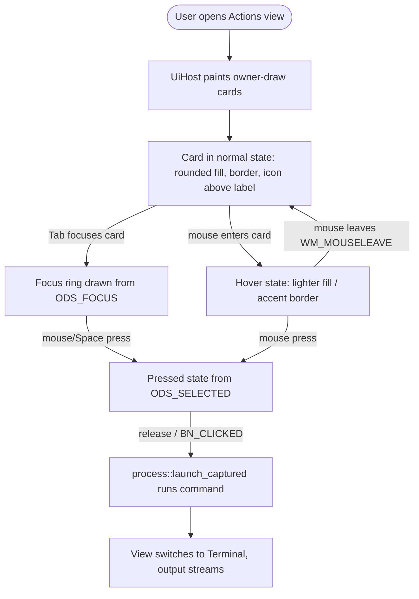

# Instruction: Lot 1 — Owner-draw Fluent visual rework of the Actions view

## Feature

- **Summary**: Replace the raw `BS_PUSHBUTTON` action buttons with owner-draw (`BS_OWNERDRAW`) buttons painted as Fluent-style cards via GDI in a `WM_DRAWITEM` handler. Add normal/hover/pressed/focus visual states, Segoe UI typography with the label below the icon, restyled category headers, and homogeneous spacing. Light theme only. No model change; click/launch behavior is preserved.
- **Stack**: `Rust 2021`, `tao 0.26`, `windows 0.52` (features: existing + `Win32_UI_Controls`, `Win32_UI_Input_KeyboardAndMouse`), pure Win32/GDI, no WebView2, no WinUI 3.
- **Branch name**: `feature/actions-view-rework/lot1-ownerdraw`
- **Parent Plan**: `2026_06_23-actions-view-rework-master.md`
- **Sequence**: `1 of 2`
- Confidence: 9/10
- Time to implement: ~1.5-2 days

## Architecture projection

### Files to modify

- `src/ui/app.rs` - Replace `BS_PUSHBUTTON` with `BS_OWNERDRAW` in `create_button`; add `WM_DRAWITEM` handling in `container_proc` (NOT `WM_MEASUREITEM` — not sent for buttons); add per-button hover subclass (TrackMouseEvent); add a hover-state map + `id_to_icon` map + light-theme color/metric constants; restyle headers; tune spacing constants.
- `Cargo.toml` - Add `Win32_UI_Controls` and `Win32_UI_Input_KeyboardAndMouse` features to the `windows` dependency.

### Files to create

- `src/ui/card.rs` (or `src/ui/draw.rs`) - GDI card renderer: takes `(hdc, rect, state: CardState, icon: &IconSource, label: &str)`, paints rounded fill/border, icon-above-label (via `IconSource` dispatch), focus ring. `CardState` is a plain struct `{ is_hot: bool, is_pressed: bool, is_focused: bool }` — all three flags are needed simultaneously (a card can be focused AND hovered). Keeps unsafe GDI isolated and unit-testable for its pure geometry helpers.

### Files to delete

- none

## Applicable rules

| Tool   | Name           | Path                              | Why it applies                                                                 |
| ------ | -------------- | --------------------------------- | ------------------------------------------------------------------------------ |
| —      | project-guidelines | `aidd_docs/GUIDELINES.md`     | Repo workflow rules: never skip validation, never merge code you don't understand, run technical review. |
| —      | coding-assertions  | `aidd_docs/memory/coding-assertions.md` | Project coding/assertion conventions the implementation must follow (GDI handle ownership, leak-safety). |
| —      | claude-md          | `CLAUDE.md`                   | Be anti-sycophantic, verify claims against actual project state, do not commit/push without explicit ask. |

<!-- No cursor/copilot/opencode rule files exist in the repo root; native AIDD docs are the only rule surfaces. -->

## User Journey



## Risk register

| Risk                                                                 | Impact                                                              | Mitigation                                                                                                                                                              |
| -------------------------------------------------------------------- | ------------------------------------------------------------------ | --------------------------------------------------------------------------------------------------------------------------------------------------------------------- |
| `WM_DRAWITEM` routed to wrong window                                  | Cards never paint; buttons appear blank or default-drawn            | Confirmed: `WM_DRAWITEM` goes to the button's immediate parent = `actions_container`. Handle it in `container_proc`, not the top-level subclass. `WM_MEASUREITEM` is NOT sent for buttons — do not handle it. Add explicit branch + log. |
| Owner-draw loses automatic hover (no `ODS_HOTLIGHT`)                  | Hover state never triggers; cards feel dead                         | Per-button subclass arms `TrackMouseEvent(TME_LEAVE)` on `WM_MOUSEMOVE`; store hot-flag by ctrl id; `InvalidateRect` on enter/leave to repaint.                        |
| Existing icon HBITMAP path (`BM_SETIMAGE`/`BS_BITMAP`) conflicts with owner-draw | Icon double-drawn or ignored; GDI handle leaks                     | In owner-draw, `BM_SETIMAGE` is not used for paint. `id_to_icon: HashMap<u16, IconSource>` (Phase 2) is the SOLE owner of all HBITMAP handles — do NOT push them to `bitmaps: Vec<HBITMAP>`. The interim `id_to_bitmap` (Phase 1) needs its own Drop guard until Phase 2 replaces it (see Phase 1 task 2). `Drop` iterates `id_to_icon` and calls `DeleteObject` for each `Bitmap` variant. |
| New GDI objects (fonts/pens/brushes) leaked per paint                | GDI handle exhaustion over time                                    | Create theme font/pens/brushes ONCE (cached on host or as lazily-initialized statics), select-and-restore per paint; never create per `WM_DRAWITEM`. Restore original objects into the DC before returning. |
| `container_proc` returns wrong value for `WM_DRAWITEM`               | Windows assumes not handled; default ugly draw                     | Return `TRUE` (LRESULT(1)) after painting, per the owner-draw contract.                                                                                                |

## Implementation phases

### Phase 1: Enable owner-draw plumbing (no visual change yet)

> Switch the button class to BS_OWNERDRAW and route owner-draw messages to a paint entry point that initially mimics the current look.

#### Tasks

1. Add `Win32_UI_Controls` and `Win32_UI_Input_KeyboardAndMouse` to the `windows` features in `Cargo.toml`; `cargo build` to confirm `DRAWITEMSTRUCT`, `ODS_*`, `TrackMouseEvent` resolve.
2. In `create_button`, replace `BS_PUSHBUTTON` with `BS_OWNERDRAW` (keep `WS_TABSTOP`, drop `BS_MULTILINE|BS_CENTER|BS_VCENTER` which are meaningless for owner-draw). Stop calling `set_button_bitmap` for paint. Create a temporary `id_to_bitmap: HashMap<u16, HBITMAP>` on `UiHost` for Phase 1 (bitmap-only lookup for the placeholder paint); this map is a stepping stone — **Phase 2 replaces it entirely with `id_to_icon: HashMap<u16, IconSource>`**, which becomes the sole HBITMAP owner (see Phase 2 task 1 for ownership rules). Do not push new bitmap handles to the legacy `bitmaps: Vec<HBITMAP>` once owner-draw is active. **Drop guard for Phase 1**: implement `Drop` for `id_to_bitmap` immediately (iterate and call `DeleteObject` for each handle) — this prevents GDI handle leaks during Phase 1 development/testing. Remove this Drop when Phase 2 replaces `id_to_bitmap` with `id_to_icon`.
3. Extend `container_proc` to intercept **`WM_DRAWITEM` only** (NOT `WM_MEASUREITEM` — Windows does not send `WM_MEASUREITEM` for `BS_OWNERDRAW` buttons; that message is reserved for list-boxes, combo-boxes, and menus). Cast `lParam` to `*const DRAWITEMSTRUCT`, dispatch to a host paint routine via the thread-local `HOST`, return `LRESULT(1)`. Button size comes from `SetWindowPos` alone.
4. Provide a minimal placeholder paint (fill + label text) so the build is runnable and clicks still launch.

#### Acceptance criteria

- [ ] `cargo build` exits 0 with the new features enabled.
- [ ] Action buttons are created with `BS_OWNERDRAW` and still launch their command on click (BN_CLICKED path unchanged).
- [ ] `WM_DRAWITEM` is observably handled in `container_proc` (log line on first paint), not in the top-level subclass.

### Phase 2: GDI Fluent card renderer

> Paint each card with rounded corners, opaque fill, discreet border, Segoe UI font, and icon-above-label layout.

#### Tasks

1. Create `src/ui/card.rs` with a `paint_card(hdc, rect, state: CardState, icon: &IconSource, label: &str)` function and pure geometry helpers (icon rect vs label rect split) that are unit-tested. Define `CardState` as:
   ```rust
   pub struct CardState { pub is_hot: bool, pub is_pressed: bool, pub is_focused: bool }
   ```
   All three flags are independent and combinable (e.g. focused + hovered simultaneously). The caller constructs `CardState` by reading `DRAWITEMSTRUCT.itemState` for `ODS_SELECTED`/`ODS_FOCUS` (Phase 2 can stub `is_hot: false` since hover tracking comes in Phase 3) and the host hover map for `is_hot` (Phase 3). `IconSource` is an owned enum (no lifetime parameter — required so it can be stored in `HashMap<u16, IconSource>` on `UiHost` without propagating a lifetime to the thread-local `HOST`):
   ```rust
   pub enum IconSource { Bitmap(HBITMAP), Emoji(String), NoIcon }
   ```
   - `Bitmap(hbitmap)` → blit the HBITMAP centered in the icon rect via a compatible memory DC.
   - `Emoji(glyph)` → render the emoji character with `DrawTextW` using the face "Segoe UI Emoji" in the icon rect. This preserves the icon for all commands currently using emoji icons (📝 💻 🌐 in the default config).
   - `NoIcon` → icon area is empty; label fills the full card height.
   In `create_button`, resolve `icons::IconResolution::EmojiFallback(text)` → `IconSource::Emoji(text.clone())`, `IconResolution::Image(path)` → decoded HBITMAP → `IconSource::Bitmap(hbitmap)`, `IconResolution::None`/empty → `IconSource::NoIcon`. Store the resolved `IconSource` in `id_to_icon: HashMap<u16, IconSource>` on `UiHost`. **Ownership of HBITMAP handles**: `id_to_icon` is the SOLE owner — do NOT also push handles to `bitmaps: Vec<HBITMAP>`. Update `Drop` to iterate `id_to_icon` and call `DeleteObject(h.0)` for each `IconSource::Bitmap(h)` variant. Remove the `bitmaps` vec from `UiHost` once owner-draw is fully active (or keep it empty and unused for the owner-draw path — must not call `DeleteObject` twice on the same handle). This replaces the interim `id_to_bitmap` introduced in Phase 1.
2. Define light-theme constants: card fill, hover fill, pressed fill, border color, focus-ring color, text color, corner radius, border width, inner padding.
3. Cache two distinct fonts on `UiHost` — fields `label_font: HFONT` (Segoe UI, for card labels) and `emoji_font: HFONT` (Segoe UI Emoji, for the emoji icon region) — both freed in `Drop` with `DeleteObject` alongside bitmaps. Create in `UiHost::new` via `CreateFontW`.
4. Paint the rounded card using **`CreateRoundRectRgn` + `FillRgn` + `FrameRgn`** (NOT `RoundRect`): this gives independent control over fill color and border color per visual state. Draw inside a **memory DC** (CreateCompatibleDC + CreateCompatibleBitmap + BitBlt) to eliminate hover-transition flicker — never paint directly in the `DRAWITEMSTRUCT.hDC` without double-buffering.
5. Ensure all cached GDI objects (`HFONT`, `HBRUSH` constants, `HPEN` constants) are created once in `UiHost::new` and freed in `Drop`; per-paint code only selects/restores. `CreateRoundRectRgn` and the memory DC are created and destroyed per paint (they are not cacheable — but they hold no scarce handles beyond the call).

#### Acceptance criteria

- [ ] Each card shows rounded corners, opaque fill, a discreet border, the icon in the upper area and the label below in Segoe UI.
- [ ] Emoji-icon commands (default config: 📝 💻 🌐) show their emoji glyph in the icon region — no regression vs the old button text rendering.
- [ ] No GDI object (font, brush, pen) is created inside `WM_DRAWITEM` — creation only in `new`/first-use; deletion only in `Drop`.
- [ ] No hover-transition flicker: painting goes through a memory DC before BitBlt to the screen.
- [ ] `cargo test` still exits 0 (pure geometry helpers covered by new unit tests).

### Phase 3: Visual states (normal / hover / pressed / focus)

> Make cards react to interaction using ODS_* flags for pressed/focus and TrackMouseEvent for hover.

#### Tasks

1. In `paint_card`, branch fill/border using all three `CardState` fields: `is_pressed` (from `ODS_SELECTED`) → pressed fill; `is_focused` (from `ODS_FOCUS`) → draw focus ring (e.g. inner dashed/accent rect via `DrawFocusRect` or a custom inset frame); `is_hot` → hover fill; none → normal. States compose: a focused hovered card shows both hover fill and focus ring.
2. Add a hover-state map on `UiHost` keyed by control id (or HWND). When building `CardState` for `paint_card`, set `is_hot` from this map; set `is_pressed` and `is_focused` from `DRAWITEMSTRUCT.itemState & ODS_SELECTED` / `ODS_FOCUS`. Call `InvalidateRect` on enter/leave to repaint.
3. Install a per-button subclass in `create_button` that: on `WM_MOUSEMOVE` arms `TrackMouseEvent { dwFlags: TME_LEAVE, hwndTrack }` and sets the hot-flag (if not already), `InvalidateRect`; on `WM_MOUSELEAVE` clears the hot-flag, `InvalidateRect`; chains everything else via `DefSubclassProc`. Remove the subclass in `reload`/`Drop` (mirror existing leak-safe destroy discipline for buttons).
4. Verify keyboard focus ring appears on Tab and pressed state on Space/Enter and on mouse-down.

#### Acceptance criteria

- [ ] Hovering a card changes its appearance and reverts on mouse-leave (no stuck hover when leaving fast).
- [ ] Pressing a card (mouse or keyboard) shows the pressed state; releasing launches the command.
- [ ] Tab focus draws a visible focus ring distinct from hover.
- [ ] Per-button subclasses are removed on `reload` and on drop (no orphaned subclasses; `cargo build`/manual run shows no leak warnings).

### Phase 4: Header restyle + spacing rhythm

> Restyle category headers and homogenize gutters/spacing for a coherent Fluent rhythm.

#### Tasks

1. Restyle section headers: either give the STATIC headers `SS_OWNERDRAW` and paint them (Segoe UI semibold, accent/uppercase eyebrow style) in the same `WM_DRAWITEM` path, OR handle `WM_CTLCOLORSTATIC` for color + set a heavier font via `WM_SETFONT`. Pick one and document it as a decision in this plan's Amendments.
2. Tune spacing constants in `layout_flat` / `layout_grouped` (`PAD`, `HEADER_H`, inter-card gutter) for homogeneous gutters; keep `SetWindowPos`-only (leak-safe) layout intact.
3. Verify both flat (`show_categories == false`) and grouped (`show_categories == true`) paths render with consistent rhythm.

#### Acceptance criteria

- [ ] Category headers are visually restyled and consistent across groups.
- [ ] Gutters between cards and around headers are homogeneous in both flat and grouped modes.
- [ ] Resizing the window re-flows cards without creating GDI handles (layout remains `SetWindowPos`-only).
- [ ] `cargo build` and `cargo test` exit 0.

## Amendments

<!-- AI-initiated changes during implementation. Each entry is prefixed with 🤖. -->

🤖 **Phase 3 — WM_MOUSELEAVE constant**: `WM_MOUSELEAVE` (0x02A3) is not re-exported by the `windows` 0.52 crate's `Win32_UI_WindowsAndMessaging` feature. Defined as a local `const WM_MOUSELEAVE: u32 = 0x02A3` in `app.rs`. Value is stable Win32 ABI — will not change.

🤖 **Phase 4 — Header approach decision**: Chose approach (b) — `WM_CTLCOLORSTATIC` for text color + `WM_SETFONT` for font — over (a) `SS_OWNERDRAW`. Rationale: no need for a new `WM_DRAWITEM` dispatch path; the STATIC control draws its own text; we just inject font and color. Implementation: `create_font_segoe_ui(10, true)` → `FW_SEMIBOLD` header font cached on `UiHost` as `header_font`; `WM_SETFONT` sent to each header after creation and after reload. `WM_CTLCOLORSTATIC` handled in `container_proc` → sets text color `#505050` (Fluent eyebrow style) + `TRANSPARENT` bg mode → returns `header_bg_brush` (white, matching container surface).

🤖 **Phase 4 — `create_font_segoe_ui` bold parameter**: The existing function signature had `_bold: bool` (underscore-prefixed, ignoring the parameter). Fixed to actually use `bold`: `FW_SEMIBOLD` (600) when `true`, `FW_REGULAR` (400) otherwise.

🤖 **Phase 4 — Spacing tuning**: `PAD` increased from 8 → 12 px in both `layout_flat` and `layout_grouped`. `HEADER_H` increased from 24 → 30 px in `layout_grouped` to accommodate the SemiBold font. These values are `const` inside the functions, so future changes are a single-line edit.

## Log

<!-- APPEND ONLY. One entry per step attempt. Never rewrite. -->

### 2026-06-24 — Phase 3: Hover state

- Added `id_to_hover: HashMap<u16, bool>` field to `UiHost`; initialized to empty in both flat and grouped `build_from_config` paths.
- Replaced `is_hot: false` stub in `draw_item` with `self.id_to_hover.get(&ctrl_id).copied().unwrap_or(false)`.
- Added `HOVER_SUBCLASS_ID = 2` constant (distinct from `SUBCLASS_ID = 1`).
- Added `hover_subclass_proc` in `app.rs`: handles `WM_MOUSEMOVE` (arm `TrackMouseEvent(TME_LEAVE)`, set hot=true, `InvalidateRect` if changed) and `WM_MOUSELEAVE` (set hot=false, `InvalidateRect` if changed). Only invalidates on actual state change to avoid repaint storms.
- Added `pub fn set_hover(ctrl_id: u16, hot: bool) -> bool` in `mod.rs` (borrow_mut HOST, returns whether state changed).
- Installed `hover_subclass_proc` on each button HWND in `create_button` via `SetWindowSubclass`.
- `reload`: removes hover subclass (`RemoveWindowSubclass`) for each button before `DestroyWindow`; clears `id_to_hover`; swaps `id_to_hover` with new host.
- `Drop`: iterates `self.buttons` and calls `RemoveWindowSubclass(hover_subclass_proc, HOVER_SUBCLASS_ID)` for each.
- `WM_MOUSELEAVE` not exported by `windows` 0.52; defined as `const WM_MOUSELEAVE: u32 = 0x02A3`.
- Validation: `cargo build` ✓ · `cargo clippy` ✓ · `cargo test` 116/116 ✓

### 2026-06-24 — Phase 4: Header restyle + spacing rhythm

- Decided approach (b): `WM_CTLCOLORSTATIC` + `WM_SETFONT` (see Amendments).
- Fixed `create_font_segoe_ui` to actually use the `bold` parameter via `FW_SEMIBOLD`.
- Added `header_font: HFONT` and `header_bg_brush: HBRUSH` fields to `UiHost`; initialized null in both struct literals, created in `new`, freed in `Drop`.
- Added `apply_header_font(&self)` method: sends `WM_SETFONT` to each `headers` HWND; called from `new` (after font creation) and from `reload` (after swap).
- Added `pub unsafe fn ctlcolor_static_for_container(hdc: HDC) -> Option<LRESULT>` in `mod.rs`: sets text color `#505050` + `TRANSPARENT` bg mode → returns `header_bg_brush` as `LRESULT`.
- Added `WM_CTLCOLORSTATIC` branch in `container_proc`; returns brush from `ctlcolor_static_for_container` or falls through to `DefWindowProcW`.
- `PAD` tuned 8 → 12 px in both layout functions; `HEADER_H` tuned 24 → 30 px in `layout_grouped`.
- Validation: `cargo build` ✓ · `cargo clippy` ✓ · `cargo fmt` ✓ · `cargo test` 116/116 ✓

## Validation flow demonstration

1. `cargo build` then run the app; open the Actions view.
2. Observe each command rendered as a rounded Fluent card with icon above its Segoe UI label.
3. Move the mouse over a card — it highlights; move away — it reverts.
4. Press Tab — a focus ring appears; press Space — the card shows pressed then launches the command, switching to the Terminal view with streamed output.
5. Toggle `show_categories` to true in config, reload — grouped mode shows restyled headers with homogeneous spacing.
6. Resize the window — cards re-flow smoothly with no flicker or handle growth.
