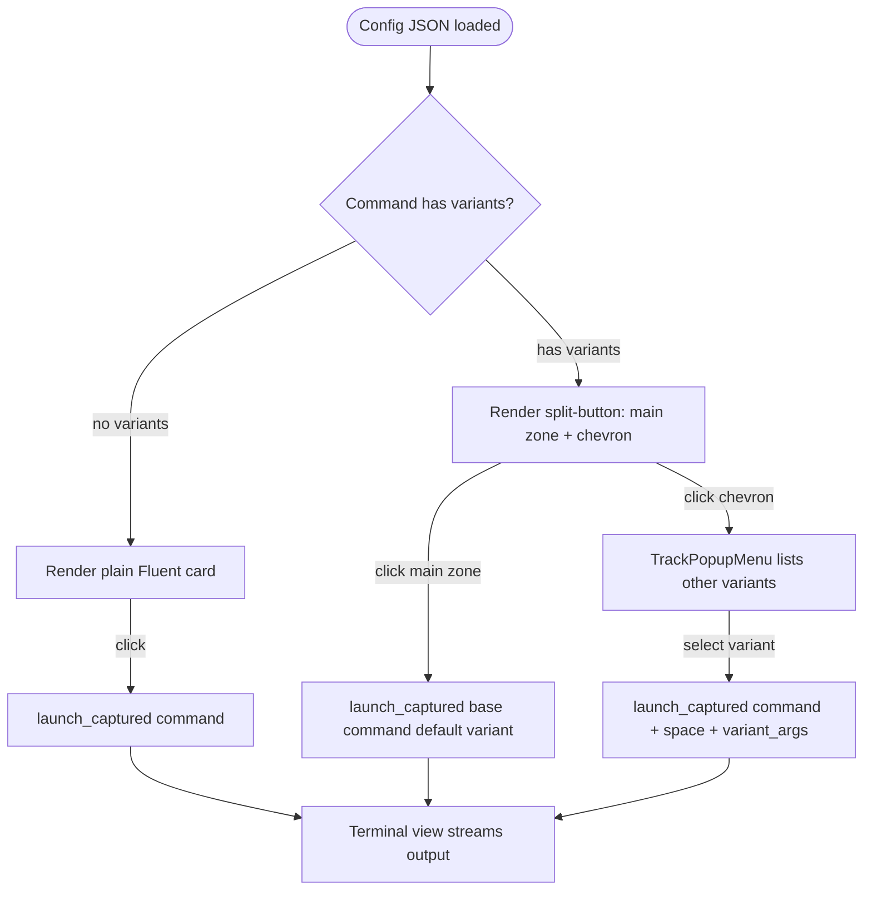

# Instruction: Lot 2 — Argument-variant model + native split-button

## Feature

- **Summary**: Add an optional, serde-default `variants` field to `Command` so existing JSON keeps deserializing/round-tripping losslessly (a command with no variants = a plain card). Plumb a "has-variants" marker through the layout model. Render commands with variants as a split-button: the main zone launches the default variant (base `command`), and a chevron hit region opens a native `TrackPopupMenu` listing the other variants; selecting one launches `command + " " + variant_args`.
- **Stack**: `Rust 2021`, `tao 0.26`, `windows 0.52` (features from Lot 1; `TrackPopupMenu` already available under `Win32_UI_WindowsAndMessaging`), `serde`/`serde_json`.
- **Branch name**: `feature/actions-view-rework/lot2-variants-splitbutton`
- **Parent Plan**: `2026_06_23-actions-view-rework-master.md`
- **Sequence**: `2 of 2`
- Confidence: 9/10
- Time to implement: ~1-1.5 days

## Architecture projection

### Files to modify

- `src/storage/models.rs` - Add `CommandVariant { name, args }` struct and `variants: Vec<CommandVariant>` to `Command` with `#[serde(default, skip_serializing_if = "Vec::is_empty")]`; add round-trip tests proving existing JSON is unaffected.
- `src/ui/xaml_gen.rs` - Add a `has_variants: bool` (or `variant_count: usize`) field to `GridEntry`/`GridCell` so layout/paint know which cells are split-buttons; thread it through `build_grid`/`build_sectioned`; extend unit tests.
- `src/ui/app.rs` - Pass variant data from `Command` into `GridEntry`; in the `WM_DRAWITEM` card renderer draw the chevron + divider for split cells; add click hit-testing (main zone vs chevron) and `TrackPopupMenu` on chevron; wire variant launch through `process::launch_captured`; maintain an id→variants map.
- `src/ui/card.rs` (from Lot 1) - Extend `paint_card` to optionally draw a chevron glyph + vertical divider on the right edge for split cells; expose the chevron hit-rect geometry as a pure, tested helper.

### Files to create

- none (all changes are additive to Lot 1 surfaces)

### Files to delete

- none

## Applicable rules

| Tool   | Name               | Path                                      | Why it applies                                                                                  |
| ------ | ------------------ | ----------------------------------------- | ----------------------------------------------------------------------------------------------- |
| —      | project-guidelines | `aidd_docs/GUIDELINES.md`                 | Repo workflow rules: define non-goals, run technical review, never merge code you don't understand. |
| —      | coding-assertions  | `aidd_docs/memory/coding-assertions.md`   | Serde/model conventions and the lossless round-trip discipline the new field must respect.       |
| —      | testing            | `aidd_docs/memory/testing.md`             | Unit-test strategy: serde round-trip + layout-model tests are the primary regression guard here. |
| —      | claude-md          | `CLAUDE.md`                               | Verify backward-compat claims against actual `models.rs` tests; do not commit/push without ask.  |

## User Journey

## Risk register

| Risk                                                                  | Impact                                                                 | Mitigation                                                                                                                                              |
| --------------------------------------------------------------------- | --------------------------------------------------------------------- | ----------------------------------------------------------------------------------------------------------------------------------------------------- |
| New `variants` field breaks existing serde round-trip tests           | `shortcut_absent_stays_absent_on_roundtrip` etc. fail; config corrupts | Use the exact `shortcut` pattern: `#[serde(default, skip_serializing_if = "Vec::is_empty")]`. Add a test asserting absent `variants` stays absent.       |
| Chevron hit-testing wrong → main zone and menu overlap                | Wrong action launched; menu opens on main click                       | Compute chevron hit-rect as a pure, unit-tested geometry helper shared by paint + click handling; main zone = card rect minus chevron rect.             |
| `TrackPopupMenu` blocks / wrong coords                                | Menu appears off-screen or app appears frozen                         | Anchor at bottom-left of chevron rect via `ClientToScreen` (NOT `GetCursorPos` — cursor may have moved); use `TPM_RETURNCMD | TPM_LEFTALIGN | TPM_TOPALIGN` to get selection inline. |
| Default-variant semantics ambiguous                                   | Main zone launches wrong thing                                        | Frozen decision: default variant = base `command` with no extra args. Main zone always launches `command`; menu lists only the declared variants.       |
| Owner-draw `WM_COMMAND` for split-button click can't distinguish zone | Chevron vs main indistinguishable via BN_CLICKED alone                | Owner-draw buttons still send BN_CLICKED; capture the last `WM_LBUTTONDOWN` client point in `id_to_last_click: HashMap<u16, (i32,i32)>` on `UiHost`; consume-and-remove the entry on each `BN_CLICKED` dispatch. Absent entry (keyboard Space/Enter, or stale entry cleared after prior dispatch) → main zone (default variant). |

## Implementation phases

### Phase 1: Backward-compatible variant model

> Add argument variants to Command without breaking any existing JSON.

#### Tasks

1. Add `pub struct CommandVariant { pub name: String, pub args: String }` deriving the same traits as the other models (`Serialize, Deserialize, Clone, Debug, PartialEq`).
2. Add `#[serde(default, skip_serializing_if = "Vec::is_empty")] pub variants: Vec<CommandVariant>` to `Command`.
3. Add tests: (a) the existing `DEFAULT_JSON` (no `variants`) deserializes with `variants == []`; (b) re-serializing a variant-less command emits NO `variants` key; (c) a command WITH variants round-trips losslessly.
4. Confirm all pre-existing tests (`deserializes_default_json_exact_fields`, `shortcut_absent_stays_absent_on_roundtrip`, `settings_deserializes_correctly`) still pass unchanged.

#### Acceptance criteria

- [ ] `cargo test` exits 0 with the new field and new tests.
- [ ] Serializing a command with empty `variants` produces JSON with no `variants` key.
- [ ] A command with variants survives a serialize→deserialize round-trip equal to the original.

### Phase 2: Layout-model plumbing

> Carry the "has variants" signal from Command through the grid model to the renderer.

#### Tasks

1. Add `has_variants: bool` to `GridEntry` and `GridCell` (default false), preserving existing constructors; update `build_grid` and `build_sectioned` to copy it through.
2. In `app.rs` build paths (flat + grouped), set `has_variants = !command.variants.is_empty()` when constructing `GridEntry`s.
3. Build an `id_to_variants: HashMap<u16, Vec<CommandVariant>>` (or store base command + variants) on `UiHost`, rebuilt atomically in `new`/`reload` exactly like `id_to_command`.
4. Update `xaml_gen` unit tests to assert the flag propagates and that variant-less cells stay `has_variants == false`.

#### Acceptance criteria

- [ ] `GridCell.has_variants` is true exactly for commands whose `variants` is non-empty.
- [ ] `id_to_variants` is rebuilt on reload alongside `id_to_command`.
- [ ] `cargo test` exits 0 (xaml_gen tests updated and passing).

### Phase 3: Split-button rendering

> Draw the chevron + divider on split cells and expose a tested hit-rect.

#### Tasks

1. Extend `paint_card` (Lot 1) to draw, when `has_variants`, a vertical divider and a chevron glyph in a fixed-width right-edge zone; main zone is the remaining area.
2. Add a pure helper `chevron_hit_rect(card_rect) -> RECT` (and `main_zone_rect`) in `card.rs` with unit tests for typical/narrow card widths.
3. Verify a variant-less command still renders as a plain Lot 1 card (no chevron, full-width main zone).

#### Acceptance criteria

- [ ] Commands with variants show a chevron + divider; commands without variants are visually unchanged from Lot 1.
- [ ] `chevron_hit_rect` / `main_zone_rect` are unit-tested and non-overlapping.
- [ ] `cargo build` and `cargo test` exit 0.

### Phase 4: Click hit-testing, popup menu, and launch wiring

> Route main-zone clicks to the default variant and chevron clicks to a native variant menu.

#### Tasks

1. In the per-button subclass (Lot 1), record the last `WM_LBUTTONDOWN` client point by storing it in a new `id_to_last_click: HashMap<u16, (i32, i32)>` field on `UiHost` (keyed by ctrl_id, parallel to `id_to_hover`); on `BN_CLICKED` dispatch, **consume-and-remove** the entry (`HashMap::remove`) to decide zone via `chevron_hit_rect`. If `remove` returns `None` (keyboard Space/Enter, or stale entry already consumed), always route to the main zone (launch default variant). Consuming the entry on dispatch prevents stale mouse-chevron coordinates from routing a subsequent keyboard Space to the chevron — a real bug path when the user clicks chevron → Tabs away → Tabs back → presses Space.
2. Main zone → `process::launch_captured(base_command, sender)` (default variant — base `command`, no extra args).
3. Chevron zone → build a `CreatePopupMenu`, `AppendMenuW` one item per variant (label = `variant.name`), anchor the popup at the **bottom-left of the chevron rect** converted to screen coords via `ClientToScreen` (do NOT use `GetCursorPos` — the cursor may have moved); call `TrackPopupMenu` with `TPM_RETURNCMD | TPM_LEFTALIGN | TPM_TOPALIGN` to get the chosen item inline. `TrackPopupMenu` returns 0 when the user dismisses the menu without selecting — check for this case and do NOT launch anything. Only launch `format!("{command} {args}")` when the return value is non-zero (a valid menu item id).
4. Ensure the popup menu HMENU is destroyed (`DestroyMenu`) after use; reuse existing menu-building patterns already in `install_menu_bar`.
5. Confirm variant-less commands keep the unchanged single-zone launch behavior.

#### Acceptance criteria

- [ ] Clicking the main zone of a split-button launches the base command.
- [ ] Clicking the chevron opens a native menu listing exactly the declared variants.
- [ ] Selecting a variant launches `command + " " + args` and streams output to the Terminal view.
- [ ] No menu handle leak (`DestroyMenu` after `TrackPopupMenu`); `cargo build` + `cargo test` exit 0.

## Amendments

<!-- AI-initiated changes during implementation. Each entry is prefixed with 🤖. -->

## Log

<!-- APPEND ONLY. One entry per step attempt. Never rewrite. -->

## Validation flow demonstration

1. Add a command with two `variants` to a test config; keep an existing command with no variants.
2. `cargo test` — all serde + layout tests pass, including the variant-less round-trip guard.
3. Run the app: the variant command shows a split-button (chevron + divider); the other command is an unchanged plain card.
4. Click the main zone of the split-button — base command launches.
5. Click the chevron — a native menu lists the variants; pick one — `command + args` launches and output streams to Terminal.
6. Re-load the original config (no variants) — everything renders and behaves exactly as in Lot 1.
