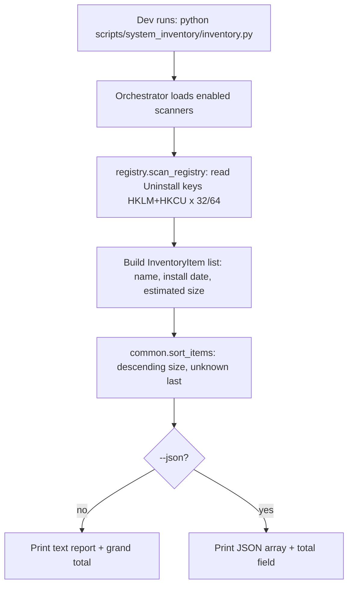

# Instruction: System Inventory Part 1 - core + orchestrator + registry source

## Feature

- **Summary**: Stand up the `scripts/system_inventory/` package: a shared `InventoryItem` model, a safe recursive directory-size helper, report/JSON/sort/total formatting, an `argparse` CLI orchestrator, and the first real source — the Windows Uninstall registry (HKLM+HKCU, 32/64-bit views) with native name / install date / estimated size.
- **Stack**: `Python 3.13 (stdlib only: argparse, json, os, sys, dataclasses, pathlib, winreg, ctypes)`
- **Branch name**: `feature/system-inventory/`
- **Parent Plan**: `./2026_07_06-system-inventory-master.md`
- **Sequence**: `1 of 3`
- Confidence: 9/10
- Time to implement: ~0.5 day

## Architecture projection

### Files to modify

- `none` - Part 1 only adds a new isolated package; no existing file changes.

### Files to create

- `scripts/system_inventory/__init__.py` - marks the package (mirrors `scripts/deps_audit` layout; may hold `__version__`).
- `scripts/system_inventory/common.py` - `InventoryItem` dataclass, `human_size()`, safe `dir_size_on_disk()` (reparse-point-skipping, error-tolerant), `sort_items()`, `format_report()`, `to_json_payload()`.
- `scripts/system_inventory/registry.py` - `scan_registry()` reading the Uninstall keys across HKLM/HKCU and 32/64 views; emits `source="registry"` items.
- `scripts/system_inventory/inventory.py` - CLI entry point: aggregates enabled scanners (registry only in Part 1), sorts, prints report or `--json`, prints grand total.
- `scripts/system_inventory/README.md` - purpose (read-only, offline, v1 raw inventory), usage, sources present so far, vhdx/sparse + registry-estimate caveats placeholder (extended by Parts 2 and 3).
- `scripts/system_inventory/tests/__init__.py` - test package marker.
- `scripts/system_inventory/tests/test_common.py` - unit tests for sizing, sorting, formatting, human size.
- `scripts/system_inventory/tests/test_registry.py` - unit tests for registry-record parsing with injected/fake key data (no live registry dependency).
- `scripts/system_inventory/tests/test_inventory.py` - orchestrator wiring, ordering, total, `--json` shape.

### Files to delete

- `none`

## Applicable rules

<!-- No installed tool exposes project rules: no .claude/rules, no .cursor/rules, no .github/copilot instructions under the repo root. -->

| Tool | Name | Path | Why it applies |
| ---- | ---- | ---- | -------------- |
| none | -    | -    | No rule surface present in the repo. |

## User Journey

## Risk register

| Risk | Impact | Mitigation |
| ---- | ------ | ---------- |
| `EstimatedSize` (KB DWORD) missing or misinterpreted | Wrong or missing sizes | Convert KB→bytes; missing value → `size_bytes=None` sorted last; never fabricated |
| Reading both 64 and 32 views double-lists apps | Inflated inventory | Query WOW64_64KEY and WOW64_32KEY separately, dedupe by (hive, view, subkey) key path; document that 32/64 are genuinely distinct nodes |
| `winreg` import on non-Windows | ImportError crash | Guard import in `registry.py`; orchestrator degrades with a clear "Windows only" message, non-zero exit |
| Accidental registry write | Breaks read-only contract | Use only `OpenKey`/`EnumKey`/`QueryValueEx`; no write APIs imported |

## Implementation phases

### Phase 1: Package scaffold + shared core (`common.py`)

> Create the package and the reusable model + formatting/sizing helpers, fully unit-tested without any OS scan.

#### Tasks

1. Create `scripts/system_inventory/__init__.py` and `tests/__init__.py`.
2. Define `InventoryItem` dataclass: `source: str`, `name: str`, `path: str | None`, `size_bytes: int | None`, `detail: dict[str, str]` (e.g. install date, view, flags).
3. Implement `human_size(n)` (B/KB/MB/GB, `n=None` → "unknown").
4. Implement `dir_size_on_disk(path, exclude_paths=None)`: iterative `os.scandir` walk, sum `st_size`, skip entries whose `st_file_attributes` has `FILE_ATTRIBUTE_REPARSE_POINT`, swallow `OSError`/`PermissionError` per entry and continue. `exclude_paths` is an optional `set[Path]` of resolved absolute paths; any entry (file or directory) matching one is skipped entirely (not recursed into, not summed) — this lets a source that claims a specific file or subtree exactly (e.g. a Docker/WSL `.vhdx` owned by the `docker-wsl` source) opt out of being re-summed by a broader first-level folder scan (e.g. `appdata`).
5. Implement `sort_items(items)` (descending `size_bytes`, `None` last, tie-break by name) and `total_bytes(items)`.
6. Implement `format_report(items)` and `to_json_payload(items)` (list of dicts + a `total_bytes`/`total_human`).

#### Acceptance criteria

- [x] `test_common.py` covers: human size boundaries, `None` size handling, sort order with mixed/`None` sizes, a temp-dir sizing case, a reparse-point/permission-error case that does not raise, and an `exclude_paths` case where a nested file several levels deep is skipped and does not contribute to the sum.
- [x] `python -m unittest scripts.system_inventory.tests.test_common` (or discover) passes.

### Phase 2: Registry source (`registry.py`)

> Read the Uninstall registry across both hives and both bitness views into `InventoryItem`s.

#### Tasks

1. Guard the `winreg` import (Windows-only) with a clear failure path.
2. Define the four scan targets: `HKLM\SOFTWARE\...\Uninstall` (64 view), same via WOW64_32KEY, and the `HKCU` equivalents.
3. Implement `_read_uninstall_entry(key)` extracting `DisplayName`, `InstallDate` (REG_SZ `YYYYMMDD`), `EstimatedSize` (DWORD KB → bytes), `InstallLocation`; tolerate missing values.
4. Implement `scan_registry()` returning deduped `InventoryItem`s with `source="registry"`, `detail={install_date, hive, view}`.
5. Make record parsing a pure function fed a dict so tests need no live registry.

#### Acceptance criteria

- [x] `test_registry.py` verifies KB→bytes conversion, missing `EstimatedSize` → `None`, `InstallDate` capture, and that no write API from `winreg` is referenced (import/attribute check).
- [x] `scan_registry()` runs on the live machine without error and returns at least one item (smoke, guarded to Windows).

### Phase 3: Orchestrator + CLI (`inventory.py`)

> Wire the registry scanner behind a `deps_audit`-style CLI.

#### Tasks

1. `argparse` with `--json`, `--source` (repeatable; default all-enabled = `registry` in Part 1), `--top N` (optional cap), mirroring `deps_audit` invocation style.
2. Aggregate scanner outputs, `sort_items`, print `format_report` or JSON payload, always print grand total.
3. Non-Windows / no-source → clear message and non-zero exit.
4. Write `README.md` describing purpose (read-only, offline, v1 raw inventory), usage, sources present so far, and the vhdx/sparse + registry-estimate caveats placeholder.

#### Acceptance criteria

- [x] `python scripts/system_inventory/inventory.py` prints a registry inventory sorted by descending size with a grand total.
- [x] `python scripts/system_inventory/inventory.py --json` emits a valid JSON array + total, sorted descending.
- [x] `test_inventory.py` asserts ordering, total, and `--json` shape using a fake scanner (no live registry).

## Amendments

- 🤖 2026-07-06: Phase 1's own task text (`to_json_payload(items)` → "list of dicts + a total_bytes/total_human") and the header `success_condition` ("emitting a JSON array of registry items") are in tension: a bare top-level array has nowhere to carry the grand total, but "always print grand total" (Phase 3 task 2) plus the validation-flow demo (`--json | python -m json.tool` must yield valid JSON) rules out printing the total as trailing plain text after the JSON blob. Resolution: `--json` emits one JSON object `{"items": [...], "total_bytes": int, "total_human": str}` — the `items` array is what "a JSON array of registry items sorted by descending size_bytes" refers to, not the top-level value. This matches `to_json_payload()` exactly as already implemented and unit-tested in Phase 1 (commit `e599aff`), so Phase 3's `inventory.py --json` should print `json.dumps(to_json_payload(sorted_items))` as-is rather than unwrap it into a bare array.

## Log

## Validation flow demonstration

1. `python -m unittest discover -s scripts/system_inventory/tests -v` → all green.
2. `python scripts/system_inventory/inventory.py` → readable table of installed programs by descending estimated size + total.
3. `python scripts/system_inventory/inventory.py --json | python -m json.tool` → valid JSON, descending `size_bytes`.
