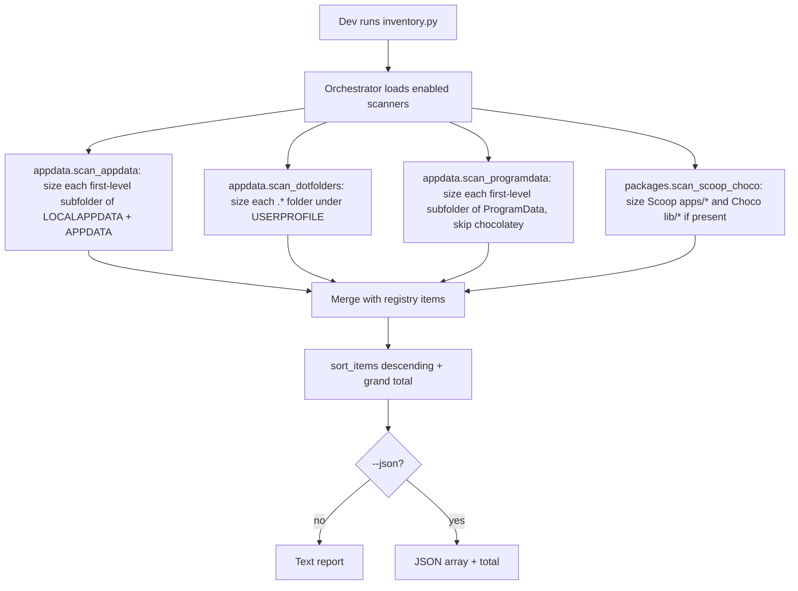

# Instruction: System Inventory Part 2 - AppData/dotfolders + Scoop/Choco sources

## Feature

- **Summary**: Add the filesystem-walk sources that reuse Part 1's `dir_size_on_disk()`: (a) first-level subfolders of `%LOCALAPPDATA%` and `%APPDATA%` plus dotfolders directly under `%USERPROFILE%` (`.cargo`, `.rustup`, `.npm`, `.ollama`, `.cache`, ...); (b) first-level subfolders of `%ProgramData%`, excluding the `chocolatey` entry (itemized per-app by source (c) to avoid double-counting the same bytes under two sources); (c) Scoop (`%USERPROFILE%\scoop`) and Chocolatey (`C:\ProgramData\chocolatey`) app trees when present. All wire into the existing orchestrator behind `--source` filtering.
- **Stack**: `Python 3.13 (stdlib only: os, pathlib, dataclasses)`
- **Branch name**: `feature/system-inventory/`
- **Parent Plan**: `./2026_07_06-system-inventory-master.md`
- **Sequence**: `2 of 3`
- Confidence: 9/10
- Time to implement: ~0.4 day

## Architecture projection

### Files to modify

- `scripts/system_inventory/inventory.py` - register the two new scanners in the source map / `--source` choices.
- `scripts/system_inventory/README.md` - document the new sources and their per-folder sizing semantics.

### Files to create

- `scripts/system_inventory/appdata.py` - `scan_appdata()` (first-level subfolders of LOCALAPPDATA + APPDATA, `source="appdata"`), `scan_dotfolders()` (USERPROFILE dotfolders, `source="dotfolder"`), and `scan_programdata()` (first-level subfolders of `%ProgramData%`, excluding `chocolatey`, `source="programdata"`).
- `scripts/system_inventory/packages.py` - `scan_scoop_choco()` sizing Scoop `apps/*` and Chocolatey `lib/*`, `source="scoop-choco"`, present-only (no error when absent).
- `scripts/system_inventory/tests/test_appdata.py` - temp-tree tests for first-level sizing and dotfolder discovery.
- `scripts/system_inventory/tests/test_packages.py` - temp-tree tests for Scoop/Choco discovery + graceful absence.

### Files to delete

- `none`

## Applicable rules

| Tool | Name | Path | Why it applies |
| ---- | ---- | ---- | -------------- |
| none | -    | -    | No rule surface present in the repo. |

## User Journey

## Risk register

| Risk | Impact | Mitigation |
| ---- | ------ | ---------- |
| Deep AppData subtrees slow / permission-locked | Slow scan or crash | Reuse Part 1 `dir_size_on_disk()` (error-tolerant, reparse-skipping); only recurse to size, list at first level |
| Dotfolder that is a junction (e.g. redirected `.cache`) | Double counting / loop | `dir_size_on_disk()` skips reparse points; dotfolder discovery uses `is_dir()` on first level only |
| Scoop/Choco not installed | Scanner errors | Present-only: return `[]` when roots absent; unit-tested |
| Same folder appears in both AppData and a dotfolder scan | Duplicate lines | Sources are distinct roots (AppData dirs vs `~/.x`); no overlap by construction; document tagging |
| `%ProgramData%` first-level scan re-sums the `chocolatey` tree already itemized per-app by `scan_scoop_choco` | Duplicate bytes inflate the grand total | `scan_programdata()` hardcodes an exclude-list containing `chocolatey`; unit-tested; documented in README |

## Implementation phases

### Phase 1: AppData + dotfolders + ProgramData (`appdata.py`)

> List and size the first level of the two AppData roots, the USERPROFILE dotfolders, and the ProgramData root.

#### Tasks

1. Resolve `%LOCALAPPDATA%`, `%APPDATA%`, and `%ProgramData%` via `os.environ`; skip cleanly if unset.
2. `scan_appdata(base=None, exclude_paths=None)`: for each existing root, iterate first-level `os.scandir` dirs, size each via `dir_size_on_disk(entry, exclude_paths=exclude_paths)`, emit `source="appdata"` items with `detail={root: LOCALAPPDATA|APPDATA}`. `exclude_paths` is forwarded as-is (empty/`None` in this part, since no other source claims sub-paths yet); Part 3 supplies real values once `docker_wsl.py` exists.
3. `scan_dotfolders()`: iterate `%USERPROFILE%` first-level entries whose name starts with `.` and is a dir, size each, emit `source="dotfolder"`.
4. `scan_programdata(base=None, exclude_paths=None)`: iterate `%ProgramData%` first-level entries, skip the entry named `chocolatey` (case-insensitive; owned by `scan_scoop_choco`), size the rest via `dir_size_on_disk(entry, exclude_paths=exclude_paths)`, emit `source="programdata"`.
5. Keep all three as pure functions taking an optional base path (and, for `scan_appdata`/`scan_programdata`, an optional `exclude_paths`) for testability.

#### Acceptance criteria

- [x] `test_appdata.py` builds a temp tree and asserts: correct first-level enumeration, correct summed sizes, dotfolders picked up, non-dot and file entries ignored, missing root tolerated.
- [x] `test_appdata.py` covers `scan_programdata()`: first-level enumeration, `chocolatey` exclusion (case-insensitive), missing root tolerated.
- [x] `test_appdata.py` covers `exclude_paths` forwarding for both `scan_appdata()` and `scan_programdata()`: a path passed via `exclude_paths` is excluded from the relevant entry's summed size.
- [x] Live smoke: `scan_appdata()`, `scan_dotfolders()`, and `scan_programdata()` return items with plausible sizes.

### Phase 2: Scoop + Chocolatey (`packages.py`)

> Size the app trees of the two package managers if they exist on the machine.

#### Tasks

1. `scan_scoop_choco()`: probe `%USERPROFILE%\scoop\apps\*` and `C:\ProgramData\chocolatey\lib\*`; for each existing manager, size each app subfolder via `dir_size_on_disk()`.
2. Emit `source="scoop-choco"` items with `detail={manager: scoop|chocolatey}`.
3. Return `[]` (no error) when neither manager is present; allow base-path override for tests.

#### Acceptance criteria

- [x] `test_packages.py` covers: Scoop-only present, Choco-only present, both absent (empty list), correct per-app sizes, `manager` detail tag.
- [x] Live smoke on this machine does not raise regardless of what is installed.

### Phase 3: Orchestrator wiring

> Expose the new sources through the existing CLI.

#### Tasks

1. Add `appdata`, `dotfolder`, `programdata`, `scoop-choco` to the orchestrator source map and `--source` choices.
2. Ensure default (no `--source`) now aggregates registry + these sources into one descending-size inventory with a single grand total.
3. Update `README.md` (new sources, first-level-only semantics, present-only behavior, `chocolatey` exclusion from `programdata`).

#### Acceptance criteria

- [x] `python scripts/system_inventory/inventory.py --source appdata` lists only AppData items, size-sorted; `--source dotfolder` lists only USERPROFILE dotfolder items.
- [x] `python scripts/system_inventory/inventory.py --source programdata` lists ProgramData items with `chocolatey` excluded.
- [x] `python scripts/system_inventory/inventory.py` merges registry + filesystem sources in one sorted inventory + total.
- [x] Full test discover passes.

## Amendments

- 🤖 2026-07-06: Live-verifying this part's acceptance criteria against the real `%LOCALAPPDATA%` tree (hundreds of thousands of files across dev-tool caches) exposed a performance defect in Part 1's `common.dir_size_on_disk()`: it called `Path.resolve()` (an OS syscall) on every walked entry unconditionally, even when `exclude_paths` is empty — the common case throughout Part 1 and most of Part 2, since the mechanism is only meaningfully exercised starting in Part 3. This made a full appdata/dotfolder/programdata scan time out past 120s. Fix: guard the `.resolve()` call behind `if excluded:` (skip it entirely when there is nothing to match against) in `scripts/system_inventory/common.py`. Verified: full suite still 67/67 green (the `exclude_paths`-specific tests exercise the guarded branch and still pass), and a fresh timed run of `--source appdata --source dotfolder --source programdata` completed in 50.4s (was timing out) with a plausible 221.4 GB total.

## Log

## Validation flow demonstration

1. `python -m unittest discover -s scripts/system_inventory/tests -v` → green.
2. `python scripts/system_inventory/inventory.py --source appdata --source dotfolder` → biggest AppData/dotfolder consumers first.
3. `python scripts/system_inventory/inventory.py --source programdata` → biggest ProgramData consumers first, `chocolatey` absent from this list.
4. `python scripts/system_inventory/inventory.py --json` → registry + filesystem items merged, descending `size_bytes`.
