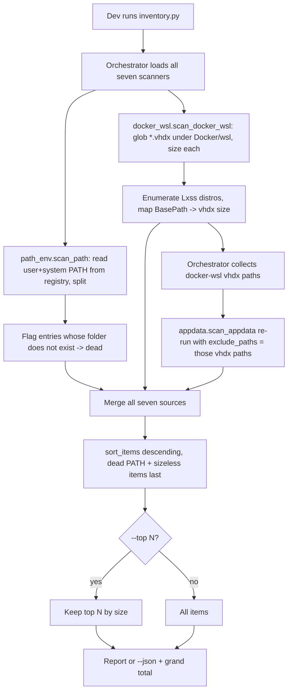

# Instruction: System Inventory Part 3 - PATH audit + Docker/WSL vhdx + polish

## Feature

- **Summary**: Add the two remaining sources. (a) PATH: read the user PATH (`HKCU\Environment`) and system PATH (`HKLM\...\Session Manager\Environment`), list each entry, and FLAG entries pointing to a non-existent folder — signalling only, never modifying registry/PATH. (b) Docker/WSL: size `%LOCALAPPDATA%\Docker\wsl\{data,disk}\*.vhdx` (and `ext4.vhdx`) and enumerate registered WSL distros via the `Lxss` registry (each distro's `BasePath` — which can point either under `LOCALAPPDATA\Docker\wsl` or, for a Microsoft-Store-installed distro such as Ubuntu/Debian, under `LOCALAPPDATA\Packages\<PackageFamilyName>\LocalState`), reporting each distro's vhdx size. Both locations are also inside the generic `LOCALAPPDATA` first-level folders (`Docker`, `Packages`) that Part 2's `scan_appdata()` recursively sums, so this part wires the orchestrator to compute `docker_wsl` items FIRST, collect their absolute `.vhdx` paths, and pass that set as `exclude_paths` into `scan_appdata()` (the parameter Part 2 already plumbed) — so those exact bytes are skipped by the generic scan regardless of which first-level folder they happen to live under, and are attributed only once, to `docker-wsl`. Then final polish: `--top N`, README completion, cross-source grand total.
- **Stack**: `Python 3.13 (stdlib only: os, pathlib, glob, winreg)`
- **Branch name**: `feature/system-inventory/`
- **Parent Plan**: `./2026_07_06-system-inventory-master.md`
- **Sequence**: `3 of 3`
- Confidence: 9/10
- Time to implement: ~0.4 day

## Architecture projection

### Files to modify

- `scripts/system_inventory/inventory.py` - register `path` and `docker-wsl` scanners; run `docker_wsl` before `appdata` and thread its claimed `.vhdx` paths into `scan_appdata()` as `exclude_paths`; finalize `--top N` and grand-total wording.
- `scripts/system_inventory/README.md` - document PATH (read-only, dead-entry flag) and vhdx (sparse allocated size) sources; final usage matrix; note the `docker-wsl`/`appdata` exclusion mechanism.

### Files to create

- `scripts/system_inventory/path_env.py` - `scan_path()` reading user+system PATH from the registry (unexpanded), splitting, flagging dead (non-existent) dirs; `source="path"`, `size_bytes=None`.
- `scripts/system_inventory/docker_wsl.py` - `scan_docker_wsl()` sizing `.vhdx` files and enumerating `Lxss` distros; `source="docker-wsl"`.
- `scripts/system_inventory/tests/test_path_env.py` - PATH splitting, dead-entry flagging, dedupe, read-only assertion.
- `scripts/system_inventory/tests/test_docker_wsl.py` - vhdx globbing/sizing with a temp tree; distro-record parsing from injected data.

### Files to delete

- `none`

## Applicable rules

| Tool | Name | Path | Why it applies |
| ---- | ---- | ---- | -------------- |
| none | -    | -    | No rule surface present in the repo. |

## User Journey

## Risk register

| Risk | Impact | Mitigation |
| ---- | ------ | ---------- |
| Reading expanded `os.environ['PATH']` hides which entry is user vs system | Can't attribute or flag precisely | Read raw `REG_EXPAND_SZ` from `HKCU\Environment` and system `Environment` key; expand with `os.path.expandvars` only for existence checks |
| Any registry/PATH write | Violates read-only contract | `path_env.py` uses only read APIs; a test asserts no write API is imported/used; NEVER call `SetValueEx` |
| vhdx sparse size vs logical size confusion | Misleading numbers | Report `os.stat().st_size` (on-disk allocated); README states it is the sparse allocated size, not guest logical size |
| Docker/WSL not installed | Scanner errors | Present-only: return `[]` when the `Docker\wsl` root and `Lxss` key are absent |
| Duplicate PATH entries / trailing separators | Noisy list | Normalize (strip, drop empties), dedupe while preserving user-vs-system origin in `detail` |
| A `docker-wsl` `.vhdx` is nested under a `LOCALAPPDATA` first-level folder also summed by `appdata` — either `Docker\wsl\` (Docker's own utility VM) or `Packages\<PackageFamilyName>\LocalState\` (a Microsoft-Store-installed WSL distro, e.g. Ubuntu/Debian) | Same multi-GB `.vhdx` bytes double-counted in the grand total | Orchestrator runs `docker_wsl` first, collects every item's absolute `path`, and passes that set as `exclude_paths` into `scan_appdata()`; regression test asserts a fake nested vhdx under both `Docker\wsl\` and `Packages\...\LocalState\` is excluded from the `appdata` total |

## Implementation phases

### Phase 1: PATH audit (`path_env.py`)

> List every PATH entry with origin and a dead/alive flag; never modify anything.

#### Tasks

1. Read user PATH from `HKCU\Environment` and system PATH from `HKLM\SYSTEM\CurrentControlSet\Control\Session Manager\Environment` (raw values; tolerate absence).
2. Split on `;`, strip, drop empties; keep origin (`user`/`system`) in `detail`; dedupe by (origin, normalized path).
3. For each entry, `os.path.isdir(os.path.expandvars(entry))`; set `detail={origin, status: alive|dead}`; `size_bytes=None`.
4. Pure helper `split_path_value(raw)` for testing without the registry.

#### Acceptance criteria

- [ ] `test_path_env.py`: splitting/normalization/dedupe, dead vs alive flag via temp dirs, both origins captured, and an assertion that no `winreg` write API is referenced.
- [ ] Live smoke: `scan_path()` lists real PATH entries and flags at least the correct alive ones.

### Phase 2: Docker/WSL vhdx + distros (`docker_wsl.py`)

> Size Docker Desktop / WSL2 virtual disks and map them to registered distros.

#### Tasks

1. Glob `%LOCALAPPDATA%\Docker\wsl\{data,disk}\*.vhdx` and `ext4.vhdx`; size each via `os.stat().st_size`; `source="docker-wsl"`, `path=<absolute vhdx path>`, `detail={kind: vhdx}`.
2. Enumerate `HKCU\Software\Microsoft\Windows\CurrentVersion\Lxss\*`: read `DistributionName` + `BasePath`; size the distro's `ext4.vhdx` under `BasePath` if present (this covers both Docker-internal distros and Microsoft-Store-installed ones such as Ubuntu/Debian, whose `BasePath` typically resolves under `LOCALAPPDATA\Packages\<PackageFamilyName>\LocalState`); emit with `path=<absolute vhdx path>`, `detail={distro, kind: wsl-distro}`.
3. Present-only: return `[]` when neither the Docker root nor `Lxss` exists; keep distro-record parsing a pure function for tests.
4. Every `InventoryItem` this scanner emits MUST set `path` to the vhdx's absolute filesystem path — the orchestrator relies on this to build the `exclude_paths` set passed into `scan_appdata()`.

#### Acceptance criteria

- [ ] `test_docker_wsl.py`: temp-tree vhdx globbing/sizing, `ext4.vhdx` inclusion, distro-record parsing from injected dict, graceful absence, and every returned item has a non-`None` absolute `path`.
- [ ] Live smoke does not raise whether or not Docker/WSL is installed.

### Phase 3: Final polish + orchestrator

> Complete the CLI and documentation across all seven sources.

#### Tasks

1. Register `path` and `docker-wsl` in the source map / `--source` choices; default aggregates all seven.
2. When both `docker-wsl` and `appdata` are enabled (the default), run `scan_docker_wsl()` first, collect the `path` of every returned item into a `set[Path]`, and pass it as `exclude_paths` to `scan_appdata()`; when `docker-wsl` is disabled via `--source`, `scan_appdata()` runs with no exclusions (documented as a known, accepted over-count in that filtered view).
3. Implement `--top N` (cap the sorted output; total still computed over all items, noted in report).
4. Finalize `README.md`: purpose (read-only, offline, v1 raw inventory, no verdict), full source list, semantics/caveats (registry estimate, vhdx sparse size, PATH read-only flagging), the two documented exclusions (`chocolatey` from `programdata`; `docker-wsl`-claimed vhdx paths from `appdata`), usage examples mirroring `deps_audit`.
5. Confirm the master success condition end-to-end.

#### Acceptance criteria

- [ ] `python scripts/system_inventory/inventory.py --json` emits items from all seven sources, descending by size, with a grand total.
- [ ] `test_inventory.py` asserts that with fake `docker_wsl` and `appdata` scanners, the orchestrator threads the former's paths into the latter's `exclude_paths` and the grand total does not double-count them.
- [ ] `python scripts/system_inventory/inventory.py --top 20` prints the 20 largest items and states the full total.
- [ ] `python -m unittest discover -s scripts/system_inventory/tests -v` passes.
- [ ] README documents all sources, the read-only/offline guarantees, and the two documented exclusions (`chocolatey` from `programdata`; `docker-wsl`-claimed vhdx paths from `appdata`).

## Amendments

## Log

## Validation flow demonstration

1. `python -m unittest discover -s scripts/system_inventory/tests -v` → green.
2. `python scripts/system_inventory/inventory.py --source path` → PATH entries with dead ones flagged; nothing modified.
3. `python scripts/system_inventory/inventory.py --source docker-wsl` → vhdx files + WSL distros with sizes.
4. `python scripts/system_inventory/inventory.py` (default, all sources) → the `Docker`/`Packages` `appdata` entries exclude every `docker-wsl`-claimed vhdx path, confirming no overlap between the two sources.
5. `python scripts/system_inventory/inventory.py --top 20 --json` → 20 largest machine-wide items across all seven sources, descending, with a grand total.
