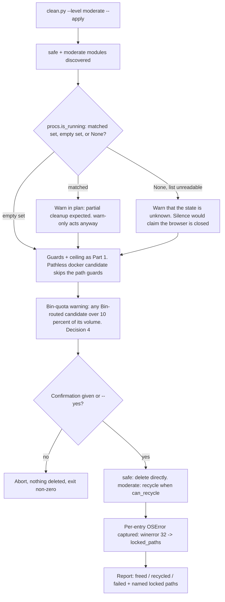

# Instruction: winclean Part 2 - `moderate` level + lock handling + confirmations

## Feature

- **Summary**: Add the `moderate` module family — browser caches, VS Code/Cursor caches, `%TEMP%`, `CrashDumps`, `docker system prune` — on top of Part 1's unchanged primitives. This is where Windows diverges hardest from the sysclean model: files are **locked** while their owning process runs, so partial success becomes a normal reported outcome. Recycling becomes the default at this level (frozen decision 4), and the level requires an interactive confirmation under `--apply`.
- **Stack**: `Python 3.13 (stdlib only)`
- **Branch name**: `feature/winclean/`
- **Parent Plan**: `./2026_08_04-winclean-master.md`
- **Sequence**: `2 of 3`
- Confidence: 8/10
- Time to implement: ~0.75 day (was ~0.5 day: the Bin-quota warning and its tests were added by the challenge passes)

## Architecture projection

### Files to modify

- `scripts/winclean/registry_mod.py` - register the new `moderate` modules. Additive; existing `safe` entries unchanged.
- `scripts/winclean/clean.py` - route `moderate` candidates through recycling by default; add the interactive confirmation gate and the Bin-quota warning; give the **existing** `--yes` (declared in Part 1, where it acknowledges a running-process warning) its second and final meaning, answering that confirmation. The flag is not re-declared here; surface the `failed` column in the report.
- `scripts/winclean/common.py` - add `locked_paths: list[str]` **and `recycle_failed_paths: list[str]`** to `CleanResult` so the report can name what could not be removed, by class. Two lists and not one because the `failed` column has two sources (Part 1 Phase 2 task 5) and they are different events: additive fields with defaults.
- `scripts/winclean/tests/test_clean.py` - **extended, not replaced** (the file is created in Part 1 and extended again in Part 3): the lock exit-code rule, the deferred-reclamation footer and the Bin-quota warning are asserted there because they live in `clean.py`.
- `scripts/winclean/tests/test_registry_mod.py` - **extended, not replaced**: Part 1's three registry-relative mapping tables — `discovery`, `proc_guard`, `needs_network` — gain this part's five modules, and the `pathless` behavioural case becomes assertable here because `docker-light` is registered in this part. The three tables are compared against the live registry, so omitting this change fails Part 1's tests rather than silently leaving a module unclassified.
- `scripts/winclean/README.md` - this part's additions to it; **Phase 3 task 5 is the authority on what they are**. The enumeration that stood here named three of them and predated the two added since: the recycled-is-not-freed loop with its closing step, and the `%TEMP%` residual risk of decision 19 - which is to say, exactly the safety text an implementer working from the shorter list would omit.

### Files to create

- `scripts/winclean/mod_apps.py` - `browser-cache` (Chrome/Edge/Brave/Vivaldi/Firefox profiles), `vscode-cache` (VS Code + Cursor; Phase 2 task 2 owns the six allowlisted names - this bullet deliberately no longer carries them, having listed four of the nine directories that actually exist), `user-temp` (`%TEMP%`), `crashdumps` (`%LOCALAPPDATA%\CrashDumps`), `docker-light` (`docker system prune` — images dangling + stopped containers + build cache, **never volumes**).
- `scripts/winclean/tests/test_mod_apps.py`.

> `procs.py` and `tests/test_procs.py` are **no longer created here**: they moved to Part 1 (Phase 2b), because `cargo-target`/`dotnet-binobj` need process detection and ship in Part 1. Part 2 consumes the existing `is_running()` unchanged.

### Files to delete

- `none`

## Applicable rules

| Tool | Name | Path | Why it applies |
| ---- | ---- | ---- | -------------- |
| none | -    | -    | No rule surface present in the repo. |

## User Journey

## Risk register

| Risk | Impact | Mitigation |
| ---- | ------ | ---------- |
| A locked file aborts the whole module | User sees a crash on a routine run | Part 1's per-entry `OSError` capture already returns `failed`; Part 2 only adds naming. Exit code stays `0` when the only failures are locks — a lock is not an error, it is a fact |
| Deleting the whole browser profile instead of its cache | Loss of bookmarks, passwords, history | Candidates are limited to the **allowlisted** subdirectory names, per browser family - Phase 2 task 1 owns that list, its fail-closed default and the names that read as caches but are data. This row deliberately does not repeat them: it previously listed `Service Worker\CacheStorage` among the *targets*, where task 1 classes it as user data, and prescribed adding the profile root to `DEFAULT_PROTECTED`, which `is_protected()`'s subtree match turns into a silent cancellation of the module. The mitigation is the allowlist and nothing else; unit-tested against a fake profile containing `Login Data` that must survive |
| `docker system prune` removes volumes | Irreversible loss of database data | Invoked without `--volumes`, explicitly with `--filter` scoping; a test asserts the argument vector never contains `--volumes` or `-a` |
| `docker` absent or daemon down | Spurious failure | The two-stage probe of Phase 2 task 5, which owns it: no `docker` binary, or a non-zero exit from `docker system df --format json`, yields zero candidates with empty stderr |
| A pathless candidate is forced through the path guards | `path_sanity` rejects `docker-light` outright, or worse, a module bypasses the guards to ship it | Part 1 Phase 1 task 2b makes `path: str | None` part of the model from the first commit: guards skip pathless candidates, the ceiling still counts them, `remove.py` is never called for them. No module ever bypasses the guard chain |
| `%TEMP%` contains a file in use by the current Python process | Self-inflicted lock | winclean creates **no** temp file under `%TEMP%` during a run (`--out` writes where the user asked), so there is nothing of its own to exclude. PID-based filtering was specified earlier and dropped: `tempfile` names carry no PID, so the rule was unimplementable. Anything held open by any process — winclean included — surfaces as `winerror 32` in `locked_paths`, which is already a first-class outcome |
| Confirmation prompt in a non-interactive context (launched from WinFXStart UI) | Hang with no visible prompt | If `stdin` is not a TTY, no prompt is attempted: the run aborts with a message telling the user to pass `--yes`. Never assume consent |
| Recycling a multi-GB cache fills the Bin without freeing space | User sees "cleaned" but disk is unchanged | Part 1's `freed` vs `recycled` split is already enforced; per master decision 18 the footer states the recycled total, that those bytes are still on disk, the follow-up command **including its mandatory `--trash-days 0`**, and `--no-recycle`. No implicit Bin emptying |
| The follow-up command printed in the footer is itself a no-op | The documented way out does nothing, which is worse than documenting nothing | The footer's command carries `--trash-days 0` explicitly (master decision 18), and a test asserts the printed string contains it — a footer without it fails the suite |
| A failed `recycle()` silently deletes instead | The undo guarantee the level exists for is destroyed | Master decision 14: `recycle-failed` is terminal — counted `failed`, path left in place. Only an explicit `--no-recycle` authorises direct deletion at this level |
| `--only browser-cache` reaches the module without its confirmation | Irreversible-ish deletion with no prompt | Master decision 12: an `--only` module above the active `--level` is a non-zero error before discovery, never an escalation |

## Implementation phases

### Phase 1: Reuse of `procs.py` (no new file)

> Part 1 Phase 2b already shipped `procs.is_running()`. Nothing is written here; this phase only records the dependency and the names Part 2 queries.

#### Tasks

1. Declare the owner-process name sets consumed by `mod_apps.py`: `{"chrome.exe", "msedge.exe", "brave.exe", "vivaldi.exe", "firefox.exe"}` for `browser-cache`, `{"Code.exe", "Cursor.exe"}` for `vscode-cache`. Detection stays informational — Part 1's contract (never kill, never suspend, never elevate) is not relaxed. The return values are **not** restated here: Part 1 Phase 2b is the authority, and an earlier draft of this line said "empty set means unknown", which is exactly the semantics that phase now rejects. A reader who needs to know what an empty set versus a `None` means reads it there; task 1 of Phase 2 below only says what this module *does* with a `None`.
1b. **Both modules declare `proc_guard = warn-only`** (master decision 19; the value is tabulated with this part's two other declared properties in the Phase 2 preamble, and the mapping is asserted by Part 1's `test_registry_mod.py`). A running browser or editor holds its cache files **open**, it does not rewrite the tree being deleted: the outcome is `winerror 32` in `locked_paths`, which this part makes a first-class reported state. Part 1's `warn-and-skip` strength exists for the build modules, where a concurrent write corrupts a build. Inheriting `warn-and-skip` here would make the ordinary `--level moderate --apply` with a browser open skip every browser candidate silently — the opposite of what this part's own criteria assert.
2. Do **not** re-create `procs.py` or `tests/test_procs.py`; if either is missing, Part 1 is incomplete and must be finished first.

#### Acceptance criteria

- [x] `test_mod_apps.py` imports `procs` from the package and does not redefine `is_running`; the source-level assertion is that **exactly one file under `scripts/winclean/` contains a `def is_running`, and it is `procs.py`** — not a count of modules in the package, which Part 3 raises by adding `mod_system.py`, `config.py` and `history.py` and would turn a duplication check into a spurious failure.

### Phase 2: `moderate` modules (`mod_apps.py`)

> No module here walks the roots: `browser-cache`, `vscode-cache`, `user-temp` and `crashdumps` are **fixed** (documented per-user paths) and `docker-light` is **pathless**, so all five are discovered whatever `--root` holds (the three-valued classification is declared in `registry_mod.py` — Part 1 Phase 3 task 5 — and merely read by the plan builder). They are listed under "per-user, outside your roots" so `--root` is not misread as confining the run, and each is added to Part 1's discovery-mode mapping test — which compares against the live registry, so registering one without classifying it fails the suite.
> **All five carry `needs_network=False`** (master decision 11, mapping asserted by the same registry-relative test): none of them refills from a package registry. A browser cache does refill as you browse, but that is incidental traffic, not a build prerequisite — the flag exists so `--offline` protects a machine that cannot rebuild, and nothing here blocks a build. Saying so is mandatory rather than polite: the **module** field has no default and a missing value is a `TypeError` at import, while the identically named **candidate** field does default to `False` — for the reason Part 1's Phase 1 criterion states and which is not restated here, since a default with two published justifications is a default nobody dares change. The module declares the classification; the plan builder stamps it onto each candidate the module returned (Part 1 Phase 4 task 3), so no `discover_*()` here writes that field.
>
> **The three declared properties of this part's modules, in one place** (the reason a reader should not have to hunt across two phases). They are exactly the three no-default fields of `CleanModule`; `ownership_rank` is absent because it is **derived** from `registry_mod.py`'s `MODULE_ORDER` tuple, to which this part appends its five names and nothing more:
>
> | Module | `discovery` | `needs_network` | `proc_guard` |
> | --- | --- | --- | --- |
> | `browser-cache` | `fixed` | `False` | `warn-only` |
> | `vscode-cache` | `fixed` | `False` | `warn-only` |
> | `user-temp` | `fixed` | `False` | `None` |
> | `crashdumps` | `fixed` | `False` | `None` |
> | `docker-light` | `pathless` | `False` | `None` |
>
> This part therefore owns the one behavioural assertion Part 1 could not write, having no member of that bucket: that a `pathless` module is discovered with **no `--root` at all**. `warn-only` is already asserted in Part 1 on a fake module — here it is asserted on the real `browser-cache`, which is what Phase 3's lock criterion does.

#### Tasks

1. `browser-cache`: enumerate profiles per browser **family**, emit candidates for the **allowlisted cache subdirs only**, and attach a `reason` naming the browser plus a warning when `procs.is_running` matched.

   **The profile root is not added to the protected set, and this is a correction rather than an omission.** Part 1's `is_protected()` matches an exact path **or a resolved subtree**, so protecting `<profile>` protects everything beneath it - including the `Cache` subdir this module exists to remove. The two rules are each right and jointly cancel the module: discovery would keep yielding candidates, every unit test at the discovery level would keep passing, and `--level moderate --apply` would free nothing on any machine, for the least visible of reasons. The allowlist below is the mechanism that keeps profile data safe, and it is the **only** one; introducing a second, non-recursive flavour of protection for one module would buy nothing and add a semantics the guard layer does not have.

   **The allowlist is therefore load-bearing and stated as a rule.** A name qualifies only if the browser refills it by itself with no user-visible loss; anything not on the list is never a candidate, including a name that merely looks like a cache. `Local Storage`, `IndexedDB`, `Service Worker\CacheStorage`, `Cookies`, `Login Data` and `Bookmarks` are site and user **data** - a PWA's offline documents live in the first two - and `moderate` is advertised as costing web sessions, not files. A profile holding none of the allowlisted names yields **nothing** for that profile; it never falls back to the profile root. (A stale, empty profile directory is a real case: this machine has one.)

   **Per family, because the two families share no layout - verified on this machine.** Chromium (`chrome.exe`, `msedge.exe`, `brave.exe`, `vivaldi.exe`) keeps profiles under a `User Data` directory, and the allowlist there is the `Cache`, `Code Cache` and `GPUCache` shape. Firefox has **no `User Data` directory at all**: its profiles are split across two roots under two different variables - `%LOCALAPPDATA%\Mozilla\Firefox\Profiles\<id>\` for the cache side and `%APPDATA%\Mozilla\Firefox\Profiles\<id>\` for the data side. Enumerating Firefox "under `User Data`" finds zero profiles, which is a module silently doing nothing for one of the five process names it guards. And the Local side is **not** uniformly cache: alongside `cache2`, `startupCache`, `thumbnails` and `jumpListCache` it holds `settings`, `remote-settings`, `safebrowsing` and `personality-provider`, so "delete the whole local profile folder" is wrong there too - the allowlist applies on both families or on neither. A return of `None` (process list unreadable, Part 1 Phase 2b) warns that the state is **unknown** rather than staying silent: a `warn-only` module never skips, so the warning is the only thing a user gets, and printing nothing would claim the browser is closed.
2. `vscode-cache`: same shape for VS Code and Cursor (`%APPDATA%\Code`, `%APPDATA%\Cursor`) - "same shape" includes task 1's two rules that are easy to drop when copying: an allowlist of names, and **no** subtree protection over the directory the candidates sit in.

   **The allowlist is six names, stated here because this task owns it and "same shape as task 1" supplies a rule with no data to apply it to.** They are `Cache`, `Code Cache`, `GPUCache`, `CachedData`, `DawnGraphiteCache` and `DawnWebGPUCache`. Task 1's qualifying rule is what selects them - the application refills each by itself with no user-visible loss - and the fail-closed default carries over: a name not on this list is never a candidate. Pointing at task 1 without naming these was the same defect iteration 60 fixed one task earlier, arrived at from the other side: there the allowlist existed and was unstated, here the rule was stated with an empty list, and read strictly fail-closed an empty list is a module that yields nothing.

   **The three excluded `Cached*` names are the reason a `*Cache*` glob is forbidden rather than merely discouraged.** The real layout, verified on this machine for both applications, holds nine cache-shaped directories, not the four an older summary of this task listed: beside the six above sit `CachedConfigurations`, `CachedProfilesData` and `CachedExtensionVSIXs`. A glob takes all nine. The first two name *configuration* and *profile* state, and nothing establishes that either is regenerated without user-visible loss, so the fail-closed rule refuses them - the cost of keeping a few megabytes is nil, the cost of guessing wrong is a user's editor setup. `CachedExtensionVSIXs` holds downloaded extension packages, which only a **re-download** restores; taking it would make this module network-dependent and contradict the `needs_network = False` it declares in the table above, so it is excluded on a property this plan already asserts rather than on taste. `logs` and `User` are not caches at all and `User` is where settings, keybindings, snippets and `workspaceStorage` live.
3. `user-temp`: first-level entries under `%TEMP%`. No self-exclusion logic: winclean writes nothing there, and an entry another process holds open is reported as locked rather than filtered out in advance.

   **Its `proc_guard = None` is a statement about `%TEMP%`, not a claim that nothing writes there, and this task owns saying so** - it is the one module in the package where the *primary* TOCTOU guard of master decision 19 does not exist. `warn-and-skip` and `warn-only` both work by querying named owner processes; `%TEMP%` has no owner, it is the shared scratch space of every process on the machine, so there is no name to hand `procs.is_running` and `None` is the truthful value rather than a relaxation. What follows is the residual risk decision 19 requires to be written rather than closed, and `user-temp` is where it is largest: the secondary mtime re-`stat` is the **only** guard this module has, and a directory's mtime moves only for its **direct** entries - verified on this machine, a file written two levels down leaves the top-level entry's mtime untouched. An installer unpacking into `%TEMP%\<guid>\payload\` is therefore invisible to both guards. The partial compensations are real but must not be presented as more: a file still open yields `winerror 32` and is reported in `locked_paths` rather than deleted, and `moderate` recycles by default, so the usual outcome is recoverable. Neither covers a process that has written and closed and will read again. This goes in the README beside the build-directory risk decision 19 already mandates (task 5), because a user choosing `--level moderate` mid-install deserves the same sentence a user deleting `target\` mid-build gets.
4. `crashdumps`: `%LOCALAPPDATA%\CrashDumps` contents.
5. `docker-light`: the one **pathless** candidate of v1 (`path=None`, mandatory `label` naming the three resource kinds it prunes — dangling images, stopped containers, build cache — per Part 1 Phase 1 task 2b). Clean via its own `clean()` running `docker system prune -f` with **no** `--volumes` and **no** `-a` — `remove.py` is never involved, and the guard chain skips it because there is no path to guard. It is never recycled, so the confirmation gate, not the Bin, is its only safeguard.

   **This task is the single authority on the module's availability probe**, and the probe has exactly two stages: `shutil.which("docker")` for the binary, then the **exit status of `docker system df --format json`** for the daemon. That command *is* the daemon probe — no separate `docker info` call exists anywhere in the package, and `requires="docker"` is satisfied by these two checks and nothing else. Stated in two places, an implementer probes with one while a criterion patches the other, and the test becomes unpassable on the common machine that has the CLI installed with the daemon stopped.

   **Its byte columns are `None` after the run too, not only before it, and this task owns that.** `measure_freed()` works by measuring a path before and after; there is no path here, so `freed` is **`None`** - the module reports that it ran and that its reclamation cannot be priced. `0` is the wrong answer for the same reason it is wrong everywhere in this package, and here it is also the loudest: a prune that reclaimed gigabytes would print `freed 0`. Parsing the `Total reclaimed space:` line prune prints is the other reachable answer and it is refused on the grounds already established below for the estimate - those figures are human-rendered strings, and this would be the one byte column in the package not produced by a measurement. A **non-zero exit from prune** is a removal failure other than a lock, so the run exits non-zero (Part 1 Phase 4 task 4 is the authority) and `failed` is `None` as well: the bytes are unknown in both directions, which is exactly what `None` says.

   **`estimated_bytes` is `None` for this module in v1** — a decision, not an unfilled blank. Three reasons, the first two verified against the local Docker (29.6.1): `docker system df --format json` emits **one JSON object per line**, one per `Type` (`Images`, `Containers`, `Local Volumes`, `Build Cache`), so its output must be read line by line — `json.loads()` over the whole stdout raises. Its `Size` and `Reclaimable` fields are **human-readable strings** (`"6.271GB (35%)"`), not byte integers, so any number would come from parsing a formatted string back into bytes: invented precision, where `None` states the truth (master's single encoding of unmeasurable). And the `Reclaimable` column is not this module's ceiling anyway — its `Local Volumes` row counts bytes a `prune` without `--volumes` never touches, and its `Images` row counts unused-but-tagged images only `-a` removes. Summing it would advertise as reclaimable exactly the volumes frozen decision 7 forbids deleting: a plan promising to free a database. Fail closed on a non-zero exit or on output that will not parse — zero candidates, `estimated_bytes` left `None`, nothing on stderr.

#### Acceptance criteria

- [x] `test_mod_apps.py` (`vscode-cache`): a fixture `%APPDATA%\Code` holding all eleven directories observed on a real installation - the six allowlisted ones plus `CachedConfigurations`, `CachedProfilesData`, `CachedExtensionVSIXs`, `logs` and `User` - yields exactly six candidates, and none of the other five. Asserted as an exact set rather than as "contains `Cache`", because the implementation a bare "allowlist of names" invites is a `*Cache*` glob, which passes any containment assertion while taking configuration and profile state with it.
- [x] `test_mod_apps.py`: a fake browser profile containing `Login Data`, `Bookmarks` and `Cache` yields exactly one candidate pointing at `Cache`, and the profile root is **not** in the protected set - asserted in that direction, because `is_protected()` matches a resolved subtree, so protecting the root would silently disqualify the one candidate the same criterion requires; a fixture profile holding **none** of the allowlisted names yields no candidate at all rather than its own root; a Firefox-shaped fixture (`Profiles\<id>\cache2` under a fake `%LOCALAPPDATA%`, with `settings\` beside it) yields `cache2` and not `settings` - Firefox has no `User Data` directory, so a Chromium-only enumeration finds nothing there and the module quietly covers four of its five guarded process names; the docker argument vector contains neither `--volumes` nor `-a`; a missing `docker` binary yields zero candidates with empty stderr.
- [x] `test_registry_mod.py` extended (the `pathless` behavioural case Part 1 deferred): with `--root` set to a single empty directory, **both stages of the probe** patched to succeed — `shutil.which("docker")` and the exit status of `docker system df --format json`, the two Phase 2 task 5 names and the only two — and `%TEMP%` patched to a fixture holding **one** entry, `docker-light` is still discovered and `user-temp` too, while every `walking` module yields nothing — one run proving all three discovery modes at once. Neither patch is optional, and for the same reason: `docker-light` declares `requires="docker"` and yields zero candidates silently when the daemon is down (risk register), while `user-temp` yields nothing when `%TEMP%` happens to be empty. Unpatched, the criterion fails on any machine without Docker and proves nothing about discovery modes on the machines where it passes — a `fixed` module that yields nothing is indistinguishable from a `walking` one, which is the very distinction under test. Part 1's equivalent criterion patches the documented path in for exactly this reason. The three mapping tables gain this part's five modules in the same change.

### Phase 3: Confirmation gate + report surfacing (`clean.py`)

#### Tasks

1. Under `--apply` with `--level moderate` or higher: require an interactive `yes` unless `--yes` is passed. If `stdin` is not a TTY and `--yes` is absent, abort non-zero. `--only` cannot substitute for `--level` here (master decision 12): `--only browser-cache` without `--level moderate` is a non-zero error naming the required level, so the gate is unreachable from the command line.
2. Route `moderate` candidates through `recycle()` when `can_recycle()` is true; when it is false, skip and report `no-undo` unless `--no-recycle` was passed explicitly. **A `path=None` candidate is dispatched before that test ever runs**: its own `clean()` is called and `remove.py` is not involved at all (Part 1 Phase 1 task 2b), so `can_recycle` is never handed a `None`. Written as a single rule over "every `moderate` candidate", the only pathless module of v1 — `docker-light`, on the default `moderate` path — would either raise inside `can_recycle` or be skipped as `no-undo`, which is the outcome Part 1 rules out for pathless candidates. A `recycle()` that fails is counted `failed` with reason `recycle-failed` and the path is left in place — never a fallback to `delete_tree` (master decision 14).
3. Extend the report with **two** named path sections, one per class of failure, and this task is their authority. `locked_paths` holds the entries that raised `winerror == 32` inside `delete_tree` - only those, as the flowchart above already implies. `recycle_failed_paths` holds the candidates of master decision 14: the `recycle()` call failed, the path is still there and nothing was removed. One list cannot carry both. The `failed` column counts both classes (Part 1 Phase 2 task 5 pins each source), so a single `locked_paths` section presented as "the paths behind that count" has two readings and both misreport a decision-14 outcome: leave the candidate out, and a whole tree abandoned in place is a number in a column with no path printed anywhere - the silence decision 14 exists to prevent, and the reason Part 1 forbids its `failed` contribution from being `0`; or list it among the locked paths, and the report tells the user a file was in use when in fact the shell refused the move, which sends them to close an application that was never the problem. The recycle-failed section states that the path was left in place, since that is what distinguishes it from every other line in the report. **Both lists surface in both renderings**: the text sections above and `to_json_payload()`, each under a key named after its field. Part 1 Phase 1 task 4 set that precedent for the skipped-candidates list precisely so a machine reader is not left with a count it cannot explain, and `--json --out <path>` (Part 1 Phase 4 task 5) makes the payload the only report a launcher-spawned run can surface at all - so a text-only section is invisible in exactly the mode master decision 16 says the UI must use. Said here because "extend the report" reads as the human table, which is how the text formatter gets both sections and the payload neither. The `failed` **column** is not created here — Part 1 Phase 1 task 4 already builds `format_result_report()` with distinct `freed` / `recycled` / `failed` columns, and this part's own risk register says so ("Part 2 only adds naming"). What this part adds is the list of paths behind that count, which needs the new `CleanResult.locked_paths` field. Exit `0` when the only failures are locks, non-zero on any other error class. A `no-undo` skip is **not** a failure and does not affect the exit code either — Part 1 Phase 4 task 4 states the rule for every skip outcome; this task does not re-decide it.
3b. **Bin-quota warning (master decision 4)**: at plan time, for every candidate that will be routed to the Recycle Bin, compare its estimated size to `shutil.disk_usage(volume).total`; over **10 %**, print a warning naming the candidate and stating that it **may exceed the Bin's allowance** - in which case the shell deletes permanently and silently and the undo cannot be relied on. **The hedge is in the imperative, not in a correction further down.** This sentence read "past the Bin quota" while a later one in the same task explained that 10 % is a proxy and that the message must say *may*: the line telling an implementer what to print contradicted the line explaining what it means, and the imperative is the one that gets implemented. **The absence of the warning says nothing either**: a candidate below 10 % can still exceed a Bin configured smaller, so no printed line - not this warning, not the deferred-reclamation footer of decision 18, not the README - may present a recycled candidate as recoverable. That half was absent altogether, leaving the reassuring reading to be invented by whoever writes the footer, at the one level users choose *for* its undo. **Pathless candidates are excluded from this step like every other path-typed step** (master's package-shape rule): the volume is derived from the candidate's path, so `docker-light` would reach `splitdrive(None)` here — the same crash task 2 above rules out for `can_recycle`, in a step that runs *earlier* and would therefore fail before the dispatch rule could save it. **A candidate whose `estimated_bytes` is `None` is not compared, and the step says so rather than leaving a comparison against `None` to be written.** There is no ratio to compute, so this warning does not fire - consistent with the paragraph above, whose whole point is that its silence proves nothing. What must not happen is the coercion: treating an unknown estimate as `0` produces a confident *no warning* for the candidate nobody could size, which is the one case where the user most needs to be told the undo may not hold. **It is reported instead, and this step is what reports it** - the acceptance criterion below already required an uncomparable candidate to be "reported as uncomparable" without anything defining that, so the term is defined here: a warning under the code **`recycle-bin-allowance-unknown`**, naming the candidate and its volume, stating that its size could not be measured and that whether the Bin will accept it is therefore unknown. It is a **separate code from `recycle-bin-allowance`** because the two say different things to a machine reader - *this may exceed the allowance* versus *we could not tell* - and collapsing them under one code with a `null` ratio makes every consumer re-derive the distinction from a missing field. The ceiling's `ceiling-total-partial` warning (Part 1 Phase 1 task 5) is **not** a substitute: it says the plan total is partial, which is a question about arithmetic, not about whether an undo will hold.

   The **10 %** is a deliberate proxy, not the quota: the real per-volume allowance lives in the shell's own configuration and is not readable from the stdlib, which is why the message hedges and why its silence proves nothing. A proxy stated as a measurement is how a warning becomes a false denial the day Windows changes its default. The warning fires on the **default `moderate` path**, not only under an explicit `--recycle` — the default is precisely where a user assumes undo exists. It is informational: it never blocks and never changes the removal mode. It is **emitted as well as printed**, under the code `recycle-bin-allowance` with the candidate, its volume and the measured ratio, per Part 1 Phase 1 task 4. This is the one warning in the package that can reach a launcher-surfaced report - such an action prints a plan and this warning fires at plan time - whereas the deferred-reclamation footer of task 4 cannot, since it requires `--apply` and the launcher wiring must not carry `--apply` at all (Part 3 Phase 4 task 5). Recorded so the footer's absence from the payload is not later read as the same omission. An `estimated_bytes` of `None` cannot be compared, so it produces no warning and says so.
4. **Deferred-reclamation footer (master decision 18)**: when a run recycled anything - **the event, recorded when `recycle()` returns successfully, not a comparison on the recycled total** - print the recycled total, the statement that those bytes are **still on disk**, and three ways out, in this order — `--no-recycle` on the next run for immediate reclamation; the Windows Bin UI; `clean.py --level aggressive --only recycle-bin --apply --trash-days 0` as the scriptable equivalent. The `--trash-days 0` is **mandatory** in that printed command: `recycle-bin` defaults to a 7-day age floor and would therefore ignore exactly the bytes this run just recycled, making the command a silent no-op. winclean never empties the Bin implicitly.

   **The total may be unknown and the footer still prints.** `recycled` is a measurement taken immediately before the recycle (Part 1 Phase 2 task 5), so it is `None` when that measurement failed while the recycle itself succeeded: bytes are in the Bin and nobody knows how many. The footer then states that the total is unknown and prints **the same three ways out**, because none of them depends on knowing the size. Keying the footer on `recycled > 0` is what this forbids - it suppresses decision 18's only exit route for a run that really did fill the Bin, and the user is left with an undo they were never told expires.
5. Update `README.md`: the `moderate` level, the running-process warning, the lock caveat, the recycled-is-not-freed loop with its closing step spelled out, and - beside the build-directory residual risk master decision 19 already requires - the same sentence for `%TEMP%` (task 3): no owner process to check, and an mtime guard that sees only direct entries.

#### Acceptance criteria

- [ ] `python scripts/winclean/clean.py --level moderate` prints safe + moderate candidates, deletes nothing.
- [ ] `python scripts/winclean/clean.py --level moderate --apply --yes` with a browser open reports the locked cache files by name and still exits `0` — the candidates are attempted rather than skipped, because `browser-cache` is `warn-only` (Phase 1 task 1b). Answering the prompt interactively instead of passing `--yes` gives the same outcome **provided no build tool is running**, the level gate being then the only thing that needed answering. The proviso is not pedantry: `--yes` also overrides the `warn-and-skip` of Part 1's `cargo-target`/`dotnet-binobj`, which a `--level moderate` plan includes, so with `cargo` up the two invocations diverge on the build modules. The fixture patches `procs.is_running` to return an **empty set** for the build names — a successful query that matched nothing, not `None`. Part 1 Phase 2b makes `None` mean *unknown* and `warn-and-skip` treats unknown as running, so a fixture returning `None` would skip the build modules and the two invocations would converge for the wrong reason, proving nothing about `--yes`.
- [ ] Without a TTY and without `--yes`, `--apply --level moderate` aborts non-zero having deleted nothing (tested with a patched `isatty`).
- [ ] `python scripts/winclean/clean.py --apply --only browser-cache` (no `--level`) exits non-zero naming `--level moderate`, deletes nothing, and never prompts.
- [ ] `test_clean.py` extended: a fake module returning a `winerror 32` failure keeps the exit code at `0`; any other `OSError` makes it non-zero.
- [ ] `test_clean.py` (the two failure classes are reported apart): under `--level moderate --apply` with `recycle()` stubbed to fail on the single candidate, the run exits **non-zero**, the candidate appears in the `recycle_failed_paths` section with its path, `locked_paths` is **empty**, and the `failed` column is that candidate's pre-operation size rather than `0`. Under `--json` the same run emits both keys, the recycle-failed one holding the path and the locked one an empty list - asserted on the payload and not only on the text, since the two renderings are built by different code and only one of them is what a launcher can read. Asserting `locked_paths` empty is the half that matters: a report listing the candidate as locked satisfies any assertion that merely looks for the path somewhere.
- [ ] `test_clean.py` (pathless dispatch): under `--level moderate --apply --yes` with `docker system prune` spied on, the `docker-light` candidate calls the module's own `clean()`, `can_recycle` is **never called** (asserted on a spy, so a `None` can never reach it) and the candidate is not reported `no-undo`. Without this the default recycling path either raises or silently skips the one pathless module of v1.
- [ ] `test_clean.py` (`docker-light` prices nothing): with `docker system prune -f` patched to succeed and print a `Total reclaimed space:` line, the candidate's `freed` is `None` - rendered `unknown`, not `0` and not the parsed figure - and under `--json` it is JSON `null`; with prune patched to exit non-zero, the run exits non-zero and `failed` is `None` too. The printed line is present in the fixture on purpose: it is the bait, and a test whose stub prints nothing cannot catch an implementation that parses it.
- [ ] `test_clean.py` (byte sourcing, Part 1 Phase 2 task 5): a candidate whose tree **grows between the plan and the apply** reports a `recycled` figure equal to its size at apply time and **not** its `estimated_bytes` - the divergence is the whole assertion, since any fixture that does not change size cannot tell the two sources apart. In the same file, a candidate whose `recycle()` is patched to fail reports its measured size in `failed` and the run's `failed` is **non-zero**: `0` there is the reachable wrong implementation and it renders a terminal, undo-preserving failure as an idle run. This part owns the assertions because this part owns the only level that routes to the Bin.
- [ ] `test_clean.py` (decision 18): a run whose only outcome is `recycled > 0` prints `freed = 0` **and** the follow-up command in the footer, and the asserted footer string contains the literal `--trash-days 0` so the printed command cannot degrade into a no-op; a run with `recycled == 0` does not print that footer at all. A third run recycles successfully with the pre-operation measurement patched to fail: the footer **still prints**, with all three ways out and the total stated as unknown. That case fails every `recycled > 0` spelling of the trigger, and it is the run where losing the footer costs the most.
- [ ] `test_clean.py` (decision 4, Bin quota): with `disk_usage` patched to a small total, a Bin-routed candidate over 10 % of the volume produces the warning **without** `--recycle` on the command line; the same candidate under 10 % produces none; an `estimated_bytes=None` candidate produces no `recycle-bin-allowance` warning and instead emits `recycle-bin-allowance-unknown` naming it and its volume, asserted in `to_json_payload()` and not only in the printed text; the `docker-light` pathless candidate produces none and `disk_usage` is **never called for it** (asserted on the same spy, so no `None` reaches `splitdrive`); the warning never alters the removal mode nor the exit code.
- [ ] `test_mod_apps.py`: a `__pycache__` or `bin/obj` candidate nested inside a `user-temp` candidate is absorbed by `user-temp` and counted once (master decision 13, exercised across module families).
- [ ] `%TEMP%` candidates carry a non-`None` `stat_mtime`, so Part 1's `skipped-changed` guard **runs** for them: an entry whose own mtime moved between plan and apply is skipped rather than deleted. The criterion stops there deliberately. It previously read "a file written between plan and apply is skipped", which is what master decision 19 forbids claiming: the guard sees direct entries only, so a write two levels down passes it - and a test written around that sentence would touch the candidate directly, pass, and certify a window that is still open. A second case pins the honest limit instead: a file written into a **sub**directory of a `user-temp` candidate does **not** produce `skipped-changed`, and the README carries that residual risk (task 3).

## Amendments

### 2026-08-04 — 🤖 shadow-areas pass

Amended after `aidd_docs/tasks/2026_08/2026_08_04-winclean-master-shadow-report.md`. Changes made here:

- `procs.py` / `tests/test_procs.py` **removed from Files to create** — moved to Part 1 Phase 2b, which needs them for `cargo-target`. Phase 1 became a dependency declaration (which process names Part 2 queries) instead of an implementation phase.
- Phase 3 gained the **deferred-reclamation footer** (master decision 18): the report names the recycled total, says the bytes are still on disk, and gives the closing step. This answers the report's "who empties the Bin?" gap — nobody implicitly; the user, with a named command.
- `recycle-failed` handling made explicit (decision 14) in both the tasks and the risk register.
- `--only` without the matching `--level` is now stated as a non-zero error (decision 12) instead of being left to the reader; the acceptance command that previously used `--only browser-cache` with no level is corrected.
- Acceptance criteria added for cross-family nesting (`__pycache__` inside `%TEMP%`, decision 13) and for `stat_mtime` on `%TEMP%` candidates so the TOCTOU guard covers them.

### 2026-08-04 — 🤖 challenge pass (iteration 1)

Amended after `/aidd-refine:02-challenge` on the master plan. Changes made here:

- **The footer's follow-up command now carries `--trash-days 0`**, and a test asserts the literal. Without it the printed command hits `recycle-bin`'s 7-day age floor and therefore skips exactly the bytes the run just recycled: the documented way out was a no-op. A risk row was added for that failure mode specifically.
- **`moderate` is confirmed as the only recycling level** (master decision 4, tightened): `safe` and `aggressive` both delete directly, so Part 2 owns the entire recycling path and the deferred-reclamation footer belongs here and nowhere else.
- **Bin-quota warning implemented here** (task 3b, master decision 4): it fires for any Bin-routed candidate over 10 % of its volume, **including the default `moderate` path** — the decision previously gated it behind `--recycle`, i.e. absent from the only path where a user assumes undo exists. A `None` estimate is uncomparable and reported as such rather than silently passing.
- **TOCTOU wording aligned on master decision 19**: the `stat_mtime` criterion stands for `%TEMP%` **files**, where mtime is meaningful; it is not claimed as a guard for directory trees, which is Part 1's `procs.is_running` job.

### 2026-08-04 — 🤖 challenge pass (iteration 3)

Amended after a third `/aidd-refine:02-challenge` pass. Changes made here:

- **`--yes` is no longer claimed by two plans**: it is declared in Part 1's CLI, and "Files to modify" now says explicitly that Part 2 only gives it its second meaning (acknowledging the confirmation gate) without re-declaring the flag. Two plans each declaring the same `add_argument` would have collided at implementation time.
- **PID-based self-exclusion dropped from `user-temp`** (Phase 2 task 3 and the matching risk row): `tempfile` does not put the PID in generated names, so the rule as written was unimplementable. An entry another process holds open now surfaces as `winerror 32` in `locked_paths` instead of being filtered out in advance — an acknowledged residual is better than a guard that cannot work.
- **`docker-light` is declared pathless** (`path=None`, mandatory `label`), against the model Part 1 Phase 1 task 2b now defines. It previously had no filesystem path at all, so `path_sanity` (which rejects anything under 10 characters) would have rejected it, or the module would have had to bypass the guard chain to ship it. `remove.py` is never involved and the path guards skip it; the confirmation gate, not the Bin, is its only safeguard.
- Mermaid diagram gained the Bin-quota node, and the estimate rose to ~0.75 day to cover the quota warning and its tests.

### 2026-08-04 — 🤖 challenge pass (iteration 4)

- **Phase 2 marked fixed-location**: every `moderate` module resolves per-user paths and runs whatever `--root` holds. Stated here as well as in Part 1 because reading Part 2 alone left `--root` looking like a confinement flag.
- A recycle-only `--apply` — the default outcome of this level — is now explicitly a **recorded** run in Part 3's history: `freed = 0` is not "nothing happened".

### 2026-08-04 — 🤖 challenge pass (iteration 6)

- **Phase 2's preamble stopped saying "fixed" about five modules that are not all fixed**: four resolve documented per-user paths, `docker-light` has no path at all. It now names the three-valued classification Part 1 Phase 4 task 3 owns, states that all five are discovered whatever `--root` holds for two different reasons, and points at the mapping test — which compares against the live registry, so registering a module here without classifying it fails the suite.
- **`no-undo` is no longer left to imply a failure**: Phase 3 task 3 refers to Part 1's "a skip is never an error" rule instead of re-deciding the exit code locally.

### 2026-08-04 — 🤖 challenge pass (iteration 7)

- **`browser-cache` and `vscode-cache` declare `proc_guard = warn-only`** (new Phase 1 task 1b). Part 1's process guard was phrased as a global skip, and this part's criteria assumed the opposite without saying so: a browser open meant "locked files reported by name", which requires the deletion to have been attempted. Inheriting `warn-and-skip` would have made the level's flagship run a silent no-op. The two strengths, and why the build modules get the stronger one, are now written down on both sides.
- **The lock criterion carries `--yes`** and states that answering the prompt interactively is equivalent here, the level gate being the only thing that needed answering — the process warning is not something a prompt answer acknowledges.
- **`tests/test_clean.py` declared in "Files to modify"**: three criteria of this part extend that file and only Part 3 was admitting to touching it.

### 2026-08-04 — 🤖 challenge pass (iteration 8)

- **The five modules of this part now declare `needs_network=False`** (Phase 2 preamble). They never stated the flag at all, and the mapping test that was supposed to force the decision lived in Part 1's `test_mod_dev.py` — scoped to Part 1's own family, so nothing here failed. `--offline` would have embarked all five, which is the opposite of what the flag is for. The test is now registry-relative and this part extends it, as it already does for the discovery mode and `proc_guard`.
- **The three mapping tests are named as a set** in "Files to modify", so extending one and forgetting the others is visible in the diff rather than in the suite three commits later.

### 2026-08-04 — 🤖 challenge pass (iteration 9)

- **This part's three declared properties are tabulated once**, in the Phase 2 preamble, instead of `proc_guard` living in Phase 1 and the other two in Phase 2. Answering "what kind of module is `browser-cache`" took two phases and a cross-reference to Part 1; it now takes one table. Phase 1 task 1b keeps the *rationale* for `warn-only` and points at the table for the value.
- **This part inherits the `pathless` behavioural assertion Part 1 could not write**, having no member of that bucket: with `--root` on a single empty directory, `docker-light` and `user-temp` are still discovered while every `walking` module yields nothing — one run exercising all three discovery modes.

### 2026-08-04 — 🤖 challenge pass (iteration 10)

- **That same new criterion needed the availability probe patched** (named `docker info` at the time; iteration 54 replaced it with the two-stage probe Phase 2 task 5 now owns). `docker-light` declares `requires="docker"` and yields zero candidates silently when the daemon is down, so the criterion would have failed on any machine without Docker — and proved nothing about discovery modes on the machines where it happened to pass. The patch is now stated as mandatory, with the reason.

### 2026-08-04 — 🤖 challenge pass (iteration 11)

- **The table's three columns are now genuinely the three declared fields.** `needs_network` moved onto `CleanModule` (Part 1), and `ownership_rank` left the declared set entirely — it derives from `registry_mod.py`'s `MODULE_ORDER` tuple, to which this part only appends its five names. Before the fix the table named three properties while a fourth, undeclared and defaultless, applied to all five modules.
- **Module-level and candidate-level `needs_network` are distinguished**: the module field has no default (a missing value is an import-time `TypeError`), the candidate field keeps `False` as a construction convenience. The preamble previously implied the candidate default made an omission harmless, which is now exactly backwards.

### 2026-08-04 — 🤖 challenge pass (iteration 12)

- The preamble credited the `needs_network` stamping to `discover()`. Part 1 now makes the **plan builder** the single writer of that field (Part 1 Phase 4 task 3), so no `discover_*()` in this part touches it either. Same fact, one writer.

### 2026-08-04 — 🤖 challenge pass (iteration 16)

- **The `moderate` routing rule did not exclude pathless candidates.** "Route every `moderate` candidate through `recycle()` when `can_recycle()` is true, otherwise skip as `no-undo`" hands `can_recycle` a `None` for `docker-light`, the only pathless module of v1 — either an exception or a false negative skipping it as `no-undo` on the **default** `moderate` path. Part 1 Phase 1 task 2b already ruled both out for pathless candidates; the part that writes the routing had not carried the exclusion. Pathless candidates are now dispatched to their own `clean()` **before** the recycling test, with a criterion asserting `can_recycle` is never called for them.

### 2026-08-04 — 🤖 challenge pass (iteration 18)

- **`test_registry_mod.py` was asserted against but not declared as modified.** The three mapping tables were mentioned inside the `test_clean.py` bullet, so the file this part actually has to extend appeared in no file list — while Part 3 declares it properly. Given its own bullet, matching Part 3's wording.

### 2026-08-04 — 🤖 challenge pass (iteration 19)

- **Phase 2's preamble credited the three-valued classification to Part 1 Phase 4 task 3.** That task consumes the value; the declaration lives in `registry_mod.py` (Part 1 Phase 3 task 5). Corrected, so extending the table here means editing the registry rather than the plan builder.

### 2026-08-04 — 🤖 challenge pass (iteration 27)

- The three references to Part 1's process-detection phase followed its relabelling from `3b` to `2b` — it moved above Phase 3, which calls `procs.is_running()`. Nothing else in this part changes: Phase 1 remains a dependency declaration over an already-shipped `is_running()`.

### 2026-08-04 — 🤖 challenge pass (iteration 29)

- **Two plans claimed the `failed` column.** Phase 3 task 3 said "extend the report with a `failed` column", while Part 1 Phase 1 task 4 builds `format_result_report()` with that column from the start — and this part's own risk register already conceded "Part 2 only adds naming". The same duplicated-ownership fault as `--yes` at iteration 3, and it cuts both ways: Part 1's implementer can read it as Part 2's job and ship a report without the column. This part now adds only the `locked_paths` section, which is what the new `CleanResult` field is for.
- Suggestion applied: the lock criterion claimed an interactive `yes` and `--yes` are interchangeable. They are not in general — `--yes` also overrides the `warn-and-skip` of the build modules a `moderate` plan includes — so the equivalence is now scoped to a fixture with no build tool running, which the criterion states rather than assumes.

### 2026-08-04 — 🤖 challenge pass (iteration 35)

- **An anti-duplication criterion was written as a count that a later part invalidates.** Phase 1 asserted "no second implementation exists in the tree" via "the module count" — Part 3 adds `mod_system.py`, `config.py` and `history.py`, so the check would fail on correct code and be deleted rather than fixed. It now asserts what it means: exactly one file under `scripts/winclean/` defines `is_running`, and it is `procs.py`. Same family as the counts this project has already refused to copy into prose — a count is a claim about everything that exists, and three plans keep adding to that.
- **The `pathless` discovery criterion patched one of its two environment dependencies.** It justified patching the availability probe (`docker info` as then named; the two-stage probe of Phase 2 task 5 since iteration 54) — unpatched, it fails wherever Docker is absent — and in the same breath asserted `user-temp` "too" while leaving `%TEMP%` to chance. An empty `%TEMP%` yields no candidate, and a `fixed` module yielding nothing is exactly what a `walking` module does in this fixture, so the run would prove the opposite of what it claims. `%TEMP%` is now patched to a one-entry fixture, as Part 1's equivalent criterion already does with its documented path.
- Suggestion applied: the Phase 2 preamble justified the `needs_network` **candidate** default as being "purely so a test can build a candidate in one line", while Part 1 states a different reason (a module constructs candidates before the plan builder stamps them). One default, two published rationales, and the weaker one here is the one a reader of this part meets first. It now points at Part 1 and states none of its own.

### 2026-08-04 - challenge pass (iteration 39)

- The Bin-quota warning of Phase 3 task 3b derives a volume from the candidate's path and runs at **plan** time - so `docker-light`, whose `path` is `None`, reaches `splitdrive(None)` and crashes before the pathless dispatch rule of task 2 can protect it. Third place in this package where a path-typed step had to be told that pathless candidates exist (the guards, `can_recycle`, now this), and the first where the step runs early enough that the later rule is no defence. The exclusion is now written into the task and asserted on the spy.
- Suggestion applied: the same warning claimed the candidate exceeds "the Bin quota". Ten percent is a **proxy** - the real per-volume allowance is shell configuration the stdlib cannot read - so the wording now says "may exceed the Bin's allowance". A proxy presented as a measurement turns into a false denial the day Windows changes its default.

### 2026-08-04 - challenge pass (iteration 42)

- Propagation of Part 1's `is_running()` change, which this part consumes. The `--yes`-versus-prompt criterion said its fixture "asserts `procs.is_running` false for the build names" - a boolean reading of a function that now returns a set or `None`. Worse, the ambiguity flips the result: a fixture returning `None` makes `warn-and-skip` treat the state as running, both invocations skip the build modules, and the criterion passes while proving nothing about `--yes`. It now pins an **empty set**.
- Suggestion applied: `browser-cache` attached its warning only when the query "matched", so an unreadable process list produced silence - which reads as "the browser is closed". A `warn-only` module never skips, so the warning is the entire user-facing signal; `None` now warns that the state is unknown.

### Amendment - challenge pass (iteration 44)

- **Phase 1 task 1 still asserted "empty set means *unknown*"**, the semantics Part 1 Phase 2b now rejects, while task 1 of Phase 2 - fourteen lines below, in this same part - correctly treats `None` as unknown. The line no longer restates any return value: it keeps the properties that are genuinely this part's business (never kill, never suspend, never elevate) and points at Phase 2b for the rest.
- The offending clause was a parenthetical summary of a foreign contract. It survived three passes because nothing reads a parenthesis as a claim - which is precisely why it should not have contained one.

### 2026-08-04 - challenge pass (iteration 54)

- **`docker-light` named two different availability probes, and its estimate was sourced from a column that counts the volumes decision 7 forbids deleting.** Phase 2 task 5 said `requires="docker"` with the estimate from `docker system df --format json`; the `pathless` discovery criterion patched `docker info`. Two mechanisms, so an implementer probing with one makes the criterion unpassable on the very common machine that has the CLI installed with the daemon stopped. Task 5 is now the single authority and the probe has exactly two stages - the binary via `shutil.which`, the daemon via the exit status of the estimate command itself - with no `docker info` anywhere in the package; the risk row and the criterion both point there.
- Verified against the local Docker (29.6.1) rather than assumed: `docker system df --format json` emits **one JSON object per line**, one per `Type`, so `json.loads()` over the whole stdout raises - and its `Size`/`Reclaimable` fields are human-readable strings (`"6.271GB (35%)"`), not byte integers. So `estimated_bytes` is now **`None` by decision**, stated as such: a figure would mean parsing a formatted string back into bytes, and the `Reclaimable` column is not this module's ceiling anyway - its `Local Volumes` row counts bytes a `prune` without `--volumes` never touches and its `Images` row counts tagged images only `-a` removes. Summed, the plan would advertise a database as reclaimable. Fail closed on a non-zero exit or unparseable output.

### 2026-08-04 - challenge pass (iteration 60)

- **Two individually correct rules that jointly cancelled `browser-cache`.** Task 1 emitted `<profile>\Cache` as a candidate *and* added `<profile>` to the protected set, while Part 1's `is_protected()` matches an exact path **or a resolved subtree**. So every candidate this module produced sat inside a tree it had just protected: discovery kept yielding, every discovery-level unit test kept passing, and `--level moderate --apply` freed nothing on any machine. The protected-set addition is dropped - the named allowlist already prevents `Login Data` and `Bookmarks` from being candidates, and a second non-recursive flavour of protection would add a semantics the guard layer does not have. The criterion now asserts the profile root is *not* protected, in that direction.
- **The allowlist, now the only thing standing between the module and profile data, was never stated.** "Named cache subdirs" named none. It is now a rule (a name qualifies only if the browser refills it with no user-visible loss), fail-closed for anything unlisted, with the data directories that a naive reader would call caches called out explicitly - `Local Storage`, `IndexedDB`, `Service Worker\CacheStorage` hold a PWA's offline documents, and `moderate` is advertised as costing sessions, not files.
- **Firefox has no `User Data` directory** - verified on this machine, along with the rest: its profiles split across `%LOCALAPPDATA%\Mozilla\Firefox\Profiles\<id>\` (cache side) and `%APPDATA%\...\` (data side), and even the Local side mixes `cache2`/`startupCache` with `settings`/`remote-settings`/`safebrowsing`. Enumerating "under `User Data`" made the module cover four of the five process names it guards and silently skip the fifth. Discovery is now per family, with the allowlist applying to both.

### 2026-08-04 - challenge pass (iteration 61)

- **A criterion promising what master decision 19 forbids claiming.** The `%TEMP%` criterion read "a file written between plan and apply is skipped, not deleted" - but the mtime guard sees a directory's **direct** entries only, verified here: a write two levels down leaves the top entry's mtime untouched. Worse than merely wrong, it is self-certifying: a test written around that sentence writes into the candidate directly, passes, and reports a closed TOCTOU window that is still open. The criterion now asserts only that the guard **runs**, and a second case pins the limit by requiring that a write into a *sub*directory does **not** produce `skipped-changed`.
- **`user-temp`'s `proc_guard = None` had no justification, and it is the one place where the primary guard is absent.** Both guard strengths work by querying named owner processes; `%TEMP%` has no owner, so `None` is truthful rather than lax - but it also means the secondary mtime check is this module's *only* guard, in the directory every process on the machine writes to. Task 3 now states that, names the two partial compensations without inflating them (`winerror 32` reporting, and `moderate` recycling by default), and sends the residual risk to the README beside the build-directory one decision 19 already mandates.
- Checked and clean: `shutil.disk_usage()` on a bare `C:` from `os.path.splitdrive()` works, so Phase 3 task 3b's volume lookup needs no separator fix. Recorded so a later pass does not re-open it.

### 2026-08-04 - challenge pass (iteration 63)

- **The risk register still carried the rule iteration 60 removed, and pointed it the wrong way.** The browser-profile row prescribed "the profile root is added to `DEFAULT_PROTECTED`" - the exact composition that cancels the module - and listed `Service Worker\CacheStorage` among the subdirectories candidates *target*, while the amended task 1 classes it as user data holding a PWA's offline documents. Both halves of iteration 60's fix were contradicted by the one table an implementer reads to learn why the module is safe. A stale mitigation is worse than a missing one: it reads as the authority and it is actionable.
- The row now **points at task 1 instead of restating it**, which is the rule the rest of this register already follows (rows 74, 83 and the master-decision rows all cite their authority rather than paraphrase it). It also says what it used to say and why that was wrong, so a future reader does not restore it from an older copy.
- Method note: an amendment must re-read the risk register, not only the task body. Iteration 62 found the residue of a correction inside one task; this pass found the same class of residue one document section away, in the summary table nobody thought of as a copy.

### 2026-08-04 - challenge pass (iteration 64)

- **The flowchart branched `procs.is_running` two ways for a three-state function, and the missing state is falsy.** An earlier pass already fixed this part's *prose* - the log records that a query "matched" was the wrong trigger because an unreadable process list produced silence, which reads as "the browser is closed" - but the diagram was never re-read. It still showed `yes` and an unlabelled fall-through, and since `None` is falsy in Python the obvious implementation of that shape puts the unknown state on the quiet branch, reinstating the exact defect the prose fix removed. The chart now branches three ways and says why the unknown branch warns.
- Recorded so the pattern is visible rather than re-discovered: this is the same failure as Part 1's chart in the same pass and as the risk rows in iteration 63 - the task bodies were amended and every summary of them was left alone.

### 2026-08-04 - challenge pass (iteration 65)

- **`vscode-cache` required an allowlist and named nothing.** Task 2 said "same shape" as task 1, including "an allowlist of names" - a rule with no data. The only place the names existed was the file-list bullet at the top of the document, a summary. Since iteration 60 that allowlist is the module's single safety mechanism and it is fail-closed, so the two readings are a module that yields nothing at all, or an implementer inventing the list. The six names are now stated in the task that owns them, selected by task 1's qualifying rule.
- **The list in that bullet was also wrong, and wrong in the direction a glob would fix badly.** Verified on this machine, both VS Code and Cursor hold **nine** cache-shaped directories under `%APPDATA%`, not four: `CachedConfigurations`, `CachedProfilesData` and `CachedExtensionVSIXs` sit beside the six real caches. An implementer told only "an allowlist of names" reaches for `*Cache*`, which takes all nine - configuration state, profile state, and extension packages that only a re-download restores. The first two are refused by the fail-closed rule because nothing establishes they regenerate harmlessly; the third is refused on a property this plan already declares, `needs_network = False`. The criterion now asserts an **exact set** of six against an eleven-directory fixture, because a containment assertion is exactly what a glob passes.
- The bullet now points at task 2 instead of carrying the list, per the rule iteration 63 enforced across the risk registers.
- Checked and clean: Part 1's `procs.py` file-list bullet correctly carries the three-state return and names Phase 2b as the authority on it, so the defect its own log records at that spot has not returned. Recorded so a later pass does not re-open it.

### 2026-08-04 - challenge pass (iteration 66)

- **This part's README bullet was stale in the most consequential direction.** It named the `moderate` level, the running-process requirement and the lock caveat - the three items task 5 had when it was written - and missed the two added since: the recycled-is-not-freed loop with its closing step, and the `%TEMP%` residual risk iteration 61 routed there because decision 19 requires it written rather than closed. An implementer treating the bullet as the checklist ships a README missing precisely the sentences that exist to warn a user mid-install. The bullet now points at Phase 3 task 5 instead of copying it.

### 2026-08-04 - challenge pass (iteration 69)

- **The two byte columns this level actually produces had no stated source** (rule now in Part 1 Phase 2 task 5; the criteria are here because `moderate` is the only level that routes to the Bin). `recycled` defaulted to the plan estimate and a `recycle-failed` candidate's `failed` defaulted to `0` - the second prints `freed 0 / recycled 0 / failed 0` for a candidate abandoned in place, which is this part's flagship failure mode rendered as an idle run. Both criteria are written so the wrong source cannot pass: the recycled fixture **changes size between plan and apply**, and the failure fixture asserts non-zero rather than merely asserting the count exists.

### 2026-08-04 - challenge pass (iteration 71)

- **Task 3b specified when the quota warning fires and never what its silence means.** The threshold is a proxy for an allowance the stdlib cannot read - this part established that - so a candidate under 10 % can still exceed a Bin configured smaller. Specifying only the positive case leaves the inverse to be invented by whoever writes the deferred-reclamation footer, in a report about the only level chosen *for* its undo. The task now forbids any line - warning, footer or README - presenting a recycled candidate as recoverable.
- The master's decision 4 carried the framing this part had already corrected, calling 10 % the quota outright. Fixed there, with this task named as the authority on the wording.

### 2026-08-04 - challenge pass (iteration 72)

- **Task 3b carried both wordings at once.** Its imperative still said the warning states that "past the Bin quota the shell deletes permanently", while a sentence three clauses later required the message to say *may exceed the Bin's allowance* and never claim to know it. An earlier pass had recorded that correction as applied; what it actually did was append the reasoning next to the sentence it contradicts, and between an imperative and a gloss the imperative is what gets implemented. The hedge now lives in the instruction, and the duplicated proxy paragraph is collapsed to the part that adds something.
- Iteration 71's own edit made this visible by placing its prohibition beside the unhedged imperative - worth recording, because the lesson is not about this warning: **a correction appended to a task is not a correction of it**, and the amendment log will happily assert otherwise. Both halves are now in the sentence an implementer executes.
- The label "Bin-quota warning" is deliberately kept rather than renamed to match the hedge. It is an internal name shared by the file-list bullet, the flowchart node, the criterion and the master; a label is not a message, and renaming it in five places buys nothing the hedged wording does not already secure. Recorded so a later pass does not reopen it as a naming inconsistency.

### 2026-08-04 - challenge pass (iteration 76)

- **A `recycle-failed` candidate had no printed path anywhere in the report.** Task 3 added one section, `locked_paths`, described as the paths behind the `failed` count - but that count covers two sources since Part 1 Phase 2 task 5, and the flowchart of this very part builds `locked_paths` from `winerror == 32` alone. So either the abandoned candidate is absent from the report, which is the silent outcome master decision 14 exists to prevent and the reason Part 1 forbids its `failed` contribution from being `0`, or it is printed as locked, which sends the user to close an application that was never involved. Neither is detectable from the plan as written: the criteria only ever asserted the count.
- Now two lists, `locked_paths` and `recycle_failed_paths`, declared in the file list and owned by this task, with a criterion that asserts the candidate is in the second **and `locked_paths` is empty** - without that second half the wrong implementation passes.

### 2026-08-04 - challenge pass (iteration 77)

- **The two path sections existed only in the human table.** Task 3 said "extend the report", which reads as the text formatter, and nothing carried the lists into `to_json_payload()` - although Part 1 Phase 1 task 4 had already set the opposite precedent for the skipped-candidates list, and `--json --out <path>` is the only report a launcher-spawned run can surface (master decision 16). A machine reader would have received a `failed` count with no way to learn which tree was abandoned, in the one invocation mode where stdout is invisible. Both lists now appear in both renderings, and the criterion asserts the payload rather than only the text.
- Found by applying iteration 76's own rule, which is why it is recorded as its own pass: when a figure gains a source, every **rendering** inherits the split - and "rendering" includes the JSON payload, not just the table a human reads.

### 2026-08-04 - challenge pass (iteration 79)

- The Bin-allowance warning now names its payload code (`recycle-bin-allowance`) under the rule Part 1 Phase 1 task 4 gained this pass: warnings are emitted, not only printed. It is the only warning here that can appear in a launcher-surfaced report, because that report is a plan and this warning fires at plan time. The deferred-reclamation footer is the opposite case and is recorded as such - it needs `--apply`, which the launcher wiring is forbidden to pass - so a later pass does not read its absence from the payload as the same defect.

### 2026-08-04 - challenge pass (iteration 86)

- **The one pathless module had no stated value for its byte columns after a successful run.** Task 5 settled `estimated_bytes = None` and stopped there; `freed` was left to the implementer, with two reachable answers and both wrong. `0` prints "freed 0" after a prune that reclaimed gigabytes and breaks the package's most-repeated invariant in the one place it is most visible; parsing prune's `Total reclaimed space:` line contradicts the reasoning that already refused Docker's human-rendered sizes for the estimate, and would make it the only byte figure here not produced by a measurement.
- Both columns are `None`, and the failure branch is stated with them: a non-zero exit from prune is a removal failure other than a lock, so the run exits non-zero per Part 1's list, with `failed` unknown as well. The criterion has the stub print the tempting line, since a stub that prints nothing cannot fail a parser.

### 2026-08-04 - challenge pass (iteration 89)

- **The sweep's second and third instances, both in Phase 3 and both reachable at the default level.** The deferred-reclamation footer was triggered by "a run recycled anything" in the imperative but by `recycled > 0` in its criterion, and `recycled` is `None` whenever the pre-operation measurement failed on a recycle that succeeded - so decision 18's only documented way out disappears for a run that genuinely filled the Bin. The Bin-quota warning compared an `estimated_bytes` that the same package allows to be `None`.
- Both fixed on the principle iteration 87 established: the footer keys on the **event** recorded when `recycle()` returns, prints all three ways out regardless, and states the total as unknown when it is; the quota warning does not compare an unknown estimate and does not coerce it to `0`, since a confident silence for the one candidate nobody could size is worse than no warning at all. The unpriced candidate still surfaces, through the `ceiling-total-partial` warning of the previous pass.

### 2026-08-04 - challenge pass (iteration 91)

- **The previous pass answered a question this part had already asked, and answered it somewhere else.** Phase 3's acceptance criterion required an uncomparable candidate to be "reported as uncomparable" - a term occurring nowhere else, with no code, no fields and no owning section, iteration 83's defect again - while iteration 89's own amendment sent the reader to the ceiling's `ceiling-total-partial` warning. Two surfacing mechanisms for one fact, and the one I had reached for answers a different question: a partial total is arithmetic, an unmeasurable Bin candidate is about whether the undo will hold.
- Defined where it belongs: `recycle-bin-allowance-unknown`, a **separate code** from `recycle-bin-allowance`, naming the candidate and its volume. Separate rather than one code with a `null` ratio, because *may exceed* and *cannot tell* are different statements and a consumer should not have to infer which one it received from an absent field.

## Log

## Validation flow demonstration

1. `python -m unittest discover -s scripts/winclean/tests -v` → all green.
2. `python scripts/winclean/clean.py --level moderate --json | python -m json.tool` → plan with both levels present.
3. Open a browser, then `python scripts/winclean/clean.py --level moderate --apply --only browser-cache --yes` → some bytes recycled, locked files named, exit 0, bookmarks and logins intact, footer naming the follow-up command.
4. Same command with `--no-recycle` → bytes actually freed, footer absent.
4b. `python scripts/winclean/clean.py --level moderate` on a machine whose browser cache exceeds 10 % of its volume → the Bin-quota warning appears in the plan **without** `--recycle` being passed, and the run still exits 0 having deleted nothing.
5. `python scripts/winclean/clean.py --apply --only browser-cache` (no `--level`) → non-zero, `--level moderate` named, nothing touched.
6. `docker volume ls` before and after a `--only docker-light --apply --level moderate --yes` run → identical output.
