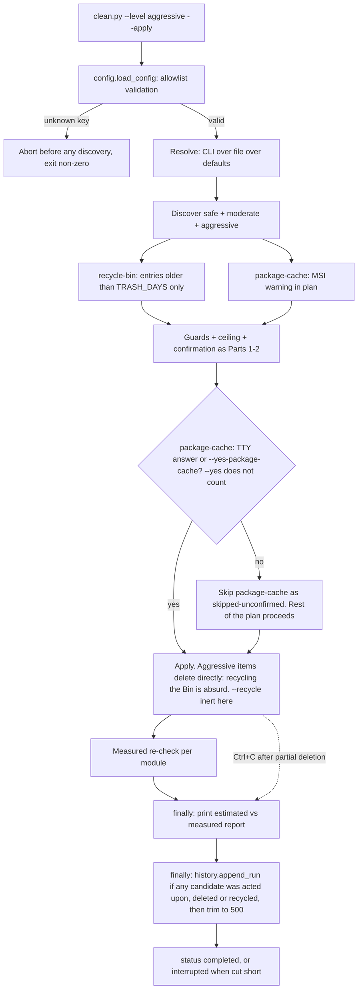

# Instruction: winclean Part 3 - `aggressive` level + config + history + measured report

## Feature

- **Summary**: Close the port of the sysclean model. Add the `aggressive` family (`$Recycle.Bin` per volume with a `--trash-days` age floor, the MSI Package Cache with its uninstall/repair warning), the allowlisted config file that resolves as *CLI > file > defaults* and can only ever **restrict**, the JSONL run history with `--history N`, and the estimated-vs-measured report that makes the tool auditable after the fact.
- **Stack**: `Python 3.13 (stdlib only)`
- **Branch name**: `feature/winclean/`
- **Parent Plan**: `./2026_08_04-winclean-master.md`
- **Sequence**: `3 of 3`
- Confidence: 8/10
- Time to implement: ~0.75 day

## Architecture projection

### Files to modify

- `scripts/winclean/registry_mod.py` - register the `aggressive` modules with their three declared properties (Phase 3 task 4), and extend `validate_names()` so an `--only` naming a module listed in the config's `DISABLED_MODULES` aborts non-zero before discovery (Phase 1 task 3). Additive: the check joins the unknown-name and above-the-level ones already there, so all three validation aborts stay in one function.
- `scripts/winclean/tests/test_registry_mod.py` - **extended, not replaced**: this part's two modules are added to the `discovery`, `needs_network` and `proc_guard` mapping tables created in Part 1 and already extended by Part 2.
- `scripts/winclean/clean.py` - resolve config before building the plan; write the history line from the **same `finally` block** that prints the report (master decision 17); declare `--history N`, `--trash-days`, `--config` and `--yes-package-cache` (the only new flags of this part — Part 1 owns every other one, including `--yes`, and none is re-declared here); print the measured-comparison report.
- `scripts/winclean/tests/test_clean.py` - extended, not replaced: the `aggressive` confirmation paths, the inert `--recycle`, and the history-write triggers are asserted here because the CLI lives in `clean.py`.
- `scripts/winclean/common.py` - add `measured: int | None` alongside `estimated` in `CleanResult`, and the comparison formatter. The field is **this part's**, unconditionally: Part 1 declares the initial set in `common.py` and reports estimated-vs-freed, which is enough for a level that always deletes directly. That set is **not** restated here — Part 2 already adds `locked_paths` to it, so any tuple written down in this file describes a `CleanResult` that no longer exists by the time this part is implemented, and the master refuses the same enumeration for the same reason. What carries over instead is the rule: byte counts are nullable and `None` is the package's only encoding of unmeasurable. `measured` only earns its place here, where recycling and external commands make "freed" and "removed" diverge. A conditional "if Part 1 did not already carry it" would leave the field's owner undecided and invite a duplicate.
- `scripts/winclean/README.md` - this part's additions to it; **Phase 4 task 4 is the authority on what they are**, including the deferred-reclamation loop of decision 18 with its closing command, which the three-item list that stood here did not mention.

### Files to create

- `scripts/winclean/config.py` - `load_config(path)`: read a JSON file, validate **every** key against an allowlist and every value against a type/range check, abort on the first unknown key or invalid value. Keys: `TRASH_DAYS`, `PROTECTED_PATHS`, `DISABLED_MODULES`, `MAX_DELETE_BYTES` — and no scope key. Default location `%APPDATA%\winclean\winclean.json`.
- `scripts/winclean/history.py` - `append_run(record)` writing one JSONL line to `%LOCALAPPDATA%\winclean\history.jsonl`, `read_runs(limit)`, `trim(max_lines=500)`.
- `scripts/winclean/mod_system.py` - `recycle-bin` (per-volume `$Recycle.Bin\<SID>`, entries older than `--trash-days`), `package-cache` (`%ProgramData%\Package Cache`).
- `scripts/winclean/winclean.json.example` - commented example config.
- `scripts/winclean/tests/test_config.py`, `tests/test_history.py`, `tests/test_mod_system.py`.

### Files to delete

- `none`

## Applicable rules

| Tool | Name | Path | Why it applies |
| ---- | ---- | ---- | -------------- |
| none | -    | -    | No rule surface present in the repo. |

## User Journey

## Risk register

| Risk | Impact | Mitigation |
| ---- | ------ | ---------- |
| Config file used to widen destruction | Silent data loss on a routine run | The allowlist holds **no key that widens a run** — none for `--apply`, the level or `--yes`, and none naming roots or scope (a `ROOTS` key existed and was removed in this part's Phase 1: it was the one key that added discovery targets, and choosing what to walk stays a per-invocation `--root`). `PROTECTED_PATHS` only adds protections; `MAX_DELETE_BYTES` and `DISABLED_MODULES` only restrict. Asserted by a test over the allowlist as a property, not as a list of three named keys |
| Config parsed as code | Arbitrary execution | JSON via `json.load`, never `eval`/`exec`/`import`. sysclean's "never sourced" rule, kept and made structural |
| Emptying the whole Recycle Bin ignoring `--trash-days` | User loses a file deleted five minutes ago | The deletion timestamp of each `$I`/`$R` **pair** compared to the age floor - not "per entry", which is the reading that makes each `$I` a candidate of its own and orphans every payload. Phase 3 task 1 owns the unit, the byte-level parse and the **three-step** fail-closed chain this row used to compress into "or `st_mtime` fallback": `$I` header, then the paired `$R`'s `st_mtime`, then **skip and report** - never assume old. Default `TRASH_DAYS` is non-zero; unit-tested with a recent entry that must survive |
| `$Recycle.Bin` of **another** user's SID | Deleting another account's data, or an access error | Only the current user's SID subfolder is a candidate, and that SID is resolved through the `ctypes` token chain of Phase 3 task 1 — never inferred by enumerating `$Recycle.Bin` subfolders. When resolution fails the module yields zero candidates (fail-closed). Other accounts' folders are not listed either: naming them would require reading a directory this run has no business in (non-elevated scope, frozen decision 6) |
| Package Cache purge breaks MSI repair/uninstall | Applications unrepairable | `aggressive` only, the MSI repair/uninstall warning carried in the plan text (Phase 3 task 2 states what it must say), listed in README as the single most consequential module. Its second confirmation is **not** answerable by `--yes` (master decision 4 caps `--yes` at two effects): it takes a TTY answer or the module-specific `--yes-package-cache`, otherwise this module alone is skipped as `skipped-unconfirmed` while the rest of the plan proceeds |
| History file grows unbounded | Disk noise from a disk cleaner | `trim(max_lines=500)` after each append (sysclean's `HISTORY_MAX`, kept) |
| History parsing brittle across versions | `--history` crashes on old lines | Each line parsed independently in a `try`; an unparseable line is skipped with a notice, never fatal |
| A concurrent run corrupts the JSONL | Interleaved partial lines | Single `open(..., "a")` write of one pre-serialised line (atomic enough for line-oriented appends on Windows); documented as best-effort, not transactional |
| Measured ≠ estimated confuses the user | Trust loss in the tool | Both are shown side by side with a delta; `null` (unmeasurable) renders as `—`, never as `0`. The row stopped there, which reads as a display rule and nothing more: the two figures must also come from **independent walks** (Part 1 Phase 2 task 5), since a `measured` derived from the estimate never disagrees with it and so reassures about nothing |
| An interrupted destructive run leaves no record | Data gone with no audit trail | Master decision 17: the history line is written from the **same `finally`** that prints the report, with `status: "interrupted"`; tested by interrupting after the first module |
| A user expects `moderate` to free space and finds the Bin full | "The cleaner does nothing" | `recycle-bin` is the documented closing step (master decision 18) and its plan text names the bytes not yet eligible under `TRASH_DAYS`; the `moderate` footer points here explicitly |
| A launcher action prints its plan into an invisible console | User believes nothing was found | Master decision 16: any `builtin-actions.json` entry must pass `--out <path>`, **absolute** - the launcher runs the child in `scripts/winclean/`, so a relative path writes the report into the package source tree; no `--apply` action is exposed to the UI. The `bundled_python_actions_reference_existing_scripts` count assertion is updated in the same change or `cargo test` fails |

## Implementation phases

### Phase 1: Config (`config.py`)

#### Tasks

1. `ALLOWED_KEYS` mapping each key to a validator (`TRASH_DAYS`: int ≥ 0, default **7**; `PROTECTED_PATHS`: list of absolute paths; `DISABLED_MODULES`: list of known module names; `MAX_DELETE_BYTES`: int > 0, default **50 GiB**). Defaults come from master decision 15 and are not re-opened here; the file may only lower `MAX_DELETE_BYTES` and raise `TRASH_DAYS`.

    **There is no `ROOTS` key, and its removal is the point.** It was in the allowlist and it was the one key that *widened* the blast radius instead of narrowing it, against the master's frozen mitigation "config can only restrict (disable modules, add protected paths, lower ceilings)". Concretely: master decision 15 narrowed the default root to the repo root alone because `%USERPROFILE%\Documents` is a cloud-synced personal vault on this machine, where a deletion replicates remotely and the Recycle Bin does not undo the remote side — and a `ROOTS` entry in a file would have handed that scope back to an unattended run, silently, with no flag typed. Choosing the trees to clean is a per-invocation act (`--root`), the same reasoning that keeps `--apply` and level escalation CLI-only. An unknown-key abort now covers `ROOTS` like any other rejected key, so an existing config carrying it fails loudly instead of being honoured.
2. Abort with a precise message on: unknown key, wrong type, out-of-range value, unknown module name in `DISABLED_MODULES`.
3. Resolution order: CLI flag > config file > default, **with no exception for `TRASH_DAYS`**. A config that raised the floor to 30 days is still overridden by `--trash-days 0` on the command line: if the file won, the closing command of master decision 18 would become a no-op again on any machine carrying such a config — the exact failure mode that decision exists to prevent. The asymmetry is deliberate and safe: raising the floor in a file protects *unattended* runs, while `--trash-days 0` is a typed, per-invocation act. `PROTECTED_PATHS` **unions** with `DEFAULT_PROTECTED` (never replaces it) — that one the CLI cannot undo, because it only ever adds protection.

    **`DISABLED_MODULES` is a protection too, so the CLI cannot undo it either — but it must say so.** It **unions** with `--skip`, and naming a disabled module in `--only` is a **non-zero error naming the config file and the key**, checked in `validate_names()` alongside the unknown-name and above-the-level checks, before any discovery. The three defensible readings had to be narrowed to one: letting the CLI win would make an unattended-safety setting defeatable by the flag most likely to be typed by hand; letting the file win *silently* would print "no module selected" and exit `0`, which reads as "nothing to clean" for a module the user explicitly asked for — the worst of the three, since it is indistinguishable from success. Erasing a module from the run is not the same kind of act as lowering a byte ceiling, which is why the scalar rule (CLI > file > default) does not extend to these two set-valued keys.
4. Write `winclean.json.example`.

#### Acceptance criteria

- [x] `test_config.py`: an unknown key aborts non-zero; `TRASH_DAYS: -1` aborts; `DISABLED_MODULES: ["nmp"]` aborts; `PROTECTED_PATHS` adds to and never removes from `DEFAULT_PROTECTED`; a missing config file is not an error. The allowlist is asserted to contain **no key that widens the run** — none for `apply`, level or `yes`, and none naming roots or scope: `{"ROOTS": ["D:\\"]}` aborts as an unknown key. Stated as a property over the allowlist rather than as three named keys, because the next key someone adds is the one a fixed list would not have covered.
- [x] `test_config.py`: with `TRASH_DAYS: 30` in the file, `--trash-days 0` on the CLI resolves to `0` — otherwise the decision-18 closing command would silently become a no-op wherever such a config exists.
- [x] `test_config.py` (set-valued keys are not scalars): with `DISABLED_MODULES: ["recycle-bin"]`, `--only recycle-bin` aborts **non-zero** with a message naming the config file and the key, before any discovery runs (asserted on a spy over the registry); `--skip pycache` with the same config disables **both** modules rather than replacing the list; and a plain run silently omits the disabled module without an error. A silent empty selection exiting `0` would be indistinguishable from "nothing to clean" for a module the user named explicitly.

### Phase 2: History (`history.py`)

#### Tasks

1. Record shape: `{"timestamp", "level", "status", "estimated_bytes", "freed_bytes", "recycled_bytes", "failed_bytes", "modules": {name: {"estimated": int|null, "measured": int|null}}}`. The four top-level byte fields are `int|null` on the same terms as the per-module pair - a total is `null` only when no module in the run could measure anything, which is reachable with a single `--only docker-light`. `timestamp` is **UTC ISO-8601 with a trailing `Z`**, the spelling this repo already uses for machine-written timestamps (see any plan's `created_at`): a local naive time is ambiguous twice a year and unsortable across a machine that changes zone, in a file whose only ordering is the one it was written in. There is deliberately **no `mode` field**: only runs that destroyed something are recorded, so it could hold nothing but `"apply"` — a constant column that invites a reader to filter on it and conclude that dry-runs are simply absent from this file rather than never written to it. `status` ∈ `{"completed", "interrupted"}` — `"completed"` when the apply loop ran to its end (locked files and `recycle-failed` included: those are outcomes, not interruptions), `"interrupted"` for a `KeyboardInterrupt` or an unhandled exception after the first byte was removed (master decision 17). A line is written whenever **any candidate was acted upon**, and this task is the authority on how that is decided: the apply loop **sets a flag when it attempts a removal**, and the flag is what `clean.py` tests in the `finally` block. The trigger is **not derived from the byte totals afterwards**, because the totals cannot answer the question. `freed` is `None` for an unmeasurable reclamation — Part 2's pathless `docker-light` after a successful `docker system prune -f` is the case that exists in v1 — so a totals-based rule either raises comparing `None` to `0` or, written defensively as `(freed or 0) > 0`, leaves the one module that can reclaim gigabytes as the one destructive run with no audit trail. The three figures are **evidence** of an attempt, not its definition: `freed > 0`, `recycled > 0`, a failure raised after removal had started, and an attempt whose bytes came back `None`. The trigger is deliberately not `freed > 0`: a `moderate` run recycles by default and therefore frees zero bytes (master decisions 5 and 18), so a `freed`-based rule would leave the most common destructive run unaudited. A run that touched nothing at all writes no line, and that set is defined by the rule rather than by a list of examples: every dry-run, every abort before the loop (a guard abort, a ceiling abort, any of the validation errors listed in Part 1 Phase 4 task 4 — unknown `--only`, `--only` above the level, a bad config key, a config-disabled `--only` — and a refused or unobtainable **level** confirmation), and also an `--apply` run in which **no candidate was removed**, every one of them having ended in some `skipped-*` status or in `no-undo`. That is stated as a rule over the whole family rather than as the four names it used to list, and the reason is on the record: Part 1 gained a fifth status, `skipped-running`, and this list did not follow it - which is precisely the failure the sentence above, "defined by the rule rather than by a list of examples", exists to prevent. Any status added later is covered without touching this task. That last one is the case an example list keeps omitting: the loop ran, yet nothing was destroyed, so there is nothing to audit. No third status is needed either — a refused *per-module* confirmation is not in that set, since the rest of the run acted (Part 1 Phase 4 task 4, the single authority on what exits non-zero). **No `skipped-*` status and no `no-undo` carries a field of its own** in the record - written as a pattern over the family, for the same reason as above, so that a status invented in a later part cannot silently acquire one: they surface in the printed report, and in the record they leave their module's `measured` at `null` when the module acted on nothing at all - nothing was touched, so nothing was measured (Part 1 Phase 2 task 5) - and, when part of the module acted, at a number covering only the candidates that did. Iteration 73 corrected the criterion in Phase 4 that summarises this rule and left this sentence, the one an implementer executes, saying "below its `estimated`": the second consecutive pass to fix a summary and not its imperative. Note what the record deliberately does **not** distinguish: a module partly skipped and a module partly blocked by locks both show a `measured` under their estimate, and no field is added to tell them apart - that is the printed report's job. `null` is not zero and is never rendered as such. The record answers "what was removed", the report answers "what was not and why"; duplicating the second into the first would grow the shape once per skip reason invented.
2. `append_run()` then `trim(500)`. **`trim` is positional and this task is its authority**: it keeps the last 500 **lines in file order** and never parses, sorts or filters to decide what to keep. Two reasons, and the first is the one that makes this a rule rather than a preference. `read_runs` is required to skip an unparseable line with a notice (task 3) - but `trim` is the step that *rewrites* the file, so a `trim` that parsed in order to sort by `timestamp` would silently drop exactly the lines `read_runs` was told to tolerate, and an audit trail that quietly loses records is worse than none. Second, a JSONL file appended to once per destructive run is already in chronological order, so sorting buys nothing and can only disagree with the file. The rewrite goes through a temp file **in the same directory** followed by `os.replace()`, so an interrupted `trim` cannot leave a truncated history - the one file whose job is to survive an interrupted run must not be destroyed by one.
3. `read_runs(limit)` parsing line by line, skipping unparseable lines with a notice.
4. `--history N` prints the last N runs in a compact table; `--history N --json` emits the raw records. It is a **query mode, not a run**: `clean.py --history 3` reads the file, prints, and exits `0` **without discovering anything and without touching a single path**. It is therefore mutually exclusive with `--apply` — passing both is an `argparse` error, not a run followed by a listing — and an absent or empty history file prints "no recorded run" and still exits `0`. Left unstated, the only flag that reads the audit trail of a destructive tool would be a flag that might also delete.

#### Acceptance criteria

- [x] `test_history.py`: a round trip preserves `null` vs `0`; `trim` caps at 500 keeping the last 500 **lines in file order**; a corrupted middle line is skipped without raising by `read_runs` **and survives a `trim`** - the file has 501 lines, one of them unparseable and not among the oldest, and after `trim` that line is still there; a dry-run appends **no** history line (only `--apply` runs are recorded). Without the survival half, a `trim` that sorted by `timestamp` would pass the cap assertion while deleting the records `read_runs` is required to tolerate.
- [x] `test_history.py`: an `--apply` run whose outcome is `freed = 0, recycled > 0` appends exactly one line with `status: "completed"` and the recycled total — a recycle-only run is a destructive run and must be auditable.
- [x] `test_history.py` (an unmeasurable removal is still a removal): an `--apply --only docker-light` run with prune patched to succeed appends **exactly one** `completed` line whose `freed_bytes` is `null`, and the round trip keeps it `null`. This is the criterion the totals-based trigger fails, in both of its reachable spellings: one raises on `None > 0`, the other writes nothing.
- [x] `test_history.py`: an `--apply` run whose every candidate was skipped (`skipped-gone` on a fixture removed between plan and apply) appends **no** line, so "the loop ran" is not the trigger — "something was destroyed" is.
- [x] `test_history.py`: an `--apply` interrupted after one module wrote appends exactly one line with `status: "interrupted"` and the partial `freed_bytes`; the line is well-formed and readable by `read_runs`.
- [x] `test_clean.py`: `--history 3` runs no discovery (asserted on a spy over the module registry), deletes nothing and exits `0`; `--history 3 --apply` is rejected by `argparse`; with no history file at all, `--history 3` prints "no recorded run" and exits `0`.

### Phase 3: `aggressive` modules (`mod_system.py`)

#### Tasks

1. `recycle-bin`: enumerate fixed volumes (`GetDriveTypeW` → `DRIVE_FIXED`, as Part 1's `can_recycle`), take only `$Recycle.Bin\<current SID>`, read each entry's `$I` sidecar for the deletion timestamp, keep only entries older than `TRASH_DAYS` (default **7**). **A candidate is a `$I`/`$R` pair, and this task is the authority on that unit** - the age floor is specified below to the byte offset, so the thing it gates must be specified too. A recycled item is stored as two siblings: `$I<id><ext>` holds the metadata, `$R<id><ext>` holds the payload and is a **directory** when a folder was recycled. Enumeration therefore walks the `$I*` files and derives each `$R` sibling by substituting the leading letter; it never treats a directory entry as a candidate in its own right.

    **The pair maps onto a one-`path` model, and this task says how, because `CleanCandidate` has a single `path` field (Part 1 Phase 1 task 2) and a unit of two paths does not fit it unaided.** The candidate carries the **`$R`** path: it holds the payload, it is what `dir_size_on_disk` sizes, and it is the member whose survival the user would notice. `recycle-bin` therefore supplies **its own `clean()`**, which removes the `$R` side through `remove.delete_tree()` and then the `$I` sibling derived from that same path by substituting the leading letter. Two consequences follow and both are deliberate. The `$I` path never goes through discovery or the guard chain: it is derived from a path that already passed both, in the same directory, differing by one character - so it inherits that verdict rather than being unchecked. And this module's `measured` legitimately **exceeds** its `estimated` by the sidecar bytes, which nothing may treat as an error: the estimate prices the payload, the run removes the payload and its metadata, and Phase 4 task 1 prints the delta without judging its sign. Emitting two candidates instead is the alternative this forecloses - it is the per-entry reading the paragraph above already refuses, and it would put the metadata in the plan as bytes of its own. Getting this wrong has a worst case that is worse than either mistake it is made of: iterating the folder blindly makes each `$I` a candidate of its own, so a run deletes a few hundred bytes of metadata per entry and leaves every `$R` behind - the shell then shows an **empty** Recycle Bin over gigabytes the user can no longer restore and has not recovered either, and the measured report reads as a success because the tiny amount it promised is exactly the tiny amount it freed. The `estimated_bytes` of a pair is the size of its **`$R` side** (`dir_size_on_disk` when that side is a directory), never the original-size field of the `$I` header: that field is a logical size, and for a recycled folder it does not describe what the volume gets back. Both members are removed in the same operation, **`$R` first, then `$I`**: an interrupted removal then leaves at worst a metadata stub the shell displays and fails to restore - visible, tiny, manually clearable - where the other order leaves an orphaned payload that is invisible to the UI and holds its bytes forever. A bare `$R` with no `$I` (left by an earlier crash or another tool) is **not** a candidate: it carries no deletion timestamp, so the fail-closed rule below already refuses it, and this enumeration never reaches it in the first place. That the fallback below speaks of "the paired `$R` entry" presupposed all of this; it is now stated where the enumeration happens. **The parse is specified here rather than left to the implementer, because getting it wrong fails in the dangerous direction.** The timestamp is a Windows `FILETIME` - 100-nanosecond ticks since 1601-01-01 UTC, little-endian - at byte offset **16** of the `$I` file, after an 8-byte format version (`2` on Windows 10 and later, `1` before) and the 8-byte original size. Read as a Unix epoch it yields a date in 1601, which reads as *very old*: the entry sails past the age floor and a file binned five minutes ago is destroyed - precisely the loss the floor exists to prevent, and a bug no test written around plausible dates would catch. So validate the version field, convert explicitly (`datetime(1601, 1, 1, tzinfo=UTC)` plus the ticks), and **fail closed**: a missing, truncated, unknown-version or implausible `$I` (a timestamp in the future, or older than the volume could plausibly be) falls back to the paired `$R` entry's `st_mtime`, and when that is unavailable too the entry is **skipped** and reported - never assumed old. The unit test covers both directions: a recent entry survives, and an entry whose `$I` is deliberately corrupt survives as well.

    The current SID is **resolved, never guessed**: one `ctypes` call chain — `advapi32.OpenProcessToken` (`TOKEN_QUERY`) → `GetTokenInformation(TokenUser)` → `ConvertSidToStringSidW` — behind a single helper returning `str | None`. If it returns `None`, the module yields **zero** candidates and says so in its plan text; it never falls back to enumerating every `$Recycle.Bin\S-1-5-*` folder it can read. Without a named mechanism the obvious implementation is that enumeration, and on a shared machine it deletes another account's trash — which is precisely what the acceptance criterion below forbids, so the mechanism belongs in the task and not only in the test. Failing closed is **sysclean**'s `have <bin> || return 0` — a bash idiom from the tool this package ports, and the same rule `docker-light` already follows via `requires="docker"`: an unresolvable precondition means the module does nothing, not that it widens its scope. It is deliberately not attributed to `deps_audit`, which is Python and does the opposite (it raises `FileNotFoundError` and the CLI exits non-zero on a missing prerequisite) — the two repo scripts are cited for different conventions and this one is not theirs.
2. `package-cache`: size `%ProgramData%\Package Cache`; attach the MSI repair/uninstall warning to the candidate `reason`. **This task is the authority on what that warning must say, because no plan file quotes its text and "verbatim" would otherwise instruct an implementer to copy a string that does not exist.** It must carry three facts: deleting this directory removes the cached MSI/MSP payloads Windows Installer needs, so a later **repair, modify or uninstall** of an affected product prompts for the original installer media or fails outright; those bytes are **not** locally regenerable - only re-downloading or re-running each vendor's installer restores them, which is why the module is `needs_network=False` yet still the most consequential one (nothing refills automatically, so there is nothing for `--offline` to protect); and the consequence **outlives the run**, unlike every other module here, which is what the second confirmation exists for. The wording is authored in French like all printed output (master decision 20), so the criteria that assert "the Package Cache warning" assert stable tokens - the literal path `%ProgramData%\Package Cache` and the module name - never a sentence.
3. Both are deleted directly, never recycled (recycling the Recycle Bin is nonsense). `--recycle` is therefore **accepted and inert** at `aggressive`, exactly as Part 1 made it inert at `safe`: the run states once that recycling does not apply at this level and proceeds with direct deletion. It is not an error — a global alias carrying `--recycle` must stay usable — and it is not honoured either, because master decision 4 makes `moderate` the only recycling level.
4. Declare the three per-module properties for both modules and extend Part 1's three registry-relative mapping tables in the same change, as Part 2 does — the fields have no default, so an omission is a `TypeError` at import rather than a silent classification. `ownership_rank` is not among them: it is derived from `registry_mod.py`'s `MODULE_ORDER` tuple, to which this part appends its two names.

    | Module | `discovery` | `needs_network` | `proc_guard` |
    | --- | --- | --- | --- |
    | `recycle-bin` | `fixed` | `False` | `None` |
    | `package-cache` | `fixed` | `False` | `None` |

    `needs_network=False` because nothing here refills from a registry (master decision 11). `proc_guard = None` because neither module queries `procs.is_running`: an MSI repair is broken by the **deletion itself**, not by a concurrent process, which is what the `package-cache` confirmation exists for. `recycle-bin` is `fixed` even though it enumerates volumes rather than resolving one documented path — the operative test is whether `--root` bounds the module, and it does not (the value is declared in `registry_mod.py`, Part 1 Phase 3 task 5, and read by the plan builder). Volume enumeration is a third shape of the same "outside your roots" fact, not a fourth discovery mode.
5. `recycle-bin` is the step that closes the deferred-reclamation loop of master decision 18 — but **only when invoked with `--trash-days 0`**. At its default 7-day floor it is a maintenance module and by construction ignores what a `moderate` run recycled minutes earlier. Its plan text therefore states which recycled items are **not yet eligible** (younger than `TRASH_DAYS`), how many bytes they hold, and that `--trash-days 0` is what makes them eligible now — so a user arriving from a `moderate` run reads why the Bin is not emptied *and* what to change.

#### Acceptance criteria

- [x] `test_mod_system.py`: a fake Bin with one recent and one old entry yields exactly the old one; another user's SID folder is never a candidate; the `package-cache` candidate carries the warning text.
- [x] `test_mod_system.py`: the old entry's candidate reports the size of its **`$R`** side (a recycled *folder* fixture, so the value can only come from `dir_size_on_disk` and not from the `$I` header), and after `clean()` **both** members of the pair are gone. Asserted on the `$R` side specifically: the failure this excludes is a run that deletes the metadata, reports the few hundred bytes it freed as a match, and leaves the payload orphaned in an apparently empty Bin.
- [x] `test_mod_system.py` (the pair is one candidate): the fake Bin's old entry produces **exactly one** candidate, whose `path` is the `$R` member, and the module's own `clean()` is what removes both - asserted by a spy showing the generic apply path was handed the `$R` path only. The count is the assertion: two candidates for one recycled item is the shape that puts metadata bytes in the plan and lets a partial run orphan a payload.
- [x] `test_mod_system.py`: a bare `$R` with no `$I` sibling yields **no** candidate - it cannot be dated, and an undatable entry is never assumed old.
- [x] `test_mod_system.py`: with the SID helper patched to return `None`, the module yields **zero** candidates and its plan text says why — the fail-closed branch of task 1, asserted because its failure mode is a module that quietly widens to every readable `$Recycle.Bin` subfolder.
- [x] `test_mod_system.py`: the plan text names the not-yet-eligible bytes when a recent entry was skipped, mentions `--trash-days 0` as the way to include them, and omits both when the Bin holds nothing recent.
- [x] `test_mod_system.py`: with `--trash-days 0`, an entry deleted seconds ago **is** a candidate — the flag is what closes the deferred-reclamation loop of decision 18, so its effect is asserted rather than assumed.
- [x] `test_mod_system.py`: with `GetDriveTypeW` patched to `DRIVE_REMOTE`, that volume contributes zero candidates.
- [x] `test_clean.py`: `--level aggressive --recycle --apply --yes` deletes directly and never calls `recycle()` (asserted on a spy), printing the "recycling does not apply at this level" notice and exiting `0` — the Recycle Bin is never routed into itself. The `--yes` is **required** in this command, not decoration: without it the level confirmation aborts non-zero on a non-TTY (Part 2 Phase 3 task 1), and the spy would then read "never recycled" because nothing ran at all — a criterion passing for the wrong reason.
- [x] `test_clean.py`: `--level aggressive --apply --yes` on a non-TTY skips `package-cache` as `skipped-unconfirmed` while the other `aggressive` modules still run, and the process exits **`0`** — declining a **per-module** confirmation skips that module and is a user choice, not a failure, and a non-zero exit here would make the tool unusable from any scheduled or piped context. Declining the **level** gate is the opposite case and does exit non-zero (Part 2 Phase 3 task 1), because nothing at all was cleaned; Part 1 Phase 4 task 4 draws that line once and is the single authority on what exits non-zero. The same invocation with `--yes-package-cache` includes the module.

### Phase 4: Measured report + wiring (`clean.py`, `common.py`, README)

#### Tasks

1. Compute, store and print `measured`. **Compute**: a module's `measured` is the **sum over its candidates** of `measure_freed()`, whose `before_bytes` is the per-candidate pre-operation measurement pinned by **Part 1 Phase 2 task 5** and never `estimated_bytes`; sum the **known** contributions and yield `None` only when not a single candidate produced a measurable figure - the fully-skipped module of Phase 2 task 1. **Print**: the estimated-vs-measured table, one row per module, with a delta column; `—` in the `measured` cell whenever it is `None`, **and `—` in the delta cell with it**. A `None` measured has no delta, and the only other value within reach is `estimated - 0`, which prints the module's entire estimate as a shortfall - the table would then say "nothing was recovered" about a module the record says was never attempted, which is the confusion iterations 73 and 74 removed from the record and would have left standing in the report. **And emit it**: `to_json_payload()` carries `estimated` and `measured` per module, exactly the two fields the history record of Phase 2 task 1 already holds, so a reader computes the delta and no third representation of it exists. `None` is JSON `null` there - never `—`, which is the text rendering, and never `0`. Stated because this part is the estimated-vs-measured report and, without it, that report exists only in the human table: `--json --out <path>` is the only output a launcher-spawned run can surface (master decision 16, task 5 below), so the part's headline deliverable would be missing in the one mode the UI can read - the same omission iteration 77 found in Part 2's failure lists, on the figure this part exists for. Free space per touched volume is already printed by Part 1, before and after, and is not repeated here. Three things this task spells out because each had a wrong answer within reach. It is a **sum** because `measure_freed` is per-candidate while a module has several: "the value returned by `measure_freed()`", as this task read until iteration 74, prescribes one call per module - a second walk of a root already walked candidate by candidate, with nothing to say about a module whose candidates share no root. It comes from a **pre-operation walk and never the estimate** because, fed from the estimate, the two columns of this very table hold the same number and the delta is always `0`: the report's entire purpose deleted with every criterion still green. And the delta is **rendered, not derived**, when there is nothing to compare.
2. Wire `--config`, `--trash-days`, `--history N`, `--yes-package-cache`, and the second confirmation specifically for `package-cache`. **`--yes` does not answer it** — master decision 4 gives `--yes` exactly two effects and this is neither, so a blanket `--yes` must not purge the MSI cache. Only an interactive answer on a TTY, or the module-specific `--yes-package-cache`, does. Without either (typically a non-TTY caller passing `--yes`), `package-cache` alone is **skipped** and reported as `skipped-unconfirmed`; the rest of the run proceeds normally rather than aborting, because one unconfirmable module must not cancel the whole plan.
3. Write the history line **inside the same `finally` block that prints the report** (master decision 17), not after it: `status: "completed"` when the apply loop ran to its end, `"interrupted"` on `KeyboardInterrupt` or an unhandled exception after the first byte was removed. **Which runs write a line is decided in Phase 2 task 1 and not re-decided here**: this task only calls `append_run()` where that rule says to. Restating the set was already producing two lists that had drifted apart. A history write that fails is reported as a warning and never masks the report.
4. Finish `README.md`: full config reference, history format and location, the aggressive warnings, the deferred-reclamation loop (decision 18) with `recycle-bin --trash-days 0` as its closing step — the flag spelled out, since the command without it is a no-op on freshly recycled bytes — and the explicit list of what winclean deliberately does **not** do (WinSxS, Windows Update, shadow copies, `hiberfil.sys`, `.vhdx`, anything requiring elevation).
5. **Optional, separate product decision (master decision 16)** — wiring winclean into `config/builtin-actions.json`. Launcher-spawned actions carry `CREATE_NO_WINDOW` (set in `build_command()`, `src/windows/process.rs`), so a plan printed to stdout is invisible: any such action must pass `--out <path>` and the UI must surface that file. **That path must be absolute.** `resolve_action()` sets the child's working directory to the script's own parent (`script_path.parent()`, applied by `build_action_command()` through `current_dir`), so a relative `--out` resolves inside `scripts/winclean/` - the report would be written into the package source tree, overwritten on every run, and would sit where a `git status` notices it. This is the same verified fact that forbids `Path.cwd()` as the default root (Part 1 Phase 4 task 3); it has two consequences and this is the second. Note that `bundled_python_actions_reference_existing_scripts` in `src/windows/process.rs` asserts an **exact count** of `@python` actions; adding one requires updating that assertion in the same change. Neither the count nor a line number is written here — the test is its own authority and a figure copied into a plan is wrong as soon as an unrelated action lands (master decision 16 states the same refusal). Do **not** add a `--apply` action: destruction stays terminal-only.

#### Acceptance criteria

- [x] `python scripts/winclean/clean.py --level aggressive` prints all three levels, the Bin age floor in effect, the Package Cache warning, and deletes nothing.
- [x] `python scripts/winclean/clean.py --apply --only pycache --root <fixture>` — where the fixture is a tree **prepared to hold at least one `__pycache__`** — appends exactly one JSONL line; `--history 1` shows it. The fixture is part of the criterion, not setup detail: Phase 2 task 1 makes "something was destroyed" the trigger, so the same command against an already-clean tree correctly appends **nothing** — an implementer running it there would either read the criterion as failing on correct code or add a line for a run that destroyed nothing. Same qualifier as this part's `success_condition` and the master's final checkpoint carry.
- [x] `test_clean.py` (independence of `measured`, Part 1 Phase 2 task 5): a candidate whose tree **grows between the plan and the apply** reports a `measured` above its `estimated` and a **non-zero** delta. The growth is the whole assertion - with `before_bytes` taken from the plan the delta is `0` for every fully removed candidate, so a fixture of constant size cannot tell an audited number from a copied one, which is how the estimate stayed a legal source for the column that audits it.
- [x] `test_clean.py` (a `None` measured prints as `—` in **both** cells): a run in which one module acted and another was skipped in full prints the skipped module's `measured` and its delta as `—`, while the acting module's delta is a number. Both cells are asserted because a delta computed as `estimated - 0` passes any assertion aimed at the `measured` cell alone, and it makes the report contradict the record it was written from - "not attempted" there, "nothing recovered" here.
- [x] `test_clean.py` (the comparison is emitted, not only printed): the same run as the criterion above, under `--json`, produces a payload carrying `estimated` and `measured` per module, with JSON `null` - not `0` and not the string `—` - for the module that acted on nothing. Asserted on the payload because the text table and the payload are built by different code, and only the payload survives `--out` under a launcher.
- [x] A config file with an unknown key makes any invocation abort non-zero **before** discovery output appears.
- [x] An `--apply` run interrupted with Ctrl+C after the first module appends exactly one line with `status: "interrupted"`, and the partial report is still printed.
- [x] A run that destroyed nothing appends **no** history line — the trigger is stated once in Phase 2 task 1 and this criterion only samples it: one test per family it names (an abort before the loop, and an `--apply` run whose every candidate was skipped). Two runs are explicitly *not* on that list and each has its own assertion: a recycle-only run writes a line with `freed = 0`, and a run whose `package-cache` was `skipped-unconfirmed` while other modules deleted still writes a line. What that second line contains is **not** a mention of the skip — Phase 2 task 1 gives skipped candidates no field in the record — but `package-cache` with `measured: null`, rendered `—` in the table, while every module that acted carries a **non-null** number. Two things this criterion must not say, both of which it did say until iteration 73. It must not expect a *smaller number* for the skipped module: nothing was touched, so nothing was measured (Part 1 Phase 2 task 5), and a number below the estimate is the signature of a candidate that was attempted and partly prevented — the locked-file case, which is the one outcome a reader most needs to tell apart from a skip. And it must not require the acting modules to **match** their estimate: since iteration 70 the two figures come from independent walks at different moments, so equality is not a property of a correct run, and a criterion demanding it hands an implementer a reason to source `measured` from `estimated` — reopening precisely the defect that iteration closed. Assert non-null, never equal. Asserted this way round for the original reason too: demanding the record "name the skip" would push an implementer to add the very per-reason field the record shape refuses, and the reason belongs to the printed report.
- [ ] If task 5 is executed: `cargo test bundled_python_actions_reference_existing_scripts` passes with the updated count, and the added action passes an **absolute** `--out` path - relative would land in `scripts/winclean/`, since that is the working directory `resolve_action()` gives the child.
- [x] `python -m unittest discover -s scripts/winclean/tests -v` exits 0.

## Amendments

### 2026-08-04 — 🤖 shadow-areas pass

Amended after `aidd_docs/tasks/2026_08/2026_08_04-winclean-master-shadow-report.md`. Changes made here:

- **History moved into the `finally` block** (master decision 17), where the report is already printed. `status` reduced to `{"completed", "interrupted"}`; a run that deleted nothing writes no line — the earlier `"aborted"` state overlapped with `"interrupted"` and is gone.
- `TRASH_DAYS` default pinned at **7** and `MAX_DELETE_BYTES` at **50 GiB** (master decision 15); the config file may only lower the ceiling and raise the age floor.
- `recycle-bin` documented as the **closing step of the deferred-reclamation loop** (master decision 18): its plan text names the bytes not yet eligible, which is what a user coming from a `moderate` run needs to read.
- Fixed-volume detection aligned on Part 1's `GetDriveTypeW` / `DRIVE_FIXED` instead of a prefix heuristic.
- Added an **optional** launcher-integration task (master decision 16) with its three constraints: `--out <path>` mandatory because `CREATE_NO_WINDOW` hides stdout, the exact-count assertion in `bundled_python_actions_reference_existing_scripts` updated in the same change, and no `--apply` action exposed to the UI.

### 2026-08-04 — 🤖 challenge pass (iteration 1)

Amended after `/aidd-refine:02-challenge` on the master plan. Changes made here:

- **`--trash-days 0` made explicit wherever `recycle-bin` is called the closing step** of the deferred-reclamation loop, with two tests: the plan text must mention the flag, and the flag must actually make a seconds-old entry eligible. At the default 7-day floor the module cannot close that loop — the previous wording promised a resolution the default configuration silently refused.
- **`aggressive` deletes directly, never recycles** — restated in line with the tightened master decision 4, so `moderate` is the single recycling level and the footer of Part 2 is the only place the loop is announced.
- `git diff --quiet HEAD -- scripts/system_inventory` in the validation flow, so a staged modification of the imported package is caught too.

### 2026-08-04 — 🤖 challenge pass (iteration 4)

- **`package-cache`'s second confirmation given an owner**: not `--yes` (master decision 4 caps it at two effects), but a TTY answer or the module-specific `--yes-package-cache`. With neither, that module alone is skipped as `skipped-unconfirmed` and the rest of the plan proceeds — one unconfirmable module must not cancel a whole run, and a blanket `--yes` must not purge the MSI cache.
- **`--recycle` declared inert at `aggressive`**: honouring it would route the Recycle Bin into itself. Same treatment as Part 1 gave it at `safe` — accepted, stated once, not honoured.
- **CLI beats a config-raised `TRASH_DAYS`**, with a test. If the file won, `--trash-days 0` would be a no-op wherever such a config exists, and decision 18's closing command would silently stop working again. `PROTECTED_PATHS` remains the one key the CLI cannot undo.
- **History trigger changed from "deleted something" to "acted on any candidate"**: a `moderate` run recycles by default and frees zero bytes, so the previous rule left the most common destructive run with no audit line. A recycle-only run now writes one, asserted by a test.

### 2026-08-04 — 🤖 challenge pass (iteration 5)

- **A skipped `package-cache` exits `0`**, asserted. The iteration-4 fix invented a `skipped-unconfirmed` outcome without saying what the process returns; read as an error it would make the tool unusable from any piped or scheduled context. The authoritative list of non-zero causes lives in Part 1 Phase 4 task 4.
- **New flags of this part enumerated exhaustively** in "Files to modify" (`--history N`, `--trash-days`, `--config`, `--yes-package-cache`), with `test_clean.py` named as extended rather than replaced — `--yes-package-cache` was introduced in the prose without ever being added to the part's flag inventory.
- **Skipped candidates given a stated home**: the printed report, not the history record shape. They leave `measured` below `estimated` and carry no field of their own, so inventing a skip reason never grows the record.

### 2026-08-04 — 🤖 challenge pass (iteration 6)

- **`--history N` pinned as a query mode.** It had been declared as a flag and demonstrated in the validation flow without anyone saying whether it ran the tool: reading a destructive tool's audit trail could plausibly have discovered, or deleted. It now reads the file, prints, exits `0`, discovers nothing and touches no path; it is mutually exclusive with `--apply` at the `argparse` level, and an absent or empty file prints "no recorded run" and still exits `0`. Three criteria assert it, one of them on a spy over the module registry.
- **The mermaid's `L` node still read `if anything was deleted`**, the trigger iteration 4 replaced with "acted upon" precisely so a recycle-only run gets an audit line. Relabelled — the diagram was contradicting the task text two sections above it.
- `no-undo` and `skipped-unconfirmed` now defer to Part 1's single "a skip is never an error" rule rather than restating an exit code per outcome.

### 2026-08-04 — 🤖 challenge pass (iteration 7)

- **The inert-`--recycle` criterion would have passed for the wrong reason.** `--level aggressive --recycle --apply` carries no `--yes`, so on the non-TTY a unittest runs in, the level gate aborts non-zero and nothing executes — at which point the "never called `recycle()`" spy is trivially green while the "exits `0`" assertion fails. `--yes` added, and the trap recorded beside it so it is not dropped again as noise.

### 2026-08-04 — 🤖 challenge pass (iteration 8)

- **"A declined confirmation is a user choice, not a failure" was too general and contradicted Part 2.** Declining a **per-module** confirmation (`package-cache`) skips it and exits `0`; declining the **level** gate aborts the whole run non-zero, because nothing was cleaned and reporting success would lie to the caller. Both statements of the non-zero list in this file now defer to Part 1 Phase 4 task 4, which enumerates the five causes and draws that line once.
- **`measured` stops being conditional.** "Add it to `CleanResult` if Part 1 did not already carry it" left the field's owner undecided, which is how a duplicate gets written. It is this part's field: Part 1 always deletes directly and estimated-vs-freed suffices there, while recycling and external commands make "freed" and "removed" diverge here.

### 2026-08-04 — 🤖 challenge pass (iteration 10)

- **This part registered two modules without declaring any of the per-module properties.** `discovery`, `proc_guard` and `needs_network` have no default precisely so an omission fails the suite — so as written, Part 3 broke the tests Part 1 and Part 2 had just been fixed to enforce. Both modules are now declared in a table (both `fixed`, `needs_network=False`, `proc_guard = None`) and `test_registry_mod.py` is listed as extended. Third occurrence of the same drift in three passes: a property added in one part and not carried into the others.
- **`recycle-bin` is `fixed` although it enumerates volumes.** Neither "walks under the roots" nor "resolves one documented per-user path" describes it literally, and the operative test is stated instead: `--root` does not bound it. Volume enumeration is a third shape of "outside your roots", not a fourth discovery mode — worth writing down before an implementer invents one.

### 2026-08-04 — 🤖 challenge pass (iteration 11)

- **The declared set is `discovery` / `proc_guard` / `needs_network`**, matching this part's table columns; `ownership_rank` is derived from `registry_mod.py`'s `MODULE_ORDER` tuple, to which this part appends its two names and declares nothing. The previous wording named `ownership_rank` among the three declared properties while the table omitted it — an omission that, the field having no default, would have been an import-time failure.

### 2026-08-04 — 🤖 challenge pass (iteration 14)

- Suggestion applied: **"refused confirmation" is qualified as the *level* confirmation** in the two places the history rule is stated. The two refusals have opposite consequences — the level gate cancels the run, a per-module refusal lets it finish — so an unqualified "refused confirmation" reads as forbidding the history line for the most common destructive run there is. The per-module case is now named on both sides, and the criterion asserts it.

### 2026-08-04 — 🤖 challenge pass (iteration 15)

- **`DISABLED_MODULES` versus `--only` was never decided.** The resolution order was written for scalars (`TRASH_DAYS`, `MAX_DELETE_BYTES`); applied to a set of module names it left three defensible outcomes, the worst of which — the file wins silently, "no module selected", exit `0` — is indistinguishable from "nothing to clean" for a module the user typed by hand. Same class as the `--only`/`--level` blocker of the shadow-areas pass. Decided: `DISABLED_MODULES` is a protection like `PROTECTED_PATHS`, so it unions with `--skip` and the CLI cannot undo it, but naming a disabled module in `--only` is a **non-zero error naming the file and the key**, checked in `validate_names()` before discovery. Part 1's five-cause enumeration gained it under "validation error" in the same pass.
- Third occurrence of the unqualified "refused confirmation", in the history record shape — corrected, along with adding the config-disabled abort to the list of runs that write no line.

### 2026-08-04 — 🤖 challenge pass (iteration 19)

- **Two stale `Phase 4 task 3` pointers.** The `recycle-bin` discovery-mode rationale credited the classification to Part 1's plan builder instead of `registry_mod.py` (Part 1 Phase 3 task 5), and the history-record rule cited an unqualified "Phase 4 task 3" that reads as *this* part's Phase 4 while meaning Part 1 Phase 4 task 4, the authority on the five non-zero causes. Both qualified.

### 2026-08-04 — 🤖 challenge pass (iteration 22)

- Suggestion applied: **the history's "writes no line" list said "only" while being incomplete.** It omitted a guard abort, three of the four validation errors, and — the one that matters — an `--apply` run whose every candidate was skipped. The operative rule ("something was destroyed") already gave the right answer, but a list claiming exhaustiveness invites an implementer to follow the list. Replaced by the rule plus the skipped-everything case, with a criterion asserting no line is written for it.

### 2026-08-04 — 🤖 challenge pass (iteration 23)

- **The rule iteration 22 had just fixed existed in a second copy.** Phase 4 task 3 (the wiring) re-enumerated which runs write a history line, and its list was the pre-iteration-22 one — so the two statements now contradicted each other inside the same file. Fixed the way the same family was fixed at iterations 12/15/19: one authority (Phase 2 task 1, which owns `history.py`) and one reader (Phase 4 task 3 calls `append_run()` where that rule says to, and re-decides nothing). Phase 4's matching criterion stopped enumerating "the three abort paths" and now samples the families the authority names, so extending the rule can no longer leave a criterion behind.

### 2026-08-04 — 🤖 challenge pass (iteration 24)

- Three pointers in this file described Part 1 Phase 4 task 4 as enumerating "the five non-zero causes". That list gained a sixth entry — the interrupted run this part already stamps `status: "interrupted"` — so the pointers now name the authority without counting its entries.

### 2026-08-04 — 🤖 challenge pass (iteration 28)

- **This part's `success_condition` still promised a history line for any `--apply` run.** Iteration 22 made "something was destroyed" the trigger and iteration 23 removed the duplicated list, but the frontmatter — read first by anyone opening the file, and the sentence a reviewer checks the part against — kept the pre-22 wording. Qualified to an `--apply` run that actually removed or recycled something. The master's final checkpoint carried the same sentence and was fixed in the same pass.

### 2026-08-04 — 🤖 challenge pass (iteration 30)

- **The config allowlist carried a key that widened the run.** `ROOTS` (a list of directories, in `ALLOWED_KEYS` since the first draft) let a file add discovery roots, while the master's frozen mitigation says config can only restrict and decision 15 had just narrowed the default root to the repo alone — because `%USERPROFILE%\Documents` is a cloud-synced vault where deletions replicate remotely and the Bin does not undo the remote side. The key also had no stated resolution rule against `--root` and no criterion of its own, so it was widening the blast radius unspecified and unasserted. Removed; the unknown-key abort now covers it, and the allowlist criterion asserts the *property* (no key widens the run) instead of naming three keys.

### 2026-08-04 — 🤖 challenge pass (iteration 31)

- The `measured` field's justification quoted Part 1's `CleanResult` as including an `unmeasurable` boolean, which Part 1 dropped this pass — this part was the reason it could not stay, since `measured: int | None` beside a flag gives two answers to "was this measured?", and this part's own report reads the number (`null` renders `—`). The quoted shape is updated; `measured` remains this part's field.

### 2026-08-04 — 🤖 challenge pass (iteration 32)

- **A fourth copy of the "any `--apply` writes a history line" claim survived iteration 28.** The frontmatter `success_condition` and the master's final checkpoint were qualified then, but Phase 4's own criterion — `--apply --only pycache --root <repo>` "appends exactly one JSONL line" — was not, and neither was validation-flow step 3. Against an already-clean repo, correct code appends nothing (Phase 2 task 1: "something was destroyed" is the trigger), so both would have failed correct code or pushed an implementer to log a run that destroyed nothing. Both now name the prepared fixture as part of the check. Qualifying three of four copies is how the fourth becomes the authority by accident.

### 2026-08-04 - challenge pass (iteration 36)

- Two residues of earlier passes, both in this part. Iteration 33 stripped the literal `python_actions.len() == 14` and the `process.rs:373` pin from master decision 16, on the grounds that a copied figure is wrong the day an unrelated `@python` action lands; this part still carried both, in Phase 4 task 5 **and** in the risk register. Now they name `build_command()` and `bundled_python_actions_reference_existing_scripts` and let the test hold its own count. A rule fixed in one file and left standing in another is the same duplication failure as any other, and the copy that survives is the one someone reads.
- `recycle-bin` was told to take `$Recycle.Bin\<current SID>` without naming how the SID is obtained, while an acceptance criterion asserted another user's folder is never a candidate. Stdlib offers no direct call, so the obvious implementation is enumerating every readable `S-1-5-*` subfolder - which on a shared machine deletes another account's trash. Task 1 now names the `ctypes` chain (`OpenProcessToken` / `GetTokenInformation(TokenUser)` / `ConvertSidToStringSidW`) and, when it yields nothing, makes the module fail **closed** with zero candidates, asserted by its own criterion. A guarantee stated only as a test outcome is a guarantee nobody implements.

### 2026-08-04 - challenge pass (iteration 37)

- The `common.py` line restated Part 1's `CleanResult` as a five-field tuple to justify owning `measured`. Part 2 adds `locked_paths` to that same record, so the tuple was already wrong for the file that wrote it - the fourth time an enumeration in these plans described a sibling's state as of a phase that is not the one being read. It now points at Part 1 as the declaring site and keeps only the nullability rule.
- The history record carried a `mode` field. Nothing but destructive runs are ever written, so `mode` could only ever be `"apply"` - and a constant column is worse than no column, because a reader filtering on it concludes dry-runs are missing from the file rather than never written to it. Dropped, with the reason stated where the shape is defined.
- Suggestion applied: the SID row of the risk register promised other accounts' folders would be "reported as out-of-reach", which no task implements and which the fail-closed rule just added contradicts - reporting them means reading them. The mitigation now describes the mechanism that exists.

### 2026-08-04 - challenge pass (iteration 38)

- One deal-breaker, and it is the record-shape rule contradicting its own acceptance criterion. Phase 2 task 1 states that skipped candidates carry **no field of their own** in the history record - they show up as a `measured` below its `estimated`, and the reason lives in the printed report. Phase 4's criterion nonetheless required the line of a partially-skipped run to "name that skip", which is a per-reason field by another name and would have been implemented as one. The criterion now asserts the shape the record actually has. A rule and a test that disagree are resolved by whichever the implementer reads last, and that is always the test.

### Amendment - challenge pass (iteration 46)

- **A convention was attributed to the wrong tool, and to one that does the opposite.** The `recycle-bin` fail-closed rationale cited "`deps_audit`'s `have <bin> || return 0`". That is a bash idiom belonging to **sysclean**, the tool this package ports; `scripts/deps_audit/audit.py` is Python, contains no such guard, and handles a missing prerequisite by raising `FileNotFoundError` so the CLI exits non-zero - the inverse of doing nothing quietly. An implementer who followed the citation to its stated source would have found a precedent for aborting, not for yielding zero candidates.
- Verified against the repo rather than reasoned about: `deps_audit --check` (cited in Part 1) does exist and does fail on findings, so that citation stands. Only the fail-closed one was wrong, and it now names sysclean plus the in-package precedent that actually exists (`docker-light`'s `requires="docker"`).

### Amendments from the challenge pass (iteration 49)

- **"Warning printed verbatim" given a referent** (Part 3 Phase 3 task 2, now the single authority; the flow node, the risk row and master risk row 155 stop using the word). The phrase appeared four times and no plan file ever quoted a warning string, so "verbatim" told an implementer to copy something that did not exist, and three acceptance criteria asserted the presence of a message whose content was undefined. Task 2 now states the three facts the warning must carry - the cached MSI/MSP payloads go, so a later repair/modify/uninstall prompts for installer media or fails; the bytes are not locally regenerable; the consequence outlives the run, which is why the second confirmation exists - and, per decision 20, notes that the criteria assert stable tokens (the literal path, the module name) rather than a sentence.

### Amendments from the challenge pass (iteration 50)

- **Two repo claims verified true, one count residue removed.** Decision 16's premise checks out (`src/windows/process.rs` line 373 applies `creation_flags(CREATE_NO_WINDOW)` on every spawn) and so does the assertion it warns about (`bundled_python_actions_reference_existing_scripts` pins an exact `@python` count). Nothing to change there. But Part 3's shadow-report amendment entry still phrased that constraint as "the `python_actions.len() == 14` assertion", which is the figure decision 16 refuses to write and the **third** site it has had to be removed from - and unlike the historical mentions in this master, that line reads as a live constraint rather than as a quote of something deleted. It now names the test and lets the test hold its own count.

### Amendments from the challenge pass (iteration 52)

- **The `$I` timestamp parse is now specified** (Phase 3 task 1). The task said "read each `$I` header for the deletion timestamp" and the risk register leaned on that timestamp as the whole defence of the age floor - with no offset, no encoding and no version check. The value is a Windows `FILETIME` at offset 16; read as a Unix epoch it yields **1601**, which reads as *very old*, so a file binned five minutes ago sails past `TRASH_DAYS` and is destroyed. That is the exact loss the floor exists to prevent, and no test written around plausible dates would catch it. The parse, the version check, the explicit conversion and a **fail-closed** rule are now stated (corrupt or implausible metadata falls back to the paired `$R` file's `st_mtime`, then skips the entry - never assumes old), with a corrupt-`$I` case added beside the recent-entry one in the unit test.

### 2026-08-04 - challenge pass (iteration 55)

- **The optional launcher wiring required `--out` without requiring it to be absolute** (Phase 4 task 5, its risk row, its criterion). `resolve_action()` gives the child `script_path.parent()` as its working directory, so a relative `--out` resolves inside `scripts/winclean/`: the report lands in the package source tree and is overwritten on every run. The flag that exists precisely because `CREATE_NO_WINDOW` hides stdout would have written its file where nobody looks for it and where `git status` reports it. Same verified fact that forbids `Path.cwd()` as the default root in Part 1 - this is its second consequence, and it had no reader until now.

### 2026-08-04 - challenge pass (iteration 58)

- **`trim(500)` had no stated semantics, and the plausible wrong one destroys audit records.** Task 3 requires `read_runs` to skip an unparseable line with a notice; task 2 is the step that rewrites the file. A `trim` that parsed the lines in order to sort them by `timestamp` - a reading nothing excluded - would silently drop precisely those tolerated lines, and it would still satisfy the old criterion, which only checked the cap. `trim` is now positional by rule (last 500 lines in file order, no parse, no sort), its rewrite goes through a same-directory temp file plus `os.replace()` so an interrupted trim cannot truncate the one file meant to survive interruptions, and the criterion now asserts that an unparseable line survives a trim.
- `timestamp` is pinned to **UTC ISO-8601 with `Z`**, the spelling the repo already uses for machine-written timestamps. A naive local time is ambiguous twice a year and unsortable across a zone change, in a file whose only ordering is the order it was written in.

### 2026-08-04 - challenge pass (iteration 59)

- **The Recycle Bin's age floor was specified to the byte offset while the unit it gates was not.** Task 1 said "read each entry's `$I` sidecar", leaving "entry" to the implementer - and the obvious reading, one candidate per directory entry, makes each `$I` a candidate on its own. That run deletes a few hundred bytes of metadata per item and orphans every `$R` payload: the shell shows an **empty** Bin over gigabytes that are no longer restorable and were never reclaimed, and the estimated-vs-measured report calls it a success because the tiny figure it promised is the tiny figure it freed. Strictly worse than either half of the mistake. Task 1 now owns the pair as the unit (walk `$I*`, derive the `$R` sibling), sizes the candidate from the **`$R`** side via `dir_size_on_disk` rather than the `$I` header's logical original-size field, removes `$R` **before** `$I` so an interruption leaves a visible metadata stub rather than an invisible orphaned payload, and excludes a bare `$R` as undatable. Three criteria, one of them a recycled-*folder* fixture so the size can only come from the payload.
- The existing fallback already said "the paired `$R` entry's `st_mtime`", so the pair model was presupposed by the safety rule and never stated by the discovery rule - the same authority gap as iteration 58, one field lower.

### 2026-08-04 - challenge pass (iteration 63)

- **The Recycle-Bin risk row restated iteration 59's rule in the unit iteration 59 had just refused.** It read "Per-entry `$I` metadata timestamp" - and *per entry* is precisely the reading that deletes metadata, orphans payloads, and reports success. The row now names the `$I`/`$R` **pair** and says what "per entry" would cost, so the wrong unit cannot be reintroduced from the table.
- **It also compressed a three-step fail-closed chain into a two-step one.** "(or `st_mtime` fallback)" drops the third step, which is the safety-critical one: when neither the `$I` header nor the paired `$R`'s `st_mtime` is usable the entry is **skipped and reported**, never treated as old. A mitigation that stops at the fallback tells an implementer the fallback is the floor. The row now points at Phase 3 task 1 for the parse and names all three steps.
- Checked and clean in the same sweep: the history row's `trim(max_lines=500)` mitigation is still accurate after iteration 58 (the cap is what bounds growth; `trim`'s positional semantics are task 2's business, not this row's), and the SID row already cites Phase 3 task 1 as its authority rather than paraphrasing the token chain. Recorded so a later pass does not re-open them.

### 2026-08-04 - challenge pass (iteration 66)

- **The README bullet predated decision 18.** "Config reference, history format, aggressive-level warnings" omits the deferred-reclamation loop and its closing `recycle-bin --trash-days 0` command, which task 4 requires and which is the documented answer to "the cleaner freed nothing". Now points at Phase 4 task 4.
- Fourth and last summary surface swept: risk tables (63), flowcharts (64), file-list module bullets (65), README bullets (66). All four carried copies of rules amended elsewhere; all four now cite their authority instead.

### 2026-08-04 - challenge pass (iteration 67)

- **A status added in iteration 64 was not propagated to the two places that enumerate the status set.** Task 1 defined the no-history-line case as "every candidate ended `skipped-gone`, `skipped-changed`, `skipped-unconfirmed` or `no-undo`" and, a few lines later, listed the same four as the statuses carrying no field of their own. Part 1 now has a fifth, `skipped-running`, so both lists were incomplete: a run where every candidate was skipped because a build was in progress fell outside the stated set, leaving whether it is audited to inference, and the new status had no stated treatment in the record shape at all.
- The sharper point is that this task already contained its own diagnosis. It says the set is "defined by the rule rather than by a list of examples" - and then gives a list. Both are now rules over the family (`skipped-*` plus `no-undo`), which closes them under any status a later part invents. This is the same class as iteration 62 and 66: an amendment applied to one document and not to the summaries of it, this time with my own iteration-64 addition as the amendment.
- Checked and clean in the same sweep: Part 1's "a skip is never an error" sentence and its non-zero cause list are unaffected - a skip has never been a cause of non-zero exit, so adding a fifth skip status does not touch them - and no report or `--out` specification enumerates statuses. Recorded so a later pass does not re-open it.

### 2026-08-04 - challenge pass (iteration 70)

- **This part's headline deliverable was satisfiable by a table comparing a number with itself.** Task 1 said "re-measure and store `measured`" without naming the input of the function that produces it, and Part 1's `measure_freed(before_bytes, path)` returns `before_bytes` unchanged whenever the path is gone - the normal successful case. With `before_bytes` read off the plan, `measured == estimated` on every removed candidate and the delta column is structurally `0`. Nothing in the part detected it: the risk table promised the delta is *shown*, and no criterion asserted it can ever be non-zero.
- Task 1 now names Part 1 Phase 2 task 5 as the source and forbids `estimated_bytes`; a new criterion uses a candidate that **grows between plan and apply**, so a copied number fails it; and the risk row states that the two figures must come from independent walks, not merely be printed side by side.

### 2026-08-04 - challenge pass (iteration 73)

- **The history criterion of Phase 4 contradicted iteration 70 in both of its halves.** It required a partially-skipped run's line to show `package-cache` with `measured` *below* its `estimated` "while the modules that acted match theirs". Neither holds. A skipped candidate is never touched, so it is never measured and contributes `null`; a number below the estimate means attempted-and-partly-prevented, which is the locked-file signature and the outcome a reader most needs to distinguish from a skip. And requiring the acting modules to equal their estimate denies what iteration 70 established - two independent walks at two moments - while handing an implementer a documented reason to feed `measured` from `estimated`, which is the defect 70 exists to prevent. A criterion that rewards the wrong implementation is worse than an absent one.
- Now: `measured: null` for the skipped module (rendered `—`), **non-null** for the ones that acted, and equality explicitly ruled out. Part 1 Phase 2 task 5 gained the underlying rule, since it owns where every figure comes from.
- The log lines in this file and in the master that describe a skip as "`measured` below `estimated`" are left as written: they record what the plan said at the time, and rewriting them would erase the trail this section exists to keep. Only the normative criterion was wrong, and only it was changed.

### 2026-08-04 - challenge pass (iteration 74)

- **Iteration 73 fixed the criterion and not the rule it summarises.** Phase 2 task 1 - the authority on the record - still said a skipped module "simply leaves its `measured` below its `estimated`", the exact framing 73 had just removed from the Phase 4 criterion. Second consecutive pass caught by the pattern iteration 72 wrote down, and this time the stale sentence was the normative one while the corrected one was the sample. The rule is now stated where it belongs: `null` for a module that acted on nothing, a partial number for one that acted in part, and an explicit note that the record does **not** distinguish partly-skipped from partly-locked - both are a `measured` under the estimate, and the reason lives in the printed report.
- **The module-level `measured` had no aggregation rule.** Phase 4 task 1 called it "the value returned by `measure_freed()`", but that function is per-candidate and a module has several: read literally it means one call per module, re-walking a root already walked candidate by candidate, and it says nothing about a module whose candidates share no root. It is now the sum over the module's candidates, aggregating by the rule Part 1 Phase 2 task 5 already fixes for `freed`, `recycled` and `failed` - sum the known contributions, `None` only when none was measurable - rather than a second rule that could drift from the first.

### 2026-08-04 - challenge pass (iteration 75)

- **The delta column had no value for a module whose `measured` is `None`.** The task required `—` for an unmeasurable `measured` and said nothing about the cell beside it, where the one reachable answer is `estimated - 0` - the module's whole estimate printed as a shortfall. Iterations 73 and 74 spent themselves making the record say "never attempted" rather than "came up short"; the report would have gone on saying the second. Both cells now render `—`, and a criterion asserts both, since one aimed at the `measured` cell alone is passed by the wrong implementation.
- Task 1 is also restructured, and the reason is worth recording. Iteration 70 spliced its rationale into the middle of the task and left the second imperative - "print the estimated-vs-measured table" - stranded lowercase after it, mid-paragraph, behind three sentences of justification. Compute / print now come first and the reasoning follows. An imperative an implementer has to find is a specification defect of the same kind as one that is absent, and this loop has now produced it once by amending in place.

### 2026-08-04 - challenge pass (iteration 78)

- **This part's headline deliverable was printable and not emittable.** Task 1 required the estimated-vs-measured table and nothing carried the two figures into `to_json_payload()` - the word `to_json_payload` appeared nowhere in this part. Since `--json --out <path>` is the only report a launcher-spawned run can surface (master decision 16), the comparison this part exists to publish would be absent in exactly that mode. The payload now carries `estimated` and `measured` per module - the same two fields as the history record, so the delta stays derived and has no third representation - with `None` as JSON `null`, never `—` and never `0`.
- Same defect as iteration 77 in Part 2, one file later and on a more central figure. What made both invisible is that a task says "print" or "extend the report" while the package has two renderings of every result; the criteria then assert the one a developer runs by hand.

### 2026-08-04 - challenge pass (iteration 85)

- **A two-path unit was specified for a model with one `path` field.** Iteration 59 established that a `recycle-bin` candidate is the `$I`/`$R` **pair**, and a criterion requires both members gone after `clean()` - but `CleanCandidate` carries a single `path`, and nothing said which member it holds or what removes the other. The reachable resolutions are both bad: emit two candidates, which is the per-entry reading iteration 59 refused and which prices metadata as plan bytes, or delete the sidecar from some ad-hoc line in the generic apply path, which is where an orphaned payload comes from.
- Task 1 now states the mapping: the candidate carries `$R`, the module supplies its **own `clean()`**, and the `$I` sibling is derived from the guarded `$R` path - so it inherits that verdict instead of bypassing the chain unremarked. The one consequence a reader would otherwise trip over is recorded with it: this module's `measured` exceeds its `estimated` by the sidecar bytes, and the estimated-vs-measured table prints the delta without judging its sign.

### 2026-08-04 - challenge pass (iteration 87)

- **The previous pass made the history trigger uncomputable.** The rule read "`freed > 0`, `recycled > 0`, or a failure after removal started" - an enumeration over byte totals - and iteration 86 gave `docker-light` a `freed` of `None` after a successful prune. Both reachable implementations are wrong: comparing `None` to `0` raises, and `(freed or 0) > 0` silently drops the line, so the module that can reclaim the most becomes the only destructive run with no audit trail. That is the exact failure iterations 4 and 22 already fixed once, arriving by a new route.
- Fixed at the level of what decides, not by extending the enumeration: the apply loop **sets a flag when it attempts a removal**, and the `finally` block tests the flag. The byte figures are evidence of an attempt, never its definition. The record's top-level byte fields are typed `int|null` with the totals rule, since `--only docker-light` reaches a run whose every total is unknown.

## Log

## Validation flow demonstration

1. `python -m unittest discover -s scripts/winclean/tests -v` → all green.
2. `python scripts/winclean/clean.py --level aggressive` → three levels listed, Bin age floor and not-yet-eligible bytes shown, Package Cache warning visible, nothing deleted.
3. `python scripts/winclean/clean.py --apply --only pycache --root <repo>` on a repo that **currently holds** at least one `__pycache__` → freed bytes, then `--history 1` shows the run with matching totals and `status: "completed"`. Run it on an already-clean repo and the correct outcome is no new line at all (Phase 2 task 1).
4. Same command interrupted with Ctrl+C after the first module → partial report printed, `--history 1` shows `status: "interrupted"` with the partial total.
5. `--apply --level aggressive` refused at the prompt → nothing deleted and `--history 1` still shows the previous run, not a new line.
5b. `--apply --level aggressive --yes` piped from a non-TTY → every `aggressive` module runs except `package-cache`, reported `skipped-unconfirmed`; the same command with `--yes-package-cache` includes it after printing the MSI warning.
5c. `--level moderate --apply --yes` whose whole outcome is recycled bytes → `--history 1` shows one `completed` line with `freed_bytes: 0` and a non-zero `recycled_bytes`.
6. Add `"FOO": 1` to the config → any invocation aborts non-zero with a message naming `FOO`, before any plan is printed.
7. `python scripts/winclean/clean.py --history 3 --json | python -m json.tool` → valid JSON records.
8. `git diff --quiet HEAD -- scripts/system_inventory` → exit 0.
