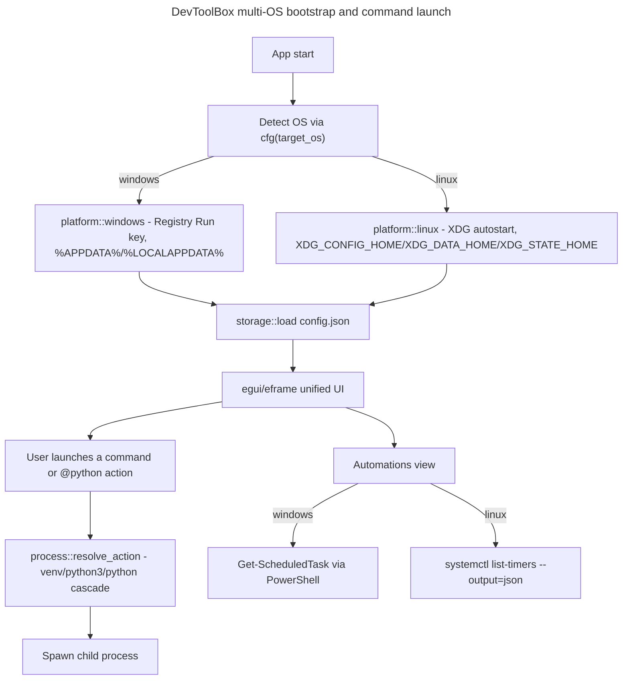

# Master Plan: DevToolBox Multi-OS (Windows + Linux)

## Overview

- **Goal**: Port DevToolBox — currently a Windows-only Rust launcher built on `tao` + Win32 (GDI rendering, Registry startup, `windows` crate) — to also run on Linux, at MVP parity (core launcher features, no pixel-perfect UI parity), while keeping the Windows build fully functional. Source spec: `./2026_08_05-multi-os-transformation-spec.md`. Shadow-areas gaps closed: `./2026_08_05-multi-os-transformation-spec-shadow-report.md`.
- **Risk Score**: 10/10
  - Breaking changes to public internals: the UI module is fully replaced, storage/icon path resolution signatures change (+3)
  - 5+ modules affected: `src/main.rs`, `src/storage/`, `src/icons/`, `src/windows/`, `src/ui/`, `scripts/system_inventory/`, `scripts/winclean/` (+3)
  - Major refactoring: `tao` + Win32 GDI UI (`app.rs`, `card.rs`, `gdi.rs`, `ui/mod.rs`) deleted and replaced by a unified `eframe`/`egui` UI (+2)
  - External dependency change: `tao` dropped, `eframe`/`egui` added (+2)
- **Branch**: `feature/multi-os/`

## Frozen decisions (from validated brainstorm + shadow-areas closure — do NOT revisit)

1. **Scope**: whole repository, including `scripts/system_inventory/` and `scripts/winclean/`, not just the Rust binary. Target OS: Windows + Linux. macOS explicitly out of scope.
2. **Parity level**: MVP minimal. Acceptance bar on Linux: launch a command/action (including `@python`), add/remove/toggle a favorite, create/rename/delete a category, persist `config.json` across restarts, register for autostart. Pixel-perfect rendering and native look are not MVP criteria.
3. **UI toolkit**: `egui` (immediate-mode, pure Rust), single unified UI for both OS — no dual Windows-native / Linux-egui implementation.
4. **`tao` is replaced by `eframe`.** `egui` targets `winit` natively (`egui-winit`); `tao` is a diverging `winit` fork with no maintained `egui` integration and pulls GTK3 on Linux. `eframe` supplies its own `winit`-based event loop + render backend (glow/wgpu). This is a correction discovered during architecture exploration, not part of the original brainstorm — it is now frozen on the same footing as the other decisions.
5. **Startup**: Linux uses XDG autostart (`~/.config/autostart/devtoolbox.desktop`) as the counterpart to the Windows Registry Run key. A failed write or an unsupported desktop environment logs a non-blocking warning; it never prevents manual launch.
6. **Config/data/log paths on Linux**: `$XDG_CONFIG_HOME` (fallback `~/.config`) for `config.json`, `$XDG_DATA_HOME` (fallback `~/.local/share`) for the icons folder, `$XDG_STATE_HOME` (fallback `~/.local/state`) for the log file — counterparts to `%APPDATA%`/`%LOCALAPPDATA%`. No new crate (`dirs`/`directories`) — resolved with `std::env::var` + manual fallback, consistent with the project's existing avoidance of utility crates.
7. **Icon backend**: a portable `IconBackend` trait abstracts icon rendering (`gdi.rs` → deleted, `egui_backend.rs` → created). Icon *resolution* on Linux uses freedesktop Icon Theme Specification lookup, with fallback to an embedded icon then a generic default. No direct equivalent to Windows `.exe` GDI icon extraction exists on Linux and none is built.
8. **Automations view**: Linux gets a direct counterpart via `systemctl list-timers --output=json`, matching the functional scope of the current `Get-ScheduledTask` PowerShell-backed view (name, category, next run, state). Not hidden, not deferred.
9. **`system_inventory` / `winclean` on Linux**: real equivalents, not stubs — package managers (apt/dnf/pacman) instead of Scoop/Choco, `systemd` instead of Task Scheduler, native Docker disk usage (`docker system df` / `/var/lib/docker`) instead of `.vhdx` inventory. `winclean`'s Linux modules are a **Python reimplementation** of the author's existing `sysclean` bash tool inside the same `scripts/winclean/` package (shared declarative `CleanModule` registry, OS-tagged), not a call-out to the external `sysclean` script.
10. **`@python` resolution** (`src/windows/process.rs`): cascade extended with `.venv/bin/python` (Linux) alongside `.venv\Scripts\python.exe` (Windows), then the existing env-var override, then `python3`, then a new `python` fallback for minimal distros lacking a `python3` binary.
11. **Distribution**: build from source only this iteration. Reference Linux distribution for manual validation: latest Ubuntu LTS, glibc-based. No CI/CD (none exists in this project); Linux validation is manual, performed by the developer before the lot is considered done.
12. **Default config**: `config/default.json` and `config/builtin-actions.json` currently reference Windows-only binaries (`notepad.exe`, `cmd.exe`, hardcoded `C:/Users/fxgui/...` paths) and would fail the MVP acceptance bar on Linux as shipped — a Linux-safe default command set is in scope, not an afterthought.
13. **Out of scope / deferred**: macOS; binary packaging/installers (`.deb`, Flatpak, etc.); CI/CD; automated testing on non-Ubuntu Linux distributions (Fedora, Arch are not actively tested this iteration).

## Architecture projection

### Files to modify

- `Cargo.toml` - drop `tao`; move `windows`/`raw-window-handle` to `[target.'cfg(windows)'.dependencies]`; add `eframe`/`egui`
- `src/main.rs` - bootstrap rewritten around the `eframe` event loop; registry/startup call cfg-gated behind `platform::`
- `src/storage/json.rs` - `user_config_path()` routed through `platform::config_path()`
- `src/icons/resolve.rs` - `icons_dirs()` routed through `platform::data_dir()`
- `src/windows/process.rs` - `@python` cascade extended (`.venv/bin/python`, `python` fallback)
- `src/windows/registry.rs`, `src/windows/mod.rs` - fully `cfg(windows)`-gated, wrapped behind a `StartupProvider` trait
- `config/default.json`, `config/builtin-actions.json` - Windows-only commands/paths replaced or split by OS
- `README.md`, `CLAUDE.md`, `aidd_docs/memory/architecture.md`, `aidd_docs/memory/deployment.md` - reflect `eframe`/`egui`, drop `tao`/WinUI 3 mentions, document Linux build prerequisites
- `scripts/winclean/{registry_mod,common,procs,remove,clean,config,history,mod_dev,mod_apps,mod_system}.py` + mirrored tests - OS dispatch
- `scripts/system_inventory/{inventory,packages,appdata,docker_wsl,registry,path_env,common}.py` + mirrored tests - OS dispatch

### Files to create

- `src/platform/{mod,windows,linux}.rs` - config/data/state path abstraction + `StartupProvider` trait
- `src/linux/{autostart,icon_theme,automations}.rs` - XDG autostart writer, freedesktop icon theme lookup, `systemctl list-timers` reader
- `src/icons/{backend,egui_backend}.rs` - `IconBackend` trait + `egui` texture conversion
- `src/ui/{egui_app,dialogs}.rs` - unified `egui` UI (card grid, Actions/Terminal/Automations nav) and cross-platform `info()`/`warn()`/`confirm()` dialogs
- `config/default.linux.json` (or cross-platform merge) - Linux-safe default commands
- `assets/devtoolbox.desktop`, `assets/devtoolbox.png` - autostart template and fallback icon
- `scripts/winclean/{mod_linux_pkg,mod_linux_cache,mod_linux_system,trash_linux,platform_paths}.py` + tests
- `scripts/system_inventory/{packages_linux,systemd,docker_native,xdg_dirs}.py` + tests

### Files to delete

- `src/ui/app.rs`, `src/ui/card.rs`, `src/ui/mod.rs`, `src/icons/gdi.rs` - replaced by the unified `egui`/`eframe` UI (single-backend decision; no parallel Win32-native path retained)

## Applicable rules

None — `list-rules.mjs` returned an empty inventory (no `.cursor/rules`, path-scoped Copilot/OpenCode rules, or similar detected in this repository).

## User Journey

## Risk register

| Risk | Impact | Mitigation |
| --- | --- | --- |
| `tao`/`windows` crate imported without `cfg` in shared files (`ui/mod.rs`, `ui/app.rs`, `ui/card.rs`, `windows/registry.rs`) | `cargo build`/`cargo check` fails on Linux from day one, blocking every subsequent lot | Part 1 makes cfg-gating and a clean Linux `cargo check` its explicit exit criterion, before any UI or script work starts |
| `eframe` replaces `tao` mid-project | Window bootstrap, icon rendering, and dialogs all change at once; regression risk on the Windows build | Part 2 keeps the Windows build green at every commit (`cargo build --release` on Windows validated before merging), not only at the end |
| Default config/actions unusable on Linux (`notepad.exe`, hardcoded `C:/Users/fxgui` paths) | MVP acceptance criteria (`launch a command/action`) fails immediately on a fresh Linux checkout even if the code is otherwise correct | Part 3 explicitly ships a Linux-safe default config as an acceptance criterion, not a follow-up |
| `winclean`'s existing test suite encodes source-scanning invariants (e.g. "`mod_dev.py` never imports `remove`") | A naive Linux port could pass existing tests while leaving new Linux modules uncovered by the same guarantees | Part 5 requires new Linux modules to be covered by the same class of contract tests, not just unit tests of behavior |
| No CI/CD | Linux regressions can silently reappear after being fixed once | Each part's acceptance criteria include a runnable local command (`cargo test`, `python -m unittest discover`) run on both OS where feasible, per `aidd_docs/memory/testing.md` |
| Manual GUI/autostart validation (autostart honored after relogin, freedesktop icon lookup, systemd timers visible in the UI) assumes a desktop-environment-equipped Ubuntu LTS machine; the environment used to develop and drive these plans may be headless (CLI-only, no GNOME/Xfce session) | Acceptance criteria requiring a live desktop session become unverifiable in the actual working environment, silently blocking Part 3 | Part 3's desktop-dependent acceptance criteria are validated on a separate disposable Ubuntu LTS VM/desktop session dedicated to manual QA, distinct from any headless dev/build environment; this is stated explicitly in Part 3's risk register, not assumed |
| Documentation updates (`README.md`, `CLAUDE.md`, memory files) and the final cross-cutting Ubuntu LTS validation pass have no owning phase in any child plan by default | They get silently dropped once Parts 1-5's code-level acceptance criteria are all green | Part 5 (last sequential lot) carries an explicit closing phase for documentation updates and the full-scope manual validation pass — see Part 5 Phase 4 |

## Child Plans

| #   | Plan                                              | File                                                          | Status  | Validated |
| --- | -------------------------------------------------- | -------------------------------------------------------------- | ------- | --------- |
| 1   | Rust core portability (cfg-gating, `platform/`)    | `./2026_08_05-multi-os-transformation-part-1.md`               | done    | [ ]       |
| 2   | Unified `egui`/`eframe` UI                         | `./2026_08_05-multi-os-transformation-part-2.md`               | done    | [ ]       |
| 3   | Linux OS integrations + cross-platform default config | `./2026_08_05-multi-os-transformation-part-3.md`             | done    | [ ]       |
| 4   | `system_inventory` Linux port                      | `./2026_08_05-multi-os-transformation-part-4.md`               | done    | [ ]       |
| 5   | `winclean` Linux port                              | `./2026_08_05-multi-os-transformation-part-5.md`               | done    | [ ]       |

<!-- Status values: pending, in-progress, done, blocked -->
<!-- RULE: Plan N+1 blocked until Plan N checkbox checked — bypassed this run per explicit user instruction to execute all 5 parts consecutively without pausing at checkpoints. -->
<!-- "done" = code-level work complete and regression-verified in a headless Linux dev environment. "Validated" stays [ ] on all 5 rows: it requires the user's own confirmation (live Windows build/run, and a disposable Ubuntu LTS desktop session — see Risk register and Validation Protocol below, none of which were available in this working environment). -->

## Validation Protocol

| Step | Action | Gate |
| --- | --- | --- |
| 1 | Complete Part 1: run `cargo check --target x86_64-unknown-linux-gnu` and `cargo build --release` on Windows | [ ] Checkpoint 1 — user confirms Linux compiles and Windows still builds |
| 2 | Complete Part 2: run the app on both OS, exercise the card grid, favorites, categories, and the 3 dialogs | [ ] Checkpoint 2 — user confirms UI parity at MVP level on both OS |
| 3 | Complete Part 3: validate every MVP acceptance criterion from decision 2 end-to-end on Ubuntu LTS | [ ] Checkpoint 3 — user confirms the MVP acceptance bar is met on Linux |
| 4 | Complete Part 4 and Part 5 independently (both depend only on Part 1's `platform/` abstraction, not on each other) | [ ] Checkpoint 4 — user confirms `system_inventory` and `winclean` Linux ports each pass their own success condition |
| 5 | Run Part 5 Phase 4 (documentation updates + full-scope Ubuntu LTS validation covering launcher + `system_inventory` + `winclean` together) | [ ] Final — user confirms README/CLAUDE.md/memory docs are updated and the combined manual validation pass is clean |

## Estimations

- **Confidence**: 9/10
  - ✓ Architecture projection validated against the actual codebase (import-level exploration, not guesswork)
  - ✓ The `tao`/`egui` incompatibility was caught before any code was written, not mid-implementation
  - ✓ Existing `winclean`/`system_inventory` test density gives a template for what Linux-side test coverage must match
  - ✗ Risk: `eframe`'s exact glue with the existing `DecodedIcon`/`image`-crate pipeline is not prototyped yet — first concrete unknown to resolve in Part 2
  - ✗ Risk: no Linux machine confirmed available for manual validation in this environment — Part 1's exit criterion assumes at least `cargo check` cross-compilation or a Linux dev machine is reachable
- **Duration**: not estimated in wall-clock time; sequenced by dependency (Part 1 blocks everything, Parts 4-5 run independently after Part 1)
