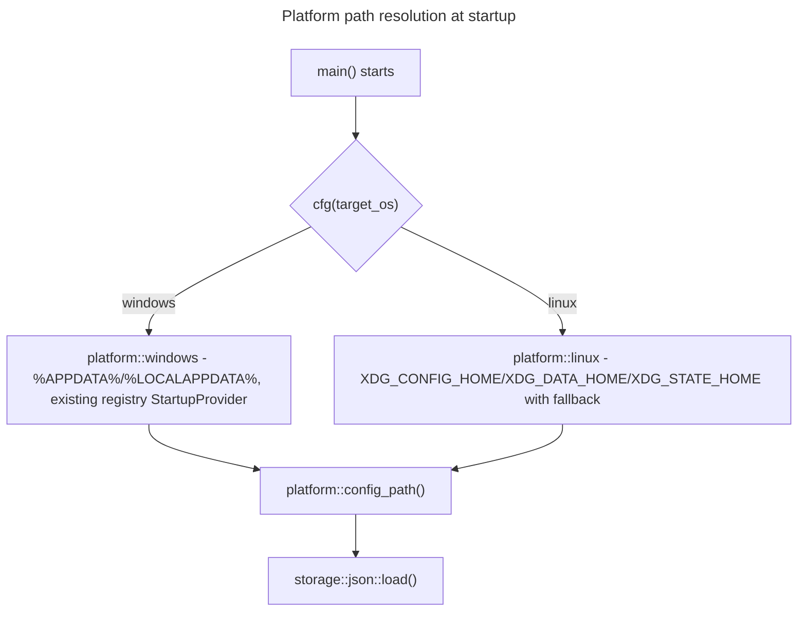

## Feature

### Summary

Today the crate does not compile on Linux at all: the `windows` crate is a non-conditional `[dependencies]` entry in `Cargo.toml`, and `src/ui/mod.rs`, `src/ui/app.rs`, `src/ui/card.rs`, `src/windows/registry.rs` import it unconditionally. This lot introduces a `src/platform/` module exposing OS-neutral path resolution and a `StartupProvider` trait, cfg-gates every Windows-only module, and confirms a clean `cargo check`/`cargo test` on Linux. It does not touch the UI rendering itself (Part 2) or ship the Linux startup/icon implementations (Part 3) — it only makes the tree buildable and lays the trait surface those lots implement against.

### Stack

- Rust workspace, edition 2021 (unchanged)
- `windows` 0.52 - moved to `[target.'cfg(windows)'.dependencies]`
- No new crate added in this part (`platform::linux` uses `std::env::var` only)

### Branch name

`feature/multi-os/part-1-platform-abstraction`

### Parent Plan

`./2026_08_05-multi-os-transformation-master.md`

### Sequence

1 of 5

### Confidence

8/10 — the cfg-gating mechanics are standard Rust; the main unknown is whether any currently-Windows-only logic is silently depended upon by OS-neutral code paths (e.g. tests asserting Windows path separators).

### Time to implement

Not estimated in wall-clock time (see master plan Estimations).

## Architecture projection

### Files to modify

- `Cargo.toml` - move `windows` and `raw-window-handle` to `[target.'cfg(windows)'.dependencies]`
- `src/main.rs` - route registry/startup calls through `platform::` instead of calling `src/windows/registry.rs` directly
- `src/storage/json.rs` - `user_config_path()` (currently line ~88-94) delegates to `platform::config_path()`
- `src/icons/resolve.rs` - `icons_dirs()` (currently line ~81-100) delegates to `platform::data_dir()`
- `src/icons/mod.rs` - drop the direct Win32-only import at line ~21 in favor of the platform-neutral path helper
- `src/windows/mod.rs`, `src/windows/registry.rs` - entire module body wrapped in `#[cfg(windows)]`; `registry.rs`'s 5 existing tests (which write to real `HKCU\Software\DevToolBox\Test`) stay Windows-only, unchanged in behavior

### Files to create

- `src/platform/mod.rs` - `config_path() -> PathBuf`, `data_dir() -> PathBuf`, `state_log_path() -> PathBuf`, `StartupProvider` trait (`register()`, `unregister()`, `is_registered()`), OS dispatch via `#[cfg(windows)]`/`#[cfg(target_os = "linux")]`
- `src/platform/windows.rs` - thin wrapper delegating to existing `src/windows/registry.rs` logic for `StartupProvider`; `%APPDATA%`/`%LOCALAPPDATA%` resolution (unchanged behavior, relocated)
- `src/platform/linux.rs` - `StartupProvider` stub returning `Ok(())` / not-yet-implemented is NOT acceptable here (would silently break the Part 3 acceptance bar); instead this file implements path resolution only (`$XDG_CONFIG_HOME`, `$XDG_DATA_HOME`, `$XDG_STATE_HOME` with fallbacks) and defers the `StartupProvider` trait *implementation* to Part 3, leaving it declared but not wired into `main.rs` on Linux until Part 3 lands

### Files to delete

None in this part.

## Applicable rules

| Tool | Name | Path | Why it applies |
| --- | --- | --- | --- |
| none | none | none | `list-rules.mjs` returned no configured rules for this repository |

## User Journey

## Risk register

| Risk | Impact | Mitigation |
| --- | --- | --- |
| Some OS-neutral module transitively imports `windows` today without being on the identified list | `cargo check` on Linux still fails after the identified files are gated | Run `cargo check --target x86_64-unknown-linux-gnu --workspace` after each file is gated, not only at the end, to localize failures immediately |
| `registry.rs` tests are Windows-only and cannot validate the `StartupProvider` trait shape on Linux | Trait signature mismatch only discovered in Part 3 | Write a Linux-side compile-only test (`#[cfg(target_os = "linux")] #[test] fn linux_platform_paths_resolve()`) exercising `platform::linux::config_path()`/`data_dir()`/`state_log_path()` in this part, even though `StartupProvider` itself is not implemented yet |
| Moving `windows` to a target-specific dependency changes `Cargo.lock` | Could shift transitive versions unexpectedly | Run `cargo build --release` on Windows immediately after the `Cargo.toml` change and diff `Cargo.lock` for unrelated version bumps |

## Implementation phases

### Phase 1: Cargo.toml target-specific dependencies

#### Tasks

- Move `windows` and `raw-window-handle` under `[target.'cfg(windows)'.dependencies]`
- Verify `Cargo.lock` only changes for the moved crates

#### Acceptance criteria

- [ ] `cargo metadata --format-version=1` on Linux does not list `windows` as an active dependency
- [ ] `cargo build --release` still succeeds on Windows

### Phase 2: platform module skeleton

#### Tasks

- Create `src/platform/mod.rs` with `config_path()`, `data_dir()`, `state_log_path()`, and the `StartupProvider` trait declaration
- Create `src/platform/windows.rs` delegating path resolution to existing `%APPDATA%`/`%LOCALAPPDATA%` logic, and a `StartupProvider` impl wrapping the existing registry code
- Create `src/platform/linux.rs` implementing XDG path resolution only

#### Acceptance criteria

- [ ] `platform::config_path()` on Windows returns byte-identical output to the current `user_config_path()`
- [ ] `platform::linux::config_path()` returns `$XDG_CONFIG_HOME/devtoolbox/config.json` when set, `~/.config/devtoolbox/config.json` otherwise (unit test, runs on any OS by mocking env vars)

### Phase 3: cfg-gate existing Windows-only modules

#### Tasks

- Wrap `src/windows/mod.rs` and `src/windows/registry.rs` bodies in `#[cfg(windows)]`
- Update `src/main.rs`, `src/storage/json.rs`, `src/icons/{resolve,mod}.rs` to call `platform::` instead of `src/windows/registry.rs` or hardcoded path logic directly

#### Acceptance criteria

- [ ] `cargo check --target x86_64-unknown-linux-gnu --workspace` succeeds
- [ ] `cargo test` on Windows still passes, including the 5 existing `registry.rs` tests

### Phase 4: Linux compile-only validation

#### Tasks

- Add `#[cfg(target_os = "linux")]` unit tests for `platform::linux::{config_path, data_dir, state_log_path}`
- Confirm no other file in the tree imports `windows` unconditionally (`grep -rn "^use windows" src/` cross-checked against `#[cfg(windows)]` gating)

#### Acceptance criteria

- [ ] `cargo test --target x86_64-unknown-linux-gnu` passes for the new platform tests (UI/icon/registry-dependent tests remain Windows-only and are not expected to run on Linux yet — that is Part 2/3's job)
- [ ] `grep -rn "^use windows" src/ | grep -v "cfg(windows)"` returns no unexpected matches outside files already gated in Phase 3

## Amendments

None yet.

## Log

- 2026-08-05: Plan created via `aidd-dev:01-plan`, part 1 of 5.

## Validation flow demonstration

1. Developer runs `cargo check --target x86_64-unknown-linux-gnu --workspace` after Phase 1 → expect the same failures as today (baseline), confirming the target is reachable.
2. After Phase 3, re-run the same command → expect success with zero errors.
3. Developer runs `cargo test` on Windows → expect no regression versus the pre-part-1 baseline.
4. Developer runs `cargo test --target x86_64-unknown-linux-gnu` → expect the new `platform::linux` tests to pass; no other tests are expected to run yet on this target.
