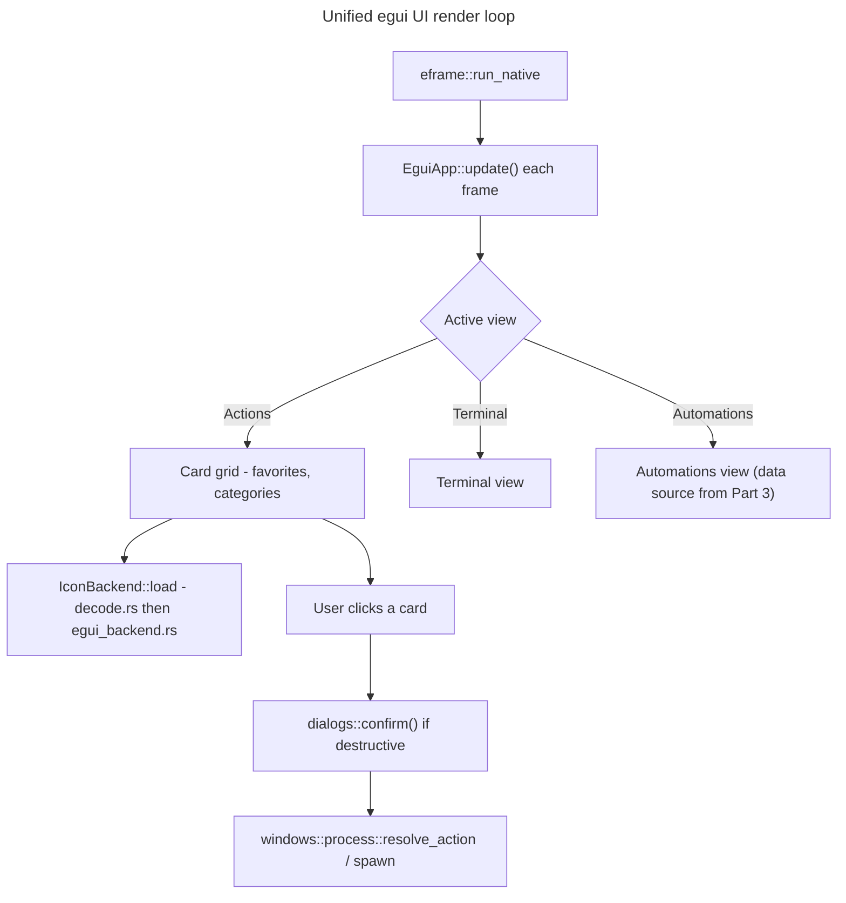

## Feature

### Summary

`src/ui/app.rs` (1993 lines), `src/ui/card.rs` (608 lines, GDI `BitBlt`/`CreateRoundRectRgn`/`FrameRgn`), and `src/ui/mod.rs` are deleted and replaced by an `egui`/`eframe` implementation covering the same functional surface: the command card grid, favorites toggle, category CRUD, the Terminal view, the Automations view (data source swapped in Part 3, UI shell built here), and the 3 `MessageBoxW`-backed dialogs (currently at lines ~1581/1589/1596) replaced by `egui` modal equivalents. This lot depends on Part 1's `platform::` module for path resolution but not on Part 3's Linux `StartupProvider`/icon-theme/systemd work — the Automations view here is built against the existing `ScheduledTask{name, category, next_run, state, author}` struct shape (already produced by the current Windows `Get-ScheduledTask` code path), not a new formal trait; no `AutomationsProvider` trait is introduced in this or any other part. Each OS module independently produces a `Vec<ScheduledTask>` that the UI renders identically, so this UI can be built and manually tested on Windows (with the existing Windows data source) before Part 3's Linux data source exists.

### Stack

- `eframe` (latest stable at implementation time) replacing `tao` 0.26.2
- `egui` (matching `eframe` version) for widgets/rendering
- `src/icons/{backend,egui_backend}.rs` (created here) converting decoded `image`-crate buffers to `egui::TextureHandle` — replaces `src/icons/gdi.rs` (deleted)
- `raw-window-handle` 0.6 dependency dropped (no longer needed once `tao`-specific window handle plumbing is gone; `eframe` manages its own window)

### Branch name

`feature/multi-os/part-2-egui-ui`

### Parent Plan

`./2026_08_05-multi-os-transformation-master.md`

### Sequence

2 of 5

### Confidence

6/10 — largest single-lot risk in the whole effort: a full UI rewrite touching nearly 2600 lines of existing code, with no prototype yet validating `eframe`'s texture upload path against the existing `DecodedIcon` pipeline.

### Time to implement

Not estimated in wall-clock time (see master plan Estimations).

## Architecture projection

### Files to modify

- `Cargo.toml` - remove `tao`, `raw-window-handle`; add `eframe`, `egui`
- `src/main.rs` - bootstrap rewritten around `eframe::run_native` instead of the `tao` event loop; `hwnd_from_window`/`host_init` (currently lines ~98-102) removed, replaced by `eframe::App` trait implementation

### Files to create

- `src/ui/egui_app.rs` - `eframe::App` impl: card grid layout, Actions/Terminal/Automations navigation, favorites toggle, category CRUD panels
- `src/ui/dialogs.rs` - cross-platform `info()`/`warn()`/`confirm()` modal dialogs replacing the 3 `MessageBoxW` call sites
- `src/icons/backend.rs` - `IconBackend` trait (render-agnostic: takes a `DecodedIcon`, returns a renderer-specific handle)
- `src/icons/egui_backend.rs` - `IconBackend` impl converting `DecodedIcon` (from the existing OS-neutral `src/icons/decode.rs`) into `egui::ColorImage`/`TextureHandle`

### Files to delete

- `src/ui/app.rs`, `src/ui/card.rs`, `src/ui/mod.rs`, `src/icons/gdi.rs`

## Applicable rules

| Tool | Name | Path | Why it applies |
| --- | --- | --- | --- |
| none | none | none | `list-rules.mjs` returned no configured rules for this repository |

## User Journey

## Risk register

| Risk | Impact | Mitigation |
| --- | --- | --- |
| `eframe`'s texture upload path is unproven against the existing `image`-crate `DecodedIcon` buffers | Icons render as blank/corrupted on first integration attempt | Phase 1 builds a minimal standalone `egui_backend` smoke test (single icon, single window) before wiring it into the full card grid |
| Full UI rewrite risks silently dropping a feature present in the 1993-line `app.rs` | Regression noticed only late, possibly after Part 2 is marked done | Before deleting `app.rs`, enumerate every public interaction it exposes (menu items, keyboard shortcuts, right-click actions) into a checklist consumed by this part's acceptance criteria |
| `MessageBoxW` dialogs are currently blocking/modal at the OS level; `egui` modals are drawn in the same event loop and require explicit state management | A dialog could be dismissed by a stray click or fail to block interaction with the card grid behind it | `dialogs.rs` implements modals as an explicit `AppState::Dialog(DialogKind)` variant that the main update loop checks first, short-circuiting all other input handling while active |
| Dropping `tao` changes window-close/minimize/taskbar behavior on Windows | User-visible regression on the only currently-shipping OS | Manual smoke test on Windows (window resize, minimize, close, restore) is an explicit acceptance criterion, not assumed from "it compiles" |

## Implementation phases

### Phase 1: eframe bootstrap + icon backend smoke test

#### Tasks

- Add `eframe`/`egui` to `Cargo.toml`, remove `tao`/`raw-window-handle`
- Build a minimal `eframe::App` that opens a window and renders one hardcoded icon via `egui_backend.rs`
- Confirm the app runs on Windows

#### Acceptance criteria

- [ ] `cargo run` opens a window on Windows showing the test icon without corruption
- [ ] `cargo build --release` succeeds with `tao` fully removed from `Cargo.lock`

### Phase 2: Card grid + favorites + categories

#### Tasks

- Port the card grid layout, favorite toggle, and category CRUD panels from `app.rs`/`card.rs` into `egui_app.rs`
- Wire `storage::{toggle_favorite, add_category, rename_category, remove_category}` (unchanged from `src/storage/`) into the new UI

#### Acceptance criteria

- [ ] Every interaction enumerated from the pre-deletion `app.rs` checklist (Risk register) has a corresponding `egui_app.rs` code path, or is explicitly listed under "Amendments" as a deliberate MVP drop
- [ ] Toggling a favorite and adding/renaming/removing a category persists correctly to `config.json` across an app restart (manual test on Windows)

### Phase 3: Dialogs + Terminal view

#### Tasks

- Implement `dialogs::{info, warn, confirm}` in `dialogs.rs`
- Port the Terminal view from `app.rs`
- Replace the 3 `MessageBoxW` call sites (former lines ~1581/1589/1596) with the new dialog calls

#### Acceptance criteria

- [ ] Triggering a destructive action (e.g. remove category) shows a blocking confirm dialog; canceling leaves state unchanged
- [ ] Terminal view launches a command and displays output equivalently to the pre-rewrite behavior

### Phase 4: app.rs/card.rs/mod.rs/gdi.rs deletion

#### Tasks

- Delete `src/ui/app.rs`, `src/ui/card.rs`, `src/ui/mod.rs`, `src/icons/gdi.rs`
- Update `src/main.rs` module declarations accordingly

#### Acceptance criteria

- [ ] `cargo build --release` succeeds on Windows with the old UI files removed
- [ ] Manual smoke test on Windows: window resize, minimize, close, restore behave as before (Risk register item 4)

## Amendments

- 🤖 2026-08-05: Reworded the Automations-view independence claim from "an already-stable trait boundary" to the actual `Vec<ScheduledTask>` data-shape dependency, since no `AutomationsProvider` trait is declared anywhere in this plan (found during `aidd-refine:02-challenge` iteration 1).

## Log

- 2026-08-05: Plan created via `aidd-dev:01-plan`, part 2 of 5.
- 2026-08-05: Iteration 1 — fixed Summary wording per `aidd-refine:02-challenge` finding (see Amendments).

## Validation flow demonstration

1. Developer runs the Phase 1 smoke test on Windows → expect a window with a correctly rendered icon.
2. Developer runs the full app after Phase 2 → expect the card grid to match the pre-rewrite feature checklist, with any intentional gaps recorded under Amendments.
3. Developer triggers each of the 3 dialog call sites after Phase 3 → expect blocking modal behavior identical in effect to the former `MessageBoxW` calls.
4. After Phase 4, developer runs `cargo build --release` and performs the window-behavior smoke test → expect no regression versus the `tao`-based build.
