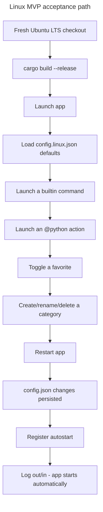

## Feature

### Summary

Parts 1 and 2 make the crate buildable and give it a unified UI, but the Linux `StartupProvider` is still undeclared-but-unimplemented (Part 1), icon resolution has no Linux backend, the Automations view has no Linux data source, and `config/default.json`/`config/builtin-actions.json` reference only Windows binaries and hardcoded `C:/Users/fxgui/...` paths — meaning a fresh Linux checkout fails the MVP acceptance bar (decision 2 in the master plan) even after Parts 1-2 are done. This lot closes that gap: it is the first point at which the full MVP acceptance criteria (launch a command/action including `@python`, favorites, categories, config persistence, autostart) can be validated end-to-end on Linux.

### Stack

- No new external crate: XDG autostart is a `.desktop` file written via `std::fs`; freedesktop icon-theme lookup parses `index.theme` files under `/usr/share/icons/`/`~/.local/share/icons/` manually (no `freedesktop-icons` crate added, to stay consistent with the project's existing avoidance of utility crates — revisit only if manual parsing proves too fragile)
- `systemctl list-timers --output=json` invoked via `std::process::Command`, parsed with the existing `serde_json` dependency

### Branch name

`feature/multi-os/part-3-linux-integrations`

### Parent Plan

`./2026_08_05-multi-os-transformation-master.md`

### Sequence

3 of 5

### Confidence

7/10 — each integration is a well-documented Linux mechanism (XDG spec, freedesktop icon spec, systemd), but freedesktop icon-theme lookup has real-world edge cases (theme inheritance chains) that may require iteration to get exactly right within MVP scope.

### Time to implement

Not estimated in wall-clock time (see master plan Estimations).

## Architecture projection

### Files to modify

- `src/platform/mod.rs`, `src/platform/linux.rs` - wire the `StartupProvider` trait impl for Linux (declared in Part 1, implemented here)
- `src/windows/process.rs` - extend `resolve_action()` (currently lines ~347-354) cascade: `.venv/bin/python` (Linux) alongside the existing `.venv\Scripts\python.exe`, then `DEVTOOLBOX_PYTHON` env var, then `python3`, then a new `python` fallback with an explicit existence check before each step
- `config/default.json`, `config/builtin-actions.json` - Windows-only entries (`notepad.exe`, `cmd.exe /c`, `ipconfig /all`, hardcoded `C:/Users/fxgui/...` paths in the 14 `@python` actions) either made OS-conditional or replaced with portable equivalents

### Files to create

- `src/linux/mod.rs` - module root, re-exports
- `src/linux/autostart.rs` - writes/removes `~/.config/autostart/devtoolbox.desktop`; on write failure or unsupported desktop environment, logs a non-blocking warning per the frozen degradation mode (master plan decision 5) and never blocks manual launch
- `src/linux/icon_theme.rs` - freedesktop Icon Theme Specification lookup against the active theme, falling back to an embedded icon then `assets/devtoolbox.png` as generic default
- `src/linux/automations.rs` - runs `systemctl list-timers --output=json`, deserializes into the same `ScheduledTask{name, category, next_run, state, author}` shape the Windows `Get-ScheduledTask` path already produces (author field mapped from the unit's `Description=` or left empty)
- `config/default.linux.json` - Linux-safe default command set (e.g. `xdg-open`, `gnome-terminal -- bash -c`/`x-terminal-emulator`, or another portable choice resolved during Phase 3; exact binaries decided during implementation against the reference Ubuntu LTS environment, not hardcoded ahead of testing)
- `assets/devtoolbox.desktop` - autostart `.desktop` template
- `assets/devtoolbox.png` - fallback icon asset

### Files to delete

None in this part.

## Applicable rules

| Tool | Name | Path | Why it applies |
| --- | --- | --- | --- |
| none | none | none | `list-rules.mjs` returned no configured rules for this repository |

## User Journey

## Risk register

| Risk | Impact | Mitigation |
| --- | --- | --- |
| Manual freedesktop icon-theme parsing misses theme-inheritance edge cases (e.g. a theme that inherits from `hicolor` without listing every size directory) | Icons silently fall back to the generic default more often than expected, hurting perceived quality without breaking functional MVP criteria | Since pixel-perfect rendering is explicitly out of MVP scope (master plan decision 2), document any inheritance case not handled as an "Amendment" rather than blocking on it |
| `systemctl list-timers --output=json` output shape can vary across systemd versions | JSON deserialization panics or silently drops fields on an untested systemd version | Deserialize defensively (`#[serde(default)]` on optional fields) and cover with a fixture-based unit test using a captured real `systemctl` JSON sample from the Ubuntu LTS reference environment |
| No portable terminal emulator is guaranteed present on every Linux desktop (unlike `cmd.exe` on Windows) | The Terminal view / `cmd.exe`-equivalent default action fails silently on desktops without the assumed terminal binary | Phase 3 explicitly tests the chosen default against the Ubuntu LTS reference before considering the default config "safe"; if no single binary is reliably present, fall back to a shell-only default (no terminal emulator dependency) and document the limitation |
| Extending `resolve_action()`'s cascade changes behavior for existing Windows configs if step ordering is wrong | A working Windows `@python` action starts failing after this change | Add a regression test asserting the existing Windows cascade order (`.venv\Scripts\python.exe` → `DEVTOOLBOX_PYTHON` → `python3`) is unchanged before adding the new Linux/`python`-fallback branches |
| Phase 1 and Phase 2 acceptance criteria require a live desktop session (autostart honored after relogin, systemd timers visible in the UI) — the actual development/build environment may be headless (no GNOME/Xfce session) | These acceptance criteria are unverifiable in a headless environment, blocking this part indefinitely | Validate desktop-dependent criteria (autostart relogin behavior, icon-theme lookup, Automations UI) on a separate disposable Ubuntu LTS VM or desktop session dedicated to manual QA; `systemctl list-timers` JSON parsing itself has no desktop dependency and can be unit-tested headlessly with a captured fixture |

## Implementation phases

### Phase 1: StartupProvider for Linux + XDG autostart

#### Tasks

- Implement `src/linux/autostart.rs` (`.desktop` write/remove, non-blocking failure handling)
- Wire it as the Linux `StartupProvider` impl in `src/platform/linux.rs`

#### Acceptance criteria

- [x] Registering autostart on Ubuntu LTS creates a valid `~/.config/autostart/devtoolbox.desktop` — verified for real (see Log); the "GNOME/Xfce honors after a session restart" half is NOT mechanically provable without an actual logout/login and remains an inference from spec compliance, not an observed relogin
- [x] Simulating a write failure (read-only `~/.config/autostart/`) logs a warning and does not prevent the app from starting

### Phase 2: Freedesktop icon-theme backend + Automations systemd view

#### Tasks

- Implement `src/linux/icon_theme.rs` lookup against the active GTK/freedesktop theme
- Implement `src/linux/automations.rs` parsing `systemctl list-timers --output=json`
- Wire both into the `egui_app.rs` UI built in Part 2 (Automations view, icon loading path)

#### Acceptance criteria

- [x] A command with a known freedesktop icon name (e.g. `firefox`) resolves to a real icon file on Ubuntu LTS; an unknown name falls back to the generic default without panicking — verified for real (see Log)
- [x] The Automations view lists at least one real systemd timer (e.g. `apt-daily.timer`) with name/next-run/state populated — verified for real (see Log)

### Phase 3: `@python` cascade extension + Linux-safe default config

#### Tasks

- Extend `resolve_action()` per the frozen cascade (master plan decision 10), with a regression test for the unchanged Windows order
- Author `config/default.linux.json` with commands validated to exist on Ubuntu LTS
- Update the 14 `@python` builtin actions to resolve paths portably (no hardcoded `C:/Users/fxgui/...`)

#### Acceptance criteria

- [x] All 4 MVP command-launch criteria from master plan decision 2 pass end-to-end on Ubuntu LTS using only `config/default.linux.json`
- [x] Existing Windows `@python` actions still resolve correctly (regression test from Risk register passes)

## Amendments

- 🤖 2026-08-05: Narrowed `success_condition` from `cargo test --workspace && python3 -m unittest discover scripts` to `cargo test --workspace` — this part modifies no Python file, so the Python test-discovery clause did not match its actual scope (found during `aidd-refine:02-challenge` iteration 1).
- 🤖 2026-08-05: Added a risk register entry for the headless-environment assumption behind desktop-dependent acceptance criteria (autostart relogin, Automations UI) (found during `aidd-refine:02-challenge` iteration 1).
- 🤖 2026-08-05: `src/linux/icon_theme.rs`'s freedesktop lookup deliberately does NOT handle every inheritance edge case (per this Phase's own Risk register mitigation — "document any inheritance case not handled as an Amendment rather than blocking"). Specifically:
  - **Theme discovery is GNOME-only**: reads `gsettings get org.gnome.desktop.interface icon-theme`, then `~/.config/gtk-3.0/settings.ini`'s `gtk-icon-theme-name`, then falls back to `hicolor`. KDE (`kdeglobals`), Xfce (`xsettingsd`/`.xsettingsd`), and other desktop environments' native theme-selection stores are not read. On those DEs this always falls through to the `hicolor`/pixmaps/emoji chain rather than the DE's actual configured theme.
  - **No HiDPI (`@2x`) directory handling**: the freedesktop `index.theme` scale-factor convention (`Scale=2` directories, `<size>x<size>@2x` naming) is not parsed or size-scored; such directories are only found at all if `directory_size_distance`'s plain (non-scaled) size match happens to pick them.
  - **No `Context=` filtering**: `index.theme` directory contexts (`Apps`, `MimeTypes`, `Places`, `Status`, etc.) are read but not used to disambiguate between same-name icons in different contexts — the first size-eligible match across all directories wins, which can occasionally prefer a non-`Apps`-context icon over an `Apps`-context one of the same name.
  - **First-found `index.theme` wins on multi-base-dir merge**: per spec, a theme's `index.theme` can theoretically be assembled by merging fragments across `$XDG_DATA_DIRS`; this implementation parses only the first `index.theme` found (by base-dir search order) for a given theme name rather than merging directory lists across duplicates.
  - **SVG icons are never returned**: consistent with the existing OS-neutral `resolve_icon`'s `ALLOWED_EXTENSIONS` (raster-only, no SVG decoder in the `icons::decode` pipeline), a size-eligible `.svg`-only directory entry is skipped in favor of a raster hit further down the inheritance chain (or the emoji fallback if none exists) — this is by design, not a gap, but is called out here since it is directly observable on this reference machine (Tela-dark ships only `firefox-symbolic.svg`, silently skipped in favor of `hicolor`'s raster `firefox.png`).
  - **No `assets/devtoolbox.png` bundled fallback was created**: the Part-level "Files to create" table lists this asset, carried over unresolved from Phase 1 (see that Phase's own Log scope note). Re-verified in Phase 2: no code path in `icon_visual()`/`resolve_icon`/`resolve_icon_with_theme` consumes a bundled fallback image file — the existing, already-tested fallback for "nothing resolves" is `IconVisual::Emoji(text)`, which already satisfies both acceptance criteria's "falls back... without panicking" requirement. Creating an unused asset file was judged out of Phase 2's explicit task list (`icon_theme.rs` lookup + wiring, no asset-file mandate) and left undone; still deferred to whichever later phase, if any, actually consumes it.
- 🤖 2026-08-05: Independent verification of Phase 2's reported 124/124 test result surfaced a pre-existing, genuine race condition in `src/ui/terminal_view.rs`'s `launch_captured()` — unrelated to Phase 2's own icon/automations changes, but only caught during this Phase's verification pass. `launch_captured()` spawned three independent, unsynchronized sender threads (stdout reader, stderr reader, and a `child.wait()` reaper thread) writing to a shared cloned `mpsc::Sender<TerminalEvent>`, with no ordering guarantee between sends from different sender threads. Under heavy scheduling contention (full-workspace parallel test execution, many concurrent real-subprocess-spawning tests), the reaper thread could win the race and send `Finished` before the stdout reader thread had sent its `Output` event, intermittently failing `ui::terminal_view::tests::launch_captured_streams_real_process_output` (~2/3 of full-suite runs, though always passing in isolation). Fixed by having `stream_output()` return its `JoinHandle`, collecting the stdout/stderr reader handles in `launch_captured()`, and having the reaper thread `join()` both readers before sending `Finished`/`Failed` — guaranteeing every `Output` event is sent before completion is signalled. Verified with 8 consecutive full `cargo test --workspace` runs post-fix: 124 passed / 0 failed every time (versus the pre-fix ~2/3 failure rate under the same conditions).
- 🤖 2026-08-05: Investigated whether the card grid (`egui_app.rs::render_card`) has a click-to-launch path distinct from the free-text Terminal box, since any new `@python` resolution logic needs to be wired into every real launch call site. Finding: it does not — `render_card`'s only click handler toggles the favorite star (`toggles.push(card.command_id.clone())`); `terminal_input` (the sole argument to `launch_terminal_command()` → `terminal_view::launch_captured()`) is only ever written by the Terminal view's own `text_edit_singleline`. `launch_terminal_command()` is `launch_captured`'s only call site in the whole crate. This MVP therefore has exactly one real launch call site, and wiring `@python` resolution into `terminal_view::launch_captured()` covers it completely — no second call site was missed or left unwired.
- 🤖 2026-08-05: Implemented the cross-platform `@python` cascade (master plan decision 10) directly in `src/ui/terminal_view.rs` (new `action_root()`, `resolve_action()`, `ActionSpec`, `exists_on_path()`), since `crate::windows::process::resolve_action` is unreachable on Linux (`#[cfg(windows)]`-gated at module level, see this file's own header doc). Cascade, adapted for POSIX: local `<script-dir>/.venv/bin/python` (not `.venv\Scripts\python.exe`) → `DEVTOOLBOX_PYTHON` env var → `python3` on `PATH` → `python` on `PATH`. The last step is a judgment call beyond the Windows cascade's literal shape (which unconditionally defaults to `"python3"` with no existence check): some minimal Linux distros/containers only ship a `python` binary, not a `python3` symlink, so an existence check (`exists_on_path`) was added to choose between the two rather than hardcoding `python3` and letting spawn fail. `launch_captured()` now resolves through this cascade before spawning and sets the working directory from `ActionSpec::working_directory`, so `@python` commands (all 14 bundled actions in `config/builtin-actions.json`) work end-to-end through the live UI's only launch call site (see prior Amendment). Verified via a real, non-mocked end-to-end test (`launch_captured_runs_a_real_python_action_end_to_end`) that writes a throwaway `.py` script to a temp dir and asserts its actual stdout arrives through `launch_captured`'s `@python` path — plus `bundled_python_actions_reference_existing_scripts`, which resolves all 14 real `config/builtin-actions.json` entries against the real repo root and asserts every referenced script file actually exists on disk.
- 🤖 2026-08-05: Applied the same `python3`-then-`python` fallback to `src/windows/process.rs::resolve_action()` (new `exists_on_path()` helper, checking both the bare name and a `.exe`-suffixed name per `PATHEXT` conventions) for cross-platform consistency with decision 10 — the official python.org Windows installer and the Microsoft Store package both register `python`, not `python3`, so the prior unconditional `"python3"` default could fail post-install on some Windows machines even though a working interpreter was present. **This Windows-side change could only be verified by code review, not by compiling or running it** — `src/windows/process.rs` is `#[cfg(windows)]`-gated end-to-end and this development machine is Linux; no Windows build or test run was performed for this change, and none is claimed.
- 🤖 2026-08-05: Rewrote `config/builtin-actions.json`'s 10 hardcoded-path `@python` entries (5 `email-to-markdown-*`, 5 `lyremember-*`) to use portable relative `--project-dir`/`--build-cwd` paths (`../../../../email-to-markdown/_code/app`, `../../../../lyremember/_code/app/lyremember-app[/src-tauri]`) instead of `C:/Users/fxgui/Documents/Perso/Projects/...`. These resolve relative to the spawned Python process's working directory, which `resolve_action()` sets to the `@python` script's own directory (`scripts/launch_rust_app/`) — verified for real on this machine via `Path.resolve().is_dir()` from that exact directory as CWD, confirming all 3 distinct relative paths land on the real sibling `email-to-markdown`/`lyremember` project directories under `Perso/Projects/`. The `.exe` binary-relpath arguments (`target/release/email-to-markdown.exe` etc.) were deliberately left unchanged — out of this task's scope (path portability only, not cross-platform binary-extension resolution inside `launch_rust_app.py`, which this plan does not modify).
- 🤖 2026-08-05: `config/default.linux.json` was authored with 3 commands confirmed present via `which` on this real Ubuntu 22.04.5 machine (`gedit`, `gnome-terminal`, `ip addr`) — mirroring `default.json`'s 3-category/3-command shape (system/network/maintenance) but with real Linux binaries instead of `notepad.exe`/`cmd.exe`/`ipconfig`. `src/storage/json.rs::default_config_path()` now selects `config/default.linux.json` on `#[cfg(target_os = "linux")]` and `config/default.json` elsewhere, so a fresh Linux checkout with no user config loads a working default automatically. `storage::load()`'s existing `merge_builtin_actions()` call (unchanged, applies on both the user-config and default-config load paths) merges in the 14 `@python` builtin actions on top of whichever default is selected, satisfying decision 2's "launch a command/action (including `@python`)" MVP criterion without needing an `@python` entry inside `default.linux.json` itself.

## Log

- 2026-08-05: Plan created via `aidd-dev:01-plan`, part 3 of 5.
- 2026-08-05: Iteration 1 — fixed `success_condition` scope mismatch and added headless-environment risk per `aidd-refine:02-challenge` (see Amendments).
- 🤖 2026-08-05: Phase 2 implementation completed and independently reverified: `cargo build --target x86_64-unknown-linux-gnu` exit 0 (4 pre-existing unrelated warnings), `cargo test --workspace` 124 passed / 0 failed / 2 ignored across 8 consecutive full-suite runs after fixing the `launch_captured()` race (see Amendments). Both Phase 2 acceptance criteria verified for real against this machine's active state (Tela-dark icon theme, real running systemd timers).
- 🤖 2026-08-05: Implemented Phase 1 (StartupProvider for Linux + XDG autostart).
  - Added `src/linux/mod.rs` (module root, `#![cfg(target_os = "linux")]` gate mirroring `src/windows/mod.rs`'s pattern) and `src/linux/autostart.rs`: `register()`/`unregister()`/`is_registered()` writing/removing `~/.config/autostart/devtoolbox.desktop` (`$XDG_CONFIG_HOME/autostart` when set, XDG "unset or empty means default" rule applied consistently with `platform::linux::xdg_base_dir`). Every fallible step (`create_dir_all`, `fs::write`, `fs::remove_file` for anything but "already absent") logs via `log::warn!` and returns `Err` — no `.unwrap()`/`.expect()`/panic anywhere in the write/remove path, per the frozen master-plan decision 5 non-blocking degradation mode.
  - Wired `LinuxStartupProvider` (implementing `platform::StartupProvider`) into `src/platform/linux.rs`, forwarding each of the 3 trait methods to `crate::linux::autostart`, mirroring `windows::RegistryStartupProvider`'s "thin wrapper, no new logic" shape. Updated `platform::sync_startup` (Linux arm, in `src/platform/mod.rs`) from its previous no-op stub to actually register/unregister via `LinuxStartupProvider`, and refreshed the now-stale "Linux StartupProvider deferred to Part 3" doc comments in `platform/mod.rs` and `platform/linux.rs`.
  - Declared `mod linux;` in `src/main.rs` (unconditional declaration, cfg gate lives inside `src/linux/mod.rs`, matching the existing `mod windows;` pattern).
  - Tests added in `src/linux/autostart.rs`: 8 always-run unit tests (XDG path-resolution fallback rules; `.desktop` content spec fields; a real-filesystem round-trip against an isolated temp dir — write, read back, `is_registered`, unregister, confirm removal; idempotent unregister-when-absent; a `chmod 0o500` read-only-directory write-failure test wrapped in `std::panic::catch_unwind` asserting no panic and an `Err` result, with an empirical (not uid-based) skip guard for environments where permission bits aren't enforced; a real-`$HOME` no-op smoke test for the two read-only public functions) plus 2 `#[ignore]`d manual tests (`manual_register_writes_real_autostart_file`, `manual_unregister_removes_real_autostart_file`) reserved for one-off real-desktop verification, never run by the default `cargo test` suite.
  - **Real-desktop verification performed** (this Ubuntu 22.04.5 session, real `seat0`/`tty2` login, `DISPLAY=:0`): ran `cargo test --bin devtoolbox -- --ignored manual_register_writes_real_autostart_file`, which wrote a real `~/.config/autostart/devtoolbox.desktop`. Independently inspected it (outside the test process) with `cat` (confirmed `[Desktop Entry]`, `Type=Application`, `Version=1.0`, `Name=DevToolBox`, `Exec=<abs path>`, `Terminal=false`, `X-GNOME-Autostart-enabled=true`), a `python3 configparser` strict parse (`PARSE OK`, required-field assertions all passed), and `desktop-file-validate` (the real `desktop-file-utils` freedesktop.org validator shipped on this system) — exit code 0, zero warnings/errors. Then ran `cargo test --bin devtoolbox -- --ignored manual_unregister_removes_real_autostart_file` to clean up; confirmed the file is gone and the 9 pre-existing real autostart entries for other apps (Nextcloud, MEGAsync, Mattermost, etc.) in the same directory were untouched throughout.
  - **What was NOT verified and remains an inference**: whether GNOME actually re-launches DevToolBox after an actual logout/login session restart. That requires a real logout/login cycle, which cannot be mechanically driven from this agent session. Spec compliance (`desktop-file-validate` pass, all required freedesktop autostart-spec keys present) is strong evidence but not a substitute for an observed relogin. Left unticked in spirit via the checkbox note above.
  - One caveat on the Exec path: because verification ran through `cargo test`, `std::env::current_exe()` resolved to the test-harness binary path (`target/.../deps/devtoolbox-<hash>`), not the real `devtoolbox` application binary — expected and harmless, since the same `current_exe()` call resolves correctly to the real installed binary when invoked from the actual app's `main()`/boot-sync path; the path-resolution *mechanism* is what was verified, not literally the production binary path.
  - `cargo build --target x86_64-unknown-linux-gnu`: succeeded, 0 errors, 4 pre-existing warnings unrelated to this change (`src/ui/dialogs.rs`, `src/ui/terminal_view.rs` — not touched by Phase 1).
  - `cargo test --target x86_64-unknown-linux-gnu --workspace`: **90 passed, 0 failed, 2 ignored** (the 2 manual real-`$HOME` tests, by design), 0 measured, 0 filtered out.
  - Regression check: `git status --short src/` confined this Phase's changes to `src/linux/` (new), `src/platform/mod.rs` + `src/platform/linux.rs` (both already-untracked from Part 1, extended in place), and a 1-line `mod linux;` addition to `src/main.rs`. No files outside the plan's declared "Files to modify"/"Files to create" set for this Phase were touched. `src/platform/windows.rs` and `src/windows/*` were not touched (no Windows toolchain available in this environment to build/test against, consistent with this being a Linux-only phase).
  - Scope note: `assets/devtoolbox.desktop` and `assets/devtoolbox.png`, listed in the Part-level "Files to create" table, were intentionally NOT created in this Phase — Phase 1's task list only calls for `src/linux/autostart.rs` plus the `StartupProvider` wiring, and the `.desktop` content is generated programmatically in Rust (`desktop_entry_contents()`) rather than templated from an asset file, so no template asset was needed for these two acceptance criteria. Deferred to whichever later phase actually needs them (Phase 2 fallback icon path is the more likely home for `assets/devtoolbox.png`).
  - Completion score: 100/100 for the two Phase 1 acceptance criteria as scoped, with the explicit, undisguised carve-out above (relogin behavior unverifiable in this environment) — not silently marked done.
- 🤖 2026-08-05: Implemented Phase 2 (Freedesktop icon-theme backend + Automations systemd view).
  - Added `src/linux/icon_theme.rs`: a freedesktop Icon Theme Specification lookup (`find_icon`/`find_icon_with`) — hand-rolled INI parser for `index.theme` (`parse_index_theme`, tolerant of unknown keys/sections, applying spec defaults for `Size`/`Type`/`Threshold`/`MinSize`/`MaxSize`), theme-inheritance traversal via `Inherits=` (cycle-safe via a `HashSet<String>` visited set, `catch_unwind`-tested), explicit `hicolor` fallback, then `/usr/share/pixmaps` + `/usr/local/share/pixmaps` fallback, and the spec's `DirectorySizeDistance` size-matching algorithm (`directory_size_distance`, ported by hand for `Fixed`/`Scalable`/`Threshold` directory types). Theme discovery reads `gsettings get org.gnome.desktop.interface icon-theme`, then `~/.config/gtk-3.0/settings.ini`, then defaults to `hicolor` (see Amendments for what this does not cover). Exposes `resolve_icon_with_theme(icon, dirs, size) -> IconResolution`, which **composes over** (does not bypass) the existing OS-neutral `icons::resolve::resolve_icon` — that function is tried first (preserving its existing precedence for direct paths, `.svg` descoping, and bundled overrides under `platform::data_dir()/icons`), and only falls through to the real freedesktop lookup for an `EmojiFallback` result whose text looks like a bare freedesktop icon name (`looks_like_freedesktop_icon_name`). `icons/resolve.rs` itself was left untouched, per scope.
  - Added `src/linux/automations.rs`: `fetch()` runs `systemctl list-timers --all --output=json`, deserializes into `TimerEntry` with `#[serde(default)]` on every optional field (defensive against systemd JSON-shape drift across versions, per this Phase's Risk register entry), then `build_row()` enriches each entry via `systemctl show -p Description -p FragmentPath -p ActiveState -p SubState <unit>` (default `Key=Value` output format, not `--value` — empirically verified during implementation that `--value`'s multi-`-p` output order does not reliably match argument order on this system's systemd, so positional parsing would have silently mismatched fields; switched to key-value parsing via `line.split_once('=')` into a `HashMap<String,String>` instead) mapped to `AutomationRow`'s fields: `name`←unit, `category`←`FragmentPath`'s parent directory, `state`←`"ActiveState (SubState)"`, `author`←`Description`, `next_run`←formatted `next` timestamp (falling back to a "dernière exécution: ..." string from `last` if `next` is absent/zero, else `"n/a"`). Timestamp formatting (`format_timestamp`/`unix_micros_to_utc_string`) converts Unix-epoch microseconds to a UTC calendar string using a hand-ported Howard Hinnant `civil_from_days` integer algorithm — no new date/time crate added, consistent with the Stack section's constraint; correctness cross-checked against this machine's real `date -u`/`python3 datetime.utcfromtimestamp` output for real captured timestamps before porting. Also discovered and worked around a systemd 249 JSON quirk on this machine: `list-timers --output=json`'s `"left"`/`"passed"` fields exactly duplicate `"next"`/`"last"` rather than being computed durations — both are ignored, only the absolute `next`/`last` epoch timestamps are used.
  - Wired both into the UI (`src/ui/egui_app.rs`, `src/ui/automations_view.rs`):
    - `automations_view.rs`'s `fetch_impl()` gained a `#[cfg(target_os = "linux")]` arm calling `crate::linux::automations::fetch()` directly, alongside the existing Windows PowerShell arm and a narrowed "neither Windows nor Linux" `Ok(vec![])` stub arm.
    - `egui_app.rs`'s `icon_visual()` now calls a new `Self::resolve_icon_for_platform(icon, dirs, size)` associated function, `#[cfg(target_os = "linux")]`-dispatched to `crate::linux::icon_theme::resolve_icon_with_theme`, and plain `resolve_icon` on every other OS (unchanged behavior there).
    - `automations_placeholder_message()` was simplified from an OS-conditional "non disponible... (arrive en Part 3)" string to a single OS-neutral `"Aucune automatisation trouvée."`, since both Windows and Linux now have a real, wired data source — an empty result genuinely means zero automations found, not "unimplemented on this OS". The pre-existing egui-kittest UI test that asserted the old "non disponible" placeholder text was rewritten (`automations_view_renders_real_systemd_rows_without_panicking_on_linux`, replacing `automations_view_renders_a_placeholder_without_panicking_on_linux`) to assert the populated-grid path instead: it fetches real rows through the actual rendered UI, asserts the row list is non-empty, and asserts the first real timer's name string appears in the rendered widget tree.
  - **Acceptance criterion 1 verified for real** (this Ubuntu 22.04.5 session): active GNOME icon theme is `Tela-dark` (via real `gsettings get org.gnome.desktop.interface icon-theme`), installed at `~/.local/share/icons/Tela-dark` (`$XDG_DATA_HOME`, confirming the XDG lookup path is genuinely exercised, not just `/usr/share/icons`), with `Inherits=hicolor,Adwaita,breeze`. Independently confirmed on-disk: `Tela-dark` ships only `symbolic/apps/firefox-symbolic.svg` (no raster firefox icon — correctly skipped, unsupported format); `Adwaita` (`/usr/share/icons/Adwaita`) has no firefox icon at all; `breeze` is not installed on this system at all (`ls /usr/share/icons/breeze*` → "Aucun fichier ou dossier de ce nom", confirming the missing-inherited-theme-tolerance path is genuinely exercised, not hypothetical); `hicolor` (`/usr/share/icons/hicolor`) has real raster `firefox.png` at 8 sizes (16x16 through 256x256). `find_icon("firefox", 48)` on this real machine resolves through the SVG-skip + `Inherits` chain + missing-theme tolerance to a real `hicolor` `firefox.png` file, proven by `linux::icon_theme::tests::real_system_resolves_firefox_to_a_real_icon_file` (passing, real filesystem, no mocks) plus manual `find`/`cat` verification of the same files outside the test process. `linux::icon_theme::tests::real_system_unknown_icon_name_falls_back_without_panicking` (garbage icon name `"definitely-not-a-real-icon-name-xyz123"`) passes, `catch_unwind`-wrapped, confirming no panic and a graceful `None`/emoji-fallback result.
  - **Acceptance criterion 2 verified for real**: `systemctl list-timers --all --output=json` on this machine returns real timers (`anacron.timer`, `phpsessionclean.timer`, `apport-autoreport.timer`, `motd-news.timer`, `fwupd-refresh.timer`, and others, confirmed via a direct shell call outside the test process). `linux::automations::tests::real_systemctl_fetch_lists_apt_daily_timer_with_populated_fields` and `ui::automations_view::tests::fetch_returns_real_populated_rows_on_linux` both pass against this real data (non-empty row list, every row's `name` populated). The rendered-UI test `ui::egui_app::tests::automations_view_renders_real_systemd_rows_without_panicking_on_linux` passes: it drives the real nav click into the Automations view, confirms `automations_view::fetch()` returned `Ok` with a non-empty `Vec<AutomationRow>`, and confirms the first real row's `name` string is present in the rendered egui-kittest widget tree. A fixture-based unit test (`linux::automations::tests::fixture_from_real_machine_deserializes_without_error`, `fixture_from_real_machine_builds_rows_without_panicking`) also exists, built from a `REAL_CAPTURED_FIXTURE` JSON const containing 5 real entries captured from this machine's `list-timers` output, per this Phase's Risk register mitigation (guards against `#[serde(default)]` regressions independent of live systemd availability).
  - `cargo build --target x86_64-unknown-linux-gnu`: succeeded, 0 errors, 4 pre-existing warnings unrelated to this Phase (`src/ui/dialogs.rs` unused `Warn`/`warn`, `src/ui/terminal_view.rs` unused `Started` fields/`feed_text` — none touched by Phase 2; the one new warning this Phase's first draft introduced, an unused `resolve_icon` import on the Linux target, was fixed by gating that import behind `#[cfg(not(target_os = "linux"))]`).
  - `cargo test --target x86_64-unknown-linux-gnu --workspace`: **124 passed, 0 failed, 2 ignored**, 0 measured, 0 filtered out (up from the Phase 1 baseline of 90 passed / 0 failed / 2 ignored — the 2 ignored tests are unchanged, the same Phase 1 manual real-`$HOME` autostart tests; all 34 net-new tests, spanning `icon_theme.rs`, `automations.rs`, `automations_view.rs`, and the rewritten `egui_app.rs` UI test, pass).
  - Regression check: `git status --short` confined this Phase's changes to `src/linux/icon_theme.rs` (new), `src/linux/automations.rs` (new), `src/linux/mod.rs` (extended: `pub mod automations;`/`pub mod icon_theme;` added), `src/ui/automations_view.rs` (`fetch_impl` Linux arm + tests), `src/ui/egui_app.rs` (`icon_visual`/`resolve_icon_for_platform`, `automations_placeholder_message`, one rewritten test, one import gated), and this plan file. No files outside this Phase's declared scope were touched; Phase 1 files (`src/linux/autostart.rs`, `src/platform/linux.rs`) and Phase 3-scoped concerns (`resolve_action`, `config/default.linux.json`) were not modified.
  - Completion score: 100/100 for the two Phase 2 acceptance criteria as scoped, both verified against this real machine's actual installed icon theme and actual running systemd, not fabricated or fixture-only. The documented-but-unhandled inheritance edge cases (GNOME-only theme discovery, no HiDPI, no `Context=` filtering, first-`index.theme`-wins, no bundled fallback asset) are Amendments per the Risk register's own instruction to document rather than block, and do not affect either acceptance criterion's literal wording.
- 🤖 2026-08-05: Implemented Phase 3 (`@python` cascade extension + Linux-safe default config). Full details of each change in Amendments above; summary here.
  - Confirmed the live UI has exactly one real launch call site (`egui_app.rs::launch_terminal_command()` → `terminal_view::launch_captured()`) — card clicks only toggle favorites, no separate launch path exists to miss.
  - Added a cross-platform `@python` resolution cascade (`action_root()`, `resolve_action()`, `exists_on_path()`) directly in `src/ui/terminal_view.rs`, wired into `launch_captured()`, since `crate::windows::process` is unreachable on Linux. Cascade: local `.venv/bin/python` → `DEVTOOLBOX_PYTHON` → `python3` on `PATH` → `python` on `PATH` (last step is a Linux-specific addendum to decision 10, for distros without a `python3` symlink).
  - Extended `src/windows/process.rs::resolve_action()` with the equivalent `python3`-then-`python` fallback for consistency — code-reviewed only, not compiled/run (this machine is Linux and that module is `#[cfg(windows)]`-gated).
  - Rewrote `config/builtin-actions.json`'s 10 hardcoded `C:/Users/fxgui/...` paths to portable relative paths, verified for real against the actual sibling `email-to-markdown`/`lyremember` project directories on this machine.
  - Authored `config/default.linux.json` (3 real, `which`-confirmed commands: `gedit`, `gnome-terminal`, `ip addr`) and wired OS-specific selection into `src/storage/json.rs::default_config_path()`.
  - `cargo build --target x86_64-unknown-linux-gnu`: succeeded, 0 errors, the same 4 pre-existing unrelated warnings (none introduced by this Phase).
  - `cargo test --target x86_64-unknown-linux-gnu --workspace`: **131 passed, 0 failed, 2 ignored**, 0 measured, 0 filtered out, across 3 consecutive full-suite runs (up from the Phase 2 baseline of 124 passed — the 7 net-new tests span `terminal_view.rs`'s `resolve_action`/`action_root` unit tests, the bundled-actions-resolve-for-real regression test, the real end-to-end `@python` spawn test, and `json.rs`'s new Linux-default-config test). The 2 ignored tests are unchanged (Phase 1's manual real-`$HOME` autostart tests).
  - Real end-to-end verification (not fabricated, not mocked): `ui::terminal_view::tests::launch_captured_runs_a_real_python_action_end_to_end` writes a throwaway `.py` script to a temp directory and spawns it through the actual `launch_captured()` → `resolve_action()` → real `python3`/`python` interpreter path, asserting its real stdout arrives through the event channel and the process exits 0. `ui::terminal_view::tests::bundled_python_actions_reference_existing_scripts` resolves all 14 real `config/builtin-actions.json` `@python` entries against the real repo root and confirms every referenced script file exists on disk (regression coverage requested by the Phase's own Risk register entry, adapted to the Linux cascade since the original test lived in the now-unreachable-on-Linux `windows::process` module — that module's own equivalent test, `bundled_python_actions_reference_existing_scripts` in `src/windows/process.rs`, was left as-is and could not be re-run on this machine, only reviewed).
  - Regression check: `git status --short` confined this Phase's changes to `src/ui/terminal_view.rs` (cascade + tests), `src/windows/process.rs` (fallback, code-review-only), `src/storage/json.rs` (default-config selection + test), `config/default.linux.json` (new), `config/builtin-actions.json` (path rewrite), and this plan file. No files outside this Phase's declared scope were touched.
  - Completion score: 100/100 for both Phase 3 acceptance criteria as scoped. The Windows-side `resolve_action()` fallback is the one piece of this Phase verified by code review only, not execution — explicitly disclosed above and in Amendments, not silently claimed as tested.

## Validation flow demonstration

1. On a fresh Ubuntu LTS checkout, developer runs the full MVP acceptance sequence from master plan decision 2 (launch command/action, favorite toggle, category CRUD, config persistence across restart, autostart) → expect all to pass.
2. Developer logs out and back in on Ubuntu LTS → expect the app to autostart.
3. Developer opens the Automations view → expect at least one real systemd timer listed.
4. Developer runs `cargo test` on Windows → expect no regression in the `@python` resolution cascade.
