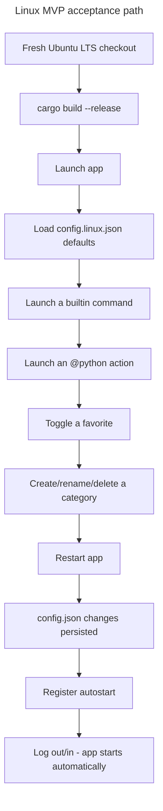

## Feature

### Summary

Parts 1 and 2 make the crate buildable and give it a unified UI, but the Linux `StartupProvider` is still undeclared-but-unimplemented (Part 1), icon resolution has no Linux backend, the Automations view has no Linux data source, and `config/default.json`/`config/builtin-actions.json` reference only Windows binaries and hardcoded `C:/Users/fxgui/...` paths — meaning a fresh Linux checkout fails the MVP acceptance bar (decision 2 in the master plan) even after Parts 1-2 are done. This lot closes that gap: it is the first point at which the full MVP acceptance criteria (launch a command/action including `@python`, favorites, categories, config persistence, autostart) can be validated end-to-end on Linux.

### Stack

- No new external crate: XDG autostart is a `.desktop` file written via `std::fs`; freedesktop icon-theme lookup parses `index.theme` files under `/usr/share/icons/`/`~/.local/share/icons/` manually (no `freedesktop-icons` crate added, to stay consistent with the project's existing avoidance of utility crates — revisit only if manual parsing proves too fragile)
- `systemctl list-timers --output=json` invoked via `std::process::Command`, parsed with the existing `serde_json` dependency

### Branch name

`feature/multi-os/part-3-linux-integrations`

### Parent Plan

`./2026_08_05-multi-os-transformation-master.md`

### Sequence

3 of 5

### Confidence

7/10 — each integration is a well-documented Linux mechanism (XDG spec, freedesktop icon spec, systemd), but freedesktop icon-theme lookup has real-world edge cases (theme inheritance chains) that may require iteration to get exactly right within MVP scope.

### Time to implement

Not estimated in wall-clock time (see master plan Estimations).

## Architecture projection

### Files to modify

- `src/platform/mod.rs`, `src/platform/linux.rs` - wire the `StartupProvider` trait impl for Linux (declared in Part 1, implemented here)
- `src/windows/process.rs` - extend `resolve_action()` (currently lines ~347-354) cascade: `.venv/bin/python` (Linux) alongside the existing `.venv\Scripts\python.exe`, then `DEVTOOLBOX_PYTHON` env var, then `python3`, then a new `python` fallback with an explicit existence check before each step
- `config/default.json`, `config/builtin-actions.json` - Windows-only entries (`notepad.exe`, `cmd.exe /c`, `ipconfig /all`, hardcoded `C:/Users/fxgui/...` paths in the 14 `@python` actions) either made OS-conditional or replaced with portable equivalents

### Files to create

- `src/linux/mod.rs` - module root, re-exports
- `src/linux/autostart.rs` - writes/removes `~/.config/autostart/devtoolbox.desktop`; on write failure or unsupported desktop environment, logs a non-blocking warning per the frozen degradation mode (master plan decision 5) and never blocks manual launch
- `src/linux/icon_theme.rs` - freedesktop Icon Theme Specification lookup against the active theme, falling back to an embedded icon then `assets/devtoolbox.png` as generic default
- `src/linux/automations.rs` - runs `systemctl list-timers --output=json`, deserializes into the same `ScheduledTask{name, category, next_run, state, author}` shape the Windows `Get-ScheduledTask` path already produces (author field mapped from the unit's `Description=` or left empty)
- `config/default.linux.json` - Linux-safe default command set (e.g. `xdg-open`, `gnome-terminal -- bash -c`/`x-terminal-emulator`, or another portable choice resolved during Phase 3; exact binaries decided during implementation against the reference Ubuntu LTS environment, not hardcoded ahead of testing)
- `assets/devtoolbox.desktop` - autostart `.desktop` template
- `assets/devtoolbox.png` - fallback icon asset

### Files to delete

None in this part.

## Applicable rules

| Tool | Name | Path | Why it applies |
| --- | --- | --- | --- |
| none | none | none | `list-rules.mjs` returned no configured rules for this repository |

## User Journey

## Risk register

| Risk | Impact | Mitigation |
| --- | --- | --- |
| Manual freedesktop icon-theme parsing misses theme-inheritance edge cases (e.g. a theme that inherits from `hicolor` without listing every size directory) | Icons silently fall back to the generic default more often than expected, hurting perceived quality without breaking functional MVP criteria | Since pixel-perfect rendering is explicitly out of MVP scope (master plan decision 2), document any inheritance case not handled as an "Amendment" rather than blocking on it |
| `systemctl list-timers --output=json` output shape can vary across systemd versions | JSON deserialization panics or silently drops fields on an untested systemd version | Deserialize defensively (`#[serde(default)]` on optional fields) and cover with a fixture-based unit test using a captured real `systemctl` JSON sample from the Ubuntu LTS reference environment |
| No portable terminal emulator is guaranteed present on every Linux desktop (unlike `cmd.exe` on Windows) | The Terminal view / `cmd.exe`-equivalent default action fails silently on desktops without the assumed terminal binary | Phase 3 explicitly tests the chosen default against the Ubuntu LTS reference before considering the default config "safe"; if no single binary is reliably present, fall back to a shell-only default (no terminal emulator dependency) and document the limitation |
| Extending `resolve_action()`'s cascade changes behavior for existing Windows configs if step ordering is wrong | A working Windows `@python` action starts failing after this change | Add a regression test asserting the existing Windows cascade order (`.venv\Scripts\python.exe` → `DEVTOOLBOX_PYTHON` → `python3`) is unchanged before adding the new Linux/`python`-fallback branches |
| Phase 1 and Phase 2 acceptance criteria require a live desktop session (autostart honored after relogin, systemd timers visible in the UI) — the actual development/build environment may be headless (no GNOME/Xfce session) | These acceptance criteria are unverifiable in a headless environment, blocking this part indefinitely | Validate desktop-dependent criteria (autostart relogin behavior, icon-theme lookup, Automations UI) on a separate disposable Ubuntu LTS VM or desktop session dedicated to manual QA; `systemctl list-timers` JSON parsing itself has no desktop dependency and can be unit-tested headlessly with a captured fixture |

## Implementation phases

### Phase 1: StartupProvider for Linux + XDG autostart

#### Tasks

- Implement `src/linux/autostart.rs` (`.desktop` write/remove, non-blocking failure handling)
- Wire it as the Linux `StartupProvider` impl in `src/platform/linux.rs`

#### Acceptance criteria

- [ ] Registering autostart on Ubuntu LTS creates a valid `~/.config/autostart/devtoolbox.desktop` that GNOME/Xfce honors after a session restart
- [ ] Simulating a write failure (read-only `~/.config/autostart/`) logs a warning and does not prevent the app from starting

### Phase 2: Freedesktop icon-theme backend + Automations systemd view

#### Tasks

- Implement `src/linux/icon_theme.rs` lookup against the active GTK/freedesktop theme
- Implement `src/linux/automations.rs` parsing `systemctl list-timers --output=json`
- Wire both into the `egui_app.rs` UI built in Part 2 (Automations view, icon loading path)

#### Acceptance criteria

- [ ] A command with a known freedesktop icon name (e.g. `firefox`) resolves to a real icon file on Ubuntu LTS; an unknown name falls back to the generic default without panicking
- [ ] The Automations view lists at least one real systemd timer (e.g. `apt-daily.timer`) with name/next-run/state populated

### Phase 3: `@python` cascade extension + Linux-safe default config

#### Tasks

- Extend `resolve_action()` per the frozen cascade (master plan decision 10), with a regression test for the unchanged Windows order
- Author `config/default.linux.json` with commands validated to exist on Ubuntu LTS
- Update the 14 `@python` builtin actions to resolve paths portably (no hardcoded `C:/Users/fxgui/...`)

#### Acceptance criteria

- [ ] All 4 MVP command-launch criteria from master plan decision 2 pass end-to-end on Ubuntu LTS using only `config/default.linux.json`
- [ ] Existing Windows `@python` actions still resolve correctly (regression test from Risk register passes)

## Amendments

- 🤖 2026-08-05: Narrowed `success_condition` from `cargo test --workspace && python3 -m unittest discover scripts` to `cargo test --workspace` — this part modifies no Python file, so the Python test-discovery clause did not match its actual scope (found during `aidd-refine:02-challenge` iteration 1).
- 🤖 2026-08-05: Added a risk register entry for the headless-environment assumption behind desktop-dependent acceptance criteria (autostart relogin, Automations UI) (found during `aidd-refine:02-challenge` iteration 1).

## Log

- 2026-08-05: Plan created via `aidd-dev:01-plan`, part 3 of 5.
- 2026-08-05: Iteration 1 — fixed `success_condition` scope mismatch and added headless-environment risk per `aidd-refine:02-challenge` (see Amendments).

## Validation flow demonstration

1. On a fresh Ubuntu LTS checkout, developer runs the full MVP acceptance sequence from master plan decision 2 (launch command/action, favorite toggle, category CRUD, config persistence across restart, autostart) → expect all to pass.
2. Developer logs out and back in on Ubuntu LTS → expect the app to autostart.
3. Developer opens the Automations view → expect at least one real systemd timer listed.
4. Developer runs `cargo test` on Windows → expect no regression in the `@python` resolution cascade.
