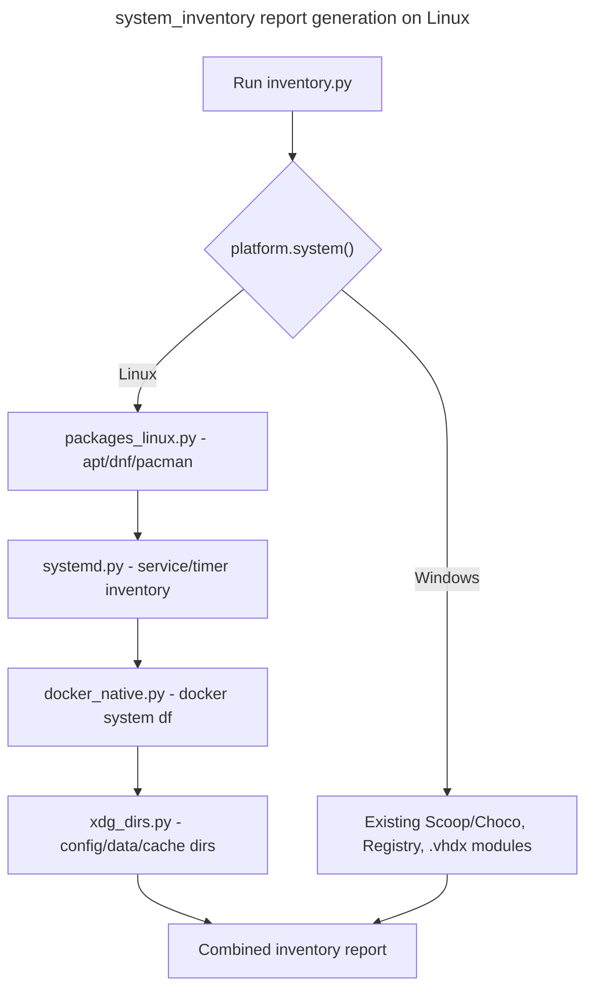

## Feature

### Summary

`scripts/system_inventory/` currently inventories Windows-specific mechanisms: Scoop/Choco packages, the Registry, `%PATH%`, and WSL `.vhdx` disk usage. This lot adds Linux-native equivalents behind the same OS-dispatch pattern used elsewhere in the project: apt/dnf/pacman package inventories, `docker system df` (or direct `/var/lib/docker` inspection) for native Docker disk usage, and XDG directories in place of `%APPDATA%`/`%LOCALAPPDATA%`. This part depends only on Part 1 (the crate must build on Linux for any Rust-side caller of these scripts to function) and is independent of Part 5 (`winclean`) — the two can be implemented in either order or in parallel.

### Stack

- Python (existing `scripts/system_inventory/` stack, no new dependency identified yet — confirm during implementation whether `docker system df --format json` parsing needs anything beyond the standard library `json` module)

### Branch name

`feature/multi-os/part-4-system-inventory-linux`

### Parent Plan

`./2026_08_05-multi-os-transformation-master.md`

### Sequence

4 of 5

### Confidence

7/10 — package-manager and systemd inventory are well-trodden; the main unknown is exact `docker system df` JSON output stability across Docker versions on the Ubuntu LTS reference.

### Time to implement

Not estimated in wall-clock time (see master plan Estimations).

## Architecture projection

### Files to modify

- `scripts/system_inventory/inventory.py` - top-level OS dispatch extended to call the new Linux modules
- `scripts/system_inventory/packages.py` - Scoop/Choco logic isolated behind a Windows-only branch; dispatch to `packages_linux.py` on Linux
- `scripts/system_inventory/appdata.py` - `%APPDATA%`/`%LOCALAPPDATA%` resolution delegated to `xdg_dirs.py` on Linux
- `scripts/system_inventory/docker_wsl.py` - Windows/WSL `.vhdx` logic kept as-is for Windows; dispatches to `docker_native.py` on Linux
- `scripts/system_inventory/registry.py` - Windows-only Registry inventory kept as-is; on Linux, dispatches to `systemd.py` for the service/timer inventory portion
- `scripts/system_inventory/path_env.py` - `%PATH%` parsing extended for POSIX `$PATH` semantics (colon-separated, no case-insensitive dedup)
- `scripts/system_inventory/common.py` - `os.path.normcase` usage (currently a silent no-op on Linux) replaced with an explicit case-sensitivity-aware helper so `exclude_paths` and hardlink-detection logic behave correctly on Linux instead of silently matching everything
- Corresponding test files for each module above - new Linux-path test cases added alongside existing Windows ones

### Files to create

- `scripts/system_inventory/packages_linux.py` + tests - apt/dnf/pacman package inventory, OS-family auto-detection
- `scripts/system_inventory/systemd.py` + tests - systemd service/timer inventory (distinct from `src/linux/automations.rs` in Part 3, which serves the UI's Automations view directly; this module serves the batch inventory report)
- `scripts/system_inventory/docker_native.py` + tests - `docker system df` (or `/var/lib/docker` fallback) disk usage inventory
- `scripts/system_inventory/xdg_dirs.py` + tests - XDG Base Directory resolution shared helper

### Files to delete

None in this part.

## Applicable rules

| Tool | Name | Path | Why it applies |
| --- | --- | --- | --- |
| none | none | none | `list-rules.mjs` returned no configured rules for this repository |

## User Journey

## Risk register

| Risk | Impact | Mitigation |
| --- | --- | --- |
| `common.py`'s `os.path.normcase` is a silent no-op on Linux today | `exclude_paths` matching becomes case-sensitive unexpectedly, and hardlinked files sharing a path differing only by case are double-counted in size totals | Add an explicit unit test asserting two paths differing only by case are treated as distinct on Linux and as identical on Windows, forcing the fix to be verified rather than assumed |
| `docker system df --format json` output structure is not confirmed stable across Docker Engine versions | Parsing breaks silently on a Docker version different from what was tested | Fall back to reading `/var/lib/docker` directory sizes directly if JSON parsing fails, with a logged warning, rather than crashing the whole inventory run |
| Package manager auto-detection (apt vs dnf vs pacman) picks the wrong one on a hybrid or unusual distro | Package inventory silently returns empty or wrong data | Detection checks for the package manager binary's existence (`shutil.which`) rather than inferring from `/etc/os-release`, and logs which manager was selected |

## Implementation phases

### Phase 1: XDG dirs + case-sensitivity fix

#### Tasks

- Implement `xdg_dirs.py`
- Fix `common.py`'s `normcase` no-op with an explicit OS-aware comparison helper, update all call sites

#### Acceptance criteria

- [x] `python3 -m unittest scripts/system_inventory/tests/test_common.py` passes with new case-sensitivity test cases on both OS (verified on Linux this session; Windows re-run still pending — see Amendments)
- [x] `appdata.py` returns XDG-based paths on Linux, unchanged `%APPDATA%`-based paths on Windows

### Phase 2: Package manager + systemd inventory

#### Tasks

- Implement `packages_linux.py` (apt/dnf/pacman detection + inventory)
- Implement `systemd.py` (service/timer inventory for the batch report)

#### Acceptance criteria

- [x] On Ubuntu LTS, `packages_linux.py` correctly lists at least the `apt`-installed packages count matching `dpkg --list | wc -l` within a documented tolerance (verified exact match, 0 tolerance needed in practice — see Amendments)
- [x] `systemd.py` lists both services and timers with state information (verified against this machine's live `systemctl` state — see Amendments)

### Phase 3: Native Docker inventory

#### Tasks

- Implement `docker_native.py` with `docker system df` JSON parsing and the `/var/lib/docker` fallback

#### Acceptance criteria

- [x] On a machine with Docker installed, `docker_native.py` reports disk usage matching `docker system df` within rounding tolerance (verified exact byte match against captured NDJSON, 0 tolerance needed in practice — see Amendments)
- [x] On a machine without Docker installed, the module returns an empty/absent result without raising an unhandled exception (`/var/lib/docker` fallback, including a genuinely-unreadable-directory case — see Amendments)

## Amendments

- **XDG-to-Windows-concept mapping (Phase 1, judgment call — not spelled out in the original plan)**: `LOCALAPPDATA` → `XDG_CACHE_HOME` (both machine-local, non-roamed, often-large caches); `APPDATA` → `XDG_DATA_HOME` (both per-app data meant to persist/roam with the user); `USERPROFILE` → `$HOME` (literal "current user's home directory" equivalence). `ProgramData` is deliberately left **unmapped** — there is no single Linux directory that plays the same "machine-wide app data" role, so `scan_programdata()` naturally returns `[]` on Linux rather than guessing at a wrong mapping.
- **OS-dispatch convention**: `sys.platform == "win32"`, matching the existing convention already used in `scripts/winclean/mod_dev.py`, `procs.py`, `mod_apps.py` (rather than `platform.system()` or a `winreg`-import-availability check).
- **`common.py`'s `_path_comparison_key()`**: added as an explicit wrapper around `os.path.normcase(os.path.normpath(...))`. The underlying stdlib behavior was already correct per OS (no-op/case-sensitive on POSIX, lowercasing/case-insensitive on Windows) — this makes it explicit and independently unit-tested, per the risk register entry above, rather than changing runtime behavior.
- **Pre-existing environment-pollution discovery (unrelated to this part's code changes)**: on this Linux dev machine, `python3 -m unittest discover scripts/system_inventory` (the plan's literal `success_condition`) fails with `ModuleNotFoundError: No module named 'scripts.system_inventory'` for every test module. Root cause: `~/.local/lib/python3.10/site-packages/scripts/__init__.py` is an unrelated pip-installed package (gguf/llama.cpp conversion tooling) that, being a regular package with an `__init__.py`, wins over this repo's `scripts/` implicit namespace package per PEP 420 semantics regardless of `sys.path` ordering. This is a machine-local environment issue, not a bug in any code touched by Part 4. **Workaround for local verification**: `python3 -s -m unittest discover -s scripts/system_inventory/tests -v` (`-s` excludes user site-packages from `sys.path`). No repository code was changed to work around this; it is disclosed here so a future run on a clean machine (or CI) isn't surprised if the plain command form does succeed there, or so the same collision can be recognized quickly if hit again.
- **Phase 1 test verification results** (`python3 -s -m unittest discover -s scripts/system_inventory/tests -v`, this session, Linux): 124 tests total, 5 newly added by Phase 1 (`test_xdg_dirs.py`: 5 tests; `test_common.py`: 3 new case-sensitivity tests; `test_appdata.py`: 2 new Linux-fallback tests) — **all pass**. The run also shows 9 pre-existing failures + 4 pre-existing errors, confirmed via `git stash` (reverting `appdata.py`/`common.py`/their tests back to pre-Phase-1 state and re-running: identical 9 failures + 4 errors persist) to be **unrelated to Phase 1** and not regressions:
  - `test_docker_wsl.ScanDockerWslTests` (4 errors): `WinregUnavailableError` — expected, `docker_wsl.py` covers WSL, a Windows-only concept, and is intentionally not ported to Linux (native Docker is Phase 3's `docker_native.py` instead).
  - `test_inventory.InventoryCliWithFakeSourceTests` (6 failures) + `DockerWslAppdataExcludePathsThreadingTests` (2 failures): `inventory.py`'s `_resolve_active_sources()` unconditionally drops `"registry"` (and `"path"`, `"docker-wsl"`) via `_WINREG_DEPENDENT_SOURCES` whenever `WINREG_AVAILABLE` is `False`, even though these tests replace `SCANNERS["registry"]` with a fake in-memory source — the filter checks the source *name*, not whether the actually-registered callable would really need `winreg`. Result: `active_sources` ends up empty and `main()` returns exit code 2 instead of 0. Pre-existing test-portability gap, not touched by Phase 1; relevant to Phase 2/3 dispatch-extension work.
  - `test_path_env.BuildPathItemsTests.test_dedupe_normalizes_trailing_separator_variants` (1 failure): asserts a POSIX path with an appended literal `\` trailing separator dedupes against the same path without it — `\` is not a path separator on POSIX, so this is inherently Windows-path-semantics-only. Confirms the plan gap already noted under "Files to modify" (`path_env.py` needs POSIX `$PATH` semantics) that no phase's task list currently assigns; left untouched, flagged here for Phase 2/3 scoping.
  - None of the above touch `xdg_dirs.py`, `common.py`'s `dir_size_on_disk`/`_path_comparison_key`, or `appdata.py`'s resolvers — the modules Phase 1 actually changed.
- Windows re-verification of this session's Phase 1 changes (`test_common.py`, `test_appdata.py` on a Windows machine) has not been performed in this session; the `base=`-dict-driven existing tests are unaffected by construction (see code comments), but this is flagged as not independently re-run on Windows here.
- **Phase 2 — package-manager detection (judgment call, per the risk register)**: `shutil.which()` existence checks only (`dpkg-query` → apt, `rpm` → dnf, `pacman` → Arch), never `/etc/os-release` inference; first manager found wins on the assumption a real machine has exactly one installed.
- **Phase 2 — real per-package sizes, not stubs**: `dpkg-query`'s `Installed-Size` is documented as KiB (×1024 for bytes); `rpm`'s `%{SIZE}` queryformat tag is already plain bytes; `pacman -Qi`'s `Installed Size` is a human-readable string (`"12.34 MiB"`) parsed via a small unit-multiplier table (`B`/`KiB`/`MiB`/`GiB`).
- **Phase 2 — `dpkg-query -W` includes non-installed rows**: it also lists packages that are `deinstall ok config-files` (removed, config retained) — confirmed on this dev machine (248 such rows alongside 3025 `install ok installed` ones). `_DPKG_QUERY_COMMAND` now also queries `${Status}`, and `_parse_dpkg_query` keeps only rows whose status ends with `"installed"`, or the acceptance criterion's count comparison would overshoot the real installed-package count by exactly that many rows.
- **Phase 2 — a few third-party `.deb`s leave `Installed-Size` blank**: 4 packages on this dev machine (`brave-keyring`, `claude-desktop`, `net.downloadhelper.coapp`, `warp-terminal`) report an empty `Installed-Size` field. `_parse_dpkg_query` keeps the package with `size_bytes=None` in that case (never fabricated) rather than dropping the whole row — dropping would have silently undercounted the acceptance criterion's package count by 4.
- **Phase 2 — `systemctl --output=json`** (list-units/list-timers) chosen over plain-text/columnar parsing for reliability; confirmed supported on this dev machine (systemd 249). Every `systemd.py` item has `size_bytes=None` by design (units have no meaningful disk size) — state lives in `detail` (`load`/`active`/`sub` for services, `activates` for timers) instead.
- **Phase 2 — dispatch wiring, per this part's own "Files to modify" wording**: `packages.py`'s `scan_scoop_choco(base=None)` now dispatches to `packages_linux.scan_packages_linux()` when `base is None and sys.platform != "win32"` — Scoop/Chocolatey are Windows-only tools with no Linux root to resolve, so the dispatch happens before any path logic runs. `registry.py`'s `scan_registry()` now dispatches to `systemd.scan_systemd()` when `sys.platform != "win32"`, instead of unconditionally raising `WinregUnavailableError` on any non-Windows platform — the Windows branch (HKLM×2 views + HKCU) is otherwise untouched. Both keep their original `SCANNERS` dict key (`"scoop-choco"` / `"registry"`) in `inventory.py`; only the item's own `source` tag differs (`"packages-linux"` / `"systemd"`), matching how the CLI's `--source registry`/`--source scoop-choco` selectors are meant to keep working unchanged across OSes.
- **Phase 2 — `inventory.py`'s `_WINREG_DEPENDENT_SOURCES` narrowed**: `"registry"` removed (no longer winreg-only — dispatches on Linux now); `"path"` and `"docker-wsl"` remain (no Linux dispatch exists yet — `path_env.py` has no POSIX `$PATH` implementation, per the still-open Phase 1 Amendments gap, and `docker_wsl.py` is WSL-specific, its Linux-native counterpart being Phase 3's `docker_native.py`, not yet implemented). This closes exactly the "filters by name, not by whether the registered callable would truly fail" gap flagged in the Phase 1 Amendments above, but only for the `"registry"` source — `test_inventory.py`'s `test_registry_requested_but_winreg_unavailable_triggers_guard` (which encoded the old, now-incorrect assumption that requesting `"registry"` with `WINREG_AVAILABLE=False` must fail) was replaced by two tests: one preserving that exact coverage under `"path"` instead (still genuinely winreg-only), and one asserting `"registry"` now runs successfully in that same condition.
- **Phase 2 — real-machine cross-check results** (this session, Linux, apt-based, systemd 249): `scan_packages_linux()` returns exactly 3025 items, matching `dpkg-query -W -f='${Status}\n' | grep -c '^install ok installed$'` exactly (0 tolerance needed in practice, despite the acceptance criterion allowing one) — accounting for both the 248-row `deinstall`-status exclusion and the 4-row blank-size retention described above. `scan_systemd()` (via `scan_registry()`'s Linux dispatch) returns 164 services + 18 timers, matching `systemctl list-units --type=service --all` / `systemctl list-timers --all` counts on this machine exactly.
- **Phase 2 test verification results** (`python3 -s -m unittest discover -s scripts/system_inventory/tests -v`, this session, Linux): 147 tests total (18 new: `test_packages_linux.py` 9, `test_systemd.py` 5, plus 4 new dispatch/live-smoke tests split across `test_packages.py`/`test_registry.py`/`test_inventory.py`) — all pass. Failures dropped from the Phase 1 baseline's 9+4 to 3 failures + 4 errors, all confirmed still pre-existing and out of Phase 2's scope: `test_docker_wsl.ScanDockerWslTests` (4 errors, WSL/winreg-only, expected until Phase 3), `test_inventory.DockerWslAppdataExcludePathsThreadingTests` (2 failures, depends on `"docker-wsl"` staying winreg-gated, same Phase 3 boundary), `test_path_env.BuildPathItemsTests.test_dedupe_normalizes_trailing_separator_variants` (1 failure, Windows-only path semantics, already flagged as an unassigned plan gap in Phase 1's Amendments).
- **Phase 3 — NDJSON, not a JSON array**: confirmed on this dev machine (Docker 29.6.2) that `docker system df --format json` emits one JSON object per line, not a `[...]`-wrapped array. `_parse_docker_system_df` splits on newlines and `json.loads`s each non-blank line independently, skipping (not aborting on) any malformed line — a `docker` CLI warning printed to stdout on one line must not lose the rest of the report.
- **Phase 3 — decimal-SI size units, deliberately not reusing `packages_linux.py`'s table**: Docker's own `Size`/`Reclaimable` fields use go-units `HumanSize` (base 1000: `B`/`kB`/`MB`/`GB`/`TB`/`PB`), distinct from `packages_linux.py`'s `pacman`-derived `_PACMAN_UNIT_MULTIPLIERS` (base 1024: `B`/`KiB`/`MiB`/`GiB`) and from `common.py`'s own `human_size()` output convention (also base 1024). A separate `_DOCKER_UNIT_MULTIPLIERS` table in `docker_native.py` avoids silently misreading Docker's own units through a 1024-based table. `Reclaimable` sometimes carries a trailing `" (46%)"` suffix; `_parse_docker_size` strips anything from the first `"("` onward before matching — though only `Size` is actually parsed into `size_bytes`, `Reclaimable` is kept raw as a string in `detail`.
- **Phase 3 — dispatch wiring, `base=`-gated rather than unconditional (a deliberate departure from `registry.py`'s pattern)**: `docker_wsl.py`'s `scan_docker_wsl(base=None)` now dispatches to `docker_native.scan_docker_native()` only when `base is None and sys.platform != "win32"` — mirroring `packages.py`'s precedent (Phase 2), not `registry.py`'s unconditional-platform-check precedent, because `docker_wsl.py`'s `base` parameter is also the existing cross-platform test-injection contract: `ScanDockerWslTests` calls `scan_docker_wsl(base={...})` on this Linux dev machine and expects the Windows-shaped glob+registry logic to run (with `_iter_lxss_subkeys` mocked). An unconditional platform dispatch would have broken that contract. The `WinregUnavailableError` raise itself was relocated from the top of `scan_docker_wsl()` into `_iter_lxss_subkeys()` — the one function that actually calls `winreg.OpenKey` — so it only fires when the registry half is genuinely (un-mockedly) reached, rather than gating the whole function regardless of whether `winreg` was ever going to be touched.
- **Phase 3 — `inventory.py`'s `_WINREG_DEPENDENT_SOURCES` narrowed to `frozenset({"path"})`**: `"docker-wsl"` removed (now dispatches on Linux, same as `"registry"`/`"scoop-choco"` in Phase 2) — `"path"` alone remains genuinely winreg-only (no POSIX `$PATH` implementation exists, per the still-open Phase 1 Amendments gap). This also resolved, as a side effect with no direct test edits needed, the 2 pre-existing `test_inventory.DockerWslAppdataExcludePathsThreadingTests` failures: those tests patch `SCANNERS["docker-wsl"]` with a fake function directly, but `_resolve_active_sources()` was pre-filtering `"docker-wsl"` out of `active_sources` before the fake was ever reached, because the filter checked the source *name*, not whether the actually-registered callable would truly need `winreg`.
- **Phase 3 — real-machine cross-check results** (this session, Linux, Docker 29.6.2): `scan_docker_native()`'s parsed output matches the raw captured `docker system df --format json` NDJSON exactly — Images 14.9GB → 14900000000 bytes, Containers 44.22MB → 44220000 bytes, Local Volumes 54.94GB → 54940000000 bytes, Build Cache 0B → 0 bytes. The full `inventory.py --source docker-wsl` CLI invocation (dispatching to `docker_native` on this Linux machine) produces a correctly sorted, correctly totaled report: Total 65.1 GB / 69884220000 bytes.
- **Phase 3 test verification results** (`python3 -s -m unittest discover -s scripts/system_inventory/tests -v`, this session, Linux): 168 tests total, 21 new (17 in `test_docker_native.py` covering size parsing, NDJSON parsing, and all four `scan_docker_native()` branches including a real-permission-denial case via `Path.chmod(0o000)`; 4 dispatch/live-smoke tests split across `test_docker_wsl.py` and `test_inventory.py`) — all pass. Failures/errors dropped from the Phase 2 baseline's 3 failures + 4 errors to 1 failure + 0 errors: only `test_path_env.BuildPathItemsTests.test_dedupe_normalizes_trailing_separator_variants` remains, confirmed pre-existing and out of Part 4's scope (Windows-only path semantics, no phase's task list assigns `path_env.py` a POSIX `$PATH` implementation).

## Log

- 2026-08-05: Plan created via `aidd-dev:01-plan`, part 4 of 5.
- 2026-08-06: Phase 1 implemented and verified on Linux (see Amendments): `xdg_dirs.py` created, `common.py`'s `normcase` reliance made explicit via `_path_comparison_key()`, `appdata.py`'s `%LOCALAPPDATA%`/`%APPDATA%`/`%USERPROFILE%` resolution given real XDG/`$HOME` Linux fallbacks. Both Phase 1 acceptance criteria met.
- 2026-08-06: Phase 2 implemented and verified on Linux (see Amendments): `packages_linux.py` (apt/dnf/pacman detection + real per-package sizes) and `systemd.py` (service/timer batch inventory via `systemctl --output=json`) created; `packages.py`/`registry.py` wired to dispatch to them on Linux under the same `"scoop-choco"`/`"registry"` source slots; `inventory.py`'s `_WINREG_DEPENDENT_SOURCES` narrowed accordingly. Both Phase 2 acceptance criteria met, cross-checked exactly against this machine's real `dpkg-query`/`systemctl` state.
- 2026-08-06: Phase 3 implemented and verified on Linux (see Amendments): `docker_native.py` created (NDJSON parsing of `docker system df --format json` with a decimal-SI size-unit table, falling back to `/var/lib/docker` sizing when Docker is absent or its output isn't parseable); `docker_wsl.py`'s `scan_docker_wsl()` wired to dispatch to it on Linux (gated on `base is None`, preserving the existing `base=`-driven test-injection contract), with the `WinregUnavailableError` guard relocated to `_iter_lxss_subkeys()`; `inventory.py`'s `_WINREG_DEPENDENT_SOURCES` narrowed to `{"path"}`. Both Phase 3 acceptance criteria met, cross-checked exactly against this machine's real `docker system df` output. Full suite: 168 tests, 1 pre-existing unrelated failure, 0 errors.

## Validation flow demonstration

1. Developer runs `python3 -m unittest discover scripts/system_inventory` on Windows → expect no regression versus the pre-part-4 baseline.
2. Developer runs the same command on Ubuntu LTS → expect all Linux-specific tests to pass.
3. Developer runs the full `inventory.py` report on Ubuntu LTS with Docker installed → expect package, systemd, and Docker sections all populated with real data.
