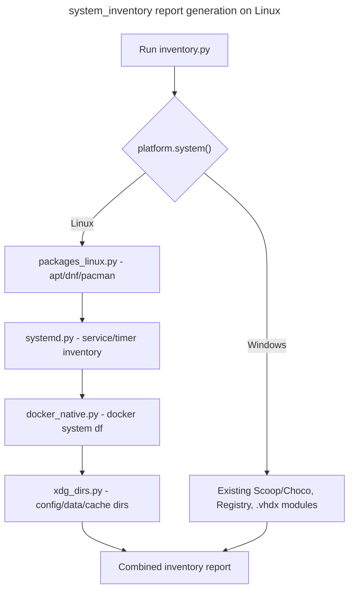

## Feature

### Summary

`scripts/system_inventory/` currently inventories Windows-specific mechanisms: Scoop/Choco packages, the Registry, `%PATH%`, and WSL `.vhdx` disk usage. This lot adds Linux-native equivalents behind the same OS-dispatch pattern used elsewhere in the project: apt/dnf/pacman package inventories, `docker system df` (or direct `/var/lib/docker` inspection) for native Docker disk usage, and XDG directories in place of `%APPDATA%`/`%LOCALAPPDATA%`. This part depends only on Part 1 (the crate must build on Linux for any Rust-side caller of these scripts to function) and is independent of Part 5 (`winclean`) — the two can be implemented in either order or in parallel.

### Stack

- Python (existing `scripts/system_inventory/` stack, no new dependency identified yet — confirm during implementation whether `docker system df --format json` parsing needs anything beyond the standard library `json` module)

### Branch name

`feature/multi-os/part-4-system-inventory-linux`

### Parent Plan

`./2026_08_05-multi-os-transformation-master.md`

### Sequence

4 of 5

### Confidence

7/10 — package-manager and systemd inventory are well-trodden; the main unknown is exact `docker system df` JSON output stability across Docker versions on the Ubuntu LTS reference.

### Time to implement

Not estimated in wall-clock time (see master plan Estimations).

## Architecture projection

### Files to modify

- `scripts/system_inventory/inventory.py` - top-level OS dispatch extended to call the new Linux modules
- `scripts/system_inventory/packages.py` - Scoop/Choco logic isolated behind a Windows-only branch; dispatch to `packages_linux.py` on Linux
- `scripts/system_inventory/appdata.py` - `%APPDATA%`/`%LOCALAPPDATA%` resolution delegated to `xdg_dirs.py` on Linux
- `scripts/system_inventory/docker_wsl.py` - Windows/WSL `.vhdx` logic kept as-is for Windows; dispatches to `docker_native.py` on Linux
- `scripts/system_inventory/registry.py` - Windows-only Registry inventory kept as-is; on Linux, dispatches to `systemd.py` for the service/timer inventory portion
- `scripts/system_inventory/path_env.py` - `%PATH%` parsing extended for POSIX `$PATH` semantics (colon-separated, no case-insensitive dedup)
- `scripts/system_inventory/common.py` - `os.path.normcase` usage (currently a silent no-op on Linux) replaced with an explicit case-sensitivity-aware helper so `exclude_paths` and hardlink-detection logic behave correctly on Linux instead of silently matching everything
- Corresponding test files for each module above - new Linux-path test cases added alongside existing Windows ones

### Files to create

- `scripts/system_inventory/packages_linux.py` + tests - apt/dnf/pacman package inventory, OS-family auto-detection
- `scripts/system_inventory/systemd.py` + tests - systemd service/timer inventory (distinct from `src/linux/automations.rs` in Part 3, which serves the UI's Automations view directly; this module serves the batch inventory report)
- `scripts/system_inventory/docker_native.py` + tests - `docker system df` (or `/var/lib/docker` fallback) disk usage inventory
- `scripts/system_inventory/xdg_dirs.py` + tests - XDG Base Directory resolution shared helper

### Files to delete

None in this part.

## Applicable rules

| Tool | Name | Path | Why it applies |
| --- | --- | --- | --- |
| none | none | none | `list-rules.mjs` returned no configured rules for this repository |

## User Journey

## Risk register

| Risk | Impact | Mitigation |
| --- | --- | --- |
| `common.py`'s `os.path.normcase` is a silent no-op on Linux today | `exclude_paths` matching becomes case-sensitive unexpectedly, and hardlinked files sharing a path differing only by case are double-counted in size totals | Add an explicit unit test asserting two paths differing only by case are treated as distinct on Linux and as identical on Windows, forcing the fix to be verified rather than assumed |
| `docker system df --format json` output structure is not confirmed stable across Docker Engine versions | Parsing breaks silently on a Docker version different from what was tested | Fall back to reading `/var/lib/docker` directory sizes directly if JSON parsing fails, with a logged warning, rather than crashing the whole inventory run |
| Package manager auto-detection (apt vs dnf vs pacman) picks the wrong one on a hybrid or unusual distro | Package inventory silently returns empty or wrong data | Detection checks for the package manager binary's existence (`shutil.which`) rather than inferring from `/etc/os-release`, and logs which manager was selected |

## Implementation phases

### Phase 1: XDG dirs + case-sensitivity fix

#### Tasks

- Implement `xdg_dirs.py`
- Fix `common.py`'s `normcase` no-op with an explicit OS-aware comparison helper, update all call sites

#### Acceptance criteria

- [ ] `python3 -m unittest scripts/system_inventory/tests/test_common.py` passes with new case-sensitivity test cases on both OS
- [ ] `appdata.py` returns XDG-based paths on Linux, unchanged `%APPDATA%`-based paths on Windows

### Phase 2: Package manager + systemd inventory

#### Tasks

- Implement `packages_linux.py` (apt/dnf/pacman detection + inventory)
- Implement `systemd.py` (service/timer inventory for the batch report)

#### Acceptance criteria

- [ ] On Ubuntu LTS, `packages_linux.py` correctly lists at least the `apt`-installed packages count matching `dpkg --list | wc -l` within a documented tolerance
- [ ] `systemd.py` lists both services and timers with state information

### Phase 3: Native Docker inventory

#### Tasks

- Implement `docker_native.py` with `docker system df` JSON parsing and the `/var/lib/docker` fallback

#### Acceptance criteria

- [ ] On a machine with Docker installed, `docker_native.py` reports disk usage matching `docker system df` within rounding tolerance
- [ ] On a machine without Docker installed, the module returns an empty/absent result without raising an unhandled exception

## Amendments

None yet.

## Log

- 2026-08-05: Plan created via `aidd-dev:01-plan`, part 4 of 5.

## Validation flow demonstration

1. Developer runs `python3 -m unittest discover scripts/system_inventory` on Windows → expect no regression versus the pre-part-4 baseline.
2. Developer runs the same command on Ubuntu LTS → expect all Linux-specific tests to pass.
3. Developer runs the full `inventory.py` report on Ubuntu LTS with Docker installed → expect package, systemd, and Docker sections all populated with real data.
