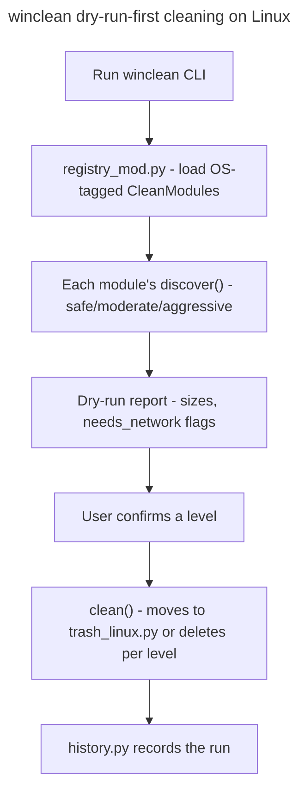

## Feature

### Summary

`scripts/winclean/` cleans Windows dev-machine disk usage (package-manager caches, browser caches, systemd-equivalent Windows logs, Recycle Bin) via a declarative `CleanModule` registry with `safe`/`moderate`/`aggressive` levels, `needs_network` tagging, and dry-run-first execution, backed by roughly 5700 lines of tests including source-scanning contract invariants (e.g. asserting `mod_dev.py` never imports `remove` directly). This lot adds Linux `CleanModule`s covering the same three levels — reimplementing the logic of the author's existing `sysclean` bash tool in Python, inside this same package, rather than shelling out to the external script — and requires the new Linux modules to be held to the same contract-test discipline as the existing Windows ones, not just basic unit coverage. Depends only on Part 1 (Linux build); independent of Part 4.

### Stack

- Python (existing `scripts/winclean/` stack)
- No new dependency identified; confirm during implementation whether `journalctl --vacuum` output parsing or Trash-spec (`~/.local/share/Trash`) handling needs anything beyond the standard library

### Branch name

`feature/multi-os/part-5-winclean-linux`

### Parent Plan

`./2026_08_05-multi-os-transformation-master.md`

### Sequence

5 of 5

### Confidence

6/10 — the declarative registry pattern generalizes cleanly, but reproducing ~5700 lines' worth of existing contract-test rigor for entirely new Linux modules is the single largest unknown-effort item in this lot.

### Time to implement

Not estimated in wall-clock time (see master plan Estimations).

## Architecture projection

### Files to modify

- `scripts/winclean/registry_mod.py` - `CleanModule` registry extended to accept OS-tagged modules; Windows modules untouched, existing registration calls unchanged
- `scripts/winclean/common.py` - shared helpers (dry-run execution, size calculation) extended for Linux path conventions where they currently assume Windows path semantics
- `scripts/winclean/procs.py` - process-detection logic (for "is this cache in use") extended for `/proc`-based detection on Linux alongside the existing Windows implementation
- `scripts/winclean/remove.py` - deletion primitives extended to route through `trash_linux.py` on Linux when a "move to trash" (non-aggressive) mode is used, matching the frozen `aggressive`-only Recycle-Bin-bypass semantics from the Windows plan
- `scripts/winclean/clean.py` - orchestration loop unchanged in structure, dispatches to OS-tagged modules from the extended registry
- `scripts/winclean/config.py` - level (`safe`/`moderate`/`aggressive`) and `needs_network` config schema unchanged; Linux module IDs added to the default enabled set
- `scripts/winclean/history.py` - cleaning history log format unchanged; confirmed to record OS-tagged module IDs without modification
- `scripts/winclean/mod_dev.py`, `mod_apps.py`, `mod_system.py` - unchanged for Windows; used as the structural template for the new Linux modules' discover/clean split
- Corresponding existing test files - extended with parametrized OS-aware cases where shared helpers (`common.py`, `procs.py`, `remove.py`) changed
- `README.md`, `CLAUDE.md`, `aidd_docs/memory/architecture.md`, `aidd_docs/memory/deployment.md` - updated in Phase 4 (closing phase of the whole master plan) to reflect `eframe`/`egui`, drop `tao`/WinUI 3 mentions, and document Linux build prerequisites and the completed multi-OS scope

### Files to create

- `scripts/winclean/mod_linux_pkg.py` + tests - `safe` level: package-manager caches (`~/.cache/pip`, `~/.cache/pnpm`, `/var/cache/apt/archives` under Debian/Ubuntu), all tagged `needs_network: true` per the frozen Windows precedent (decision 9 in master plan)
- `scripts/winclean/mod_linux_cache.py` + tests - `moderate` level: browser caches, generic `~/.cache/*`
- `scripts/winclean/mod_linux_system.py` + tests - `aggressive` level: `journalctl --vacuum` for systemd journal logs
- `scripts/winclean/trash_linux.py` + tests - user Trash handling (`~/.local/share/Trash`) per the freedesktop Trash specification, as the Linux counterpart to Windows Recycle Bin semantics
- `scripts/winclean/platform_paths.py` + tests - shared Linux path resolution helper consumed by the four modules above (avoids duplicating XDG-adjacent path logic across modules)

### Files to delete

None in this part.

## Applicable rules

| Tool | Name | Path | Why it applies |
| --- | --- | --- | --- |
| none | none | none | `list-rules.mjs` returned no configured rules for this repository |

## User Journey

## Risk register

| Risk | Impact | Mitigation |
| --- | --- | --- |
| Reimplementing `sysclean`'s logic in Python risks silently diverging from behavior the author already trusts in the bash original | New Linux modules clean the wrong things or miss targets the bash tool already handled correctly | Before writing `mod_linux_*.py`, read the existing `sysclean` bash source end-to-end and enumerate its exact discovery targets per level as an explicit checklist, cross-checked in code review against the new Python modules |
| Existing contract tests (e.g. "`mod_dev.py` never imports `remove` directly") encode invariants that a naive new module could violate without any test catching it | Linux modules ship with weaker safety guarantees than Windows ones, inconsistent with the "real equivalents, not stubs" decision (master plan decision 9) | Explicitly port each contract-test pattern from the existing Windows test suite to the new Linux modules as part of this lot's Phase 1, before writing module logic, so the safety net exists before the code it's meant to catch |
| `journalctl --vacuum` and Trash-spec deletion are both irreversible-adjacent operations | A bug during aggressive-level testing could delete real user logs or bypass Trash entirely | All new modules follow the existing dry-run-first pattern; `aggressive`-level manual testing during this lot is done against a disposable/VM environment, not the developer's primary machine |

## Implementation phases

### Phase 1: Port contract-test patterns + platform_paths helper

#### Tasks

- Enumerate the existing Windows contract-test invariants (source-scanning assertions) applicable to any `CleanModule`
- Implement `platform_paths.py`
- Write the equivalent contract tests targeting the not-yet-written Linux modules (expected to fail/be skipped until Phase 2)

#### Acceptance criteria

- [ ] Every contract-test pattern identified from the Windows suite has a corresponding (initially failing or skipped) test targeting the Linux modules
- [ ] `platform_paths.py` unit tests pass on Linux

### Phase 2: safe + moderate level modules

#### Tasks

- Implement `mod_linux_pkg.py` (safe, `needs_network: true`)
- Implement `mod_linux_cache.py` (moderate)
- Implement `trash_linux.py`

#### Acceptance criteria

- [ ] Dry-run discovery on Ubuntu LTS reports non-zero reclaimable size for at least `~/.cache/pip` when populated
- [ ] All Phase 1 contract tests targeting these two modules now pass

### Phase 3: aggressive level module + full registry integration

#### Tasks

- Implement `mod_linux_system.py` (`journalctl --vacuum`)
- Register all four new modules in `registry_mod.py` under their respective levels
- Run the full existing test suite plus new Linux tests together

#### Acceptance criteria

- [ ] `python3 -m unittest discover scripts/winclean` passes on both Windows (no regression) and Linux (new modules included)
- [ ] A manual dry-run-then-execute pass on a disposable Ubuntu LTS VM at the `aggressive` level completes without deleting anything outside the enumerated discovery targets

### Phase 4: Documentation updates + full-scope manual validation (closing phase of the master plan)

#### Tasks

- Update `README.md` and `CLAUDE.md` to reflect `eframe`/`egui`, remove `tao`/WinUI 3 mentions, and document Linux build prerequisites (target distro, required system packages if any)
- Update `aidd_docs/memory/architecture.md` and `aidd_docs/memory/deployment.md` to reflect the final multi-OS architecture (`platform::`, `src/linux/`, unified `egui` UI)
- Run the combined manual validation pass on Ubuntu LTS covering the launcher MVP acceptance bar (master plan decision 2), `system_inventory` (Part 4), and `winclean` (this part) together in one session

#### Acceptance criteria

- [ ] `README.md`/`CLAUDE.md` no longer reference `tao`, WinUI 3, or Win32-only build steps as the only supported path
- [ ] `aidd_docs/memory/architecture.md` and `aidd_docs/memory/deployment.md` describe the `platform::`/`src/linux/` split and the unified `egui` UI
- [ ] A single Ubuntu LTS session runs the launcher MVP checklist, a `system_inventory` report, and a `winclean` dry-run-then-execute pass back to back without a fresh checkout or environment reset between them

## Amendments

- 🤖 2026-08-05: Added Phase 4 (documentation updates + full-scope Ubuntu LTS validation) and the corresponding `README.md`/`CLAUDE.md`/memory files to "Files to modify" — these were listed in the master plan's architecture projection but had no owning phase in any child plan (found during `aidd-refine:02-challenge` iteration 1).

## Log

- 2026-08-05: Plan created via `aidd-dev:01-plan`, part 5 of 5.
- 2026-08-05: Added Phase 4 (documentation updates + full-scope validation) during `aidd-refine:02-challenge` iteration 1, closing the master plan's Risk register gap on doc-update ownership.

## Validation flow demonstration

1. Developer runs `python3 -m unittest discover scripts/winclean` on Windows → expect no regression versus the pre-part-5 baseline.
2. Developer runs the same command on Ubuntu LTS → expect all new Linux module tests and ported contract tests to pass.
3. Developer performs a manual dry-run at each level (safe/moderate/aggressive) on a disposable Ubuntu LTS VM → expect discovery reports matching the enumerated `sysclean` checklist from Phase 1, and expect the aggressive-level execute step to touch only the enumerated targets.
