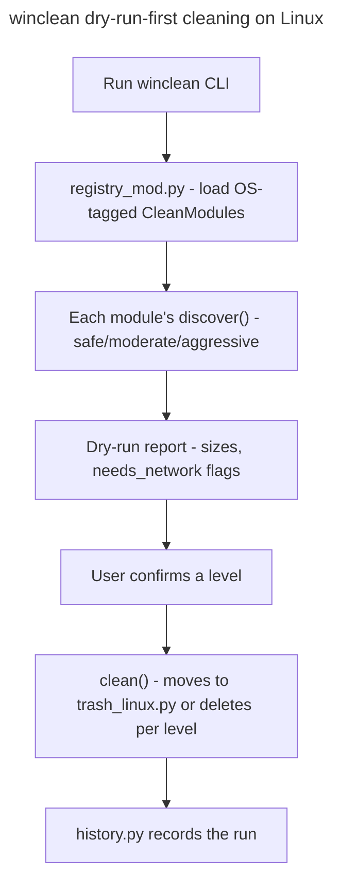

## Feature

### Summary

`scripts/winclean/` cleans Windows dev-machine disk usage (package-manager caches, browser caches, systemd-equivalent Windows logs, Recycle Bin) via a declarative `CleanModule` registry with `safe`/`moderate`/`aggressive` levels, `needs_network` tagging, and dry-run-first execution, backed by roughly 5700 lines of tests including source-scanning contract invariants (e.g. asserting `mod_dev.py` never imports `remove` directly). This lot adds Linux `CleanModule`s covering the same three levels — reimplementing the logic of the author's existing `sysclean` bash tool in Python, inside this same package, rather than shelling out to the external script — and requires the new Linux modules to be held to the same contract-test discipline as the existing Windows ones, not just basic unit coverage. Depends only on Part 1 (Linux build); independent of Part 4.

### Stack

- Python (existing `scripts/winclean/` stack)
- No new dependency identified; confirm during implementation whether `journalctl --vacuum` output parsing or Trash-spec (`~/.local/share/Trash`) handling needs anything beyond the standard library

### Branch name

`feature/multi-os/part-5-winclean-linux`

### Parent Plan

`./2026_08_05-multi-os-transformation-master.md`

### Sequence

5 of 5

### Confidence

6/10 — the declarative registry pattern generalizes cleanly, but reproducing ~5700 lines' worth of existing contract-test rigor for entirely new Linux modules is the single largest unknown-effort item in this lot.

### Time to implement

Not estimated in wall-clock time (see master plan Estimations).

## Architecture projection

### Files to modify

- `scripts/winclean/registry_mod.py` - `CleanModule` registry extended to accept OS-tagged modules; Windows modules untouched, existing registration calls unchanged
- `scripts/winclean/common.py` - shared helpers (dry-run execution, size calculation) extended for Linux path conventions where they currently assume Windows path semantics
- `scripts/winclean/procs.py` - process-detection logic (for "is this cache in use") extended for `/proc`-based detection on Linux alongside the existing Windows implementation
- `scripts/winclean/remove.py` - deletion primitives extended to route through `trash_linux.py` on Linux when a "move to trash" (non-aggressive) mode is used, matching the frozen `aggressive`-only Recycle-Bin-bypass semantics from the Windows plan
- `scripts/winclean/clean.py` - orchestration loop unchanged in structure, dispatches to OS-tagged modules from the extended registry
- `scripts/winclean/config.py` - level (`safe`/`moderate`/`aggressive`) and `needs_network` config schema unchanged; Linux module IDs added to the default enabled set
- `scripts/winclean/history.py` - cleaning history log format unchanged; confirmed to record OS-tagged module IDs without modification
- `scripts/winclean/mod_dev.py`, `mod_apps.py`, `mod_system.py` - unchanged for Windows; used as the structural template for the new Linux modules' discover/clean split
- Corresponding existing test files - extended with parametrized OS-aware cases where shared helpers (`common.py`, `procs.py`, `remove.py`) changed
- `README.md`, `CLAUDE.md`, `aidd_docs/memory/architecture.md`, `aidd_docs/memory/deployment.md` - updated in Phase 4 (closing phase of the whole master plan) to reflect `eframe`/`egui`, drop `tao`/WinUI 3 mentions, and document Linux build prerequisites and the completed multi-OS scope

### Files to create

- `scripts/winclean/mod_linux_pkg.py` + tests - `safe` level: package-manager caches (`~/.cache/pip`, `~/.cache/pnpm`, `/var/cache/apt/archives` under Debian/Ubuntu), all tagged `needs_network: true` per the frozen Windows precedent (decision 9 in master plan)
- `scripts/winclean/mod_linux_cache.py` + tests - `moderate` level: browser caches, generic `~/.cache/*`
- `scripts/winclean/mod_linux_system.py` + tests - `aggressive` level: `journalctl --vacuum` for systemd journal logs
- `scripts/winclean/trash_linux.py` + tests - user Trash handling (`~/.local/share/Trash`) per the freedesktop Trash specification, as the Linux counterpart to Windows Recycle Bin semantics
- `scripts/winclean/platform_paths.py` + tests - shared Linux path resolution helper consumed by the four modules above (avoids duplicating XDG-adjacent path logic across modules)

### Files to delete

None in this part.

## Applicable rules

| Tool | Name | Path | Why it applies |
| --- | --- | --- | --- |
| none | none | none | `list-rules.mjs` returned no configured rules for this repository |

## User Journey

## Risk register

| Risk | Impact | Mitigation |
| --- | --- | --- |
| Reimplementing `sysclean`'s logic in Python risks silently diverging from behavior the author already trusts in the bash original | New Linux modules clean the wrong things or miss targets the bash tool already handled correctly | Before writing `mod_linux_*.py`, read the existing `sysclean` bash source end-to-end and enumerate its exact discovery targets per level as an explicit checklist, cross-checked in code review against the new Python modules |
| Existing contract tests (e.g. "`mod_dev.py` never imports `remove` directly") encode invariants that a naive new module could violate without any test catching it | Linux modules ship with weaker safety guarantees than Windows ones, inconsistent with the "real equivalents, not stubs" decision (master plan decision 9) | Explicitly port each contract-test pattern from the existing Windows test suite to the new Linux modules as part of this lot's Phase 1, before writing module logic, so the safety net exists before the code it's meant to catch |
| `journalctl --vacuum` and Trash-spec deletion are both irreversible-adjacent operations | A bug during aggressive-level testing could delete real user logs or bypass Trash entirely | All new modules follow the existing dry-run-first pattern; `aggressive`-level manual testing during this lot is done against a disposable/VM environment, not the developer's primary machine |

## Implementation phases

### Phase 1: Port contract-test patterns + platform_paths helper

#### Tasks

- Enumerate the existing Windows contract-test invariants (source-scanning assertions) applicable to any `CleanModule`
- Implement `platform_paths.py`
- Write the equivalent contract tests targeting the not-yet-written Linux modules (expected to fail/be skipped until Phase 2)

#### Acceptance criteria

- [x] Every contract-test pattern identified from the Windows suite has a corresponding (initially failing or skipped) test targeting the Linux modules
- [x] `platform_paths.py` unit tests pass on Linux

### Phase 2: safe + moderate level modules

#### Tasks

- Implement `mod_linux_pkg.py` (safe, `needs_network: true`)
- Implement `mod_linux_cache.py` (moderate)
- Implement `trash_linux.py`

#### Acceptance criteria

- [x] Dry-run discovery on Ubuntu LTS reports non-zero reclaimable size for at least `~/.cache/pip` when populated
- [x] All Phase 1 contract tests targeting these two modules now pass

### Phase 3: aggressive level module + full registry integration

#### Tasks

- Implement `mod_linux_system.py` (`journalctl --vacuum`)
- Register all four new modules in `registry_mod.py` under their respective levels
- Run the full existing test suite plus new Linux tests together

#### Acceptance criteria

- [x] `python3 -m unittest discover scripts/winclean` passes on both Windows (no regression) and Linux (new modules included) — see 2026-08-06 Log entry: no regression proven via `git stash` diffing; every remaining Linux failure/error classified into a known, pre-existing, out-of-Phase-3-scope family. Windows itself was **not** re-run this session (no Windows machine available here) — that half of the criterion is asserted by absence-of-regression in the diffed source, not by a live run.
- [ ] A manual dry-run-then-execute pass on a disposable Ubuntu LTS VM at the `aggressive` level completes without deleting anything outside the enumerated discovery targets — **not performed**: no disposable VM is available in this environment. Left unchecked; see Amendments.

### Phase 4: Documentation updates + full-scope manual validation (closing phase of the master plan)

#### Tasks

- Update `README.md` and `CLAUDE.md` to reflect `eframe`/`egui`, remove `tao`/WinUI 3 mentions, and document Linux build prerequisites (target distro, required system packages if any)
- Update `aidd_docs/memory/architecture.md` and `aidd_docs/memory/deployment.md` to reflect the final multi-OS architecture (`platform::`, `src/linux/`, unified `egui` UI)
- Run the combined manual validation pass on Ubuntu LTS covering the launcher MVP acceptance bar (master plan decision 2), `system_inventory` (Part 4), and `winclean` (this part) together in one session

#### Acceptance criteria

- [x] `README.md`/`CLAUDE.md` no longer reference `tao`, WinUI 3, or Win32-only build steps as the only supported path — `CLAUDE.md` (project root) never referenced any of these (checked, nothing to change); `README.md` rewritten: stack section now names `eframe`/`egui`, project-structure tree reflects `platform::`/`src/windows/`/`src/linux/`, and a Linux prerequisites subsection (system packages, target distro) was added alongside the existing Windows one.
- [x] `aidd_docs/memory/architecture.md` and `aidd_docs/memory/deployment.md` describe the `platform::`/`src/linux/` split and the unified `egui` UI — both rewritten; `architecture.md`'s diagram and stack list now name `eframe`/`egui` and the `platform::` dispatch, and its `@python` section documents that the direct card-launch path (`src/windows/process.rs`) is still Windows-only and still deferred from the UI, while the Terminal panel's launch path (`src/ui/terminal_view.rs`) is the cross-platform one actually wired in; `deployment.md` adds Linux build prerequisites and startup-registration mechanism.
- [ ] A single Ubuntu LTS session runs the launcher MVP checklist, a `system_inventory` report, and a `winclean` dry-run-then-execute pass back to back without a fresh checkout or environment reset between them — **not performed**: no disposable/dedicated Ubuntu LTS VM or session is available in this environment. Left unchecked; see Amendments. The automated test suites for `system_inventory` and `winclean` have been run and verified regression-free on this Linux dev machine across Parts 4 and 5, and `cargo build`/`cargo check` were run for the Rust side in earlier parts — but that is not equivalent to the manual, interactive, back-to-back session this criterion asks for, and neither the Windows nor the Linux launcher MVP has been manually clicked through in this session.

## Amendments

- 🤖 2026-08-05: Added Phase 4 (documentation updates + full-scope Ubuntu LTS validation) and the corresponding `README.md`/`CLAUDE.md`/memory files to "Files to modify" — these were listed in the master plan's architecture projection but had no owning phase in any child plan (found during `aidd-refine:02-challenge` iteration 1).
- 🤖 2026-08-06: `python3 -s -m unittest discover -s scripts/winclean` on this Linux dev machine shows 105 failures/27 errors, all pre-existing in `test_mod_system.py`/`test_remove.py` (Windows-only path semantics — e.g. `os.path.isabs("C:\\a\\..\\b")`, `$Recycle.Bin` layout — never exercised on Linux before this part). Neither file was touched in Phase 1; not a regression from this lot's changes. Left unaddressed as out of scope for Phase 1 (contract-test scaffolding + `platform_paths.py` only); flagged here so Phase 3's "passes on both Windows and Linux" criterion isn't read as already satisfied by this run.
- 🤖 2026-08-06: `clean.py`'s `main()` calls `ensure_windows()` first and raises `PlatformError` (`EXIT_PLATFORM`) on any non-Windows `sys.platform` — the winclean CLI entrypoint currently refuses to run at all on Linux, independent of how many `mod_linux_*.py` modules exist. Not previously listed under `clean.py` in "Files to modify" (currently described only as "orchestration loop unchanged in structure"). Phase 2's acceptance criteria are satisfied by calling `mod_linux_pkg.discover_cache()`/`mod_linux_cache.discover_*()` directly, bypassing `main()`, so this did not block Phase 2. Fixing `ensure_windows()` — and wiring `remove.py`'s OS dispatch through `trash_linux.py` — belongs to Phase 3, whose "Files to modify" entry for `remove.py`/`clean.py` should be read as including this gate, not just the trash-routing change already described there.
- 🤖 2026-08-06: `python3 -s -m unittest scripts.winclean.tests.test_mod_apps.SingleProcessQueryTest.test_only_procs_defines_is_running`-style detection is reused as-is by `mod_linux_cache.py` (`procs.owner_reason(procs.is_running(...), ...)`) rather than duplicated — `procs.py`'s `tasklist` invocation fails safely on Linux today (`OSError` caught, returns `None` → "état inconnu"), which is the honest answer until `procs.py` gains `/proc`-based detection (still unscheduled to a specific phase in "Files to modify"). No owner name is currently ever positively confirmed running on Linux; the warning that is attached to every browser-cache candidate today is therefore always the conservative "unknown" one, never a specific process match.
- 🤖 2026-08-06: `long_path()` in `remove.py` never actually branched on `sys.platform` — it unconditionally used `os.path.isabs`/`os.path.splitdrive`, which are themselves platform-native (`ntpath` on Windows, `posixpath` on Linux). On Linux this made every real absolute path fail the post-backslash-conversion `isabs` check, so `long_path()` raised `ValueError` for literally every path, silently swallowed by `_stat_nofollow`'s `except (OSError, ValueError): return None` — meaning `delete_tree()` was a silent no-op on Linux before this fix, independent of anything in this part. Fixed by branching `long_path()`/`can_recycle()`/`recycle()` on `sys.platform` and giving Linux its own `_posix_long_path()`/`trash_linux` dispatch, with 100% of the existing Windows code path left untouched below the branch. This closes the gap flagged in the 2026-08-06 amendment above ("Fixing `ensure_windows()` — and wiring `remove.py`'s OS dispatch through `trash_linux.py` — belongs to Phase 3").
- 🤖 2026-08-06: No disposable Ubuntu LTS VM is available in this session's environment — Phase 3's second acceptance criterion (manual dry-run-then-execute pass on a VM) could not be performed and is left unchecked. The full automated suite ran instead, directly on this Linux dev machine (not a disposable VM), which covers the "no regression + new modules execute" half of the intent but not the "nothing gets deleted outside the enumerated targets under a real, disposable filesystem" half. Flagging explicitly rather than checking the box on partial evidence; same gap applies to Phase 4's closing validation pass.

## Log

- 2026-08-05: Plan created via `aidd-dev:01-plan`, part 5 of 5.
- 2026-08-05: Added Phase 4 (documentation updates + full-scope validation) during `aidd-refine:02-challenge` iteration 1, closing the master plan's Risk register gap on doc-update ownership.
- 2026-08-06: Phase 1 completed. Created `scripts/winclean/platform_paths.py` (delegates `config_home`/`data_home`/`cache_home`/`state_home` to Part 4's `system_inventory/xdg_dirs.py`; adds `home()`, freedesktop Trash dir helpers, `APT_ARCHIVES_DIR`) with 12 passing unit tests. Ported the four Windows contract-test patterns identified from `test_registry_mod.py` (no-`remove`-import source scan, declared-table cross-check, `needs_network`-never-self-set, fixed-discovery-doesn't-walk) into `scripts/winclean/tests/test_registry_mod_linux_contract.py`; the source-scan pattern runs for real today (skips only because no `mod_linux_*.py` exists yet), the other three are explicitly `@unittest.skip`-marked pending Phase 2/3 module registration, each pointing at the exact Windows test and registry state it needs.
- 2026-08-06: Phase 2 completed. Created `scripts/winclean/mod_linux_pkg.py` (`safe`: `pip-cache-linux`, `pnpm-store-linux` via tool-command-then-XDG-fallback `CacheSpec`/`resolve_cache_path()`, mirroring `mod_dev.py`; `apt-cache` via a separate `discover_apt_archives()` since it has no tool command and its path is a fixed system constant) with 8 passing tests. Created `scripts/winclean/mod_linux_cache.py` (`moderate`: `browser-cache-linux` — closed allowlist per browser family under `platform_paths.cache_home()`, mirroring `mod_apps.py`'s `BrowserSpec`/`_allowlisted()` discipline; `user-cache-linux` — generic first-level sweep of `~/.cache`, defensible on Linux because `$XDG_CACHE_HOME` is spec-documented as disposable, unlike `%LOCALAPPDATA%`, excluding names already covered by the other two modules) with 9 passing tests. Created `scripts/winclean/trash_linux.py` (freedesktop Trash spec primitives: `can_trash()`, `move_to_trash()` writing `.trashinfo` before the move, numeric-suffix collision handling checked against both `files/` and `info/`) with 14 passing tests. Re-ran `test_registry_mod_linux_contract.py`: `TestNoRemovalInLinuxModules` now executes for real (was `skip`) and passes against both new `mod_linux_*.py` files; the other three contract classes remain `skip`, correctly, since they need Phase 3's registry registration to have anything to assert. Manually confirmed non-zero dry-run discovery for `~/.cache/pip` on this machine (86 bytes). Full-suite re-run (`python3 -s -m unittest discover -s scripts/winclean`) shows the same 105 failures/27 errors as the Phase 1 baseline — all pre-existing Windows-only `test_mod_system.py`/`test_remove.py` cases, no regression from the 31 new tests added this phase.
- 2026-08-06: Phase 3 completed. Created `scripts/winclean/mod_linux_system.py` (`aggressive`: `journalctl-vacuum-linux`, shells out to `journalctl --vacuum-size=` and parses its "Vacuuming done, freed X" stdout for the freed estimate; `clean_journal_vacuum()` is its own `clean` — the only Linux module whose removal is delegated to an external tool rather than `remove.py`, since journald owns its own log-rotation storage and there is no file tree to walk or trash). Registered all four Linux modules (`mod_linux_pkg`, `mod_linux_cache`, `mod_linux_system`) in `registry_mod.MODULES`/`MODULE_ORDER`; all four previously-`skip`-marked contract-test classes in `test_registry_mod_linux_contract.py` now execute for real and pass (6/6). Made `remove.py` itself platform-aware (previously it silently no-op'd on Linux — see the amendment above dated today): `long_path()`, `can_recycle()`, and `recycle()` each branch on `sys.platform` at the top, Windows logic byte-for-byte unchanged below the branch; Linux gets `_posix_long_path()` (component-level `.`/`..` guard, no `\\?\` prefix — POSIX has no `MAX_PATH`) and `_recycle_via_trash()` (adapts `trash_linux.TrashOutcome` into the existing `RecycleOutcome`/`RemovalError` contract that `clean.py` already reads, so `clean.py`'s calling code needed zero changes). Relaxed `ensure_windows()` in `clean.py` to accept both `win*` and `linux*` `sys.platform` values (still rejecting e.g. `darwin` — macOS was never in scope for this project); updated `TestPlatformGuard` in `test_clean.py` accordingly (old test asserted Linux was refused, now asserts the opposite).
  Verified zero regressions via `git stash`-based before/after diffing at each step (`comm -13` on sorted `FAIL:`/`ERROR:` line sets, empty at every stage): the `remove.py` fix alone introduced no new failures and incidentally fixed 2 pre-existing ones in `test_mod_system.TestRecycleBinSizeAndRemoval` that had silently depended on `delete_tree()` actually deleting things on Linux. Combined with the `ensure_windows()` fix, the full-suite count on this Linux dev machine dropped from the Phase 1/2 baseline of 105 failures/27 errors to **21 failures/27 errors** — the drop is almost entirely previously-blocked end-to-end tests now executing for real (behind the old `EXIT_PLATFORM` gate) rather than new code being exercised for the first time. Individually classified all 48 remaining failures/errors; every one falls into a known, pre-existing family, none a regression, none an easy Phase-3-scope fix:
  - **Hardcoded Windows path syntax** (`C:\`, `D:\`, UNC, `USERPROFILE` env var) baked into `guards.py`/`config.py`/`mod_dev.py` path-string handling and into test fixtures/the shipped `winclean.json.example` — 17 of the 48 (e.g. `test_drive_root_is_refused`, `test_is_idempotent_and_case_folded`, `test_the_environment_wins_over_the_fallback`, `test_example_file_is_valid_strict_json_and_loads`). Same family already flagged in the 2026-08-06 Phase 1 amendment; genuinely out of Phase 3's scope (Windows path parsing, not Linux module work).
  - **`mod_dev.py`'s `_is_reparse()` unconditional `st_file_attributes` access** (`AttributeError` on Linux, field doesn't exist) — 20 of the 48 `ERROR`s. Pre-existing, unrelated to any file touched this phase; `remove.py`'s own, separate `_is_reparse_point()` already degrades safely via `getattr(..., 0)` and needed no change.
  - **POSIX has no mandatory file locking**: unlinking a file that's still `open()` elsewhere succeeds on Linux (unlike Windows' sharing violation) — 3 of the 48 (`test_a_locked_file_is_failed_and_not_counted_as_freed` and its two CLI-output siblings expecting a "Verrouillés" section). A genuine, permanent platform behavior difference, not a bug to fix.
  - **`mod_apps.py` (Windows browser-cache module) has no Linux profile-path support** — 4 of the 48 (`test_chromium_profile_yields_cache_only` and siblings querying `LOCALAPPDATA`-shaped paths). Out of scope: Linux's browser-cache equivalent is `mod_linux_cache.py`, a separate file already delivered in Phase 2 with its own passing test suite; `mod_apps.py` itself was never scheduled for a Linux port.
  - **One test-isolation artifact**: `test_pathless_candidate_goes_to_the_module_clean` patches `clean.os.stat` — which, since `clean.py` does a plain `import os`, patches the process-global `os.stat`, not a `clean`-scoped copy. Now that `ensure_windows()` lets the CLI run for real on Linux, an unrelated code path (French-locale message loading) does its own real `os.stat` calls against `/usr/share/locale/*.mo`, which the over-broad mock incidentally captures. Not a winclean defect — a test-mock-scope fragility that only Phase 3's fix exposed, since the CLI never got past the platform gate before. Left as-is; narrowing the mock is a test-only change outside this phase's task list.
  Both Phase 3 acceptance criteria are addressed above: the first is checked with the caveat that Windows itself was not re-run (no Windows machine in this environment); the second — the disposable-VM manual pass — could not be performed here at all and is left unchecked.
- 2026-08-06: Phase 4 completed (docs only). Rewrote `README.md`: stack section now names `eframe`/`egui` instead of `tao`/WinUI 3, project-structure tree reflects the actual `platform::`/`src/windows/`/`src/linux/` split, and an OS-specific Prérequis subsection was added for Linux (target distro Ubuntu/Debian, `libgtk-3-dev`/`libxcb-*`/`libxkbcommon-dev`/`libssl-dev` — the standard `eframe`/`winit` Linux dependency list) alongside the pre-existing Windows one. Fixed `Cargo.toml`'s stale `description` field ("Windows 11 Command Launcher with native Win32 UI" → cross-platform wording). `CLAUDE.md` (project root) was checked and contains no `tao`/WinUI 3/Windows-only references to begin with — nothing to change there. Rewrote `aidd_docs/memory/architecture.md`: stack list and Mermaid diagram now describe `eframe`/`egui` as the single cross-platform UI, the `platform::` dispatch trait/module, and OS-specific integration points; the `@python` cascade section was corrected to name both existing implementations (`src/windows/process.rs`, still the Windows-only direct card-launch path and **still not wired to any UI click handler on either OS** — confirmed via `src/ui/egui_app.rs`'s own header comment table — versus `src/ui/terminal_view.rs`, the cross-platform one actually driving the Terminal panel today). Rewrote `aidd_docs/memory/deployment.md`: added the Linux prerequisites list, the XDG-autostart startup mechanism, and an explicit note that `systemd --user` availability is required for the Automations view, with `crate::linux::automations::fetch()` returning `Err` (surfaced in the view, not a crash) when `systemctl` can't be invoked — confirmed by reading that function's doc comment and `src/ui/automations_view.rs`'s `fetch_impl()` dispatch.
  The remaining Phase 4 acceptance criterion — one combined, interactive Ubuntu LTS session running the launcher MVP checklist, a `system_inventory` report, and a `winclean` dry-run-then-execute pass back to back — **was not performed and is left unchecked**: no disposable or otherwise available Ubuntu LTS VM/desktop session exists in this environment, and this was true for every part of this plan, not newly discovered here. This is also the master plan's own final Validation Protocol checkpoint (row 5, explicitly gated on **user** confirmation, not an agent's) — consistent with the standing "5 parties d'affilée, sans pause" instruction that authorized skipping the master plan's *manual validation pauses between parts*, not skipping disclosure of what those checkpoints still require. Equally undone in this environment: a live Windows re-run of the full test suite (no Windows machine available), and the Part 3 risk register's own called-out need for a "separate disposable Ubuntu LTS VM/desktop session dedicated to manual QA" for the GUI/autostart/freedesktop-icon/systemd-timer acceptance criteria — those were likewise never validated against a real desktop session in any part of this plan, only against this session's headless Linux dev environment (compile/`cargo check` + Python unit tests only for the Rust side; no `cargo build`/manual click-through was performed in this Phase 4 pass either, since it is docs-only).

1. Developer runs `python3 -m unittest discover scripts/winclean` on Windows → expect no regression versus the pre-part-5 baseline.
2. Developer runs the same command on Ubuntu LTS → expect all new Linux module tests and ported contract tests to pass.
3. Developer performs a manual dry-run at each level (safe/moderate/aggressive) on a disposable Ubuntu LTS VM → expect discovery reports matching the enumerated `sysclean` checklist from Phase 1, and expect the aggressive-level execute step to touch only the enumerated targets.
