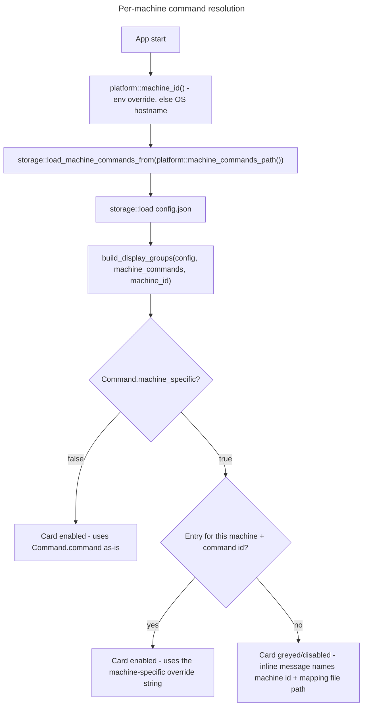

# Master Plan: Per-Machine Command Mapping

## Overview

- **Goal**: Let a `Command`'s actual launch string (path and/or arguments, not just the binary path) resolve differently depending on which machine DevToolBox is running on, through an explicit machine-id -> command mapping stored outside `config.json`. A card whose command is marked machine-specific and has no matching entry for the current machine stays visible but renders disabled/greyed with a clear message, instead of launching a wrong path or silently falling back. Source: brainstorm session on 2026-08-06, requirements validated with the user (see Frozen decisions).
- **Risk Score**: 9/10
  - Breaking changes to internals: `Command`'s field set, `build_display_groups()`'s signature, `CardData`'s shape, and `EguiApp`'s construction all change (+3)
  - Schema migration: `Command` gains a field and a new on-disk file format (`machine-commands.json`) is introduced, with explicit backward/forward compatibility handling (+3)
  - 5+ modules affected: `src/storage/`, `src/platform/` (both OS impls), `src/ui/`, `config/*.json`, `aidd_docs/memory/` (+3)
- **Branch**: `feature/machine-commands/`

## Frozen decisions (from validated brainstorm — do NOT revisit)

1. **Resolution model**: explicit machine-id -> real-command mapping. No automatic binary discovery/detection of any kind.
2. **Scope**: the whole command string (path + arguments) can vary per machine, not just the binary path — different installed versions can expose a different CLI.
3. **Unconfigured behavior**: if the current machine has no mapping entry for a machine-specific command, the card stays visible in the grid but renders disabled/greyed-out, with a clear inline message. No popup at click time, no silent fallback to a default or to the base `command` string.
4. **`Command.command` stays machine-agnostic by default.** A new `machine_specific: bool` field (default `false`) opts a command into per-machine resolution. This preserves every existing entry in `config/default.json`, `config/default.linux.json`, and `config/builtin-actions.json` without any rewrite.
5. **Mapping storage is a separate, non-synced file** (`machine-commands.json`), not a section inside `config.json` — `config.json` is rewritten wholesale on every persist (favorite toggle, category edit) and is the plausible sync candidate; the per-machine map must not travel with it. To actually deliver non-synced separation (a directory-level sync tool such as Dropbox/OneDrive/MEGA would sweep up any file placed next to `config.json`, defeating a same-directory "separate file"), the mapping file is placed alongside `state_log_path()`'s directory, not `config_path()`'s: `%LOCALAPPDATA%\DevToolBox\` (non-roaming) on Windows, `$XDG_STATE_HOME/devtoolbox/` on Linux — reusing the codebase's existing machine-local-state convention rather than inventing a new one. 🤖 Amended after `/aidd-refine:02-challenge` found the original same-directory-as-config_path design contradicted this decision's own stated purpose.
6. **Machine identity**: `DEVTOOLBOX_MACHINE_ID` env var takes priority when set (stable escape hatch, independent of hostname); otherwise OS hostname (`%COMPUTERNAME%` on Windows, `/etc/hostname` on Linux — not `$HOSTNAME`, which is not exported to non-interactive processes). No new crate, no new `windows` crate feature.
7. **Builtin `@python` actions** (`config/builtin-actions.json`, all 14 entries — the 10 `launch_rust_app.py`-based `email-to-markdown-{auto,release,debug,build-release,build-debug}` and `lyremember-{auto,release,debug,build-release,build-debug}`, plus the 4 `sftp_fetch.py`-based `sftp-{pro,perso,hermes,all}`) are left as `machine_specific: false` — universal, not in scope for this mechanism. Explicit decision, not an oversight. 🤖 Corrected entry count from 5 to 10 after `/aidd-refine:02-challenge` iteration 2 found the original count factually wrong against `config/builtin-actions.json`. Iteration 3: broadened scope from the 10 named `launch_rust_app.py` entries to all 14 `@python` actions, including the 4 `sftp_fetch.py`-based entries omitted from the original wording (confirmed by the existing `assert_eq!(python_actions.len(), 14)` test in `src/windows/process.rs`/`src/ui/terminal_view.rs`).
8. **Merge-staleness limitation accepted, not fixed**: `storage::json::merge_builtin_actions()` bakes builtin fields into `config.json` on first save; a future change to a builtin's `machine_specific` flag will not reach a user whose `config.json` already contains that command id. Documented in `architecture.md` as a known limitation.
9. **Out of scope this iteration**: no UI editor for the mapping file (hand-edited JSON, per the example file shipped in Phase 4); no click-to-launch wiring (still deferred project-wide, unrelated to this feature — this plan only prepares the resolution seam it will plug into).

## Architecture projection

### Files to modify

- `src/storage/models.rs` - `Command` gains `#[serde(default)] machine_specific: bool`; add `#[derive(Default)]` so the ~11 existing struct literals across the tree can adopt `..Default::default()`
- `src/storage/json.rs` - update its 2 existing `Command { ... }` struct literals (both test-only, inside `mod tests`' `sample_config()`) for the new `machine_specific` field
- `src/storage/mod.rs` - re-export the new `machine_commands` module through the existing facade
- `src/storage/commands.rs`, `src/storage/categories.rs` - update their `Command { ... }` struct literals for the new field
- `src/platform/mod.rs` - add `machine_id() -> String` and `machine_commands_path() -> PathBuf`, dispatched via the same `#[cfg(windows)]`/`#[cfg(target_os = "linux")]` pattern as `config_path()`
- `src/platform/linux.rs` - `machine_id()` (env override, then `/etc/hostname`) and `machine_commands_path()` (`$XDG_STATE_HOME`/`~/.local/state` counterpart to `state_log_path()`, not `config_path()` — see decision 5), extending the module's existing `*_with_env(&EnvLookup)` testable-injection idiom with a second, file-read-capable injection point for the `/etc/hostname` lookup
- `src/platform/windows.rs` - `machine_id()` (env override, then `%COMPUTERNAME%`) and `machine_commands_path()` (`%LOCALAPPDATA%\DevToolBox\`, mirroring `state_log_path()`, not `%APPDATA%` — see decision 5)
- `src/ui/egui_app.rs` - `CardData` carries the resolution outcome; `build_display_groups()` takes the machine mapping and machine id as additional parameters (updates its 2 existing test call sites plus its 1 production call site at line 675); update its own `Command { ... }` test-fixture struct literals; `render_card()` renders the disabled/greyed state without disabling the favorite-toggle button; `EguiApp` construction loads the mapping and resolves the machine id once at startup
- `aidd_docs/memory/architecture.md` - document the new per-machine resolution stage and the merge-staleness limitation

<!-- 🤖 Amended after /aidd-refine:02-challenge: added commands.rs/categories.rs (real Command-literal work missed from this list), removed windows/process.rs (it has zero Command struct literals — only unrelated std::process::Command and a Vec<Command> type annotation in test code), corrected the literal count, and switched the mapping-file directory convention from config_path()'s to state_log_path()'s per the decision-5 fix above. -->

### Files to create

- `src/storage/machine_commands.rs` - `MachineCommands` serde model (`{ machines: BTreeMap<String, BTreeMap<String, String>> }`), `load_machine_commands_from(&Path)` / `save_machine_commands_to(&Path, ...)` mirroring the existing `load_from`/`save_to` path-injection pattern (missing file resolves to an empty map, not an error), and the pure `resolve_command(&Command, &MachineCommands, &str) -> CommandResolution` function, unit-testable without I/O

<!-- 🤖 Amended after /aidd-refine:02-challenge iteration 3: this entry previously omitted `load_machine_commands_from`/`save_machine_commands_to`, which the master's `src/storage/json.rs` entry wrongly claimed instead — Part 1 (the authoritative child plan, lines 51/92) places both functions here, in `machine_commands.rs`, not in `json.rs`. Corrected to match Part 1 exactly. -->
- `config/machine-commands.example.json` - documented template showing the exact keys a user fills in per machine

### Files to delete

None.

## Applicable rules

None — `list-rules.mjs` returned an empty inventory (no `.cursor/rules`, path-scoped Copilot/OpenCode rules, or similar detected in this repository).

## User Journey

## Risk register

| Risk | Impact | Mitigation |
| --- | --- | --- |
| Machine id is mutable (hostname rename) | All mappings for that machine silently stop resolving after a rename | `DEVTOOLBOX_MACHINE_ID` env override gives a stable identity independent of the OS hostname (decision 6) |
| No mapping-file editor exists | Feature is undiscoverable without reading docs | Phase 3's disabled-state message names the exact file path and machine id; Phase 4 ships a documented example file |
| `merge_builtin_actions()` bakes builtin fields into `config.json` on first save | A future `machine_specific` change to a builtin action never reaches users with an existing `config.json` | Accepted and documented as a known limitation (decision 8, Phase 4), not fixed this iteration |
| ~11 `Command` struct literals across `json.rs` (2), `categories.rs` (1), `commands.rs` (2), `egui_app.rs` (6) need the new field | Broad mechanical touch increases the chance of a missed literal breaking the build | `Command` gains `#[derive(Default)]` in Phase 2 so each literal needs only `..Default::default()`, not an explicit new line; a missed literal fails `cargo build` immediately rather than silently |
| Placing the mapping file in the same directory as `config.json` would let directory-level sync tools (Dropbox/OneDrive/MEGA) sweep it up anyway, defeating decision 5's purpose | The "separate file" protection would only work against filename-scoped sync, not the more common folder-scoped sync | `machine_commands_path()` reuses `state_log_path()`'s directory convention (`%LOCALAPPDATA%`/`$XDG_STATE_HOME`), an established machine-local-only precedent in this codebase, instead of `config_path()`'s directory |
| `Config` has no `deny_unknown_fields` | An older binary reading a newer `config.json` would silently drop unknown fields on next save — mitigated by keeping the mapping in a separate file rather than inside `config.json` | Decision 5 (separate file) limits the blast radius; not addressed further this iteration |

## Child Plans

| #   | Plan                                          | File                                                              | Status  | Validated |
| --- | ---------------------------------------------- | ------------------------------------------------------------------ | ------- | --------- |
| 1   | Machine identity & mapping storage             | `./2026_08_06-per-machine-command-mapping-part-1.md`               | pending | [ ]       |
| 2   | Command resolution                             | `./2026_08_06-per-machine-command-mapping-part-2.md`               | blocked | [ ]       |
| 3   | UI greyed-out state                            | `./2026_08_06-per-machine-command-mapping-part-3.md`               | blocked | [ ]       |
| 4   | Documentation                                  | `./2026_08_06-per-machine-command-mapping-part-4.md`               | blocked | [ ]       |

<!-- Status values: pending, in-progress, done, blocked -->
<!-- RULE: Plan N+1 blocked until Plan N checkbox checked -->

## Validation Protocol

| Step | Action | Gate |
| --- | --- | --- |
| 1 | Complete Part 1: run `cargo test` (new `platform`/`storage` unit tests) | [ ] Checkpoint 1 — user confirms machine id resolution and mapping load/save behave as specified |
| 2 | Complete Part 2: run `cargo test` (resolution logic + updated fixtures) | [ ] Checkpoint 2 — user confirms `resolve_command` handles all three cases (non-machine-specific, resolved override, unconfigured) |
| 3 | Complete Part 3: run the app, resize-test the grid, exercise a manually configured machine-specific card in both resolved and unconfigured states | [ ] Checkpoint 3 — user confirms the disabled/greyed state and its message meet expectations |
| 4 | Complete Part 4: review `architecture.md` and `config/machine-commands.example.json` | [ ] Final — user confirms documentation is accurate and sufficient to self-serve a new machine's mapping |

## Estimations

- **Confidence**: 9/10
  - ✓ Architecture projection validated against the actual codebase (real struct/function names, not guesswork), via a dedicated exploration pass
  - ✓ No production code path reads `Command.command` today at all — it is read only inside `#[cfg(test)]` code (`windows/process.rs`, `terminal_view.rs`); the terminal view launches free-typed user input, not `Command.command`. This makes the safety case stronger than initially stated: no live launch behavior is at risk of regressing. 🤖 Corrected after `/aidd-refine:02-challenge` found the original "terminal view is a production consumer" framing inaccurate.
  - ✓ All 4 open questions raised during exploration (default-string semantics, merge staleness, machine id case-sensitivity, favorite-button interaction) were resolved before this plan was written
  - ✗ Risk: exact wording of the disabled-state message is not yet user-validated — Phase 3 includes it as an explicit review point, not assumed correct on first pass
  - ✗ Risk: no live Windows machine available in this environment to validate `%COMPUTERNAME%`/`%LOCALAPPDATA%` behavior — Part 1 and Part 3 acceptance criteria rely on code review and `#[cfg(windows)]`-gated unit tests reasoned about, not executed, in this session <!-- 🤖 Corrected "%APPDATA%" to "%LOCALAPPDATA%" after /aidd-refine:02-challenge iteration 2 — %LOCALAPPDATA% is what machine_commands_path() actually uses per the decision-5 fix; %APPDATA% belongs to the untouched config_path(). -->
- **Duration**: not estimated in wall-clock time; sequenced by dependency (Part 1 blocks Part 2, which blocks Part 3; Part 4 can start once Part 3's UI wiring is stable)
