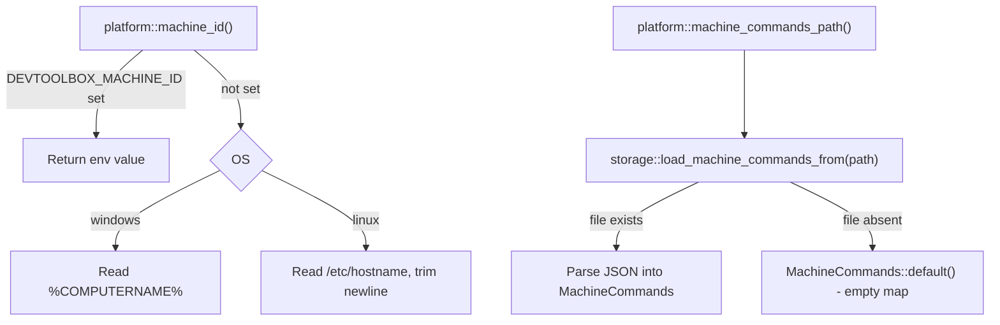

## Feature

### Summary

Today `src/platform/` exposes only `config_path()`, `data_dir()`, `state_log_path()`, and the `StartupProvider` trait — no notion of "which machine is this" exists anywhere in the codebase. This lot adds `machine_id()` (env-var override, else OS hostname) and `machine_commands_path()` to `platform::`, plus a new `src/storage/machine_commands.rs` module with a `MachineCommands` serde model and load/save functions mirroring the existing `config.json` pattern. It does not touch `Command` or any UI code — it only lays the foundation Part 2 resolves against.

### Stack

- Rust workspace, edition 2021 (unchanged)
- No new crate (`machine_id()` uses `std::env::var` + `std::fs::read_to_string("/etc/hostname")` on Linux, `std::env::var("COMPUTERNAME")` on Windows)

### Branch name

`feature/machine-commands/part-1-identity-storage`

### Parent Plan

`./2026_08_06-per-machine-command-mapping-master.md`

### Sequence

1 of 4

### Confidence

9/10 — purely additive, no existing call site changes; the only unknown is exact `/etc/hostname` trimming behavior (trailing newline), covered by a unit test.

### Time to implement

Not estimated in wall-clock time (see master plan Estimations).

## Architecture projection

### Files to modify

- `src/platform/mod.rs` - add `machine_id() -> String` and `machine_commands_path() -> PathBuf`, dispatched via the existing `#[cfg(windows)]`/`#[cfg(target_os = "linux")]` pattern used by `config_path()`
- `src/platform/linux.rs` - implement `machine_id()` (env override `DEVTOOLBOX_MACHINE_ID`, else trimmed `/etc/hostname` content) and `machine_commands_path()` (`$XDG_STATE_HOME`/`~/.local/state` + `devtoolbox/machine-commands.json` — mirrors `state_log_path()`'s directory, deliberately NOT `config_path()`'s `$XDG_CONFIG_HOME`, so a directory-level sync tool watching the config folder does not sweep up the mapping file); extends the module's existing `*_with_env(&EnvLookup)` idiom (env-var lookups only) with a second, file-read-capable injection point for the `/etc/hostname` read, since `EnvLookup`'s `Fn(&str) -> Option<String>` shape cannot itself model a filesystem read
- `src/platform/windows.rs` - implement `machine_id()` (env override, else `%COMPUTERNAME%`) and `machine_commands_path()` (`%LOCALAPPDATA%\DevToolBox\machine-commands.json` — mirrors `state_log_path()`'s non-roaming directory, deliberately NOT `config_path()`'s roaming `%APPDATA%`)
- `src/storage/mod.rs` - re-export the new `machine_commands` module's public items through the existing facade

### Files to create

- `src/storage/machine_commands.rs` - `MachineCommands { machines: BTreeMap<String, BTreeMap<String, String>> }` (serde `Serialize`/`Deserialize`, `Default`); `load_machine_commands_from(&Path) -> MachineCommands` (missing file -> `MachineCommands::default()`, not an error; malformed JSON -> propagate the parse error, same behavior as `config.json` loading); `save_machine_commands_to(&Path, &MachineCommands) -> io::Result<()>`

### Files to delete

None.

## Applicable rules

None — `list-rules.mjs` returned an empty inventory.

## User Journey

## Risk register

| Risk | Impact | Mitigation |
| --- | --- | --- |
| `/etc/hostname` may be absent on minimal containers/distros | `machine_id()` would panic or return an unexpected value | Fall back to a fixed `"unknown"` sentinel string (matches nothing in any mapping, degrading gracefully to "unconfigured" downstream, never a panic) |
| Malformed `machine-commands.json` (hand-edited by the user) | A JSON syntax error should not be indistinguishable from "no mapping" | `load_machine_commands_from` propagates the parse error distinctly from the missing-file case, so a syntax error surfaces instead of silently behaving as empty |

## Implementation phases

### Phase 1: Machine identity & mapping storage

> Add machine id resolution and a loadable/savable mapping file, independent of any consumer.

#### Tasks

1. Add `machine_id()` and `machine_commands_path()` to `src/platform/mod.rs`, dispatching to OS-specific implementations.
2. Implement both in `src/platform/linux.rs` using the existing `*_with_env` testable idiom; unit-test the `DEVTOOLBOX_MACHINE_ID` override and the `/etc/hostname` fallback (including trailing-newline trimming) via injected env/file lookups.
3. Implement both in `src/platform/windows.rs` (code reviewed, not executed in this environment — no Windows toolchain available here).
4. Create `src/storage/machine_commands.rs` with the `MachineCommands` model and `load_machine_commands_from`/`save_machine_commands_to`.
5. Unit-test: missing file returns an empty `MachineCommands` (no error); a round-trip save-then-load returns the same content; malformed JSON returns a distinct error, not an empty map.
6. Re-export the new module through `src/storage/mod.rs`.

#### Acceptance criteria

- [x] `platform::machine_id()` returns `DEVTOOLBOX_MACHINE_ID` when set, on both cfg-gated implementations
- [x] `platform::machine_id()` falls back to the OS-specific hostname source when the env var is unset, with a safe `"unknown"` sentinel if that source is also unavailable
- [x] `platform::machine_commands_path()` follows the same directory-resolution convention as `state_log_path()`, not `config_path()` (`$XDG_STATE_HOME` on Linux, `%LOCALAPPDATA%` on Windows), so it stays outside the config directory a sync tool would target
- [x] `storage::machine_commands::load_machine_commands_from` returns an empty map for a missing file and a distinct error for malformed JSON
- [x] `cargo test` passes on Linux, including all new unit tests

## Amendments

<!-- AI-initiated changes during implementation. Each entry is prefixed with 🤖. -->

🤖 The "Files to create" line for `src/storage/machine_commands.rs` writes `load_machine_commands_from(&Path) -> MachineCommands`, but its own parenthetical requires "malformed JSON -> propagate the parse error" as *distinct* from the missing-file case, which returns the empty default with no error. Those two requirements together are only satisfiable with a `Result`-returning signature (a bare `-> MachineCommands` return type has nowhere to carry a propagated error). Implemented as `load_machine_commands_from(path: &Path) -> Result<MachineCommands, MachineCommandsError>`, where a missing file yields `Ok(MachineCommands::default())` (not `Err`) and malformed JSON yields `Err(MachineCommandsError::Parse(_))`. Added `MachineCommandsError` (`Io`/`Parse` variants, `Display`/`Error` impls) mirroring `storage::json::StorageError`'s shape. No behavioral deviation from the plan's intent — this only makes the already-specified behavior compile.

🤖 The frontmatter `success_condition: cargo test --lib platform:: storage::machine_commands::` does not run verbatim: (1) this package (`Cargo.toml`) declares only a `[[bin]]` target (`devtoolbox`), no `[lib]` target, so `cargo test --lib` fails with `error: no library targets found in package`; (2) `cargo test` accepts exactly one `TESTNAME` filter positional argument, so passing both `platform::` and `storage::machine_commands::` in one invocation is a CLI usage error, not two combined filters. Verified as two separate invocations instead: `cargo test platform::` (17 passed) and `cargo test storage::machine_commands::` (4 passed) — both against the unittests binary built from `src/main.rs` (the crate's only test-bearing target, since there is no lib target to target separately). Full-suite `cargo test` (142 passed, 0 failed, 2 ignored, pre-existing/unrelated) confirms no regressions.

## Log

<!-- APPEND ONLY. One entry per step attempt. Never rewrite. -->

- 2026-08-06: Phase 1 implemented in full. `platform::machine_id()` / `platform::machine_commands_path()` added to `src/platform/mod.rs` (cfg-dispatched), `src/platform/linux.rs` (new `HostnameFileReader` injection point alongside the existing `EnvLookup` idiom; tested), and `src/platform/windows.rs` (written, not executed — no Windows toolchain in this environment, matches the plan's confidence note). New `src/storage/machine_commands.rs` with `MachineCommands`, `MachineCommandsError`, `load_machine_commands_from`, `save_machine_commands_to`; re-exported through `src/storage/mod.rs`. All required unit tests written and passing: `cargo test platform::` (17 passed) and `cargo test storage::machine_commands::` (4 passed); full `cargo test` (142 passed, 0 failed, 2 ignored, all pre-existing/unrelated). All 5 acceptance criteria met. Two amendments recorded above (return-type clarification for `load_machine_commands_from`; `success_condition` command correction for this bin-only crate).

## Validation flow demonstration

1. Run `cargo test platform:: storage::machine_commands::` — all new tests pass.
2. Set `DEVTOOLBOX_MACHINE_ID=test-machine`, call `platform::machine_id()` in a small scratch check — returns `"test-machine"`.
3. Point `machine_commands_path()` at a scratch directory with no file present — `load_machine_commands_from` returns an empty map without error.
4. Save a `MachineCommands` with one entry to that path, reload it — content matches exactly.
