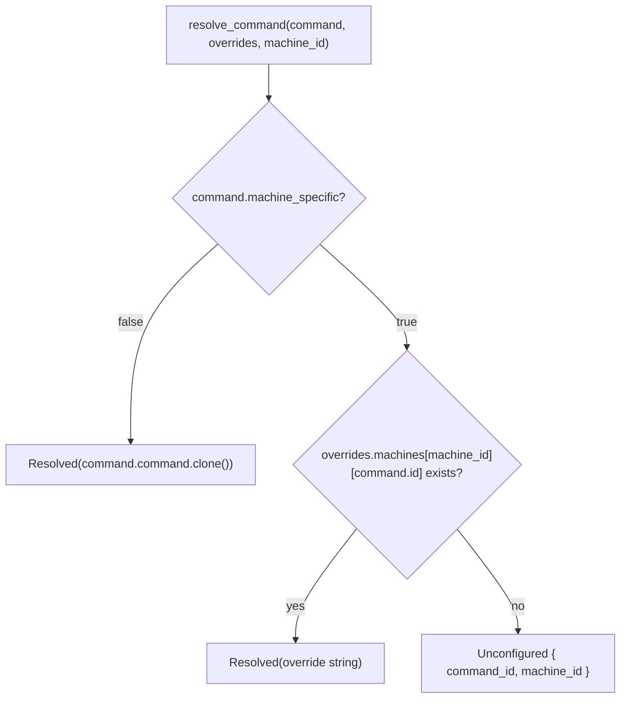

## Feature

### Summary

`Command` currently has no way to say "resolve me differently per machine" — `command: String` is used as-is everywhere it's read. This lot adds `machine_specific: bool` (default `false`, preserving every existing config entry) and a pure `resolve_command()` function that, given a `Command` and the Part 1 `MachineCommands` map plus the current machine id, returns either the resolved launch string or an explicit "unconfigured" outcome. It does not touch the UI — Part 3 consumes this function's output to render the disabled state.

### Stack

- Rust workspace, edition 2021 (unchanged)
- No new crate

### Branch name

`feature/machine-commands/part-2-resolution`

### Parent Plan

`./2026_08_06-per-machine-command-mapping-master.md`

### Sequence

2 of 4

### Confidence

8/10 — the resolution logic itself is simple and pure; the main effort is mechanically updating every existing `Command { ... }` struct literal across the tree without missing one. 🤖 The file list and literal count below were corrected after `/aidd-refine:02-challenge` verified them against the actual codebase.

### Time to implement

Not estimated in wall-clock time (see master plan Estimations).

## Architecture projection

### Files to modify

- `src/storage/models.rs` - `Command` gains `#[serde(default)] machine_specific: bool`; add `#[derive(Default)]` to the struct (all existing fields already have well-defined defaults: empty `String`, `false`, `None`)
- `src/storage/json.rs` - update its 2 test-only `Command { ... }` struct literals (lines ~274, ~286 at time of writing, inside `mod tests`' `sample_config()`) to include the new field via `..Default::default()`
- `src/storage/commands.rs` - same update for its 2 test-only `Command { ... }` literals (lines ~104, ~315)
- `src/storage/categories.rs` - same update for its 1 test-only `Command { ... }` literal (line ~232)
- `src/ui/egui_app.rs` - update its 6 `Command { ... }` literals: 3 in `fallback_config()` (lines ~186, ~198, ~210 — a **production** function, defined at line ~173 and called from `EguiApp::new()` at ~304 when `storage::load()` fails) plus 3 in `mod tests` (lines ~891, ~903, ~938); UI wiring itself is Part 3's scope, not this lot's

<!-- 🤖 Amended after /aidd-refine:02-challenge: dropped `src/windows/process.rs` from this list — it contains zero `Command { ... }` struct literals (only unrelated `std::process::Command` calls and a `Vec<crate::storage::Command>` type annotation in a `#[cfg(test)]` deserialization test), so `#[serde(default)]` alone makes it compile unchanged. Corrected the literal count from "~16" to the actual 11 (2+2+1+6), verified by grep against the real tree. Iteration 3: corrected iteration 2's overcorrected claim that "all 11 struct literals... sit inside `#[cfg(test)]` modules" — verification against the real source shows 3 of `egui_app.rs`'s 6 literals (lines ~186, ~198, ~210) are inside `fallback_config()`, a production function, not a test. Accurate tally: 8 of 11 literals are test-only (json.rs ×2, commands.rs ×2, categories.rs ×1, egui_app.rs's `mod tests` ×3), 3 of 11 are production (egui_app.rs's `fallback_config()`). -->

### Files to create

- (extends `src/storage/machine_commands.rs` created in Part 1) - add `CommandResolution` enum (`Resolved(String)` / `Unconfigured { command_id: String, machine_id: String }`) and `resolve_command(command: &Command, overrides: &MachineCommands, machine_id: &str) -> CommandResolution`

### Files to delete

None.

## Applicable rules

None — `list-rules.mjs` returned an empty inventory.

## User Journey

## Risk register

| Risk | Impact | Mitigation |
| --- | --- | --- |
| A missed `Command { ... }` struct literal fails to compile once the field is added | Build breaks mid-implementation, potentially across multiple files at once | `#[derive(Default)]` on `Command` lets every literal adopt `..Default::default()`, a one-line, low-risk edit per site, verified by `cargo build` after each file |
| `src/windows/process.rs` was initially miscounted as containing `Command` struct literals (it does not — only unrelated `std::process::Command` calls and a `Vec<Command>` type annotation in a test) | An incorrect file list could cause unnecessary or misdirected edits | Corrected in this plan's architecture projection after verification against the real source (see Amendment above) |
| Machine id case-sensitivity (Windows hostnames conventionally uppercase, `/etc/hostname` typically lowercase) | A mapping entry keyed with the wrong case silently never matches | `resolve_command` (and the map lookup it performs) normalizes both the stored keys and the lookup machine id to lowercase before comparing |

## Implementation phases

### Phase 2: Command resolution

> Add the machine-specific flag and the pure resolution function, with every existing call site updated to compile against the new field.

#### Tasks

1. Add `machine_specific: bool` (`#[serde(default)]`) and `#[derive(Default)]` to `Command` in `src/storage/models.rs`.
2. Add `CommandResolution` and `resolve_command()` to `src/storage/machine_commands.rs`, normalizing machine ids to lowercase on lookup.
3. Update every existing `Command { ... }` struct literal (`json.rs`, `commands.rs`, `categories.rs`, `egui_app.rs`, and their respective tests) to compile with the new field, using `..Default::default()`.
4. Unit-test `resolve_command`: non-machine-specific always resolves to the base command; machine-specific with a matching override resolves to the override string; machine-specific with no matching machine or no matching command id returns `Unconfigured`; machine id lookup is case-insensitive.
5. Run the full existing test suite to confirm no regression from the struct literal updates.

#### Acceptance criteria

- [x] `Command` has `machine_specific: bool`, `#[serde(default)]`, defaulting to `false` when absent from JSON (verified by loading an existing `config/default.json` unchanged)
- [x] `resolve_command` unit tests cover all three outcomes (non-machine-specific, resolved override, unconfigured) plus the case-insensitive machine id match
- [x] Every pre-existing `Command { ... }` struct literal in the codebase compiles unchanged in behavior aside from the new field
- [x] `cargo test` passes on Linux with no regressions in existing `storage::` tests

## Amendments

<!-- AI-initiated changes during implementation. Each entry is prefixed with 🤖. -->

🤖 `success_condition` (`cargo test --lib storage::`) does not run as written: this crate has no `[lib]` target (bin-only, confirmed by grepping `Cargo.toml` for `[lib]` — absent), the same fact Part 1's implementer hit. Ran `cargo test storage::` instead (no `--lib`), matching Part 1's precedent. Also ran the full `cargo test` suite per acceptance criterion 4 ("`cargo test` passes ... with no regressions").

🤖 `resolve_command`'s signature takes `overrides: &MachineCommands` per the plan text, consistent with Part 1's actual (Result-returning) `load_machine_commands_from` — no signature change was needed here since `resolve_command` operates on an already-loaded `MachineCommands` value, not on the load path itself.

## Log

<!-- APPEND ONLY. One entry per step attempt. Never rewrite. -->

- 2026-08-06: Phase 2 implemented in full. `Command` gained `machine_specific: bool` (`#[serde(default)]`) plus `#[derive(Default)]` in `src/storage/models.rs`. `CommandResolution` enum and `resolve_command()` added to `src/storage/machine_commands.rs` (case-insensitive machine-id lookup per the risk register), re-exported from `src/storage/mod.rs`. All 11 pre-existing `Command { ... }` struct literals updated across `src/storage/json.rs` (2), `src/storage/commands.rs` (2), `src/storage/categories.rs` (1), `src/ui/egui_app.rs` (6: 3 in production `fallback_config()`, 3 in `mod tests`). 5 new unit tests added for `resolve_command` covering all three outcomes plus case-insensitivity. `cargo build`: clean (pre-existing warnings only, unrelated to this change). `cargo test storage::`: 47 passed, 0 failed. Full `cargo test`: 147 passed, 0 failed, 2 ignored (pre-existing). All 4 acceptance criteria met.

## Validation flow demonstration

1. Run `cargo test storage::` — all existing and new tests pass.
2. Construct a `Command` with `machine_specific: false` and call `resolve_command` with an empty `MachineCommands` — returns `Resolved` with the base `command` string unchanged.
3. Construct a `Command` with `machine_specific: true` and a `MachineCommands` containing a matching entry — returns `Resolved` with the override string.
4. Same as above but with no matching entry — returns `Unconfigured`.
5. Load the existing `config/default.json` through `storage::json::load` — succeeds unchanged, every `Command.machine_specific` defaults to `false`.
