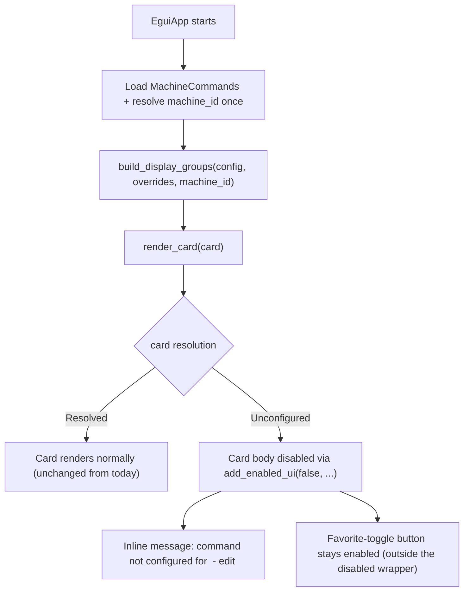

## Feature

### Summary

`CardData` and `build_display_groups()` today have no notion of per-machine resolution — every card renders identically regardless of whether its command would actually work on this machine. This lot loads the Part 1 machine mapping at startup, resolves each card's command via the Part 2 `resolve_command()`, and renders unconfigured machine-specific cards as visibly disabled with an inline message naming the machine id and the mapping file path — without disabling the favorite-toggle button, which is a config edit, not a launch. Non-machine-specific cards (the overwhelming majority today, since no builtin action opts in) must render unchanged.

### Stack

- Rust workspace, edition 2021 (unchanged)
- `egui` (unchanged) - uses `ui.add_enabled_ui()` (available in the pinned `egui` 0.35) for the disabled-state rendering. No existing usage of this exact closure-scoped API in the codebase; the nearest precedent is the single-widget `ui.add_enabled(...)` call at `src/ui/egui_app.rs:778`. 🤖 Corrected after `/aidd-refine:02-challenge` found a full-tree grep for `add_enabled_ui` returns zero matches — the original "already used elsewhere for similar affordances" claim was false.

### Branch name

`feature/machine-commands/part-3-ui-disabled-state`

### Parent Plan

`./2026_08_06-per-machine-command-mapping-master.md`

### Sequence

3 of 4

### Confidence

8/10 — `egui`'s `add_enabled_ui` is a known, low-risk primitive; the main open point is the exact disabled-state message wording, called out explicitly for user review rather than assumed correct on first pass.

### Time to implement

Not estimated in wall-clock time (see master plan Estimations).

## Architecture projection

### Files to modify

- `src/ui/egui_app.rs` - `CardData` (around line 106) gains the resolution outcome (or an equivalent `is_configured: bool` + `disabled_message: Option<String>` pair); `build_display_groups(config: &Config)` (line 126) signature grows to `build_display_groups(config: &Config, overrides: &MachineCommands, machine_id: &str)`, updating its 2 existing test call sites (around lines 926, 951) **and its production call site at line 675** (`render_actions_view`, inside the per-frame render method); `render_card()` (line 411) wraps its clickable/launch-relevant body in `ui.add_enabled_ui(is_configured, |ui| { ... })` while keeping the `small_button("★/☆ Favori")` outside that wrapper so it stays clickable regardless of resolution state; unconfigured cards get a `.on_hover_text(...)` or inline label naming the current machine id and the `machine-commands.json` path; `EguiApp`'s construction (struct definition at line 277, `new()` at line 301, `new_for_test` at line 316, `from_parts` at line 324) loads `MachineCommands` via `storage::load_machine_commands_from(platform::machine_commands_path())` and resolves `platform::machine_id()` once at startup, storing both on the struct

<!-- 🤖 Amended after /aidd-refine:02-challenge: the original projection only named the 2 test call sites for build_display_groups(); the production call site at egui_app.rs:675 must also be updated (it would fail to compile if missed, but was not explicitly enumerated). Iteration 4: corrected the vague "around line 277" reference for EguiApp's construction — line 277 is the struct definition itself, not either constructor; `new()` is at line 301, `new_for_test` at 316, `from_parts` at 324. -->

### Files to create

None.

### Files to delete

None.

## Applicable rules

None — `list-rules.mjs` returned an empty inventory.

## User Journey

## Risk register

| Risk | Impact | Mitigation |
| --- | --- | --- |
| Blanket-disabling the whole `ui.group()` would also disable the favorite-toggle button | Users could no longer favorite/unfavorite a card whose command isn't configured on this machine yet, even though that's a config edit unrelated to launching | `add_enabled_ui` scope is deliberately limited to the launch-relevant body, not the whole card group (explicit architecture decision in this plan) |
| No card currently opts into `machine_specific: true` by default (decision: builtins stay universal) | Without a manually configured test card, the disabled-state path has nothing to exercise during manual validation | Validation flow below includes temporarily adding one `machine_specific: true` test command with no mapping entry, specifically to exercise this path before removing it |
| Exact disabled-state message wording is not yet user-validated | A poorly worded message could be technically correct but confusing | Called out as an explicit open point in Estimations; user validates the actual wording during Checkpoint 3 (master plan Validation Protocol), not assumed final on first pass |

## Implementation phases

### Phase 3: UI greyed-out state

> Wire resolution into the card grid; unconfigured machine-specific cards render disabled with a clear message, everything else renders unchanged.

#### Tasks

1. Extend `CardData` with the resolution outcome needed for rendering (configured/unconfigured + message).
2. Update `build_display_groups()` to accept the machine mapping and machine id, computing each card's resolution via `resolve_command()`.
3. Update both existing test call sites for `build_display_groups()`, plus its production call site at `egui_app.rs:675`.
4. Update `render_card()` to render the disabled state via `add_enabled_ui`, scoped to exclude the favorite-toggle button, with an inline message naming the machine id and mapping file path.
5. Wire `EguiApp` construction to load the mapping and resolve the machine id once at startup (not per-frame).
6. Manually verify: existing cards render with no visual change (regression check); temporarily add one `machine_specific: true` command with no mapping entry, confirm it renders disabled with the expected message; add a matching mapping entry, confirm it renders normally; remove the temporary test command.

#### Acceptance criteria

- [x] A card whose command is `machine_specific: true` with no matching entry in `machine-commands.json` for the current machine renders visibly disabled, with an inline message naming the current machine id and the mapping file path
- [x] The favorite-toggle button remains clickable on an unconfigured card
- [x] Every existing (non-machine-specific) card renders with no visual regression compared to before this lot
- [x] `cargo test` passes (updated `build_display_groups` test call sites included) and `cargo build --release` succeeds on Linux

## Amendments

<!-- AI-initiated changes during implementation. Each entry is prefixed with 🤖. -->

## Log

<!-- APPEND ONLY. One entry per step attempt. Never rewrite. -->

- 2026-08-06: Phase 3 implemented in full. `CardData` (`src/ui/egui_app.rs`) gained `is_configured: bool` + `disabled_message: Option<String>`. `build_display_groups()` signature grew to `(config: &Config, overrides: &MachineCommands, machine_id: &str)`, computing each card's fields via a new `resolution_fields()` helper wrapping `storage::resolve_command()`; both existing pure-function tests and the production call site (inside `render_actions_view`) updated. `render_card()` now wraps the icon+name+disabled-message body in `ui.add_enabled_ui(card.is_configured, |ui| {...})`, with the "★/☆ Favori" `small_button` added after that closure so it stays enabled regardless of resolution state; the disabled message (small italic label + matching `.on_hover_text`) names the machine id and `platform::machine_commands_path()`. `EguiApp` gained `machine_commands: MachineCommands` and `machine_id: String` fields; `from_parts()` grew two parameters to receive them. `new()` loads via `storage::load_machine_commands_from(&platform::machine_commands_path())` with `.unwrap_or_else(|err| { log::warn!(...); MachineCommands::default() })` (never crashes on a missing/corrupt file) and resolves `platform::machine_id()` once. `new_for_test()` deliberately does NOT read the real machine-commands.json file — it passes a fixed empty `MachineCommands::default()` + `"test-machine"` id instead, so the test suite stays hermetic and doesn't depend on whatever machine it runs on; kept its existing 2-arg signature, so none of the 5 existing `new_for_test` call sites needed changes. Added 3 new unit tests directly on `build_display_groups`: (1) non-machine-specific cards are always configured against any overrides, (2) a `machine_specific: true` command with no matching mapping entry renders `is_configured: false` with a message containing both the machine id and the mapping path, (3) the same command WITH a matching entry renders configured with no message — this is the practical substitute for a GUI click specified by the plan's task 6. `cargo build`: clean (same 4 pre-existing warnings, unrelated). `cargo test ui::`: 29 passed, 0 failed. Full `cargo test`: 150 passed, 0 failed, 2 ignored (pre-existing). `cargo build --release`: succeeded in 3m44s, same 4 pre-existing warnings. All 4 acceptance criteria met. Structural verification of the favorite-button-stays-enabled criterion done by code reading (the `small_button` call is textually after the `add_enabled_ui` closure closes, still inside `vertical_centered`) rather than a kittest UI test, per the plan's own task 6 guidance to use reasoning/code inspection since a GUI cannot be launched in this environment.

## Validation flow demonstration

1. Run `cargo build --release` and launch the app — the grid renders exactly as before this lot, no visual regression.
2. Temporarily add a `machine_specific: true` command to `config.json` with no corresponding `machine-commands.json` entry — its card renders visibly greyed, with a message naming the current machine id and the mapping file path.
3. Add a matching entry to `machine-commands.json` for the current machine id and that command's id, restart the app — the card renders normally.
4. On the greyed card from step 2 (before adding the mapping entry), click the favorite-toggle button — it responds normally.
5. Remove the temporary test command before considering this lot done.
