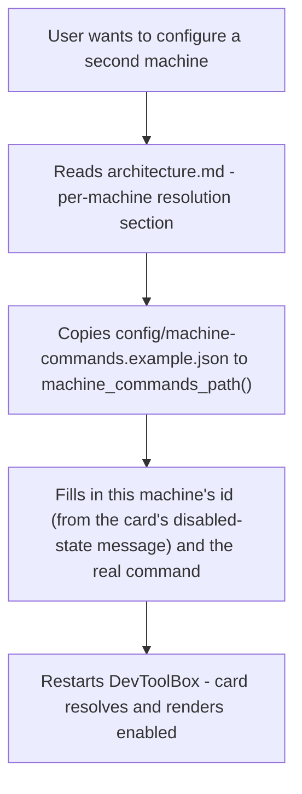

## Feature

### Summary

Parts 1-3 make the mechanism work; this lot makes it discoverable and maintainable without reading source. It ships a documented example mapping file and updates `architecture.md` with the new resolution stage and the accepted merge-staleness limitation (decision 8 of the master plan). No code changes.

### Stack

- Documentation only (Markdown, JSON example) - no code, no dependency changes

### Branch name

`feature/machine-commands/part-4-documentation`

### Parent Plan

`./2026_08_06-per-machine-command-mapping-master.md`

### Sequence

4 of 4

### Confidence

9/10 — pure documentation lot with no functional risk; the only judgment call is how much detail to put in the example file versus `architecture.md`.

### Time to implement

Not estimated in wall-clock time (see master plan Estimations).

## Architecture projection

### Files to modify

- `aidd_docs/memory/architecture.md` - add a section documenting the per-machine resolution stage (`machine_specific` flag, `MachineCommands` file, `resolve_command` cascade, where it sits relative to the existing `@python` resolution cascade) and the merge-staleness limitation (`merge_builtin_actions()` bakes `machine_specific` into `config.json` on first save; a later change to a builtin's flag won't reach users who already persisted)

### Files to create

- `config/machine-commands.example.json` - documented template with one example machine id and one example command-id override, showing the exact schema `MachineCommands` expects

### Files to delete

None.

## Applicable rules

None — `list-rules.mjs` returned an empty inventory.

## User Journey

## Risk register

| Risk | Impact | Mitigation |
| --- | --- | --- |
| Example file drifts from the actual `MachineCommands` schema if Part 1/2 change later | User copies a stale template that no longer parses or resolves correctly | This lot runs after Parts 1-3 are code-complete, so the schema documented matches what actually shipped; not a forward-looking guess |

## Implementation phases

### Phase 4: Documentation

> Ship a self-serve example file and document the resolution mechanism and its known limitation.

#### Tasks

1. Create `config/machine-commands.example.json` with one documented machine id and one command-id override, matching the exact `MachineCommands` schema.
2. Add a section to `aidd_docs/memory/architecture.md` documenting the per-machine resolution stage and where it sits relative to the existing `@python` resolution cascade.
3. Document the merge-staleness limitation (decision 8) in the same section.
4. Confirm (documentation-only, no code change) that all 14 `@python`-based entries in `config/builtin-actions.json` (10 `launch_rust_app.py`-based + 4 `sftp_fetch.py`-based) remain `machine_specific: false`, per the frozen decision. <!-- 🤖 Corrected from "5" to "10" after /aidd-refine:02-challenge iteration 2 found this stale count left over from the master plan's own iteration-1 fix. Iteration 4: broadened from "10 launch_rust_app.py entries" to "all 14 @python entries" for consistency with the master plan's iteration-3 broadening of decision 7. -->

#### Acceptance criteria

- [x] `config/machine-commands.example.json` exists and matches the actual `MachineCommands` schema shipped in Part 1
- [x] `aidd_docs/memory/architecture.md` documents the per-machine resolution stage and the merge-staleness limitation
- [x] No entry in `config/builtin-actions.json` is marked `machine_specific: true`

## Amendments

<!-- AI-initiated changes during implementation. Each entry is prefixed with 🤖. -->

## Log

<!-- APPEND ONLY. One entry per step attempt. Never rewrite. -->

- Phase 4 implemented: `config/machine-commands.example.json` created (schema verified against `src/storage/machine_commands.rs`); `aidd_docs/memory/architecture.md` gained a "Per-machine command resolution" section documenting the flag, the storage file, `resolve_command`, and the merge-staleness limitation. Verified via grep: 0 `machine_specific: true` entries in `config/builtin-actions.json`, all 14 `@python` entries (10 `launch_rust_app.py` + 4 `sftp_fetch.py`) confirmed universal. `success_condition` (`test -f config/machine-commands.example.json && grep -q machine_specific aidd_docs/memory/architecture.md`) passes. No plan amendments needed.

## Validation flow demonstration

1. Read `config/machine-commands.example.json` cold (no source access) — it's clear what to fill in for a new machine.
2. Read the new `architecture.md` section cold — it explains the resolution stage and the merge-staleness limitation without needing to read `resolve_command`'s source.
3. `grep machine_specific config/builtin-actions.json` — no match, confirming builtins were left universal.
