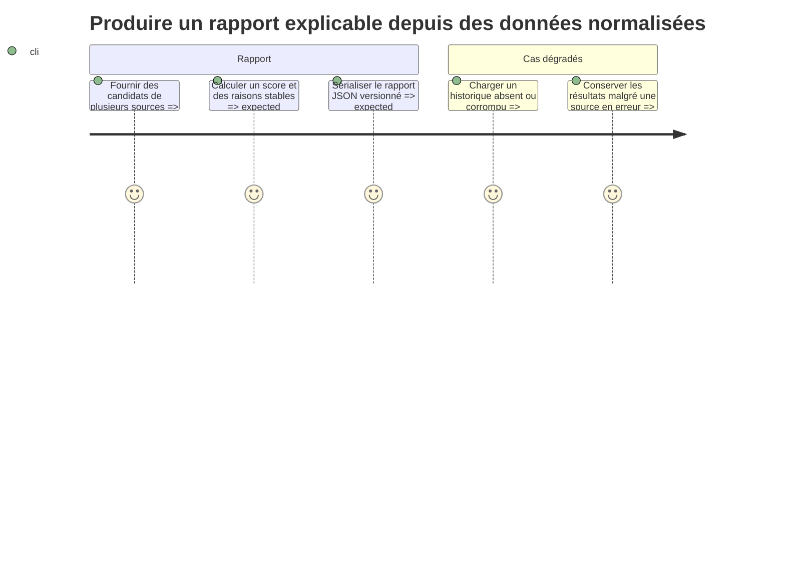

# Instruction

Créer le cœur Python multi-OS du rapport sans collecteur réel ni intégration UI. Le résultat doit être déterministe, testable avec des fixtures et invocable en JSON. Toute donnée inconnue reste explicitement inconnue ; aucune heuristique ne doit transformer l’absence d’information en recommandation forte.

## Architecture projection

- Created files:
  - `scripts/__init__.py` — ancrer l’espace de noms local et empêcher qu’un paquet tiers nommé `scripts` masque les modules DevToolBox.
  - `scripts/app_recommendations/__init__.py` — paquet du rapport applicatif.
  - `scripts/app_recommendations/models.py` — schéma versionné du rapport, candidats, indices exécutables, preuves, protections, tailles, niveau de confiance des commandes et erreurs par source.
  - `scripts/app_recommendations/scoring.py` — calcul commun du score, seuils et raisons ordonnées.
  - `scripts/app_recommendations/history.py` — lecture tolérante et normalisation de l’historique local.
  - `scripts/app_recommendations/report.py` — agrégation des sources, déduplication, classement et sérialisation JSON.
  - `scripts/app_recommendations/__main__.py` — CLI en lecture seule.
  - `scripts/app_recommendations/tests/__init__.py` — paquet de tests.
  - `scripts/app_recommendations/tests/test_models.py` — stabilité du contrat JSON.
  - `scripts/app_recommendations/tests/test_scoring.py` — invariants du classement.
  - `scripts/app_recommendations/tests/test_history.py` — historique absent, valide ou corrompu.
  - `scripts/app_recommendations/tests/test_report.py` — agrégation, déduplication et erreurs partielles.
- Modified files: none.
- Deleted files: none.

## User Journey

## Test Scope

- Tester qu’un candidat volumineux et ancien avec date connue est mieux classé qu’un petit candidat récent à protection et confiance égales.
- Tester chaque frontière du barème v1 de taille et de jours d’observation couverts.
- Tester qu’une date inconnue n’ajoute aucun bonus d’ancienneté et diminue la confiance affichée.
- Tester qu’une application jamais vue ne reçoit un bonus d’inactivité qu’à partir de ses jours de couverture postérieurs à `tracked_since`.
- Tester qu’une protection bloque toute priorité de désinstallation, même pour une grande empreinte.
- Tester qu’un élément protégé ne sérialise aucune commande copiable.
- Tester la déduplication par identifiant stable sans additionner plusieurs fois une ressource partagée.
- Tester la compatibilité ascendante du schéma et l’ordre déterministe du JSON à entrée identique.
- Tester qu’une erreur de collecteur est incluse dans `source_errors` sans supprimer les autres candidats.
- Tester qu’un collecteur dépassant son délai devient une erreur de source et que les autres résultats sont conservés.
- Tester que la CLI n’expose aucune option d’application, de correction ou de suppression.

## Tasks to do

1. Définir des dataclasses sérialisables pour le rapport, le candidat, ses indices exécutables normalisables, la preuve d’usage, la taille, la protection, la commande suggérée avec origine `manager_verified` ou `publisher_unverified`, et l’erreur de source. Ajouter une version de schéma explicite et des identifiants stables préfixés par source.
2. Séparer clairement empreinte installée, méthode et périmètre de mesure, gain estimé éventuellement inconnu, date de dernier usage éventuellement inconnue, jours de suivi couverts, score, confiance et raisons lisibles.
3. Implémenter le score v1 figé dans le plan : taille sur 50 par seuils 250 Mio/1 Gio/5 Gio/10 Gio et inactivité couverte sur 50 par seuils 30/90/180/365 jours. Appliquer les protections avant le calcul, ne pas multiplier le score par la confiance et utiliser des critères de départage stables.
4. Implémenter le chargement d’un historique JSON absent, ancien ou malformé sans interrompre le rapport. Calculer les jours couverts à partir des seuls jours possédant au moins un échantillon réussi après `last_seen` ou, pour une application jamais vue, après `tracked_since`. Ignorer les entrées invalides et remonter un avertissement exploitable.
5. Implémenter l’agrégation de collecteurs injectables, un délai maximal configurable par source, la déduplication prudente et les erreurs par source. Ne jamais additionner automatiquement l’empreinte d’un runtime partagé à chaque application.
6. Exposer une CLI `python -m scripts.app_recommendations --json` qui écrit uniquement le JSON sur stdout et les diagnostics éventuels sur stderr.
7. Ajouter les tests unitaires par fixtures pour tous les invariants de sûreté et le contrat de sortie.

## Test acceptance criteria

- `python3 -m unittest discover -s scripts/app_recommendations/tests -p 'test_*.py'` réussit.
- Deux exécutions avec les mêmes fixtures produisent le même ordre et le même JSON.
- Un usage inconnu n’est jamais décrit comme ancien ou inactif.
- Les tests de frontières verrouillent exactement les composantes 0/10/25/35/50 de taille et 0/10/25/40/50 d’inactivité.
- Une application jamais observée mais suivie pendant 90 jours couverts reçoit une preuve « non observée pendant le suivi » distincte d’une date de dernier usage connue.
- Un candidat protégé ne reçoit jamais une priorité de suppression.
- Un candidat protégé ne contient aucune commande suggérée.
- Une source défaillante n’empêche pas la présence des résultats issus des autres sources.
- La CLI ne contient et n’exécute aucune opération de désinstallation.
