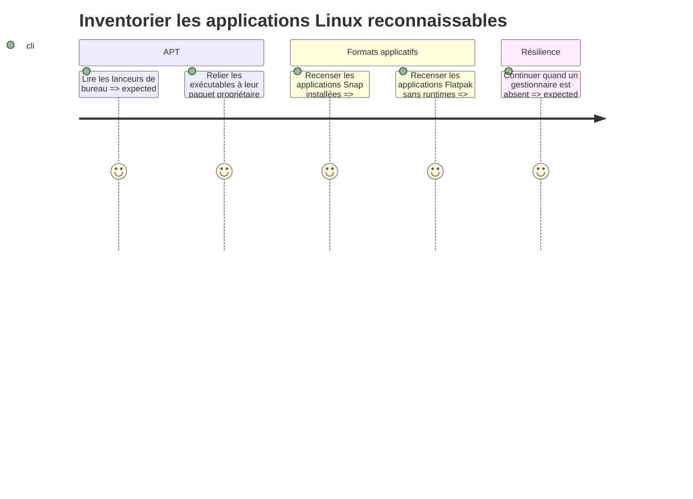

# Instruction

Brancher des collecteurs Linux au contrat commun. Le périmètre porte sur les applications que l’utilisateur reconnaît, pas sur chaque paquet de bibliothèque installé. Tous les appels externes sont bornés, en lecture seule et isolés par source.

## Architecture projection

- Created files:
  - `scripts/app_recommendations/collectors/__init__.py` — interface et registre des collecteurs.
  - `scripts/app_recommendations/collectors/linux.py` — découverte APT/dpkg, Snap et Flatpak.
  - `scripts/app_recommendations/tests/fixtures/linux/desktop_entries.json` — lanceurs et correspondances exécutable-paquet.
  - `scripts/app_recommendations/tests/fixtures/linux/snap_list.json` — sorties Snap normalisées.
  - `scripts/app_recommendations/tests/fixtures/linux/flatpak_list.json` — sorties Flatpak normalisées.
  - `scripts/app_recommendations/tests/test_collectors_linux.py` — tests des sources Linux et de leurs protections.
- Modified files:
  - `scripts/app_recommendations/report.py` — enregistrer les collecteurs disponibles sur Linux.
  - `scripts/system_inventory/packages_linux.py` — extraire ou exposer sans rupture les primitives de lecture de taille de paquets réutilisables par le nouveau rapport.
  - `scripts/system_inventory/tests/test_packages_linux.py` — préserver le contrat d’inventaire existant après l’exposition des primitives.
- Deleted files: none.

## User Journey

## Test Scope

- Tester le parsing de `Exec` dans les fichiers desktop, y compris variables, arguments, guillemets et lanceurs introuvables.
- Tester qu’un paquet dpkg sans entrée de bureau ni preuve applicative n’entre pas dans le classement.
- Tester les tailles installées et l’identité stable de chaque source.
- Tester la provenance, le périmètre et la confiance de chaque taille, sans assimiler les données utilisateur ou anciennes révisions à un gain garanti.
- Tester que les bases, runtimes et dépendances partagées sont protégés ou exclus.
- Tester l’absence de Snap ou Flatpak, les erreurs de commande et les sorties partielles.
- Tester qu’un wrapper générique Flatpak ou Snap n’est pas sérialisé comme indice exécutable d’une application.
- Tester que les commandes suggérées sont des chaînes de copie cohérentes et ne sont jamais exécutées.

## Tasks to do

1. Introduire une interface minimale de collecteur retournant candidats et erreurs structurées, puis sélectionner les collecteurs à partir de la plateforme courante.
2. Parcourir les entrées desktop système et utilisateur, normaliser leur champ `Exec`, résoudre l’exécutable et utiliser `dpkg-query`/`dpkg -S` pour identifier le paquet propriétaire. Réutiliser les primitives de taille de `system_inventory` sans changer son rapport existant, et étiqueter `Installed-Size` comme empreinte du paquet hors données utilisateur.
3. Recenser Snap avec une sortie stable, distinguer application, base, contenu partagé, révisions et données utilisateur. Mesurer séparément ce qui est accessible, conserver la méthode et sa confiance, rechercher un exécutable spécifique dans la révision montée, et proposer `sudo snap remove <nom>` comme texte seulement pour les applications non protégées.
4. Recenser Flatpak avec `flatpak list --app` et des colonnes explicites ; conserver l’installation utilisateur ou système, séparer application et runtime partagé, rechercher un exécutable spécifique dans les métadonnées ou le déploiement, et proposer la commande correspondante comme texte seulement.
5. Ne jamais utiliser `/usr/bin/flatpak`, `/usr/bin/snap` ou un autre wrapper partagé comme unique indice d’usage. Si aucun exécutable spécifique ne peut être identifié sans ambiguïté, laisser les indices vides et la date d’usage inconnue.
6. Produire une erreur localisée et poursuivre lorsqu’un binaire de gestionnaire manque, qu’une sortie est illisible ou qu’un élément ne peut pas être rapproché.
7. Ajouter des fixtures représentatives et des tests sans dépendre de l’état réel de la machine de test.

## Test acceptance criteria

- `python3 -m unittest scripts.app_recommendations.tests.test_collectors_linux` réussit.
- `python3 -m unittest scripts.system_inventory.tests.test_packages_linux` réussit.
- Le rapport APT ne contient pas une bibliothèque installée dépourvue de lanceur ou de signal applicatif.
- Les runtimes Flatpak, bases Snap et dépendances partagées ne deviennent pas des candidats prioritaires.
- Le rapport ne présente pas les anciennes révisions, données utilisateur ou ressources partagées comme un gain garanti de désinstallation.
- L’absence d’un des trois gestionnaires laisse les autres résultats disponibles et décrit la source manquante.
- Aucun test ni chemin de production n’exécute une commande de suppression.
- Aucun wrapper partagé n’est utilisé seul comme preuve d’usage d’une application.
