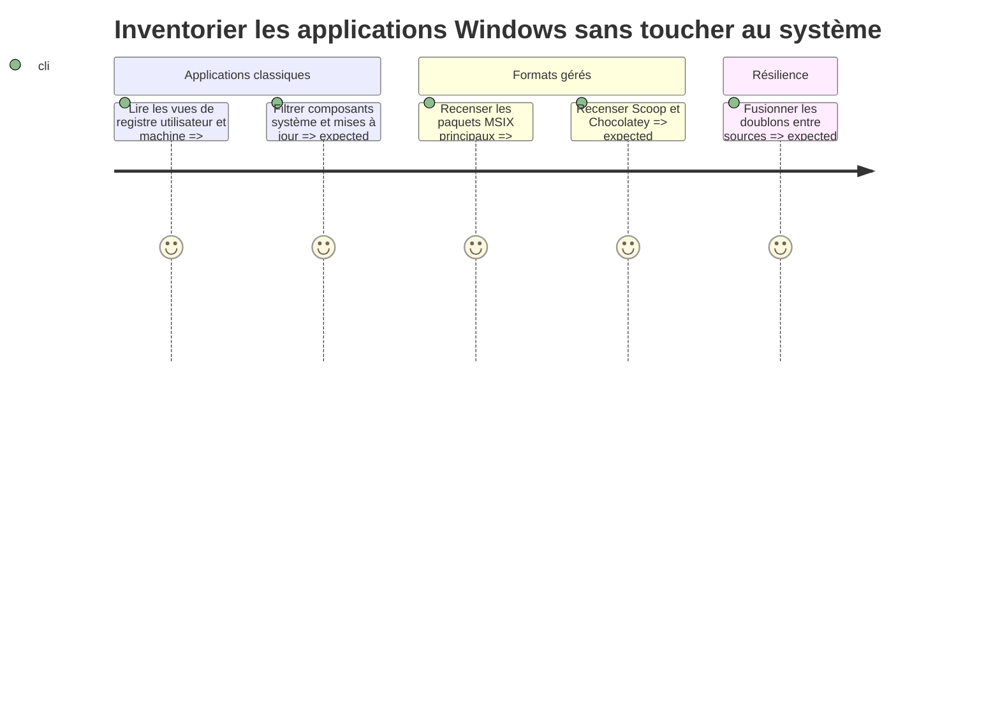

# Instruction

Brancher les sources Windows au même contrat, en conservant les différences de confiance et de désinstallation propres à chaque gestionnaire. Les tests doivent rester exécutables sur Linux à partir de fixtures ; les accès Windows réels restent derrière des gardes de plateforme.

## Architecture projection

- Created files:
  - `scripts/app_recommendations/collectors/windows.py` — agrégation registre, MSIX/AppX, Scoop et Chocolatey.
  - `scripts/app_recommendations/tests/fixtures/windows/uninstall_registry.json` — entrées de registre représentatives.
  - `scripts/app_recommendations/tests/fixtures/windows/appx_packages.json` — paquets MSIX/AppX Main et Framework.
  - `scripts/app_recommendations/tests/fixtures/windows/package_managers.json` — résultats Scoop et Chocolatey.
  - `scripts/app_recommendations/tests/test_collectors_windows.py` — parsing, protection et commandes Windows.
- Modified files:
  - `scripts/app_recommendations/report.py` — enregistrer les collecteurs disponibles sur Windows.
  - `scripts/system_inventory/registry.py` — exposer sans rupture les métadonnées de désinstallation, composant système, icône, emplacement et taille nécessaires au rapport.
  - `scripts/system_inventory/tests/test_registry.py` — verrouiller la compatibilité du collecteur de registre existant.
  - `scripts/system_inventory/packages.py` — exposer sans rupture les primitives Scoop et Chocolatey nécessaires au rapport.
  - `scripts/system_inventory/tests/test_packages.py` — verrouiller la compatibilité de l’inventaire existant.
- Deleted files: none.

## User Journey

## Test Scope

- Tester les vues 32 et 64 bits du registre, les entrées utilisateur et machine, les tailles absentes et les dates ambiguës.
- Tester l’exclusion ou la protection des `SystemComponent`, correctifs, drivers, frameworks AppX et paquets non supprimables.
- Tester la distinction entre paquet MSIX principal et dépendances/frameworks.
- Tester la déduplication prudente d’une application visible à la fois dans le registre et un gestionnaire.
- Tester les chemins contenant des espaces et l’échappement d’affichage des commandes sans jamais les lancer.
- Tester qu’une `UninstallString` du registre reste une donnée opaque marquée comme non vérifiée et qu’un élément protégé n’expose aucune commande.
- Tester toutes les transformations sur Linux à partir de fixtures et garder les imports Windows conditionnels.
- Tester qu’un lanceur PowerShell, AppX ou gestionnaire partagé n’est jamais utilisé seul comme indice d’usage.

## Tasks to do

1. Étendre de façon compatible les lecteurs `system_inventory` afin d’exposer les métadonnées utiles sans changer leurs sorties publiques actuelles.
2. Lire les entrées de désinstallation utilisateur et machine dans les vues de registre pertinentes. Marquer comme protégés les composants système, correctifs, éléments sans identité exploitable et entrées explicitement non supprimables. Conserver `EstimatedSize`, répertoire mesuré ou absence de taille avec une provenance distincte.
3. Interroger `Get-AppxPackage` avec une sortie JSON contrôlée, conserver les paquets applicatifs principaux et protéger Framework, Resource et Optional lorsque leur suppression isolée est dangereuse ou trompeuse. Dériver un indice d’usage uniquement d’un exécutable spécifique au paquet ; ne jamais enregistrer PowerShell ou un lanceur AppX partagé comme indice.
4. Réutiliser les lectures Scoop et Chocolatey pour obtenir identité et empreinte, en conservant la provenance et une commande uniquement copiable construite par l’adaptateur avec des arguments sûrs.
5. Traiter toute `UninstallString` comme une chaîne opaque fournie par l’éditeur : ne pas la découper, la réécrire ou l’insérer dans une commande shell ; l’afficher uniquement comme option non vérifiée sur un candidat non protégé.
6. Définir des clés de rapprochement prudentes fondées sur identifiant du gestionnaire, emplacement et nom normalisé. En cas d’ambiguïté, garder des lignes séparées plutôt que fusionner et surestimer le gain.
7. Ajouter des fixtures et tests multiplateformes qui ne requièrent ni registre ni PowerShell sur Linux.

## Test acceptance criteria

- `python3 -m unittest scripts.app_recommendations.tests.test_collectors_windows` réussit sur Linux avec fixtures.
- Les tests existants de `scripts.system_inventory` modifiés réussissent sans changement de leur contrat JSON.
- Un composant système, un correctif, un driver ou un framework MSIX n’est jamais classé comme candidat prioritaire.
- Une taille inconnue reste inconnue et n’est pas convertie en zéro ou en estimation trompeuse.
- Les doublons sûrs sont fusionnés sans addition de taille ; les rapprochements ambigus restent distincts.
- Les imports et appels spécifiques à Windows sont protégés par la détection de plateforme.
- Aucun élément protégé n’expose de commande et aucune `UninstallString` n’est évaluée ou interpolée.
- Aucun wrapper partagé n’est utilisé seul comme preuve d’usage d’une application Windows.
