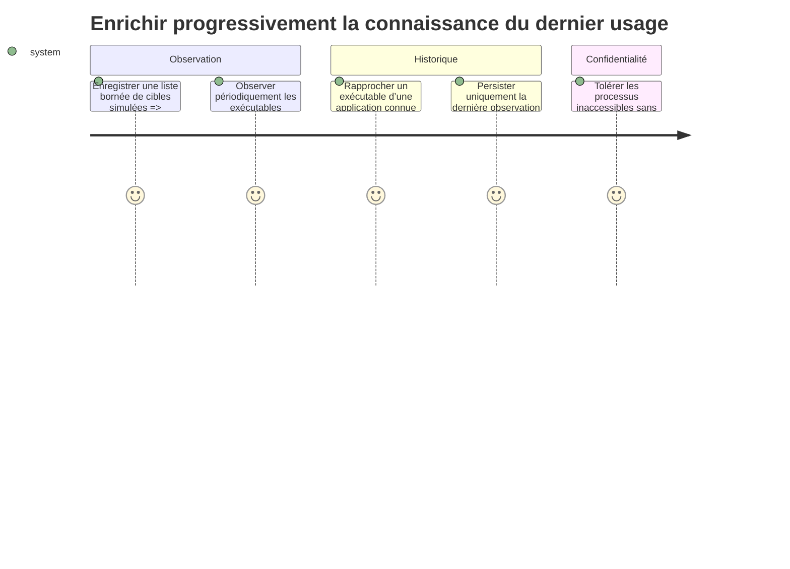

# Instruction

Ajouter au code Rust de DevToolBox un service d’observation léger mais encore dormant. Il reçoit une liste bornée de cibles applicatives, observe périodiquement les exécutables actifs, puis persiste pour chacune le début de couverture et la dernière observation ainsi qu’une couverture journalière globale, sans détail de session. Son activation et l’alimentation des cibles seront réalisées en phase 5 après chargement du premier rapport, ce qui évite toute dépendance circulaire.

## Architecture projection

- Created files:
  - `src/applications/mod.rs` — types partagés de suivi et façade de plateforme.
  - `src/applications/usage.rs` — rapprochement, mise à jour et persistance atomique de l’historique.
  - `src/applications/linux.rs` — observation des liens `/proc/<pid>/exe`.
  - `src/applications/windows.rs` — observation via EnumProcesses et QueryFullProcessImageNameW.
- Modified files:
  - `src/main.rs` — déclarer le module `applications` sans démarrer un suivi dépourvu de cibles.
  - `src/platform/mod.rs` — exposer le chemin de l’historique applicatif.
  - `src/platform/linux.rs` — placer l’historique dans l’état local XDG de DevToolBox.
  - `src/platform/windows.rs` — placer l’historique sous LocalAppData de DevToolBox.
  - `Cargo.toml` — activer uniquement les fonctionnalités Windows nécessaires aux API de processus si elles ne le sont pas déjà.
- Deleted files: none.

## User Journey

## Test Scope

- Tester la normalisation des chemins avec différences de casse Windows, liens Linux et arguments absents.
- Tester le rapprochement exact et refuser les rapprochements ambigus ou par simple sous-chaîne.
- Tester que la date la plus récente gagne et que l’horloge ne peut pas faire reculer l’historique.
- Tester `tracked_since`, les compteurs journaliers globaux, les jours sans échantillon et la rétention glissante de 400 jours.
- Tester un fichier absent, corrompu, en lecture seule et une écriture interrompue.
- Tester que l’observation ne conserve ni PID, ni fréquence, ni chronologie détaillée.
- Tester qu’aucune observation n’a lieu sans cible et que la liste de cibles peut être remplacée atomiquement.
- Tester les adaptateurs de plateforme avec des fournisseurs de processus injectés ; compiler le chemin Linux localement et vérifier le chemin Windows par gardes de source/cible disponible.

## Tasks to do

1. Définir un format d’historique versionné compatible avec le lecteur Python de la phase 1 : par identifiant stable, `tracked_since` et `last_seen` éventuellement absent ; globalement, le nombre d’échantillons réussis par date UTC. Les chemins exécutables restent dans le registre de cibles en mémoire et ne sont pas persistés.
2. Ajouter les chemins machine locaux : `$XDG_STATE_HOME/devtoolbox/application-usage.json` avec repli conforme sous Linux, et `%LOCALAPPDATA%\DevToolBox\application-usage.json` sous Windows.
3. Implémenter une persistance atomique, tolérante aux erreurs et bornée à 400 jours de compteurs globaux. Ne pas enregistrer les chemins, PID, durées, nombres de lancements ou listes de sessions applicatives.
4. Sous Linux, parcourir les PID et résoudre `/proc/<pid>/exe`, en ignorant les disparitions de processus et refus de permission attendus.
5. Sous Windows, énumérer les PID, ouvrir chaque processus avec les droits minimaux et lire son chemin via QueryFullProcessImageNameW, en ignorant les processus protégés.
6. Exposer un service démarrable avec un registre de cibles remplaçable. À la première apparition d’une cible, fixer `tracked_since` sans l’antidater. Sans cible, le service reste inactif ; avec des cibles, il échantillonne au plus une fois par minute hors du thread de rendu, incrémente le compteur du jour uniquement après un échantillonnage réussi, borne le nombre de chemins comparés et s’arrête proprement.
7. Qualifier les observations issues de cet échantillonnage d’opportunistes afin que le rapport ne les présente pas comme un historique exhaustif.
8. Ajouter des tests Rust unitaires pour la normalisation, le remplacement atomique des cibles, la confidentialité du format, la persistance et les erreurs de plateforme simulées.

## Test acceptance criteria

- `cargo test applications::usage` réussit sous Linux.
- `cargo check` réussit sur la plateforme locale et le code Windows reste entièrement sous `cfg(target_os = "windows")`.
- Le démarrage et un échantillonnage ne bloquent pas le thread de rendu.
- Le fichier persistant ne contient que les identifiants, `tracked_since`, `last_seen` et compteurs journaliers globaux sur 400 jours ; les chemins restent en mémoire.
- Un processus inaccessible ou disparu n’interrompt pas l’échantillonnage.
- Un rapprochement ambigu ne met à jour aucune application.
- Sans cible enregistrée, le service n’énumère aucun processus ; la cadence active est bornée à un échantillonnage par minute au maximum.
- Une période pendant laquelle DevToolBox ne réalise aucun échantillonnage ne compte pas comme inactivité couverte.
