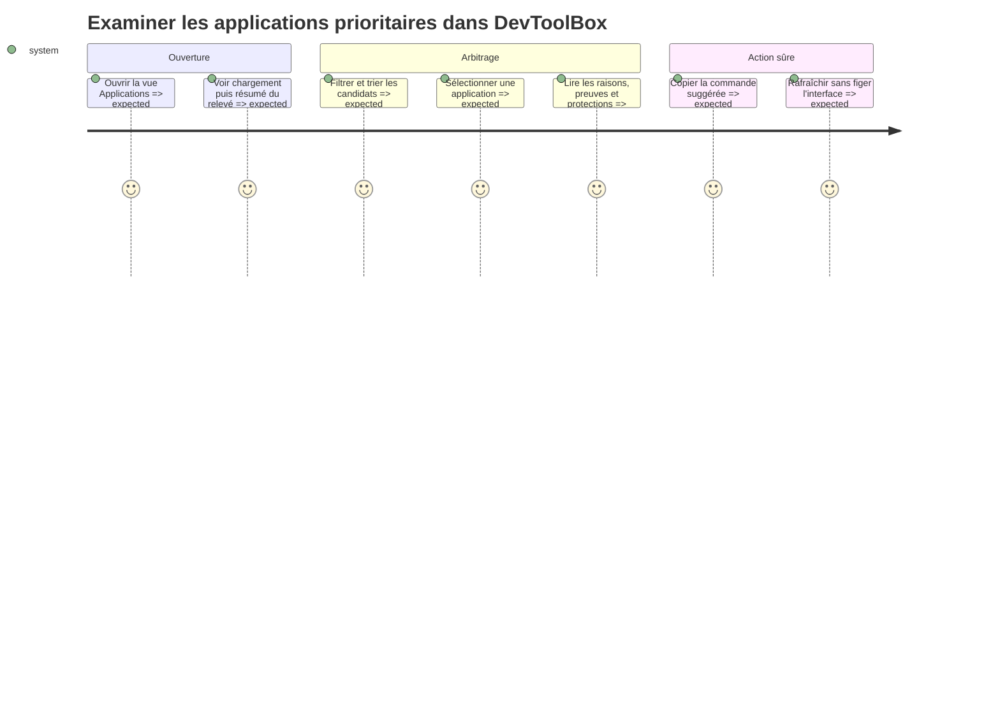

# Instruction

Intégrer le rapport à l’application sans reproduire la logique métier en Rust. Une résolution Python commune localise la racine et l’interpréteur, puis lance le module en arrière-plan avec la racine comme répertoire de travail. La sortie JSON validée alimente à la fois la vue et les cibles en mémoire du service d’usage. Aucun contrôle de l’interface ne doit exécuter une désinstallation.

## Architecture projection

- Created files:
  - `src/ui/applications_view.rs` — rendu, filtres, tri, détail, formatage et copie de commande.
  - `src/python_runtime.rs` — résolution multi-OS partagée de la racine, de l’interpréteur et des modules Python livrés.
- Modified files:
  - `src/main.rs` — déclarer le runtime Python partagé.
  - `src/applications/mod.rs` — types de désérialisation du rapport et pont asynchrone vers la CLI Python.
  - `src/ui/mod.rs` — exporter la nouvelle vue.
  - `src/ui/egui_app.rs` — ajouter la navigation, l’état du rapport, le rafraîchissement et les événements asynchrones.
  - `src/ui/terminal_view.rs` — réutiliser le runtime commun sans changer le comportement des actions `@python` Linux.
  - `src/windows/process.rs` — réutiliser le runtime commun sans changer le comportement des actions `@python` Windows.
- Deleted files: none.

## User Journey



## Test Scope

- Tester la navigation vers la vue, le premier chargement, le rafraîchissement manuel et la conservation du dernier rapport pendant un nouveau chargement.
- Tester recherche, source, ancienneté, taille minimale et affichage des éléments protégés.
- Tester les états vide, partiel, erreur totale, JSON incompatible et historique encore insuffisant.
- Tester une racine sans scripts, un interpréteur absent et les cascades `.venv`/`DEVTOOLBOX_PYTHON`/PATH sur les deux conventions d’OS.
- Tester un collecteur trop lent, deux rafraîchissements successifs et l’arrivée tardive de la première génération.
- Tester qu’une sélection affiche raisons du score, confiance des signaux, provenance de taille et protections.
- Tester la distinction entre date de dernier usage connue, application non observée pendant N jours couverts et usage inconnu faute de couverture.
- Tester que l’unique action liée à la désinstallation copie une chaîne dans le presse-papiers.
- Tester avec `egui_kittest` les interactions visibles et l’absence de freeze via événements asynchrones simulés.

## Wireframe

```text
┌──────────────────────────────────────────────────────────────────────────┐
│ (1) Navigation principale                                               │
├──────────────────────────────────────────────────────────────────────────┤
│ (2) En-tête du rapport                         (3) Action de rafraîch.   │
├──────────────────────────────────────────────────────────────────────────┤
│ (4) Résumé : espace · candidats · qualité des signaux · date du relevé  │
├──────────────────────────────────────────────────────────────────────────┤
│ (5) Recherche │ source │ ancienneté │ taille mini │ éléments protégés   │
├──────────────────────────────────────────────────────────────────────────┤
│ (6) Tableau classé                                                       │
│ Priorité │ Application │ Taille │ Dernier usage │ Confiance │ Source     │
│ ──────────────────────────────────────────────────────────────────────── │
│ ...                                                                      │
├──────────────────────────────────────────────┬───────────────────────────┤
│ (7) Justification et signaux de l’élément    │ (8) Commande copiable    │
└──────────────────────────────────────────────┴───────────────────────────┘
```

1. Ajouter « Applications » au même niveau que les vues existantes.
2. Afficher la plateforme, le statut complet ou partiel et les limites du relevé.
3. Relancer la collecte en arrière-plan avec un retour visuel non bloquant.
4. Résumer l’empreinte observée, le nombre de candidats, la qualité des signaux d’usage et la date du relevé.
5. Fournir des filtres combinables et une option explicite pour montrer les éléments protégés.
6. Comparer les candidats avec un tri stable, sans confondre priorité et certitude.
7. Expliquer le score, la provenance des données et tout avertissement de taille ou d’usage.
8. Copier la commande suggérée ; ne proposer aucun contrôle d’exécution.

## Tasks to do

1. Extraire la résolution de racine et d’interpréteur actuellement dupliquée par les actions `@python` dans `src/python_runtime.rs`, avec adaptations `.venv/bin/python` et `.venv/Scripts/python.exe`. Préserver la priorité `DEVTOOLBOX_HOME`, le répertoire du binaire, `DEVTOOLBOX_PYTHON` et PATH par des tests de non-régression.
2. Ajouter les types Rust correspondant au schéma JSON versionné et refuser proprement une version incompatible en conservant un message compréhensible.
3. Lancer `python -m scripts.app_recommendations --json` sur un worker depuis la racine résolue, capturer stdout/stderr séparément et transmettre un événement typé à l’état egui. Associer un identifiant monotone à chaque rafraîchissement, ignorer toute réponse d’une génération dépassée et borner l’attente globale au-delà des délais propres aux collecteurs. Si le module ou Python manque, produire un état indisponible explicite.
4. Lancer un premier relevé asynchrone au démarrage. À sa réception, remplacer atomiquement les cibles du service d’usage par les identifiants et indices exécutables non ambigus du rapport, puis démarrer le service s’il existe au moins une cible.
5. Ajouter `ActiveView::Applications`, la navigation et un état regroupant rapport courant, chargement, erreur, filtres et sélection.
6. Construire le résumé et le tableau classé avec valeurs inconnues explicites, confiance distincte de la priorité et badges de protection/source. Afficher séparément « vu le… », « non observé pendant N jours couverts » et « usage inconnu ».
7. Construire le panneau de détail à partir des raisons et preuves fournies par le rapport, sans recalcul du score dans l’UI.
8. Implémenter la copie via le presse-papiers egui uniquement lorsque le candidat n’est pas protégé. Une commande `manager_verified` reçoit le libellé « Copier la commande » ; une chaîne registre `publisher_unverified` reçoit le libellé et l’avertissement distincts « Copier la commande éditeur non vérifiée ». Dans les deux cas, copier la chaîne telle quelle sans passage par un shell.
9. Gérer les rapports partiels, sources absentes, résultats vides et erreurs globales avec des états actionnables et un rafraîchissement possible.
10. Ajouter des tests unitaires de filtrage/désérialisation et des tests `egui_kittest` pour la navigation, la sélection, le rafraîchissement et la copie.

## Test acceptance criteria

- `cargo test ui::applications_view` réussit.
- Les tests `egui_kittest` ouvrent la vue, appliquent un filtre, sélectionnent une ligne et déclenchent la copie sur un rapport fixture.
- Le rendu reste disponible pendant une collecte lente simulée et le dernier rapport n’est pas effacé prématurément.
- Les valeurs inconnues, protections et erreurs partielles sont visibles sans être converties en recommandations fortes.
- Une recherche dans le code et les tests confirme que la commande de désinstallation n’est utilisée que comme texte ou donnée de presse-papiers.
- L’application récupère d’un JSON invalide ou d’un worker en erreur et permet un nouveau rafraîchissement.
- Une réponse tardive d’une génération précédente est ignorée et une source expirée apparaît comme erreur partielle.
- Les tests historiques des actions `@python` réussissent après extraction du runtime partagé, et une distribution sans `scripts/app_recommendations` affiche une indisponibilité plutôt que de paniquer.
- La réception du premier rapport enregistre les cibles puis active le suivi ; aucun processus n’est énuméré avant cette réception.
