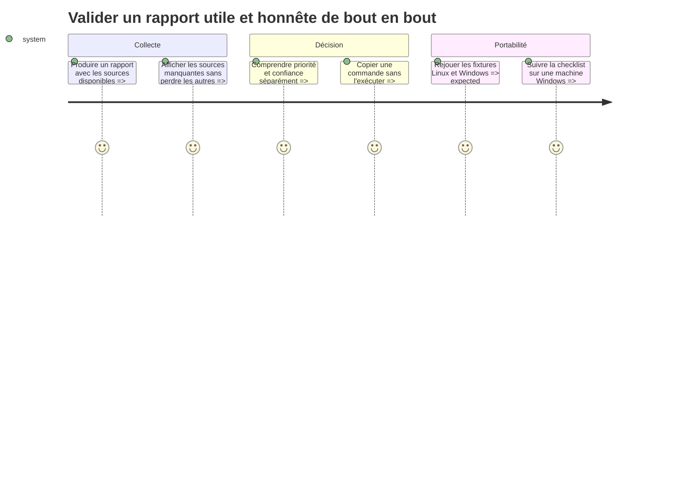

# Instruction

Finaliser l’intégration sans élargir le périmètre à la désinstallation. Cette phase verrouille les contrats entre Rust et Python, vérifie les régressions, documente le fonctionnement et prépare une validation Windows reproductible en complément des contrôles exécutables sur Linux.

## Architecture projection

- Created files:
  - `scripts/app_recommendations/README.md` — sources par OS, score, confiance, protections, CLI et limites.
  - `scripts/app_recommendations/tests/test_cli.py` — contrat stdout/stderr et exécution de bout en bout sur fixtures.
- Modified files:
  - `README.md` — présenter la vue Applications, son caractère consultatif et les plateformes couvertes.
  - `aidd_docs/memory/architecture.md` — documenter le paquet de recommandation, le pont asynchrone et l’historique local.
  - `aidd_docs/memory/codebase-map.md` — référencer les nouveaux modules Python et Rust.
  - `aidd_docs/memory/testing.md` — ajouter les commandes de test et la matrice de validation Windows/Linux.
- Deleted files: none.

## User Journey

## Test Scope

- Tester la CLI complète avec collecteurs simulés, historique, classement et contrat JSON consommé par Rust.
- Tester les délais de source et les générations de rafraîchissement afin qu’un résultat tardif ne remplace jamais un résultat récent.
- Tester la compatibilité des identifiants et chemins d’historique entre producteur Rust et lecteur Python.
- Tester le contenu de distribution minimal : module Python, fichiers requis et résolution depuis le répertoire du binaire ou `DEVTOOLBOX_HOME`.
- Exécuter l’ensemble des tests Python du rapport et des modules `system_inventory` touchés.
- Exécuter formatage, compilation, clippy et tests Rust selon les assertions du projet.
- Vérifier manuellement sur Linux le chargement, les filtres, les détails et la copie avec des données réelles, sans lancer la commande copiée.
- Préparer puis exécuter sur Windows la checklist registre/MSIX/Scoop/Chocolatey, processus protégés, chemins LocalAppData et interface native dès qu’un environnement Windows est disponible.

## Tasks to do

1. Ajouter un test CLI de bout en bout qui garantit un stdout JSON pur, des diagnostics sur stderr, une version de schéma reconnue par Rust et l’absence d’option mutatrice.
2. Ajouter des fixtures de contrat partagées ou générées par Python puis désérialisées dans les tests Rust afin d’éviter une dérive silencieuse entre les deux langages.
3. Documenter précisément le barème v1 et ses seuils, les protections, la différence entre empreinte et espace réellement récupérable, ainsi que le caractère prospectif et opportuniste de l’historique d’usage.
4. Documenter les commandes copiables comme aides manuelles qui doivent être relues par l’utilisateur, et rappeler que DevToolBox ne les exécute pas.
5. Mettre à jour la mémoire d’architecture, la carte du code et la stratégie de test avec les nouveaux composants et leurs frontières.
6. Exécuter les suites Python et Rust, corriger uniquement les régressions relevant de cette fonctionnalité et consigner toute validation Windows non réalisable localement.
7. Ajouter un contrôle automatisé ou une checklist de paquetage qui échoue si `scripts/app_recommendations` manque à côté des ressources livrées, et tester le repli `DEVTOOLBOX_HOME`.
8. Effectuer un contrôle source ciblé : aucune invocation de suppression, aucune collecte réseau, aucun stockage de chronologie d’usage détaillée, aucun calcul métier dupliqué dans l’UI.
9. Rejouer la checklist sur Windows avant livraison portable : sources présentes/absentes, applications protégées, historique LocalAppData, collecte de processus et copie de commande.

## Test acceptance criteria

- `python3 -m unittest discover -s scripts/app_recommendations/tests -p 'test_*.py'` réussit.
- Les tests ciblés de `scripts/system_inventory` affectés par les phases 2 et 3 réussissent.
- `cargo fmt --check`, `cargo check`, `cargo clippy -- -D warnings` et `cargo test` réussissent sur Linux.
- Un fixture JSON produit par Python est désérialisé et rendu par les tests Rust sans adaptation manuelle.
- Le README et la vue distinguent clairement empreinte installée, gain estimé, ancienneté et confiance.
- Le README distingue le temps calendaire des jours effectivement couverts par au moins un échantillon réussi.
- Le contrôle source ne trouve aucun chemin d’exécution d’une commande de désinstallation ni aucune collecte réseau.
- Le contrôle de distribution confirme la présence du module Python et sa résolution depuis un lancement hors du dépôt.
- La validation Windows est soit réussie et consignée, soit explicitement maintenue comme condition de livraison non satisfaite ; elle ne peut pas être déduite des seuls tests Linux.
