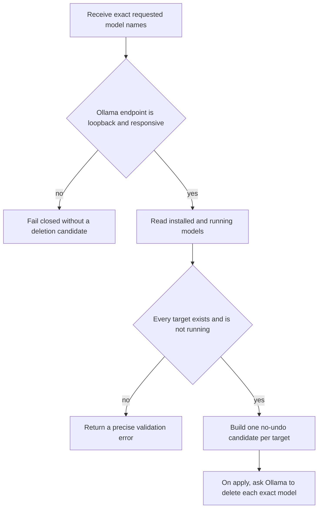
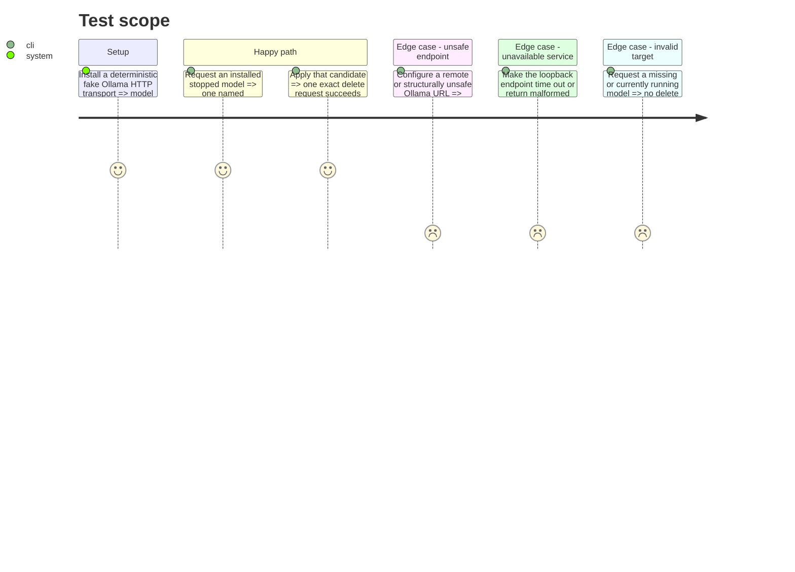

# Instruction: Build the fail-closed Ollama adapter

## Architecture projection

> Tree of the final files. ✅ create · ✏️ modify · ❌ delete

```txt
scripts/winclean/
├── common.py                     ✏️ model discovery errors, external-resource identity, and operation outcomes
├── mod_ollama.py                 ✅ isolated local-API discovery and deletion adapter
└── tests/
    ├── test_common.py            ✏️ validate discovery errors and serialize resource-operation outcomes
    └── test_mod_ollama.py        ✅ unit coverage with a fully mocked Ollama endpoint

Deleted files: none.
```

## User Journey



## Test Scope



## Tasks to do

### `1)` Define the Ollama boundary

> Isolate all Ollama-specific transport, payload validation, and error translation in one stdlib-only module.

1. Normalize the default endpoint and `OLLAMA_HOST`, accepting only HTTP loopback hosts (`localhost`, `127.0.0.1`, and `::1`) with an optional port and bounded timeouts.
2. Reject HTTPS and every non-HTTP scheme, user information, non-root path, query, fragment, missing/invalid port, and non-loopback host before opening a socket.
3. Implement typed parsing for `GET /api/tags` and `GET /api/ps`; reject non-success responses, malformed JSON, missing required fields, duplicate names, and invalid sizes.
4. Add a cycle-free `ModuleDiscoveryError` in `common.py`; raise it for endpoint, transport, HTTP, or payload failures so the CLI can translate discovery failures consistently.
5. Keep human-readable errors in French and stable machine-facing identifiers in English.

### `2)` Discover only explicit removable models

> Turn exact requested names into pathless candidates without inventing a last-used policy.

1. Match requested names exactly against the installed-model response and reject the complete request if any name is absent.
2. Reject models returned by `/api/ps` so an active model must first be stopped explicitly.
3. Extend `CleanCandidate` with a nullable `resource_id` for external operations, serialize it in JSON, and keep existing filesystem candidates unchanged through a default of `None`.
4. Add generic completed-resource and operation-failure records to `CleanResult`, including stable JSON payloads, so success is independent from measurable bytes; add `skipped-unattempted` to the closed skip-token vocabulary.
5. Emit one `Level.AGGRESSIVE`, `no_undo=True`, pathless candidate per unique target, carrying the API size as `estimated_bytes` and the exact model name as `resource_id`.
6. Never inspect or return a filesystem blob or manifest path.

### `3)` Delegate deletion and report honestly

> Ask Ollama to remove exact models while preserving winclean's accounting semantics.

1. Revalidate existence and running state immediately before deleting each model to close the dry-run/apply race per resource.
2. Record a model that disappeared since planning as `skipped-gone`; record one that became active as `skipped-running`; neither case sends `DELETE` or claims success.
3. Send one `DELETE /api/delete` request using the candidate's `resource_id`; record a 200 response as completed.
4. On any transport or non-200 API response, record one operation failure, stop issuing deletes, and record every remaining candidate as unattempted.
5. Return `CleanResult(module="ollama-models")` with completed IDs, skips, and operation failures populated, while actual `freed`, `recycled`, `failed`, and `measured` bytes remain unknown rather than copying logical estimates into measurements.
6. Cover strict endpoint normalization, payload validation, target deduplication, running/missing models, per-resource race revalidation, partial failure, `skipped-unattempted` remainder, and successful deletion with mocked unit tests.
7. Run the complete winclean test suite after the data-model change, not only the new adapter tests.

## Test acceptance criteria

| Task | Acceptance criteria |
| ---- | ------------------- |
| 1 | No test can make the adapter contact a remote or structurally unsafe URL, hang past its timeout, accept malformed data, or leak an untyped discovery exception. |
| 2 | Discovery returns exactly the explicitly requested installed and stopped models, with each exact name in `resource_id` and no direct path under an Ollama model store. |
| 3 | Apply rechecks each exact model, preserves every completed/failed/`skipped-unattempted` outcome, never claims estimated logical size as freed bytes, and leaves the complete winclean suite green. |
