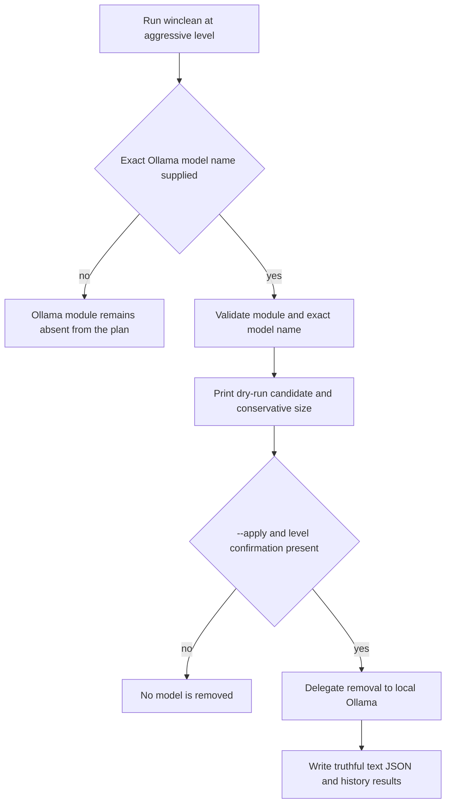
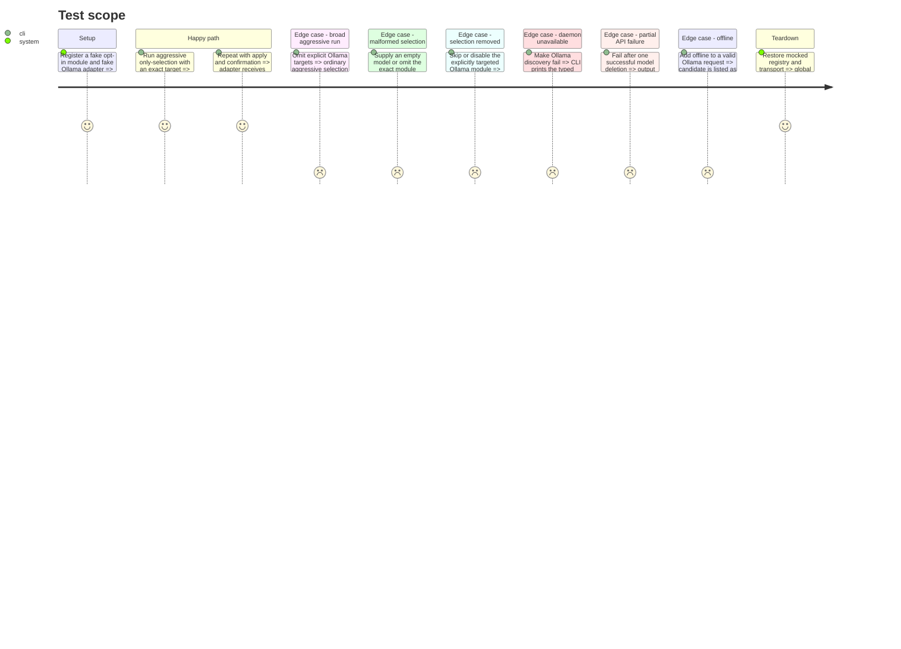

# Instruction: Wire explicit targeting into winclean

## Architecture projection

> Tree of the final files. ✅ create · ✏️ modify · ❌ delete

```txt
scripts/winclean/
├── common.py                                    ✏️ declare opt-in module metadata and render operation outcomes
├── registry_mod.py                              ✏️ register ollama-models and exclude opt-in modules by default
├── clean.py                                     ✏️ parse model names and map delegated failures to process status
├── README.md                                    ✏️ document safety contract and exact invocations
└── tests/
    ├── test_clean.py                            ✏️ CLI, dry-run, apply, JSON, ceiling, and history coverage
    ├── test_common.py                           ✏️ opt-in metadata and result-rendering contracts
    ├── test_history.py                          ✏️ destructive targeted-run audit coverage
    ├── test_mod_dev.py                          ✏️ classify helper-created modules explicitly as non-opt-in
    └── test_registry_mod.py                     ✏️ registry selection and declared-property coverage

Deleted files: none.
```

## User Journey



## Test Scope



## Tasks to do

### `1)` Add explicit Ollama selection

> Add the smallest public CLI surface that makes model deletion deliberate and unambiguous.

1. Add one required `opt_in` registry property with no default; update every production and test `CleanModule` constructor explicitly, and exclude opt-in modules from `modules_for_level()` while keeping them selectable with `--only`.
2. Add repeatable `--ollama-model MODEL` parsing that preserves names such as `namespace/model:tag`, rejects blank values, and deduplicates exact repeats in first-seen order.
3. Validate before discovery that model names are accepted only with `--level aggressive --only ollama-models`, that selecting `ollama-models` requires at least one name, and that `--skip` or configuration did not remove the module from the final selection.
4. Pass the immutable model-name tuple only to the Ollama discoverer; keep all existing discoverers compatible through their current catch-all keyword arguments.
5. Catch `ModuleDiscoveryError` beside registry validation failures in `main()`, print its French message, and return `EXIT_VALIDATION` before confirmation or deletion.

### `2)` Register Ollama without widening aggressive cleanup

> Make the adapter reachable only through deliberate module and model selection.

1. Register `ollama-models` as pathless, aggressive, opt-in, `proc_guard=None`, and `needs_network=True`.
2. Keep it out of `modules_for_level(Level.AGGRESSIVE)` unless explicitly selected; preserve normal `--only`, `--skip`, disabled-module, and level validation semantics.
3. Route its candidates through the existing delegated `clean()` path and existing aggressive confirmation; merge completed IDs and operation failures without adding a filesystem deletion branch or a silent `--yes` implication.
4. Extend the exhaustive registry tables and source-contract tests with an `opt_in` table equal in keys to the complete registry, so omissions and accidental default selection fail at test time.

### `3)` Preserve all safety and reporting gates

> Prove the new path behaves like a first-class winclean module without weakening defaults.

1. Test that plain safe, moderate, and aggressive runs never discover Ollama.
2. Test dry-run, `--apply`, interactive confirmation, `--yes`, `--offline`, `--top`, maximum-delete ceiling, JSON output, text output, and destructive-run history with exact targets.
3. Assert empty, duplicated, disabled, skipped, unselected, mixed-`--only`, and wrong-level model requests fail or deduplicate as specified before any Ollama request.
4. Assert endpoint, transport, HTTP, and payload discovery failures produce `EXIT_VALIDATION` with no traceback and no confirmation or deletion attempt.
5. Make any delegated operation failure produce `EXIT_REMOVAL`, a French stderr message, and matching text, JSON, and history details—including `skipped-unattempted` remainders—without marking the run interrupted or discarding earlier successes.
6. Assert logical model estimates remain visible in the plan while actual reclaimed-byte fields remain `null`/`unknown` after deletion.
7. Assert `--top` changes only displayed candidates and never changes the exact candidate set sent to apply, matching winclean's existing contract.

### `4)` Document the operational contract

> Give users copyable safe commands and explain what the module deliberately does not do.

1. Document the dry-run command `python scripts/winclean/clean.py --level aggressive --only ollama-models --ollama-model MODEL` and its `--apply` counterpart.
2. Require a canonical name copied from `ollama list` (including its tag such as `:latest`), and state that models are user data, no “unused” inference exists, running models are refused, restoration needs a pull, shared blobs make reclaimed bytes uncertain, and remote Ollama hosts are rejected.
3. State that the local Ollama daemon must be running for both dry-run and apply; show how to diagnose the unavailable-daemon error without starting or elevating a service implicitly inside winclean.
4. State that partial/orphan blob cleanup is outside this module's scope, manual deletion under `blobs/` is unsupported, and `--top` never reduces apply scope.
5. Run `python -m unittest discover -s scripts/winclean/tests -t .` and the existing winclean/system-inventory boundary check; do not modify `scripts/system_inventory/`.

## Test acceptance criteria

| Task | Acceptance criteria |
| ---- | ------------------- |
| 1 | `--ollama-model` is repeatable, exact, validated before discovery, and unusable unless the final selection still contains only the aggressive Ollama module. |
| 2 | `ollama-models` is absent from every broad cleanup and reachable only with the aggressive level, explicit module selection, and at least one exact target. |
| 3 | Every existing guard and output mode remains effective; completed, failed, and `skipped-unattempted` resources agree across text, JSON, history, stderr, and exit status while byte measurements stay honest. |
| 4 | Documentation provides dry-run-first commands, names every destructive limitation, the full winclean suite passes, and `scripts/system_inventory/` remains unchanged by the implementation. |
