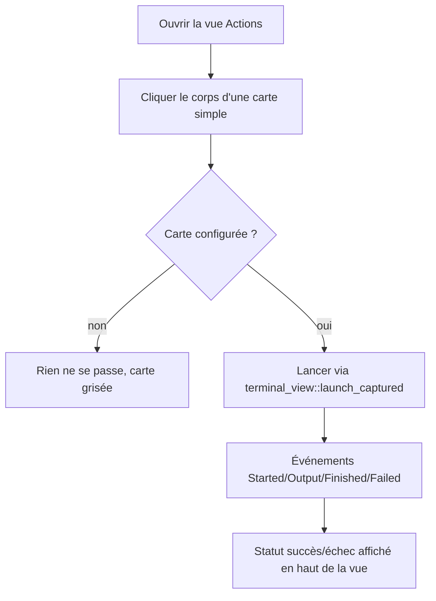

# Instruction: Clic-pour-lancer sur les cartes simples

Donner au corps d'une carte Actions (hors bouton Favori) un vrai handler de clic qui lance la commande résolue de cette carte, avec retour visuel de succès/échec — en réutilisant le pipeline de lancement déjà écrit pour la vue Terminal (`terminal_view::launch_captured`).

## Architecture projection

```txt
.
└── src/ui/egui_app.rs   ✏️ (CardData gagne `command: String` ; resolution_fields renvoie aussi la commande résolue ; EguiApp gagne action_rx/action_running + drain_action_events ; render_card gagne une zone cliquable sur le corps ; tests)
```

## User Journey



## Wireframe

```txt
┌─────────────────────────────────────────────┐
│ (1) DevToolBox — Actions                     │
│ (2) 'ipconfig' lancé avec succès.            │
│ (3) [x] Afficher par catégories              │
├───────────────────────────────────────────────┤
│ (4) Système                                    │
│  ┌────────────┐ ┌────────────┐                 │
│  │ (5) 📝     │ │ (5) 🌐     │                  │
│  │ Bloc-notes │ │ Adresse IP │                  │
│  │ ☆ Favori   │ │ ☆ Favori   │                  │
│  └────────────┘ └────────────┘                 │
└─────────────────────────────────────────────────┘
```

1. Titre, inchangé.
2. Ligne de statut existante (`StatusMessage`), désormais aussi déclenchée par un lancement de carte.
3. Toggle "Afficher par catégories" existant, inchangé.
4. En-tête de catégorie, inchangé.
5. Carte simple : le corps (icône + nom, hors bouton Favori) devient une zone cliquable qui lance la commande résolue de la carte.

## Tasks to do

### `1)` Étendre CardData et la résolution

> Porter la commande résolue jusqu'au widget de rendu, sans casser `is_configured`/`disabled_message`

1. Ajouter `command: String` à `CardData`.
2. Étendre `resolution_fields` pour renvoyer aussi la chaîne résolue (`CommandResolution::Resolved(s)` est déjà calculé, seulement jeté aujourd'hui) ; pour `Unconfigured`, renvoyer une chaîne vide (la carte est de toute façon désactivée par `is_configured: false`, donc jamais cliquable).
3. Répercuter le nouveau champ dans les deux points de construction de `CardData` dans `build_display_groups`.

### `2)` Ajouter l'état de lancement à EguiApp

> Un slot d'événements dédié, séparé de celui de la vue Terminal

1. Ajouter `action_rx: Option<Receiver<TerminalEvent>>` et `action_running: Option<String>` (id de la commande en cours) à `EguiApp` / `from_parts`.
2. Ajouter `drain_action_events`, miroir de `drain_terminal_events` mais qui alimente `self.status` (succès/échec) au lieu de `terminal_lines`, et vide `action_running` sur `Finished`/`Failed`.
3. Appeler `drain_action_events` dans `ui_content`, à côté de l'appel existant à `drain_terminal_events`.

### `3)` Rendre le corps de carte cliquable

> Cartes simples uniquement dans cette phase — la Phase 2 ajoutera le cas groupé. Le widget choisi doit rester interrogeable par `egui_kittest::Queryable::get_by_label` (déjà utilisé par tous les tests d'interaction existants, ex. ligne 1371/1607/1617) — un `ui.group(...).response.interact(Sense::click())` brut n'a pas d'info d'accessibilité nommée et ne serait pas trouvable par nom dans un test.

1. Dans `render_card`, rendre la zone icône+nom (déjà scopée dans `ui.add_enabled_ui`) sensible au clic via un widget qui pose une info d'accessibilité nommée avec `card.name` — soit `egui::Label::new(...).sense(Sense::click())` pour le texte, soit un `response.widget_info(|| egui::WidgetInfo::labeled(egui::WidgetType::Button, true, &card.name))` explicite sur la réponse du groupe.
2. Un clic déclenche le lancement de `card.command` via `terminal_view::launch_captured`, seulement si `card.is_configured` et si aucun lancement carte n'est déjà en cours (`action_running.is_none()`).
3. Pendant un lancement, désactiver le clic sur les autres cartes (un seul lancement carte à la fois) sans bloquer le reste de l'UI (favoris, catégories, autres vues). Ce garde-fou (`action_running.is_some()` → clic ignoré sur toute autre carte) doit être vérifiable par un test pur appelant directement la fonction de gestion du clic avec `action_running` déjà positionné sur un autre `command_id`, plutôt que par un test d'interaction chronométré dépendant du timing du canal d'événements (fragile : `launch_captured` est asynchrone).

## Test acceptance criteria

| Task | Acceptance criteria                                                                                                                       |
| ---- | -------------------------------------------------------------------------------------------------------------------------------------------- |
| 1... | `CardData` porte `command` ; les tests existants (`fallback_config`, `sample_config`) continuent de passer sans modification de leurs assertions actuelles |
| 2... | `drain_action_events` vide `action_running` et pose un message de statut succès/échec après `Finished`/`Failed`, sans toucher `terminal_lines` |
| 3... | Un test `egui_kittest` utilisant `harness.get_by_label(&card.name).click()` sur une carte configurée avec une vraie commande (ex. `echo`) observe un statut de succès ; cliquer une carte `is_configured: false` ne lance rien ; un test pur avec `action_running` déjà positionné sur un autre `command_id` confirme qu'un clic sur une carte différente ne déclenche aucun nouveau lancement |
