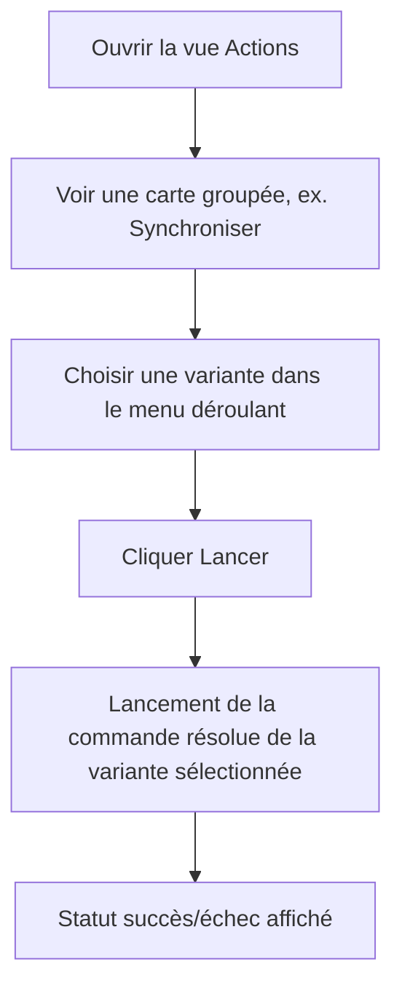

# Instruction: Regroupement par variante avec menu déroulant

Consolider les commandes qui partagent un `variant_group` (ex. les 4 variantes `sftp-sync`, les variantes `email-to-markdown`/`lyremember`) en une seule carte portant un menu déroulant de variantes et un bouton "Lancer" dédié, au lieu d'une carte par variante.

## Architecture projection

```txt
.
└── src/ui/egui_app.rs   ✏️ (build_display_groups regroupe par variant_group dans SES DEUX branches, catégorisée et favoris-seuls ; CardData gagne group_name + variants: Vec<VariantCardData> ; EguiApp gagne selected_variant ; render_card gagne ComboBox + bouton Lancer pour les cartes groupées ; tests)
```

## User Journey



## Wireframe

```txt
┌─────────────────────────────────────────────────┐
│ (1) Synchronisation SFTP                          │
│  ┌──────────────────────────┐                     │
│  │ (2) 🔄 Synchroniser        │                    │
│  │ (3) [ Perso        ▾]      │                    │
│  │ (4) [   Lancer    ]         │                    │
│  │ (5) ☆ Favori                │                    │
│  └──────────────────────────┘                     │
└─────────────────────────────────────────────────────┘
```

1. En-tête de catégorie, inchangé — une carte groupée apparaît sous la catégorie de sa première variante.
2. En-tête de carte groupée : icône + `group_name` ("Synchroniser") au lieu du nom individuel de chaque variante.
3. Menu déroulant (`egui::ComboBox`) listant chaque `variant_label` du groupe ; sélection = état de session, non persisté, initialisée à la première variante.
4. Bouton "Lancer" explicite — lance la commande résolue de la variante actuellement sélectionnée (réutilise le pipeline de la Phase 1).
5. Bouton Favori — cible la variante actuellement sélectionnée.

## Tasks to do

### `1)` Regrouper les commandes par variant_group avant l'affichage

> Une commande sans `variant_group` garde son comportement actuel (une carte) ; les commandes partageant un `variant_group` deviennent une seule `CardData`. `build_display_groups` a deux branches (`src/ui/egui_app.rs:176-227`) — la catégorisée ET la favoris-seuls (`show_categories: false`) — le partitionnement par `variant_group` doit s'appliquer aux **deux**, pas seulement à la branche catégorisée : dans `config/builtin-actions.json`, les 4 variantes `sftp-sync` sont toutes `is_favorite: true`, donc la branche favoris est la manifestation la plus visible de la régression si elle reste non traitée.

1. Factoriser un partitionnement par `variant_group` réutilisable par les deux branches de `build_display_groups` (`None` → une carte chacune comme aujourd'hui ; `Some(g)` → une seule carte portant toutes les variantes de `g` présentes dans l'ensemble de commandes de la branche courante, dans leur ordre d'apparition dans `config.commands`). Dans la branche favoris, une carte groupée n'apparaît que si au moins une de ses variantes est favorite ; ses variantes non favorites restent listées dans `variants` mais ne rendent pas la carte visible à elles seules.
2. Étendre `CardData` : `group_name: Option<String>`, `variants: Vec<VariantCardData>` — vide pour une carte simple. Chaque `VariantCardData` porte `command_id: String`, `label: String` (le `variant_label`), `command: String` (la commande résolue de cette variante spécifique via `resolution_fields`), `is_configured: bool`, `disabled_message: Option<String>` — les champs `command`/`is_configured`/`disabled_message` déjà présents au niveau racine de `CardData` (Phase 1) n'ont plus de sens univoque pour une carte groupée et doivent être lus depuis la variante actuellement sélectionnée, pas depuis la racine.
3. Pour une carte groupée, dériver le titre affiché depuis `group_name` (déjà présent sur chaque `Command` du groupe) plutôt que le `name` individuel de chaque commande.

### `2)` Mémoriser la variante sélectionnée par groupe

> État de session uniquement, jamais persisté dans `config.json`

1. Ajouter `selected_variant: HashMap<String, String>` (`variant_group` → `command_id`) à `EguiApp`.
2. Initialiser paresseusement à la première variante du groupe au premier rendu si absente de la map.

### `3)` Rendre le menu déroulant et le bouton Lancer

> Cartes groupées uniquement — les cartes simples gardent le comportement corps-cliquable de la Phase 1

1. Dans `render_card`, si `card.variants` n'est pas vide, afficher `egui::ComboBox` sur `card.variants` au lieu du nom simple, plus un bouton "Lancer" dédié.
2. "Lancer" appelle le même chemin de lancement que la Phase 1 (`command_id`/`command` = ceux de la variante actuellement sélectionnée) ; comme en Phase 1, le bouton est désactivé si la variante sélectionnée a `is_configured: false`, et affiche alors son `disabled_message`.
3. Le bouton Favori d'une carte groupée bascule le favori de la variante actuellement sélectionnée, pas de tout le groupe.

## Test acceptance criteria

| Task | Acceptance criteria                                                                                                                     |
| ---- | -------------------------------------------------------------------------------------------------------------------------------------------- |
| 1... | Un test pur (`build_display_groups`) sur les 4 variantes `sftp-sync` (toutes favorites) produit une seule `CardData` groupée aussi bien en mode catégorisé qu'en mode favoris (`show_categories: false`), portant les 4 `VariantCardData` ; le même test sur le groupe `email-to-markdown` (1 seule variante favorite sur 5) produit, en mode favoris, une carte groupée unique portant ses 5 `VariantCardData` (pas seulement la favorite) ; une commande sans `variant_group` (ex. `notepad`) produit toujours exactement une carte comme avant, dans les deux modes |
| 2... | `selected_variant` retient la variante choisie d'un rendu à l'autre de la même session, sans écrire dans `config.json`                         |
| 3... | Un test `egui_kittest` sélectionnant une variante puis cliquant "Lancer" observe le lancement de la commande de CETTE variante précise, pas celle par défaut ; sélectionner une variante `is_configured: false` désactive "Lancer" ; un test confirme que le bouton Favori d'une carte groupée bascule `is_favorite` uniquement sur le `command_id` de la variante sélectionnée, sans affecter les autres variantes du groupe |
