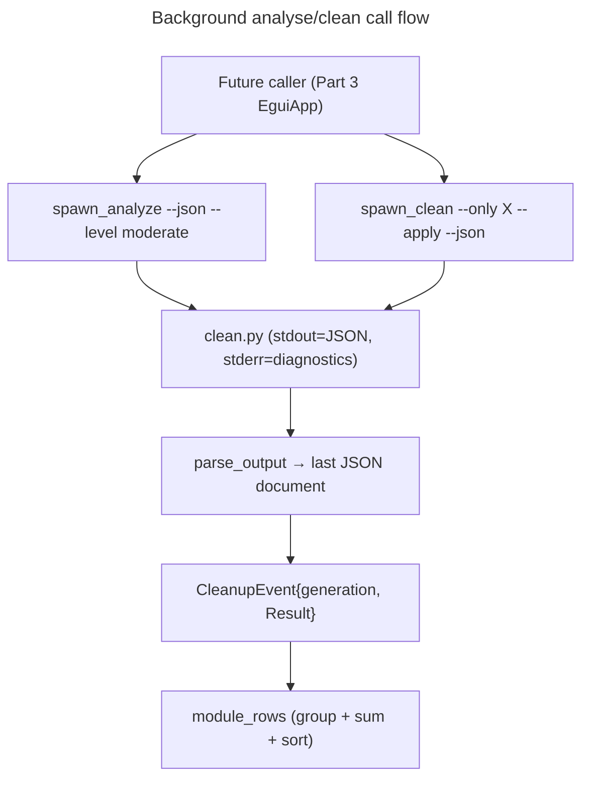

# Instruction: winclean JSON client (spawn + model)

## Feature

- **Summary**: Everything the future view consumes, without a single pixel. A new `src/cleanup/` module deserializes `clean.py --json` payloads (verified contract, `scripts/winclean/common.py`: candidates carry `module`/`path`/`label`/`estimated_bytes`/`level`/`needs_network`; a run adds per-module `freed`/`failed`/`measured`/`locked_paths`/`operation_failures`), aggregates candidates into per-module rows, and spawns the script in a background thread following the `applications::spawn_report` pattern (generation counter + `Sender` + one terminal event). Stdout may contain several JSON documents in apply mode (plan first, then plan+`run` merged — `_JsonWriter` joins chunks with blank lines): the parser takes the **last** complete top-level document. Stderr is captured separately and returned on failure (last ~10 lines) for the view's error banner.
- **Stack**: Rust workspace (unchanged); serde/serde_json already dependencies (config.json storage). Python resolution reuses `crate::python_runtime` (`action_root()`, `python_for_script()`) — no duplicated lookup logic.
- **Branch name**: `feature/cleanup-view/part-1-json-client`
- **Parent Plan**: `./2026_08_17-cleanup-view-master.md`
- **Sequence**: `1 of 3`
- Confidence: 8/10 — serde on a verified schema plus an existing threading pattern; the one unknown (multi-document stdout in apply mode) is closed by a real-run check at Checkpoint 1.

## Architecture projection

### Files to create

- `src/cleanup/mod.rs` — public facade: re-exports model, parser, aggregation, spawns.
- `src/cleanup/model.rs` — `CleanupPlan` (`level`, `apply`, `candidates`, `total_estimated_bytes`, `unpriced_modules`, `warnings`), `Candidate` (`module`, `path: Option<String>`, `label`, `estimated_bytes: Option<u64>`, `level`, `needs_network`), `RunPayload` (`status: String` — `"completed"`/`"interrupted"`, surfaced so an interrupted apply is never reported as a success — plus `results: Vec<ModuleResult>`), `ModuleResult` (`module`, `freed`, `failed`, `measured`, `locked_paths`, `operation_failures`). Contract caveat (verified `common.py:596`): `failed` is **bytes** (`failed_total_bytes`), possibly `None` when unmeasurable — never a failure count. Success/failure of a run is therefore judged on `locked_paths` and `operation_failures` being empty, and the failure count shown in the UI is `locked_paths.len() + operation_failures.len()`; `ModuleResult::is_success()` encodes exactly that. All structs `#[serde(default)]`-tolerant, never `deny_unknown_fields` — the script may grow fields.
- `src/cleanup/parse.rs` — `parse_output(stdout: &str) -> Result<Payload, String>`: split stdout into top-level JSON documents (brace-depth scan, not line heuristics), deserialize the **last** one; `Payload` is an enum `{ Plan(CleanupPlan), Applied { plan: CleanupPlan, run: RunPayload } }` keyed on the presence of `"run"`.
- `src/cleanup/rows.rs` — `ModuleRow { module, level, estimated: Option<u64>, partially_measured: bool, candidate_count, paths: Vec<String>, needs_network }`; `module_rows(&CleanupPlan) -> Vec<ModuleRow>` groups by `module` (a walking module yields many candidates), sums the **known** `estimated_bytes` mirroring the script's `sum_known` semantics: `estimated = None` only when no candidate is measured, otherwise the sum of measured ones with `partially_measured: true` when at least one candidate was `None` (matching `unpriced_modules`), sorts by size desc then name. **No module name is hardcoded anywhere** — OS-agnostic by construction (Linux modules have distinct names: `pip-cache-linux`, `pnpm-store-linux`, `apt-cache`).
- `src/cleanup/spawn.rs` — `CleanupEvent { generation: u64, result: Result<Payload, String> }`; `spawn_analyze(generation, tx)` runs `clean.py --json --level moderate` (plan only, harmless); `spawn_clean(module: &str, generation, tx)` runs `clean.py --only <module> --apply --json` (safe level implicit — no tty confirmation at safe). Both: resolve python + script via `python_runtime`, working dir = script parent, `#[cfg(windows)] creation_flags(CREATE_NO_WINDOW)`, capture stdout/stderr separately via `Command::output()` on a `std::thread` (no `-u`: nothing streams, the full output is read at exit), send exactly one event. Non-zero exit or unparsable stdout → `Err` carrying exit code + stderr tail.

### Files to modify

- `src/main.rs` (the module tree root — there is no `lib.rs`) — declare `mod cleanup;`.

### Files to delete

- None.

## Applicable rules

| Tool | Name | Path | Why it applies |
| ---- | ---- | ---- | --------------- |
| none | none | none | No installed AI-tool rules apply to this project (unchanged since the preferences plan). |

## User Journey

## Risk register

| Risk | Impact | Mitigation |
| ---- | ------ | ---------- |
| Apply-mode stdout contains plan JSON then merged plan+run JSON as separate documents | naive `serde_json::from_str` on full stdout fails | brace-depth document splitter + take-last, fixture test with two concatenated documents; Checkpoint 1 validates against a real run |
| stderr interleaves with stdout | corrupt JSON | streams are captured separately by `Command::output()` — never merged; fixture test keeps the parser stdout-only |
| Safe-level apply unexpectedly prompts on stdin | background process hangs | safe needs no confirmation by design (`clean.py`); spawn sets `stdin(Stdio::null())` so any regression fails fast (EOF) instead of hanging |
| `estimated_bytes: null` (non-measurable) summed as 0 | lying sizes in UI | `Option<u64>` end-to-end; `sum_known` semantics mirrored — known bytes summed, `partially_measured` flag raised, « non mesurable » only when nothing measured (Part 2) |
| Interrupted apply reported as success | user believes a module is clean when the run stopped midway | `RunPayload.status` checked before any success badge; `"interrupted"` renders as a failure-style message |

## Validation

- `cargo test --lib cleanup::` green: parser fixtures (plan only, plan+run, garbage, empty), aggregation (multi-candidate module, `None` sizes, sort order), no spawn test hitting real python beyond one `#[ignore]`-less smoke guarded like `launch_captured_streams_real_process_output`.
- Checkpoint 1: parse a real `clean.py --json --level moderate` run on this machine.
