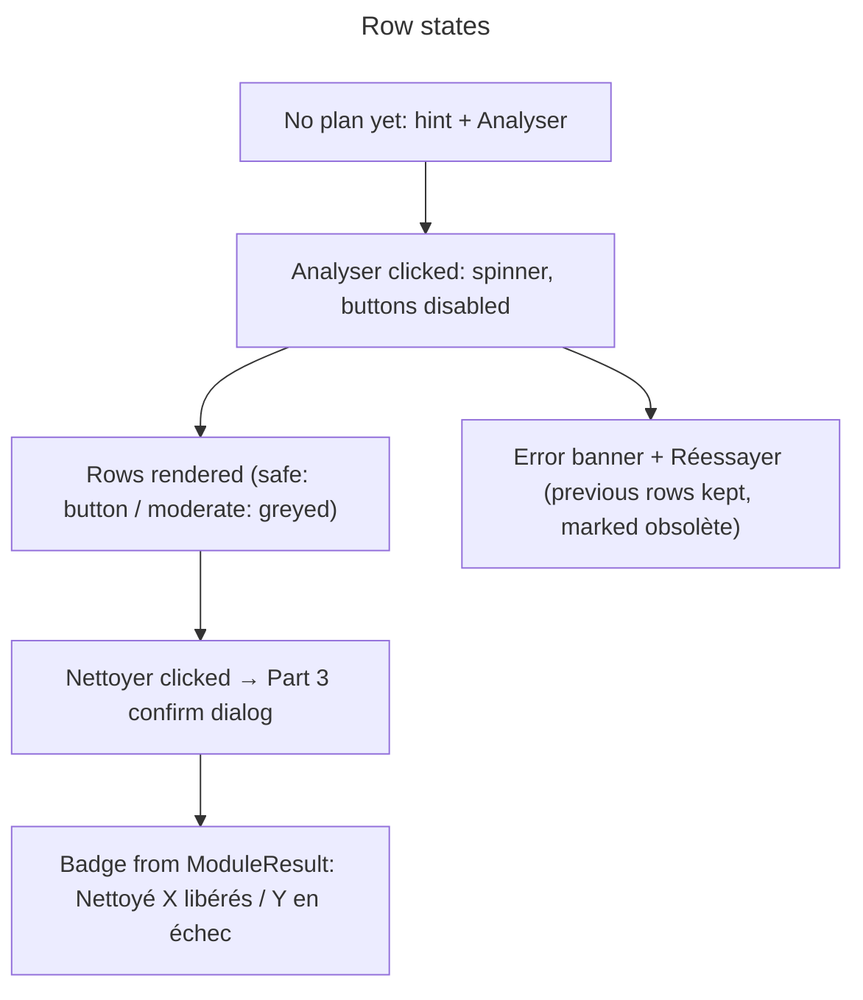

# Instruction: Cleanup view rendering (pure UI)

## Feature

- **Summary**: The « Bibliothèques » section as a stateless render module, same philosophy as `src/ui/applications_view.rs` (data in, clicked-actions out, no `EguiApp` access). Renders: header with « Analyser » button (disabled + spinner while busy), an error banner on analysis failure (red, code + stderr tail + « Réessayer »), then one row per `ModuleRow`: label, human size (« non mesurable » when `None`), candidate paths (collapsed beyond the first), « re-téléchargement requis » hint when `needs_network`, and a « Nettoyer » button **only on safe rows** — moderate rows are greyed with no button (driven by the row's `level`, per the brief's decision). After a run, the row shows a badge from the last `ModuleResult`: « Nettoyé : X libérés » on `is_success()` (defined in Part 1 as `locked_paths` **and** `operation_failures` both empty — `failed` is a byte total, possibly `None`, never a count), « X libérés, Y en échec (fichiers verrouillés) » otherwise with `Y = locked_paths.len() + operation_failures.len()`, and the displayed size comes from `measured`. An interrupted run (`RunPayload.status == "interrupted"`) renders as a failure-style message, never a success badge. Partially measured rows (`partially_measured`) show « ≥ taille (partiel) » ; « non mesurable » only when nothing was measured. Stale sizes (after a failed re-analysis) are marked « (obsolète) ».
- **Stack**: eframe/egui 0.35 (unchanged). Glyph constraint applies: only ⏵⏷⬆⬇★☆ from the builtin emoji subset — never ▸▾▲▼↑↓ (epaint `has_glyph` false negatives).
- **Branch name**: `feature/cleanup-view/part-2-rendering`
- **Parent Plan**: `./2026_08_17-cleanup-view-master.md`
- **Sequence**: `2 of 3`
- Confidence: 9/10 — direct transposition of the `applications_view::render` pattern onto Part 1's validated model; layout details are explicitly deferred to this part by the brief (« disposition fine : à trancher au moment du design »).

## Architecture projection

### Files to create

- `src/ui/cleanup_view.rs` —
  - `CleanupViewState<'a>` input struct: `rows: Option<&'a [ModuleRow]>`, `error: Option<&'a str>`, `analyzing: bool`, `busy: bool` (global command-slot guard, computed by Part 3), `last_runs: &'a HashMap<String, ModuleResult>`, `stale: bool`.
  - `pub enum CleanupAction { Analyze, Clean(String) }` — returned as `Vec<CleanupAction>` (in practice 0 or 1 per frame).
  - `pub fn render(ui, state) -> Vec<CleanupAction>` plus pure helpers: `row_badge(&ModuleResult) -> String`, `display_size(&ModuleRow, Option<&ModuleResult>) -> String` (prefers `measured` post-run).
  - `human_size` shared with `applications_view.rs`: extract the existing private `human_size` into a small `pub(crate)` helper (e.g. `src/ui/format.rs` or promote in `applications_view`) rather than duplicating it.

### Files to modify

- `src/ui/mod.rs` — declare `pub mod cleanup_view;` (and `format` if extracted).
- `src/ui/applications_view.rs` — only if `human_size` is extracted: swap to the shared helper, zero behavior change.

### Files to delete

- None.

## Applicable rules

| Tool | Name | Path | Why it applies |
| ---- | ---- | ---- | --------------- |
| none | none | none | No installed AI-tool rules apply to this project. |

## User Journey

## Risk register

| Risk | Impact | Mitigation |
| ---- | ------ | ---------- |
| Duplicating `human_size` drifts from applications_view's copy | inconsistent size formatting between the two sections of the same screen | extract-and-share, covered by keeping applications_view's existing unit expectations green |
| Badge/size logic buried in egui closures | untestable rendering decisions | `row_badge`/`display_size` are pure functions unit-tested without a `Ui` |
| Moderate rows accidentally clickable | violates the safe-only decision | the Clean button is only *constructed* for `level == "safe"` rows (not merely disabled), asserted by a unit test on the action list |

## Validation

- `cargo test --lib ui::cleanup_view::` green: badge wording for success/partial-failure/interrupted (failure count from `locked_paths` + `operation_failures`, never from `failed` bytes), `display_size` preferring `measured`, `None`-size → « non mesurable », `partially_measured` → « ≥ … (partiel) », safe-only action emission.
- Checkpoint 2: user validates the layout (row density, paths collapsing, badge colors) on a mocked plan before wiring.
